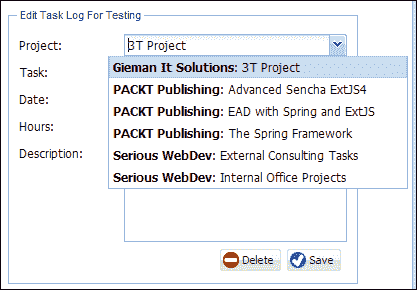
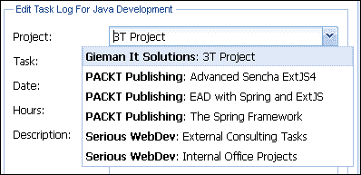
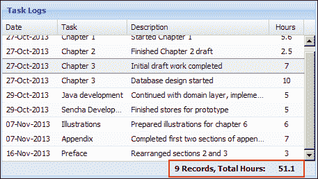

# 第十一章。构建任务日志用户界面

任务日志用户界面允许用户跟踪不同任务所花费的时间。该界面允许任务日志搜索和数据输入。用户将能够：

+   在指定的时间段内搜索任务日志

+   对任务日志条目列表进行排序

+   编辑现有的任务日志

+   添加新的任务日志条目

+   查看在一段时间内花费在任务上的总时间

我们将构建的界面如下截图所示：


**开始日期**和**结束日期**字段将使用当前月份的开始和结束日期进行预填。单击**搜索**按钮将触发搜索，并用匹配的记录填充**任务日志**网格。从列表中单击记录将在**编辑{任务名称}任务日志**表单中打开该项目。在工具栏中单击**添加新**按钮将清除任务日志表单字段并将标题设置为**添加任务日志**。现在让我们详细看看这些操作。

# 任务日志工作流程和布局

搜索任务日志将需要有效的开始和结束日期。如果单击**搜索**按钮后任一字段缺失，将显示适当的消息：


从列表中选择一个任务日志条目将在**编辑测试任务日志**表单中打开记录。在任务日志表单中，当显示列表时，**项目**下拉菜单将显示公司名称以及项目名称：



从列表中选择一个**项目**将过滤在**任务**组合框中显示的任务：


如果选择了一个没有分配任务的**项目**，将显示以下消息：


添加新的任务日志将保留当前选择的**日期**和**项目**（如果有的话）：


删除任务日志将要求用户确认其操作：


### 注意

这应该是开发企业项目时所有删除操作的标准做法；在未经用户确认的情况下，永远不要删除记录！

选择**是**将删除任务日志记录并从搜索结果中删除该记录。

# 构建我们的任务日志视图

任务日志用户界面包含各种不同的组件，包括日期选择器和组合框。我们将通过将屏幕分为三个视图来实现 UI。最外层的`ManageTaskLogs`视图将包含一个工具栏，并定义一个边框布局来容纳`TaskLogList`和`TaskLogForm`视图：


## ManageTaskLogs.js 文件

我们选择了`border`布局来允许`TaskLogForm`视图的调整大小，该视图最初固定为`east`区域的宽度为 400px。`ManageTaskLogs`的定义如下：

```java
Ext.define('TTT.view.tasklog.ManageTaskLogs', {
    extend: 'Ext.panel.Panel',
    xtype: 'managetasklogs',
    requires: ['Ext.toolbar.Toolbar', 'Ext.layout.container.Border', 'Ext.form.field.Date', 'TTT.view.tasklog.TaskLogList', 'TTT.view.tasklog.TaskLogForm'],
    layout: {
        type: 'border'
    },
    initComponent: function() {
        var me = this;
        var now = new Date();
        Ext.applyIf(me, {
            dockedItems: [{
                xtype: 'toolbar',
                dock: 'top',
                items: [{
                    xtype: 'datefield',
                    labelAlign: 'right',
                    name: 'startDate',
                    format: 'd-M-Y',
                    fieldLabel: 'Start Date',
                    value: Ext.Date.getFirstDateOfMonth(now),
                    width: 180,
                    labelWidth: 70
                }, {
                    xtype: 'datefield',
                    labelAlign: 'right',
                    name: 'endDate',
                    format: 'd-M-Y',
                    fieldLabel: 'End Date',
                    value: Ext.Date.getLastDateOfMonth(now),
                    width: 180,
                    labelWidth: 70
                }, {
                    xtype: 'button',
                    iconCls: 'search',
                    itemId: 'searchBtn',
                    text: 'Search'
                }, {
                    xtype: 'button',
                    iconCls: 'addnew',
                    itemId: 'addTaskLogBtn',
                    text: 'Add New'
                }]
            }],
            items: [{
                xtype: 'taskloglist',
                region: 'center',
                margin: 1
            }, {
                xtype: 'tasklogform',
                region: 'east',
                split: true,
                width: 400
            }]
        });
        me.callParent(arguments);
    }
});
```

这个类定义在`view.tasklog`命名空间中。在添加`ManageTaskLogs.js`文件之前，您需要创建`view/tasklog`子目录。

`date`字段使用`Ext.Date.getFirstDateOfMonth()`和`Ext.Date.getLastDateOfMonth()`函数初始化为当前月份的开始和结束日期。在 Ext JS 4 开发中操作日期是一个常见的任务，`Ext.Date`类中有许多有用的函数可以使这些任务变得容易。

`TaskLogList`视图已放置在`border`布局的`center`区域，而`TaskLogForm`视图在`east`区域被赋予了初始固定宽度为`400`。这将确保更大的屏幕分辨率会缩放任务日志列表以获得平衡的视图。因此，1200px 的屏幕宽度将显示以下布局：


`border`布局还允许调整`TaskLogForm`视图的大小，以便用户希望增加数据输入字段的宽度时进行调整。

## TaskLogForm.js 文件

`TaskLogForm`视图用于显示任务日志记录：

```java
Ext.define('TTT.view.tasklog.TaskLogForm', {
    extend: 'Ext.form.Panel',
    xtype: 'tasklogform',
    requires: ['Ext.form.FieldSet', 'Ext.form.field.ComboBox', 'Ext.form.field.Date', 'Ext.form.field.Number', 'Ext.form.field.TextArea', 'Ext.toolbar.Toolbar'],
    layout: {
        type: 'anchor'
    },
    bodyPadding: 10,
    border: false,
    autoScroll: true,
    initComponent: function() {
        var me = this;
        Ext.applyIf(me, {
            items: [{
                xtype: 'fieldset',
                hidden: true,
                padding: 10,
                fieldDefaults: {
                    anchor: '100%'
                },
                title: 'Task Log Entry',
                items: [{
                    xtype: 'combobox',
                    name: 'project',
                    fieldLabel: 'Project',
                    queryMode: 'local',
                    store: 'Project',
                    valueField: 'idProject',
                    listConfig: {
                        minWidth: 300
                    },
                    tpl: Ext.create('Ext.XTemplate', '<tpl for=".">', '<div class="x-boundlist-item"><b>{companyName}</b>: {projectName}</div>', '</tpl>'),
                    displayTpl: Ext.create('Ext.XTemplate', '<tpl for=".">', '{projectName}', '</tpl>')
                }, {
                    xtype: 'combobox',
                    name: 'idTask',
                    fieldLabel: 'Task',
                    displayField: 'taskName',
                    queryMode: 'local',
                    store: 'Task',
                    valueField: 'idTask'
                }, {
                    xtype: 'datefield',
                    name: 'taskLogDate',
                    format: 'd-M-Y',
                    fieldLabel: 'Date'
                }, {
                    xtype: 'numberfield',
                    name: 'hours',
                    minValue: 0,
                    decimalPrecision: 2,
                    itemId: 'taskHours',
                    fieldLabel: 'Hours'
                }, {
                    xtype: 'textareafield',
                    height: 100,
                    name: 'taskDescription',
                    fieldLabel: 'Description',
                    emptyText: 'Enter task log description here...'
                }, {
                    xtype: 'toolbar',
                    ui: 'footer',
                    layout: {
                        pack: 'end',
                        type: 'hbox'
                    },
                    items: [{
                        xtype: 'button',
                        iconCls: 'delete',
                        itemId: 'deleteBtn',
                        disabled: true,
                        text: 'Delete'
                    }, {
                        xtype: 'button',
                        iconCls: 'save',
                        itemId: 'saveBtn',
                        text: 'Save'
                    }]
                }]
            }]
        });
        me.callParent(arguments);
    }
});
```

**项目**下拉框定义了两种不同的模板：一种用于渲染列表，一种用于渲染所选项目的文本。`tpl`属性将公司名称和项目名称组合在一起，以在下拉框中显示：



当选择项目时，只显示项目名称，由`displayTpl`模板呈现。

## TaskLogList.js 文件

`TaskLogList`视图定义如下：

```java
Ext.define('TTT.view.tasklog.TaskLogList', {
    extend: 'Ext.grid.Panel',
    xtype: 'taskloglist',
    viewConfig: {
        markDirty: false,
        emptyText: 'There are no task log records to display...'
    },
    title: 'Task Logs',
    store: 'TaskLog',
    requires: ['Ext.grid.feature.Summary', 'Ext.grid.column.Date', 'Ext.util.Point'],
    features: [{
        ftype: 'summary',
        dock: 'bottom'
    }],
    initComponent: function() {
        var me = this;
        Ext.applyIf(me, {
            columns: [{
                xtype: 'datecolumn',
                dataIndex: 'taskLogDate',
                format: 'd-M-Y',
                width: 80,
                text: 'Date'
            }, {
                xtype: 'gridcolumn',
                dataIndex: 'taskName',
                text: 'Task'
            }, {
                xtype: 'gridcolumn',
                dataIndex: 'taskDescription',
                flex: 1,
                text: 'Description',
                summaryType: 'count',
                summaryRenderer: function(value, summaryData, dataIndex) {
                    return Ext.String.format('<div style="font-weight:bold;text-align:right;">{0} Records, Total Hours:</div>', value);
                }
            }, {
                xtype: 'gridcolumn',
                dataIndex: 'taskMinutes',
                width: 80,
                align: 'center',
                text: 'Hours',
                summaryType: 'sum',
                renderer: function(value, metaData, record) {
                    return record.get('hours');
                },
                summaryRenderer: function(value, summaryData, dataIndex) {
                    var valHours = value / 60;
                    return Ext.String.format('<b>{0}</b>', valHours);
                }
            }]
        });
        me.callParent(arguments);
    }
});
```

`viewConfig`属性用于创建`Ext.grid.View`类的实例，该类提供了特定于网格的视图功能。我们将按记录基础进行更新，而不是通过存储进行批量更新。`markDirty:false`属性将确保成功保存的记录在网格中不显示脏标志。如果任务日志搜索没有返回记录，则将在网格中显示`emptyText`值，以便向用户提供即时反馈。

`TaskLogList`视图使用`summary`功能显示包含**记录**计数和在搜索列表中显示的**总工时**的总行。`summaryType`和`summaryRender`定义用于配置在`taskDescription`和`taskMinutes`列的页脚中显示的`feature`。`summary`值可以是`count`、`sum`、`min`、`max`或`average`中的一个，我们使用`count`和`sum`值。有关`summary`功能的更多信息，请访问[`docs.sencha.com/extjs/4.2.2/#!/api/Ext.grid.feature.Summary`](http://docs.sencha.com/extjs/4.2.2/#!/api/Ext.grid.feature.Summary)。以下截图显示了`summary`功能的使用：



还有一些代码需要注意，表示分配给任务的工作小时数的列：

```java
{
    xtype: 'gridcolumn',
    dataIndex: 'taskMinutes',
    width:80,
    align:'center',
    text: 'Hours',
    summaryType:'sum',
    renderer:function(value, metaData, record){
  return record.get('hours');
    },
    summaryRenderer: function(value, summaryData, dataIndex) {
  var valHours = value/60;
  return Ext.String.format('<b>{0}</b>', valHours); 
    }           
}
```

每个任务日志的工作时间以分钟为单位存储在数据库中，但在前端显示为小时。该列绑定到模型中的`taskMinutes`字段。渲染器显示`TaskLog`模型的（计算得出的）`hours`字段（这将在接下来的部分中定义）。`summary`功能使用`taskMinutes`字段来计算总时间，因为该功能需要一个真实（未转换的）模型字段来操作。然后，将这些总时间（以分钟为单位）转换为小时以进行显示。

# 定义我们的模型

我们的`Project`、`Task`和`TaskLog`模型是使用 Sencha Cmd 在第九章中创建的，但它们缺乏持久性或验证逻辑。现在是添加所需代码的时候了。

## TaskLog 模型

`TaskLog`模型是我们应用程序中最复杂的模型。完整的`TaskLog`模型及所有必需的逻辑如下：

```java
Ext.define('TTT.model.TaskLog', {
    extend: 'Ext.data.Model',    
    fields: [
        { name: 'idTaskLog', type: 'int', useNull:true },
        { name: 'taskDescription', type: 'string' },
        { name: 'taskLogDate', type: 'date', dateFormat:'Ymd' },
        { name: 'taskMinutes', type: 'int' },
        { name: 'hours', type: 'float', persist:false, convert:function(value, record){
            return record.get('taskMinutes') / 60;
        }},
        { name: 'username', type: 'string' },
        { name: 'userFullName', type: 'string', persist:false },
        { name: 'idTask', type: 'int', useNull:true },
        { name: 'taskName', type: 'string', persist:false },
        { name: 'idProject', type: 'int', persist:false },
        { name: 'projectName', type: 'string', persist:false },
        { name: 'idCompany', type: 'int', persist:false },
        { name: 'companyName', type: 'string', persist:false }
    ],
    idProperty: 'idTaskLog',
    proxy: {
        type: 'ajax',
        idParam:'idTaskLog',
        api:{
            create:'taskLog/store.json',
            read:'taskLog/find.json',
            update:'taskLog/store.json',
            destroy:'taskLog/remove.json'
        },
        reader: {
            type: 'json',            
            root: 'data'
        },
        writer: {
            type: 'json',
            allowSingle:true,
            encode:true,
            root:'data',
            writeAllFields: true
        }
    },
    validations: [
        {type: 'presence',  field: 'taskDescription'},
        {type: 'length', field: 'taskDescription', min: 2},
        {type: 'presence',  field: 'username'},
        {type: 'presence',  field: 'taskLogDate'},
        {type: 'presence',  field: 'idTask'},
        {type: 'length', field: 'idTask', min: 1},
        {type: 'length', field: 'taskMinutes', min: 0}
    ]     
});
```

这是我们第一次在字段上使用`useNull`属性。当将 JSON 数据转换为`int`、`float`、`Boolean`或`String`类型时，`useNull`属性非常重要。当读取器无法解析值时，将为模型字段设置以下默认值：

| 字段类型 | 默认值为`useNull:true` | 默认值为`useNull:false` |
| --- | --- | --- |
| --- | --- | --- |
| `int` | `null` | `0` |
| `float` | `null` | `0` |
| `boolean` | `null` | `false` |
| `String` | `null` | `""`（空字符串） |
| `日期` | `null` | `null` |

如果读取器无法解析值，则如果字段配置为`useNull:true`，则将`null`分配给字段值。否则，将使用该类型的默认值，如前表中第三列中所示。请注意，如果无法解析值，则`Date`字段始终设置为`null`。在大多数情况下，重要的是在读取记录后能够确定字段是否为空，因此我们建议为所有主键字段设置`useNull:true`属性。

这也是我们第一次使用`dateFormat`属性。该属性定义了在通过配置的`writer`和`reader`类编码或解码 JSON `date`字段时的日期格式。`YYYYMMDD`格式字符串表示一个 8 位数。例如，2013 年 8 月 18 日的日期等同于 20130818。其他格式字符串在[`docs.sencha.com/extjs/4.2.2/#!/api/Ext.Date`](http://docs.sencha.com/extjs/4.2.2/#!/api/Ext.Date)的`Ext.Date` API 中有文档记录。强烈建议您始终为任何`date`字段指定显式日期格式。

对于`hours`字段使用`convert`函数也是新的。它将`reader`类提供的值转换并存储在模型的配置的`name`字段中。在我们的`TaskLog`模型中，分钟数被转换为十进制值并存储在`hours`字段中。对于 3T 用户来说，输入 2.5 小时的值要比 150 分钟方便得多。

请注意，我们再次使用`persist:false`属性来限制在我们的`TaskLogHandler`方法中不需要持久化的字段。我们对`TaskLog`模型的验证也应该是不言自明的！

## 项目模型

`Project`模型定义了我们通常的代理和验证属性：

```java
Ext.define('TTT.model.Project', {
    extend: 'Ext.data.Model',
    fields: [
        { name: 'idProject', type: 'int', useNull:true },
        { name: 'projectName', type: 'string' },
        { name: 'idCompany', type:'int', useNull:true },
        { name: 'companyName', type:'string', persist:false }
    ],
    idProperty: 'idProject',
    proxy: {
        type: 'ajax',
        idParam:'idProject',
        api:{
            create:'project/store.json',
            read:'project/find.json',
            update:'project/store.json',
            destroy:'project/remove.json'
        },
        reader: {
            type: 'json',
            root: 'data'
        },
        writer: {
            type: 'json',
            allowSingle:true,
            encode:true,
            root:'data',
            writeAllFields: true
        }
    },
    validations: [
        {type: 'presence',  field: 'projectName'},
        {type: 'length', field: 'projectName', min: 2},
        {type: 'presence',  field: 'idCompany'},
        {type: 'length', field: 'idCompany', min: 1}
    ]    
});
```

在持久化记录时不需要包括`companyName`字段，因此该字段包含`persist:false`属性。

## 任务模型

`Task`模型也具有简单的结构：

```java
Ext.define('TTT.model.Task', {
    extend: 'Ext.data.Model',    
    fields: [
        { name: 'idTask', type: 'int', useNull:true },
        { name: 'taskName', type: 'string' },
        { name: 'idProject', type: 'int', useNull:true },
        { name: 'projectName', type: 'string', persist:false  },
        { name: 'idCompany', type: 'int', useNull:true, persist:false  },
        { name: 'companyName', type: 'string', persist:false  }

    ],
    idProperty: 'idTask',
    proxy: {
        type: 'ajax',
        idParam:'idTask',
        api:{
            create:'task/store.json',
            read:'task/find.json',
            update:'task/store.json',
            destroy:'task/remove.json'
        },
        reader: {
            type: 'json',
            root: 'data'
        },
        writer: {
            type: 'json',
            allowSingle:true,
            encode:true,
            root:'data',
            writeAllFields: true
        }
    },
    validations: [
        {type: 'presence',  field: 'taskName'},
        {type: 'length', field: 'taskName', min: 2},
        {type: 'presence',  field: 'idProject'},
        {type: 'length', field: 'idProject', min: 1}
    ]
});
```

我们再次有几个字段不需要持久化，并因此配置了`persist:false`属性。现在是时候定义构建我们的任务日志用户界面所需的存储了。

# 定义我们的存储

`TaskLogList`和`TaskLogForm`视图需要存储才能运行。`TaskLogList`视图需要一个`TaskLog`存储，而`TaskLogForm`视图需要一个`Project`和一个`Task`存储。现在让我们来定义它们。

## TaskLog 存储

我们使用一个辅助方法定义此存储，以便轻松加载任务日志搜索。定义如下：

```java
Ext.define('TTT.store.TaskLog', {
    extend: 'Ext.data.Store',
    requires: ['TTT.model.TaskLog'],
    model: 'TTT.model.TaskLog',
    proxy: {
        type: 'ajax',
        url: 'taskLog/findByUser.json',
        reader: {
            type: 'json',
            root: 'data'
        }
    },
    doFindByUser: function(username, startDate, endDate) {
        this.load({
            params: {
                username: username,
                startDate: Ext.Date.format(startDate, 'Ymd'),
                endDate: Ext.Date.format(endDate, 'Ymd')
            }
        });
    }
});
```

请注意，我们在`doFindByUser`方法中使用`Ext.Date.format`函数格式化开始和结束日期。这是为了确保发送到服务器的日期是预期的 8 位`yyyymmdd`格式。

## 项目存储

`Project`存储将被排序，以实现在**Project**组合框中显示的所需公司名称分组：

```java
Ext.define('TTT.store.Project', {
    extend: 'Ext.data.Store',
    requires: ['TTT.model.Project'],
    model: 'TTT.model.Project',
    sorters: [{
        property: 'companyName',
        direction: 'ASC'
    }, {
        property: 'projectName',
        direction: 'ASC'
    }],
    proxy: {
        type: 'ajax',
        url: 'project/findAll.json',
        reader: {
            type: 'json',
            root: 'data'
        }
    }
});
```

请注意，所有项目记录将通过映射到`ProjectHandler` Java 类中的`findAll`方法的`project/findAll.json` URL 加载。`sorters`属性配置了加载存储后将应用于结果的排序例程。记录将首先按`companyName`字段按升序排序，然后使用`projectName`字段进行二次排序。

## 任务存储

任务存储具有非常简单的结构。以下定义对您来说应该没有什么意外：

```java
Ext.define('TTT.store.Task', {
    extend: 'Ext.data.Store',
    requires: ['TTT.model.Task'],
    model: 'TTT.model.Task',
    proxy: {
        type: 'ajax',
        url:'task/findAll.json',
        reader: {
            type: 'json',
            root: 'data'
        }
    }    
});
```

所有任务记录将通过映射到`TaskHandler` Java 类中的`findAll`方法的`task/findAll.json` URL 加载。

# 控制 TaskLog 操作

`TaskLogController`定义是我们迄今为止开发的最复杂的控制器定义。以下定义不包括`refs`和`init`配置。您可以从本书的网站下载完整的源代码：

```java
Ext.define('TTT.controller.TaskLogController', {
    extend: 'Ext.app.Controller',
    views: ['tasklog.ManageTaskLogs'],
    stores: ['TaskLog', 'Project', 'Task'],
    refs: omitted…
    init: omitted…
    doAfterActivate: function() {
        var me = this;
        me.getTaskStore().load();
        me.getProjectStore().load();
    },            
    doSelectProject: function(combo, records) {
        var me = this;
        var rec = records[0];
        if (!Ext.isEmpty(rec)) {
            me.getTaskCombo().getStore().clearFilter();
            me.getTaskCombo().getStore().filter({
                property: 'idProject',
                value: rec.get('idProject'),
                exactMatch: true
            });
            me.getTaskCombo().setValue('');
            if (me.getTaskCombo().getStore().getCount() === 0) {
                Ext.Msg.alert('No Tasks Available', 'There are no tasks assigned to this project!');
            }
        }
    },
    doSelectTaskLog: function(grid, record) {
        var me = this;
        me.getTaskCombo().getStore().clearFilter();
        me.getTaskCombo().getStore().filter({
            property: 'idProject',
            value: record.get('idProject'),
            exactMatch: true
        });
        me.getProjectCombo().setValue(record.get('idProject'));
        me.getTaskLogForm().loadRecord(record);
        me.getTaskLogFormFieldset().show();
        me.getTaskLogFormFieldset().setTitle('Edit Task Log For ' + record.get('taskName'));
        me.getTaskLogForm().getForm().clearInvalid();
        me.getDeleteTaskLogButton().enable();
    },
    doAddTaskLog: function() {
        var me = this;
        me.getTaskLogFormFieldset().show();
        me.getTaskLogFormFieldset().setTitle('Add Task Log');
        var taskLogDate = me.getTaskLogDateField().getValue();
        if (Ext.isEmpty(taskLogDate)) {
            taskLogDate = new Date();
        }
        var tl = Ext.create('TTT.model.TaskLog', {
            taskDescription: '',
            username: TTT.getApplication().getUser().username,
            taskLogDate: taskLogDate,
            taskMinutes: 0,
            idTask: null
        });
        me.getTaskLogForm().loadRecord(tl);
        me.getDeleteTaskLogButton().disable();
        var idProject = me.getProjectCombo().getValue();
        if (Ext.isEmpty(idProject)) {
            var firstRec = me.getProjectCombo().getStore().getAt(0);
            me.getProjectCombo().setValue(firstRec.get('idProject'), true);
            me.getTaskCombo().getStore().clearFilter();
            me.getTaskCombo().getStore().filter({
                property: 'idProject',
                value: firstRec.get('idProject'),
                exactMatch: true
            });
            me.getTaskCombo().setValue('');
        }
    },
    doDeleteTaskLog: function() {
        var me = this;
        var rec = me.getTaskLogForm().getRecord();
        Ext.Msg.confirm('Confirm Delete', 'Are you sure you want to delete this task log?', function(btn) {
            if (btn === 'yes') {
                rec.destroy({
                    failure: function(rec, operation) {
                        Ext.Msg.alert('Delete Failure', operation.request.scope.reader.jsonData.msg);
                    }
                });
                me.doAddTaskLog();
            }
        });
    },
    doSaveTaskLog: function() {
        var me = this;
        var rec = me.getTaskLogForm().getRecord();
        if (!Ext.isEmpty(rec)) {
            me.getTaskLogForm().updateRecord(); 
            // update the minutes field of the record
            var hours = me.getTaskHoursField().getValue();
            rec.set('taskMinutes', hours * 60);
            var errs = rec.validate();
            if (errs.isValid() && me.getTaskLogForm().isValid()) {
                rec.save({
                    success: function(record, operation) {
                        if (typeof record.store === 'undefined') {
                            me.getTaskLogStore().add(record);
                        }
                        me.getTaskLogFormFieldset().setTitle('Edit Task Log For ' + record.get('taskName'));
                        me.getDeleteTaskLogButton().enable();
                    },
                    failure: function(rec, operation) {
                        Ext.Msg.alert('Save Failure', operation.request.scope.reader.jsonData.msg);
                    }
                });
            } else {
                me.getTaskLogForm().getForm().markInvalid(errs);
                Ext.Msg.alert('Invalid Fields', 'Please fix the invalid entries!');
            }
        }
    },
    doSearch: function() {
        var me = this;
        var startDate = me.getStartDateField().getValue();
        if (Ext.isEmpty(startDate)) {
            Ext.Msg.alert('Start Date Required', 'Please select a valid start date to perform a search');
            return;
        }
        var endDate = me.getEndDateField().getValue();
        if (Ext.isEmpty(endDate)) {
            Ext.Msg.alert('End Date Required', 'Please select a valid end date to perform a search');
            return;
        }
        me.getTaskLogStore().doFindByUser(TTT.getApplication().getUser().username, startDate, endDate);
        me.getTaskLogFormFieldset().hide();
    }
});
```

`TaskLogController`部分定义了视图使用的三个存储库。`Project`和`Task`存储库在`ManageTaskLogs`面板激活时触发的`doAfterActivate`函数中加载。这确保了**任务**和**项目**下拉框有有效的数据可操作。

控制器中定义的每个`ref`项都用于一个或多个函数，以访问底层组件并执行适当的操作。每个`ref`项的自动生成的设置方法使得在我们的代码中引用组件变得容易。

### 注意

重要的是要注意，`ref`项始终返回一个单一对象，因此不能像`Ext.ComponentQuery.query`函数一样用于检索组件集合。要动态检索对象（而不使用 refs）或检索对象集合，应使用`ComponentQuery.query`函数。有关更多信息，请参见[`docs.sencha.com/extjs/4.2.2/#!/api/Ext.ComponentQuery`](http://docs.sencha.com/extjs/4.2.2/#!/api/Ext.ComponentQuery)。

每个可能的用户操作都由一个适当命名的函数处理。函数参数将取决于事件源。`button`对象的`click`事件处理程序函数将始终将对按钮本身的引用作为事件处理程序的第一个参数传递。网格`itemclick`事件处理函数将始终接收对网格本身的引用作为第一个参数，然后是被单击的记录。您应该查看 Sencha Ext JS 4 文档，以熟悉常见组件的事件处理函数参数。

执行搜索需要有效的开始和结束日期。在允许搜索之前，`doSearch`函数将验证两个`date`字段。请注意使用`TTT.getApplication().getUser()`函数来访问当前登录的用户。

成功的搜索将列出与搜索条件匹配的任务日志记录。然后用户可以点击列表中的项目以加载任务日志表单。这是在`doSelectTaskLog`函数中完成的。

添加新的任务日志将创建一个新的`TaskLog`模型记录并加载表单。记录将设置当前登录的`username`属性。如果可用，项目下拉框中当前选择的**项目**将被保留；否则，将选择下拉框中的第一项。

选择项目将会将任务存储库过滤为仅显示分配给项目的任务。这是在`doSelectProject`函数中实现的：

```java
me.getTaskCombo().getStore().filter({
property:'idProject',
value:rec.get('idProject'),
exactMatch:true
});
```

请注意，我们在`idProject`字段上定义了`exactMatch`。如果没有此属性，将返回部分匹配（例如，使用`idProject`值为`2`进行过滤将匹配具有`idProject`值为`20`的任务；对开发人员来说是一个陷阱！）。

`doSaveTaskLog`和`doDeleteTaskLog`函数对加载到任务日志表单中的记录执行适当的操作。就像在上一章中一样，表单用于显示和输入数据，但数据从未被提交。所有保存数据操作都是通过`model`实例触发的。

# 测试任务日志界面

在运行应用程序并测试新文件之前，您需要将`TaskLogController`以及新的存储库和模型添加到您的`Application.js`文件中：

```java
controllers: [
  'MainController',
  'UserController',
  'TaskLogController'
],
models: [
  'User',
  'Project',
 'Task',
 'TaskLog'
],
stores: [
  'User',
  'Project',
 'Task',
 'TaskLog'
]
```

您还需要将`ManageTaskLogs`视图添加到`MainCards`视图的`items`数组中，如下所示：

```java
Ext.define('TTT.view.MainCards', {
    extend: 'Ext.container.Container',
    xtype: 'maincards',
    requires: ['Ext.layout.container.Card', 'TTT.view.Welcome', 'TTT.view.user.ManageUsers', 'TTT.view.tasklog.ManageTaskLogs'],
    layout: 'card',
    initComponent: function() {
        var me = this;
        Ext.applyIf(me, {
            items: [{
                xtype: 'welcome',
                itemId: 'welcomCard'
            }, {
                xtype: 'manageusers',
                itemId: 'manageUsersCard'
            }, {
 xtype: 'managetasklogs',
 itemId: 'taskLogCard'
 }]
        });
        me.callParent(arguments);
    }
});
```

现在，您可以在 GlassFish 服务器中运行应用程序并测试**任务日志**界面。首先以`jsmith`用户登录，密码为`admin`，并使用不同的日期范围执行搜索。数据应该显示为您在 MySQL 中加载 3T 表时的数据：


尝试执行不返回任何记录的搜索。您应该看到在`TaskLogList`视图的`viewConfig`属性中定义的`emptyText`值：


现在您可以尝试添加新记录和编辑现有的任务日志，以测试功能的全部范围。您能让以下消息弹出吗？


在下一章中，我们将构建 3T 管理界面，以阻止这种情况发生！

# 摘要

任务日志用户界面汇集了视图、模型和存储之间的多个组件交互。我们为网格引入了`summary`功能，并在`Project`和`Task`存储中过滤记录。搜索`TaskLog`记录需要我们将日期解析为适合后端处理的格式，而我们的基本模型骨架则增加了持久性和验证属性。我们再次探索了有趣的 Ext JS 4 领域，并与各种组件一起工作。

在第十二章，“3T 管理简化”中，我们将开发 3T 管理界面并引入 Ext JS 4 树组件。`Ext.tree.Panel`是一个非常多才多艺的组件，非常适合显示公司-项目-任务的关系。
