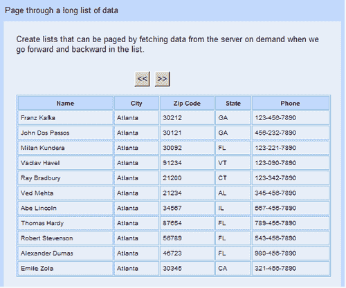
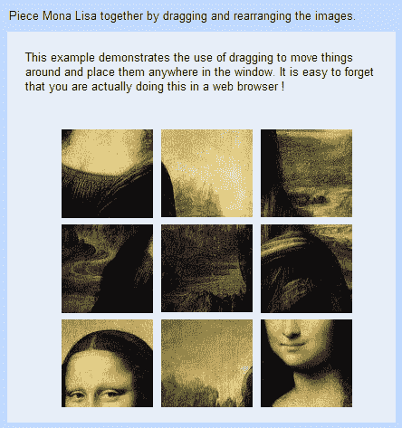

# 第五章。响应式复杂界面

在本章中，我们将创建一些演示 GWT 高级功能的用户界面。

我们将要解决的任务是：

+   可分页表格

+   可编辑的树节点

+   日志监视

+   便利贴

+   拼图游戏

# 可分页表格

在本章中，我们将开始探索更复杂的 GWT 用户界面。在当今的商业世界中，我们经常遇到一些情况，需要使用表格来显示大量数据。一次性在表格中显示所有可用数据既不是一个可行的选项，从可用性的角度来看，也不是一个实际的选择。

我们还可以潜在地锁定显示表格的浏览器，如果检索到的数据集足够大。向用户显示这些数据的更好方法是首先显示固定数量的结果，然后提供他们浏览结果的机制；这样他们可以自由地在数据中向前或向后翻页。这样做可以提供更好的用户体验，同时也可以更快地加载较小的数据集。

在本节中，我们将创建一个提供此功能的应用程序。作为示例的一部分，我们还将学习如何在 GWT 应用程序中使用嵌入式数据库。

## 行动时间——接口数据集

我们将创建一个应用程序，让我们以分块或分页的方式检索数据，而不是一次性获取所有数据。我们将通过查询检索前十个项目作为结果，并为用户提供一种方法，让他们可以在这些结果中向前或向后翻页。具体步骤如下：

1.  在`com.packtpub.gwtbook.samples.client`包中创建一个名为`PageableDataService.java`的新的 Java 文件。定义`PageableDataService`接口，其中包含一个方法，通过提供起始索引和要检索的项目数量来检索客户数据：

```java
public interface PageableDataService extends RemoteService
{
public List getCustomerData(int startIndex, int numItems );
}

```

1.  在`com.packtpub.gwtbook.samples.client`包中创建一个名为`PageableDataServiceAsync.java`的新的 Java 文件，创建这个服务定义接口的异步版本：

```java
public interface PageableDataServiceAsync
{
public void getCustomerData(int startIndex, int numItems,
AsyncCallback callback);
}

```

1.  在`com.packtpub.gwtbook.samples.server`包中创建一个名为`PageableDataServiceImpl.java`的新的 Java 文件，实现我们的可分页数据服务。创建一个名为`customerData`的私有`ArrayList`对象，用于存储客户数据：

```java
private ArrayList customerData = new ArrayList();

```

1.  如果我们使用数据库来存储数据而不是在服务中管理数据结构，将会更简单。我们将使用 HSQLDB——一个用于存储我们将在此服务中访问的数据的小型嵌入式数据库。首先，从预先填充的数据库中加载数据到列表中：

```java
private void loadData()
{
Class.forName("org.hsqldb.jdbcDriver");
Connection conn = DriverManager.getConnection
( "jdbc:hsqldb:file:samplesdb", "sa", "");
Statement st = conn.createStatement();
ResultSet rs = st.executeQuery("SELECT * FROM users");
for (; rs.next();)
{
ArrayList customer = new ArrayList();
customer.add((String) rs.getObject(2));
customer.add((String) rs.getObject(3));
customer.add((String) rs.getObject(4));
customer.add((String) rs.getObject(5));
customer.add((String) rs.getObject(6));
customerData.add(customer);
}
st.execute("SHUTDOWN");
conn.close();
}

```

1.  我们在服务的构造函数中调用`loadData()`函数，以便在服务初始化后加载所有所需的数据并可用：

```java
public PageableDataServiceImpl()
{
super();
loadData();
}

```

1.  现在添加一个服务实现方法，只返回请求的数据子集：

```java
public ArrayList getCustomerData(int startIndex, int numItems)
{
ArrayList customers = new ArrayList();
for (int i = startIndex - 1; i < (startIndex + numItems); i++)
{
customers.add((ArrayList) customerData.get(i));
}
return customers;
}

```

1.  现在创建与可分页数据服务交互的用户界面。在`com.packtpub.gwtbook.samples.client.panels`包中创建一个名为`PageableDataPanel.java`的新的 Java 文件。正如在上一章开头提到的，本书中创建的每个用户界面都将被添加到一个类似于 GWT 下载中作为示例项目之一的`KitchenSink`应用程序的示例应用程序中。这就是为什么我们将每个用户界面创建为一个扩展`SamplePanel`类的面板，并将创建的面板添加到示例应用程序的示例面板列表中。`SamplePanel`类和我们的`Samples`应用程序的结构在上一章开头进行了讨论。添加一个`FlexTable`类来显示数据，以及用于向前或向后翻页的按钮。创建一个字符串数组来存储列标题，并创建一个整数变量来存储客户数据列表的起始索引：

```java
private FlexTable customerTable = new FlexTable();
private Button backButton = new Button("<<<");
private Button forwardButton = new Button(">>");
private String[] customerTableHeaders = new String[]
{ "Name", "City","Zip Code", "State", "Phone" };
private int startIndex = 1;

```

1.  创建我们将用于调用服务以获取数据的服务类：

```java
final PageableDataServiceAsync pageableDataService =
(PageableDataServiceAsync)
GWT.create(PageableDataService.class);
ServiceDefTarget endpoint = (ServiceDefTarget)
pageableDataService;
endpoint.setServiceEntryPoint(GWT.getModuleBaseURL() +
"pageabledata");

```

1.  添加一个私有方法，在我们用数据填充表格之前清空表格：

```java
private void clearTable()
{
for (int row=1; row<customerTable.getRowCount(); row++)
{
for (int col=0; col<customerTable.getCellCount(row); col++)
{
customerTable.clearCell(row, col);
}
}
}

```

1.  添加一个私有方法，用于使用从服务检索的数据更新表格：

```java
private void update(int startIndex)
{
AsyncCallback callback = new AsyncCallback()
public void onSuccess(Object result)
{
ArrayList customerData = (ArrayList) result;
int row = 1;
clearTable();
for (Iterator iter=customerData.iterator(); iter.hasNext();)
{
ArrayList customer = (ArrayList) iter.next();
customerTable.setText(row, 0, (String) customer.get(0));
customerTable.setText(row, 1, (String) customer.get(1));
customerTable.setText(row, 2, (String) customer.get(2));
customerTable.setText(row, 3, (String) customer.get(3));
customerTable.setText(row, 4, (String) customer.get(4));
row++;
}
}
public void onFailure(Throwable caught)
{
Window.alert("Error when invoking the pageable data service
: " + caught.getMessage());
}
pageableDataService.getCustomerData(startIndex, 10, callback);
}

```

1.  在`PageableDataPanel`的构造函数中，创建一个`VerticalPanel`对象，它将是这个用户界面的容器面板，并初始化将保存客户数据的表格：

```java
VerticalPanel workPanel = new VerticalPanel();
customerTable.setWidth(500 + "px");
customerTable.setBorderWidth(1);
customerTable.setCellPadding(4);
customerTable.setCellSpacing(1);
customerTable.setText(0, 0, customerTableHeaders[0]);
customerTable.setText(0, 1, customerTableHeaders[1]);
customerTable.setText(0, 2, customerTableHeaders[2]);
customerTable.setText(0, 3, customerTableHeaders[3]);
customerTable.setText(0, 4, customerTableHeaders[4]);

```

1.  创建一个内部导航栏，其中包含后退和前进按钮：

```java
HorizontalPanel innerNavBar = new HorizontalPanel();
innerNavBar.setStyleName("pageableData-NavBar");
innerNavBar.setSpacing(8);
innerNavBar.add(backButton);
innerNavBar.add(forwardButton);

```

1.  在构造函数中添加一个事件处理程序，以便监听后退按钮的点击：

```java
backButton.addClickListener(new ClickListener()
{
public void onClick(Widget sender)
{
if (startIndex >= 10)
startIndex -= 10;
update(startIndex);
}
});

```

1.  在构造函数中添加一个事件处理程序，以便监听前进按钮的点击：

```java
forwardButton.addClickListener(new ClickListener()
{
public void onClick(Widget sender)
{
if (startIndex < 40)
{
startIndex += 10;
update(startIndex);
}
}
});

```

1.  最后，在构造函数中，将客户数据表和导航栏添加到工作面板中。创建一个小的信息面板，显示关于此应用程序的描述性文本，这样当我们在`Samples`应用程序的可用样本列表中选择此样本时，我们可以显示文本。将信息面板和工作面板添加到一个停靠面板，并初始化小部件。调用`update()`方法，这样当页面最初加载时，我们可以获取第一批客户数据并显示它：

```java
workPanel.add(innerNavBar);
HorizontalPanel infoPanel = new HorizontalPanel();
infoPanel.add(new HTML("<div class='infoProse'>Create lists that can be paged by fetching data from the server on demand
we go forward and backward in the list.</div>"));
workPanel.add(customerTable);
DockPanel workPane = new DockPanel();
workPane.add(infoPanel, DockPanel.NORTH);
workPane.add(workPanel, DockPanel.CENTER);
workPane.setCellHeight(workPanel, "100%");
workPane.setCellWidth(workPanel, "100%");
initWidget(workPane);
update(1);

```

1.  将服务添加到`Samples`应用程序的模块文件`Samples.gwt.xml`中，位于`com.packtpub.gwtbook.samples`包中：

```java
<servlet path="/Samples/pageabledata" class=
"com.packtpub.gwtbook.samples.server.PageableDataServiceImpl"/>

```

这是应用程序的用户界面：



单击按钮以向前或向后浏览列表。

### 刚刚发生了什么？

我们正在使用一个嵌入式数据库（Hypersonic SQL—HSQLDB—[`www.hsqldb.org`](http://www.hsqldb.org)），其中包含我们将浏览的客户数据，每次仅显示十个结果。使用此数据库所需的所有组件都包含在`hsqldb.jar`文件中。为了在 GWT 项目中使用它，我们需要确保将`hsqldb.jar`文件添加到 Eclipse 项目的`buildpath`中。然后当您运行或调试项目时，它将在`classpath`上可用。

使用 HSQLDB 的内存版本，这意味着数据库在与我们的 GWT 应用程序相同的 Java 虚拟机中运行。在初始化 HSQLDB 的 JDBC 驱动程序之后，我们通过指定数据库文件路径获得到名为`samplesdb`的数据库的连接。如果此文件不存在，它将被创建，如果存在，则数据库将被数据库引擎加载。提供的文件路径是相对于启动此 JVM 的目录的；所以在我们的情况下，数据库文件将被创建在我们项目的根目录中。

```java
Class.forName("org.hsqldb.jdbcDriver");
Connection conn = DriverManager.getConnection
("jdbc:hsqldb:file:samplesdb", "sa", "");

```

从客户表中检索数据并存储在本地的`ArrayList`中。这个列表数据结构包含客户表中每一行的一个`ArrayList`。它将被用作检索信息集的基础。每个检索客户数据的请求将提供一个起始索引和要检索的项目数。起始索引告诉我们在`ArrayList`中的偏移量，而项目数限制了返回的结果。

应用程序的用户界面显示了一个表格和两个按钮。后退按钮通过数据集向后翻页，而前进按钮让我们向前移动列表。页面加载时，会异步调用`PageableDataService`接口，以获取前十个项目并在表格中显示它们。注册事件处理程序以监听两个按钮的点击。单击任一按钮都会触发调用远程服务以获取下一组项目。我们将当前显示的表格项目的起始索引存储在一个私有变量中。单击后退按钮时，该变量递减；单击前进按钮时，该变量递增。在请求下一组数据时，它作为参数提供给远程方法。来自请求的结果用于填充页面上的表格。

```java
ArrayList customerData = (ArrayList) result;
int row = 1;
clearTable();
for (Iterator iter = customerData.iterator(); iter.hasNext();)
{
ArrayList customer = (ArrayList) iter.next();
customerTable.setText(row, 0, (String) customer.get(0));
customerTable.setText(row, 1, (String) customer.get(1));
customerTable.setText(row, 2, (String) customer.get(2));
customerTable.setText(row, 3, (String) customer.get(3));
customerTable.setText(row, 4, (String) customer.get(4));
row++;
}

```

我们清除表中的数据，然后通过为每一列设置文本来添加新数据。

# 可编辑的树节点

树控件提供了一种非常用户友好的方式来显示一组分层数据，常见的例子包括文件系统中的目录结构或者 XML 文档中的节点。GWT 提供了一个可以显示这些数据的树形小部件，但是没有提供任何修改树节点本身的方法。修改树控件中显示的节点最常见的用途之一是重命名文件和文件夹，比如在您喜欢的平台上的文件资源管理器中。我们将创建一个应用程序，演示如何通过单击节点并输入新文本来编辑树中显示的节点。这个示例还演示了扩展 GWT 以使其执行一些默认情况下不提供的功能有多么容易。

## 行动时间——修改节点

我们将创建一个应用程序，其中包含一个树，其行为类似于 Windows 文件资源管理器，允许我们单击节点并编辑节点的文本。步骤如下：

1.  在`com.packtpub.gwtbook.samples.client.panels`包中的一个名为`EditableTreeNodesPanel.java`的新 Java 文件中为此应用程序创建用户界面。这个类也像本书中的所有其他用户界面一样扩展了`SamplePanel`类。`SamplePanel`类扩展了`Composite`类，是创建多个用户界面并将它们添加到我们的`Samples`应用程序的简单方法，这样我们就可以以类似于 GWT 发行版中的`KitchenSink`示例项目的方式显示所有应用程序的列表。我们在第四章的开头部分描述了示例应用程序的结构。创建一个树、一个文本框和一个标签。最后，创建工作面板和工作面板的变量：

```java
private Tree editableTree = new Tree();
private TreeItem currentSelection = new TreeItem();
private TextBox textbox = new TextBox();
private AbsolutePanel workPanel = new AbsolutePanel();
private DockPanel workPane = new DockPanel();

```

1.  创建一个私有方法，用一些节点填充树：

```java
private void initTree()
{
TreeItem root = new TreeItem("root");
root.setState(true);
int index = 100;
for (int j = 0; j < 10; j++)
{
TreeItem item = new TreeItem();
item.setText("File " + index++);
root.addItem(item);
}
editableTree.addItem(root);
}

```

1.  在`EditableTreeNodesPanel`的构造函数中，初始化树并添加一个事件处理程序，用于监听树节点上的单击事件：

```java
initTree();
editableTree.addTreeListener(new TreeListener()
{
public void onTreeItemSelected(TreeItem item)
{
if (textbox.isAttached())
{
if(!currentSelection.getText().equals(textbox.getText()))
{
currentSelection.setText(textbox.getText());
}
workPanel.remove(textbox);
}
textbox.setHeight(item.getOffsetHeight() + "px");
textbox.setWidth("90px");
int xpos = item.getAbsoluteLeft() - 133;
int ypos = item.getAbsoluteTop() - 115;
workPanel.add(textbox, xpos, ypos);
textbox.setText(item.getText());
textbox.setFocus(true);
currentSelection = item;
textbox.addFocusListener(new FocusListener()
{
public void onLostFocus(Widget sender)
{
if (sender.isAttached())
{
if (!currentSelection.getText()
.equals(textbox.getText()))
{
currentSelection.setText (textbox.getText());
}
workPanel.remove(textbox);
}
}
});
}
public void onTreeItemStateChanged(TreeItem item)
{
}
}

```

1.  在构造函数中，创建一个小的信息面板，显示关于这个应用程序的描述性文本，这样当我们在`Samples`应用程序的可用示例列表中选择此示例时，就可以显示文本。将信息面板和工作面板添加到停靠面板，并初始化小部件：

```java
HorizontalPanel infoPanel = new HorizontalPanel();
infoPanel.add(new HTML
("<div class='infoProse'>This sample shows a tree whose nodes
can be edited by clicking on a tree node.</div>"));
workPanel.add(editableTree);
workPane.add(infoPanel, DockPanel.NORTH);
workPane.add(workPanel, DockPanel.CENTER);
workPane.setCellHeight(workPanel, "100%");
workPane.setCellWidth(workPanel, "100%");
initWidget(workPane);

```

运行应用程序：


您可以单击树节点并更改显示的文本框中的文本。

### 刚刚发生了什么？

树控件是可视化和探索分层数据的一种好方法。在这个示例中，我们创建了一个包含十个节点的树，每个节点包含一个字符串值。我们注册了一个事件处理程序，监听树节点的选择事件。当选择一个树节点时，我们创建一个包含与树节点相同文本的文本框，并将文本框定位在树节点上方。通过检索树节点的左侧和顶部坐标来定位文本框。当前选择的树节点存储在一个私有变量中。我们注册了一个事件处理程序，监听新添加的文本框的焦点事件。当文本框失去焦点时，我们获取当前文本并用它修改树节点的值：

```java
public void onLostFocus(Widget sender)
{
if (sender.isAttached())
{
if (!currentSelection.getText().equals(textbox.getText()))
{
currentSelection.setText(textbox.getText());
}
workPanel.remove(textbox);
}
}

```

`isAttached()`函数使我们能够检查发送者小部件是否实际附加到根面板，或者是否已经被销毁。如果小部件不再附加到面板上，我们就避免对小部件进行任何设置。就是这样！GWT 使得为树节点的内联编辑添加支持变得如此简单。当前的 GWT 版本尚不支持向树添加除字符串以外的小部件作为树节点。一旦支持可用，就可以简单地重构此示例以使用文本框作为树节点，并根据单击事件使它们可编辑或不可编辑。

# 日志监视器

在这个例子中，我们将看到如何基于客户端设置的时间间隔轮询服务器。这将涉及使用 GWT 计时器对象，对于需要根据重复的时间间隔在服务器上执行操作，然后异步更新网页部分以显示操作结果的情况非常有用。我们将创建一个简单的应用程序，可以实时监视和显示日志文件的内容。

## 行动时间-更新日志文件

几乎每个应用程序都有包含调试信息的日志文件。通常通过登录服务器，导航到包含日志文件的文件夹，然后在文本编辑器中打开文件来查看内容。这是检查日志文件的繁琐方式。更好、更用户友好的方式是使用 GWT 创建一个可以在网页中显示日志文件内容的应用程序。随着消息被添加到日志文件中，内容将实时更新。以下步骤将给我们带来期望的结果：

1.  在`com.packtpub.gwtbook.samples.client`包中创建一个新的 Java 文件`LogSpyService.java`。定义一个`LogSpyService`接口，其中包含两个方法——一个用于检索所有日志条目，一个用于仅检索新条目：

```java
public interface LogSpyService extends RemoteService
{
public ArrayList getAllLogEntries();
public ArrayList getNextLogEntries();
}

```

1.  在`com.packtpub.gwtbook.samples.client`包中的新的 Java 文件`LogSpyServiceAsync.java`中创建此服务定义接口的异步版本：

```java
public interface LogSpyServiceAsync
{
public void getAllLogEntries(AsyncCallback callback);
public void getNextLogEntries(AsyncCallback callback);
}

```

1.  在`com.packtpub.gwtbook.samples.server`包中的新的 Java 文件`LogSpyServiceImpl.java`中创建日志监视服务的实现。首先创建一个用于读取日志文件的私有方法，一个用于保存文件指针的变量，以及一个包含要读取的日志文件的名称的变量：

```java
private long filePointer = 0;
private File logfile = new File("test2.log");
private ArrayList readLogFile()
{
ArrayList entries = new ArrayList();
RandomAccessFile file = new RandomAccessFile(logfile, "r");
long fileLength = logfile.length();
if (fileLength > filePointer)
{
file.seek(filePointer);
String line = file.readLine();
while (line != null)
{
line = file.readLine();
if (line != null && line.length() > 0)
{
entries.add(line);
}
}
filePointer = file.getFilePointer();
}
file.close();
return entries;
}

```

1.  添加实现服务接口的两个方法：

```java
public ArrayList getAllLogEntries()
{
return readLogFile();
}
public ArrayList getNextLogEntries()
{
try
{
Thread.sleep(1000);
}
catch (InterruptedException e)
{
e.printStackTrace();
}
return readLogFile();
}

```

1.  现在为与日志监视服务交互创建用户界面。在`com.packtpub.gwtbook.samples.client.panels`包中创建一个新的 Java 文件`LogSpyPanel.java`。创建工作面板的变量、用于设置监视间隔的文本框、一个标签和**开始**和**停止**按钮。我们还需要一个布尔标志来指示当前的监视状态。

```java
Public VerticalPanel workPanel = new VerticalPanel();
public ListBox logSpyList = new ListBox();
public TextBox monitoringInterval = new TextBox();
public Label monitoringLabel = new Label( "Monitoring Interval :");
public Button startMonitoring = new Button("Start");
public Button stopMonitoring = new Button("Stop");
private boolean isMonitoring = false;

```

1.  创建包含**开始**和**停止**按钮、文本框和监视间隔标签的面板，以及一个计时器：

```java
private HorizontalPanel intervalPanel = new HorizontalPanel();
private HorizontalPanel startStopPanel = new HorizontalPanel();
private Timer timer;

```

1.  创建一个列表框来显示日志消息，并且我们将调用的服务接口来获取日志条目：

```java
public ListBox logSpyList = new ListBox();
ServiceDefTarget endpoint = (ServiceDefTarget) logSpyService;
endpoint.setServiceEntryPoint GWT.getModuleBaseURL()
+ "logspy");

```

1.  在构造函数中，将监视间隔文本框的初始值设置为 1000，并禁用**停止**按钮：

```java
monitoringInterval.setText("1000");
stopMonitoring.setEnabled(false);

```

1.  为面板、文本框和标签设置样式：

```java
intervalPanel.setStyleName("logSpyPanel");
startStopPanel.setStyleName("logSpyStartStopPanel");
monitoringLabel.setStyleName("logSpyLabel");
monitoringInterval.setStyleName("logSpyTextbox");

```

1.  添加一个事件处理程序来监听**开始**按钮的点击，并从处理程序调用日志监视服务：

```java
startMonitoring.addClickListener(new ClickListener()
{
public void onClick(Widget sender)
{
if (!isMonitoring)
{
timer = new Timer()
{
public void run()
{
AsyncCallback callback = new AsyncCallback()
{
public void onSuccess(Object result)
{
ArrayList resultItems = (ArrayList) result;
for (Iterator iter = resultItems.iterator();
iter.hasNext();)
{
logSpyList.insertItem(((String)
iter.next()), 0);
logSpyList.setSelectedIndex(0);
}
}
public void onFailure(Throwable caught)
{
Window.alert("Error while invoking the logspy
service " + caught.getMessage());
}
};
logSpyService.getNextLogEntries(callback);
}
};
timer.scheduleRepeating(Integer.parseInt
(monitoringInterval.getText()));
isMonitoring = true;
startMonitoring.setEnabled(false);
stopMonitoring.setEnabled(true);
}
}
});

```

1.  添加一个事件处理程序来监听**停止**按钮的点击，并停止监视：

```java
stopMonitoring.addClickListener(new ClickListener()
{
public void onClick(Widget sender)
{
if (isMonitoring)
{
timer.cancel();
isMonitoring = false;
startMonitoring.setEnabled(true);
stopMonitoring.setEnabled(false);
}
}
});

```

1.  将列表中可见项的数量限制为八项：

```java
logSpyList.setVisibleItemCount(8);

```

1.  最后，在构造函数中，创建一个小的信息面板，显示有关此应用程序的描述性文本，以便在`Samples`应用程序的可用样本列表中选择此样本时显示此文本。将监视间隔面板和开始-停止按钮面板添加到工作面板。将信息面板和工作面板添加到停靠面板，并初始化小部件：

```java
HorizontalPanel infoPanel = new HorizontalPanel();
infoPanel.add(new HTML
("<div class='infoProse'>View a log file live as entries are
written to it. This is similar in concept to the unix
utility tail. The new entries are retrieved and added in
real time to the top of the list. You can start and stop
the monitoring, and set the interval in milliseconds for
how often you want to check the file for new entries.
</div>"));
intervalPanel.add(monitoringLabel);
intervalPanel.add(monitoringInterval);
startStopPanel.add(startMonitoring);
startStopPanel.add(stopMonitoring);
workPanel.add(intervalPanel);
workPanel.add(startStopPanel);
workPanel.add(logSpyList);
DockPanel workPane = new DockPanel();
workPane.add(infoPanel, DockPanel.NORTH);
workPane.add(workPanel, DockPanel.CENTER);
workPane.setCellHeight(workPanel, "100%");
workPane.setCellWidth(workPanel, "100%");
initWidget(workPane);

```

1.  将服务添加到`Samples`应用程序的模块文件`Samples.gwt.xml`中，位于`com.packtpub.gwtbook.samples`包中：

```java
<servlet path="/Samples/logspy"
class="com.packtpub.gwtbook.samples.server.LogSpyServiceImpl"/>

```

以下是显示日志文件条目的应用程序的屏幕截图-`test.log:`


当条目被添加到此文件时，它们将实时添加到列表中，列表中的第一项将是最新的日志条目。您可以监视任何文件。只需更改`LogSpyServiceImpl`类中的`logFile`变量的值，以包含所需的文件名。

### 刚刚发生了什么？

日志文件通常只是文本文件，其中应用程序将消息附加到其中。此示例使用简单的日志文件，并可以修改为使用要监视的任何文件。我们使用`RandomAccessFile`类读取文件，以便每次只访问我们想要的文件部分，而无需每次将整个文件读入内存。类中存储了一个包含最后文件指针的私有变量。该指针是文件中的光标。我们有一个`readLogFile()`方法，用于访问文件并仅从文件指针到文件末尾读取数据。每次读取文件时，指针都会更新以存储最后读取的位置。

```java
RandomAccessFile file = new RandomAccessFile(logfile, "r");
long fileLength = logfile.length();
if (fileLength > filePointer)
{
file.seek(filePointer);
String line = file.readLine();
while (line != null)
{
line = file.readLine();
if (line != null && line.length() > 0)
{
entries.add(line);
}
}
filePointer = file.getFilePointer();
}
file.close();

```

如果自上次读取文件以来文件未被修改，则返回一个空列表，而不尝试读取文件。每当客户端发出请求以获取新的日志条目时，我们读取文件并返回新的条目。

用户界面包括一个列表框，一个文本框，用于指定监视日志文件的频率，以及用于启动和停止文件监视的按钮。当点击**开始**按钮时，我们启动一个定时器，计划在提供的时间间隔后触发。每次定时器触发时，我们发出请求以获取日志条目，然后在`onSuccess()`回调方法中将返回的条目添加到列表框中。我们将日志条目插入列表中，然后将最后添加的条目设置为选定项，以在列表中视觉上表示最新的条目：

```java
logSpyList.insertItem(((String) iter.next()), 0);
logSpyList.setSelectedIndex(0);

```

如果点击**停止**按钮，则定时器被取消，监视被停止。与所有其他示例相比，我们在这里做了一些非常不同的事情。我们根据用户在文本框中设置的时间间隔，基于重复的时间间隔调用服务。因此，每次定时器触发时，我们都会进行异步请求。这种技术可用于通过定期向服务器发出同步调用来更新页面的部分或部分，以获取新的信息。

# 便签

**文档对象模型**（**DOM**）以树结构的形式描述 HTML 文档的结构，可以使用诸如 JavaScript 之类的语言进行访问。所有现代的 Web 浏览器都通过 DOM 脚本访问加载的网页。GWT 提供了丰富的方法集，使您能够操作 Web 页面的 DOM。我们甚至可以拦截和预览 DOM 事件。我们将学习如何使用 GWT DOM 方法和对话框，利用它们提供创建类似于无处不在的便条便签的能力，并将它们拖动到浏览器窗口的任何位置。

## 行动时间-玩转便签

我们将创建可以在浏览器窗口中移动并放置在任何位置的便签。步骤如下：

1.  在`com.packtpub.gwtbook.samples.client.panels`包中创建一个名为`StickyNotesPanel.java`的新的 Java 文件。创建一个工作面板，一个用于创建便签的按钮，一个用于便签名称的文本框，以及用于保存便签的 x 和 y 坐标的变量。还创建一个整数变量，用于保存新便签坐标的增量：

```java
private HorizontalPanel workPanel = new HorizontalPanel();
private Button createNote = new Button("Create Note");
private TextBox noteTitle = new TextBox();
private int noteLeft = 300;
private int noteTop = 170;
private int increment = 10;

```

1.  创建一个名为`StickyNote`的新类，该类扩展`DialogBox`。在这个类的构造函数中，如果提供了便签标题，则设置便签的标题，并添加一个文本区域，用于输入实际的便签内容：

```java
public StickyNote(String title)
{
super();
if (title.length() == 0)
{
setText("New Note");
}
else
{
setText(title);
}
TextArea text = new TextArea();
text.setText("Type your note here");
text.setHeight("80px");
setWidget(text);
setHeight("100px");
setWidth("100px");
setStyleName(text.getElement(), "notesText", true);
setStyleName("notesPanel");
}

```

1.  在`StickyNote`类中创建一个拦截 DOM 事件的方法：

```java
public boolean onEventPreview(Event event)
{
int type = DOM.eventGetType(event);
switch (type)
{
case Event.ONKEYDOWN:
{
return onKeyDownPreview((char) DOM.eventGetKeyCode(event),
KeyboardListenerCollection.getKeyboardModifiers(event));
}
case Event.ONKEYUP:
{
return onKeyUpPreview((char) DOM.eventGetKeyCode(event),
KeyboardListenerCollection.getKeyboardModifiers(event));
}
case Event.ONKEYPRESS:
{
return onKeyPressPreview((char) DOM.eventGetKeyCode(event),
KeyboardListenerCollection.getKeyboardModifiers(event));
}
}
return true;
}

```

1.  在`StickyNotesPanel`类的构造函数中，创建一个小的信息面板，显示有关此应用程序的描述性文本，以便在我们的`Samples`应用程序中的可用示例列表中选择此示例时显示文本。将此类作为**Create Note**按钮上点击事件的监听器添加。将用于创建便利贴的按钮以及标题文本框添加到工作面板。将信息面板和工作面板添加到停靠面板，并初始化小部件：

```java
HorizontalPanel infoPanel = new HorizontalPanel();
infoPanel.add(new HTML
("<div class='infoProse'>Create sticky notes and drag them
around to position any where in your browser window. Go
ahead and try it !
</div>"));
createNote.addClickListener(this);
createNote.setStyleName("notesButton");
workPanel.add(createNote);
noteTitle.setStyleName("notesTitle");
workPanel.add(noteTitle);
DockPanel workPane = new DockPanel();
workPane.add(infoPanel, DockPanel.NORTH);
workPane.add(workPanel, DockPanel.CENTER);
workPane.setCellHeight(workPanel, "100%");
workPane.setCellWidth(workPanel, "100%");
initWidget(workPane);

```

1.  使`StickyNotesPanel`类实现`ClickListener`接口，并在`onClick()`方法中添加代码，以在单击**Create Note**按钮时创建一个新的便利贴：

```java
public void onClick(Widget sender)
{
StickyNote note = new StickyNote(noteTitle.getText());
note.setPopupPosition(noteLeft + increment, noteTop +
increment);
increment = increment + 40;
note.show();
}

```

这是应用程序的屏幕截图：


当您创建多个便利贴时，您可以拖动便利贴并将它们放在浏览器窗口的任何位置。

### 刚刚发生了什么？

这个示例演示了使用 GWT 可以生成一些非常酷的界面和应用程序的简易性。便利贴应用程序在屏幕上创建便利贴，您可以在 Web 浏览器内拖动它们并将它们放在任何位置。用户界面包含一个文本框，用于输入便利贴的名称，以及一个按钮，用于使用提供的名称创建一个新的便利贴。如果没有提供名称，则将创建一个默认名称**New Note**。

便利贴本身是`DialogBox`的子类。它有一个标题和一个用于输入便利贴的文本区域。`DialogBox`类继承自`PopupPanel`类，并实现了`EventPreview`接口。我们实现了来自该接口的`onEventPreview()`方法，如步骤 3 中所述，以便我们可以首先预览所有浏览器事件，然后再将它们发送到它们的目标。这基本上意味着我们的便利贴面板位于浏览器事件预览堆栈的顶部。

我们预览键盘事件，然后将其传递到目标。这使我们能够将模态对话框引入非模态行为。如果我们不这样做，一旦创建第一个便利贴，便利贴将是模态的，并且除非我们首先关闭便利贴，否则不允许我们通过单击**Create**按钮创建另一个便利贴。

现在，便利贴在预览事件后将事件传递给底层面板，我们可以创建任意数量的便利贴。已注册事件处理程序以侦听单击**Create Note**按钮。单击按钮时，将创建一个新的便利贴，并将其位置设置为相对于浏览器窗口，然后显示它。我们保持一个包含上一个创建的便利贴的左侧位置的私有变量，以便我们可以在创建它们时交错地放置便利贴的位置，就像我们在步骤 5 中所做的那样。这样可以很好地在屏幕上排列便利贴，以便便利贴不会相互覆盖。

由于我们的便利贴继承自`DialogBox`，因此它们是可拖动的；我们可以将它们拖动到屏幕上的任何位置！

# 拼图

上一个示例演示了 GWT 中的一些拖动功能和 DOM 事件预览。在这个示例中，我们将使用相同的 DOM 方法，但以不同的方式拦截或预览 DOM 事件。我们还将通过使用`AbsolutePanel`来演示 GWT 中的一些绝对定位功能。我们将创建一个简单的蒙娜丽莎拼图，可以通过拖动和重新排列拼图块来解决。

## 行动时间-让我们创建一个拼图！

我们将创建一个简单的拼图，其拼图块是通过将蒙娜丽莎图像分成九个部分而创建的。步骤如下：

1.  在`com.packtpub.gwtbook.samples.client.panels`包中创建一个名为`JigsawPuzzlePanel.java`的新 Java 文件，该文件实现`MouseListener`接口。创建一个`AbsolutePanel`类，它将是将添加所有小部件的主面板。还添加两个变量来存储鼠标光标的`x`和`y`位置：

```java
private AbsolutePanel workPanel = new AbsolutePanel();
private boolean inDrag;
private int xOffset;
private int yOffset;

```

1.  在`JigsawPuzzlePanel`的构造函数中，将蒙娜丽莎的图像添加到面板，并将面板添加为图像的事件监听器：

```java
Image monalisa = new Image("images/monalisa_face1_8.jpg");
monalisa.addMouseListener(this);
workPanel.add(monalisa, 60, 20);
monalisa = new Image("images/monalisa_face1_7.jpg");
monalisa.addMouseListener(this);
workPanel.add(monalisa, 60, 125);
monalisa = new Image("images/monalisa_face1_2.jpg");
monalisa.addMouseListener(this);
workPanel.add(monalisa, 60, 230);
monalisa = new Image("images/monalisa_face1_3.jpg");
monalisa.addMouseListener(this);
workPanel.add(monalisa, 170, 20);
monalisa = new Image("images/monalisa_face1_4.jpg");
monalisa.addMouseListener(this);
workPanel.add(monalisa, 170, 125);
monalisa = new Image("images/monalisa_face1_1.jpg");
monalisa.addMouseListener(this);
workPanel.add(monalisa, 170, 230);
monalisa = new Image("images/monalisa_face1_6.jpg");
monalisa.addMouseListener(this);
workPanel.add(monalisa, 280, 20);
monalisa = new Image("images/monalisa_face1_9.jpg");
monalisa.addMouseListener(this);
workPanel.add(monalisa, 280, 125);
monalisa = new Image("images/monalisa_face1_5.jpg");
monalisa.addMouseListener(this);
jigsaw puzzlecreatingworkPanel.add(monalisa, 280, 230);

```

1.  在构造函数中注册拦截 DOM 鼠标事件：

```java
DOM.addEventPreview(new EventPreview()
{
public boolean onEventPreview(Event event)
{
switch (DOM.eventGetType(event))
{
case Event.ONMOUSEDOWN:
case Event.ONMOUSEMOVE:
case Event.ONMOUSEUP:
DOM.eventPreventDefault(event);
}
return true;
}
});

```

1.  在构造函数中实现监听鼠标按下事件的方法：

```java
public void onMouseDown(Widget source, int x, int y)
{
DOM.setCapture(source.getElement());
xOffset = x;
yOffset = y;
inDrag = true;
}

```

1.  在构造函数中实现监听鼠标移动事件的方法：

```java
public void onMouseMove(Widget source, int x, int y)
{
if (inDrag)
{
int xAbs = x + source.getAbsoluteLeft() - 135;
int yAbs = y + source.getAbsoluteTop() - 120;
((AbsolutePanel)source.getParent()).
setWidgetPosition(source, xAbs- xOffset, yAbs - yOffset);
}
}

```

1.  在构造函数中实现监听鼠标抬起事件的方法：

```java
public void onMouseUp(Widget source, int x, int y)
{
DOM.releaseCapture(source.getElement());
inDrag = false;
}

```

1.  最后，在构造函数中，创建一个小的信息面板，显示关于此应用程序的描述性文本，以便在我们的`Samples`应用程序的可用示例列表中选择此示例时显示文本。将信息面板和工作面板添加到停靠面板，并初始化小部件：

```java
HorizontalPanel infoPanel = new HorizontalPanel();
infoPanel.add(new HTML
("<div class='infoProse'>This example demonstrates the use
of dragging to move things around and place them anywhere
in the window. It is easy to forget that you are actually
doing this in a web browser !
</div>"));
DockPanel workPane = new DockPanel();
workPane.add(infoPanel, DockPanel.NORTH);
workPane.add(workPanel, DockPanel.CENTER);
workPane.setCellHeight(workPanel, "100%");
workPane.setCellWidth(workPanel, "100%");
initWidget(workPane);

```

这是你第一次访问页面时的谜题：



这是已解决的谜题：


### 刚刚发生了什么？

此示例演示了 GWT 中的绝对定位功能。蒙娜丽莎的图像文件被分成九个大小相等的图像。我们混淆这些图像，并在应用程序呈现时在屏幕上以 3x3 的方形呈现它们。用户可以通过拖动它们并重新定位它们在屏幕上来重新创建蒙娜丽莎的图像。

在这个示例中，我们使用`AbsolutePanel`类作为我们的工作面板。它具有绝对定位其所有子部件的能力，甚至允许部件重叠。我们通过绝对定位将九个图像添加到面板中，使它们形成一个漂亮的 3x3 网格。

这是网格的一列：

```java
Image monalisa = new Image("images/monalisa_face1_8.jpg");
monalisa.addMouseListener(this);
workPanel.add(monalisa, 60, 20);
monalisa = new Image("images/monalisa_face1_7.jpg");
monalisa.addMouseListener(this);
workPanel.add(monalisa, 60, 125);
monalisa = new Image("images/monalisa_face1_2.jpg");
monalisa.addMouseListener(this);
workPanel.add(monalisa, 60, 230);

```

在上一个示例中，我们能够实现`onEventpreview()`方法来预览浏览器事件，然后再发送到它们的目标。我们之所以能够做到这一点，是因为该注释是`PopupPanel`的子类，它提供了这种能力。但在当前示例中，我们没有使用弹出面板。因此，我们使用另一种方法将自己添加到事件预览堆栈的顶部。这次我们使用 DOM 对象中的`addEvetnpreview()`方法，如步骤 3 所示。

在第 4 步中，我们实现了`MouseListener`接口，并在面板中注册自己作为鼠标事件的事件处理程序。当用户在拖动图像之前单击图像时，我们获取被单击的元素并将其设置为鼠标捕获。这确保元素将接收所有鼠标事件，直到它从鼠标捕获中释放。我们将元素的`x`和`y`坐标存储在一个私有变量中。我们还设置了一个标志，告诉我们当前处于拖动元素的模式。

一旦用户开始拖动图像，我们检查是否处于拖动模式，并设置小部件的位置，这将使小部件移动到新位置。您只能通过调用包含小部件的绝对面板来设置绝对小部件位置；因此，我们必须获取图像的父对象，然后将其转换为正确的类。我们在第 5 步中已经涵盖了所有这些内容。

当用户完成将图像拖动到位置并释放鼠标时，我们将元素从鼠标捕获中释放，并将拖动标志设置为 false，如第 6 步所示。

GWT 中的绝对定位支持仍然需要一些工作，并且在 Firefox 和 Internet Explorer 以及它们的多个版本中可能表现出不同的行为。

# 总结

在本章中，我们学习了如何创建可以友好地浏览一组数据的表格，并扩展了树部件以添加对树节点进行简单编辑的支持。我们利用`timer`对象创建了一个日志监视应用程序，用于监视给定日志文件的新条目，并实时显示在更新的列表中。

我们学习了如何在 GWT 中使用一些 DOM 方法和 DOM 事件预览功能，并利用它来实现可拖动的便签应用程序。我们还学会了如何使对话框框非模态，以便我们可以自适应它们的使用。最后，利用绝对定位功能和另一种预览 DOM 事件的方法，我们创建了一个拼图应用程序。

在下一章中，我们将学习如何使用 JavaScript 本地接口将第三方 JavaScript 库与 GWT 集成。
