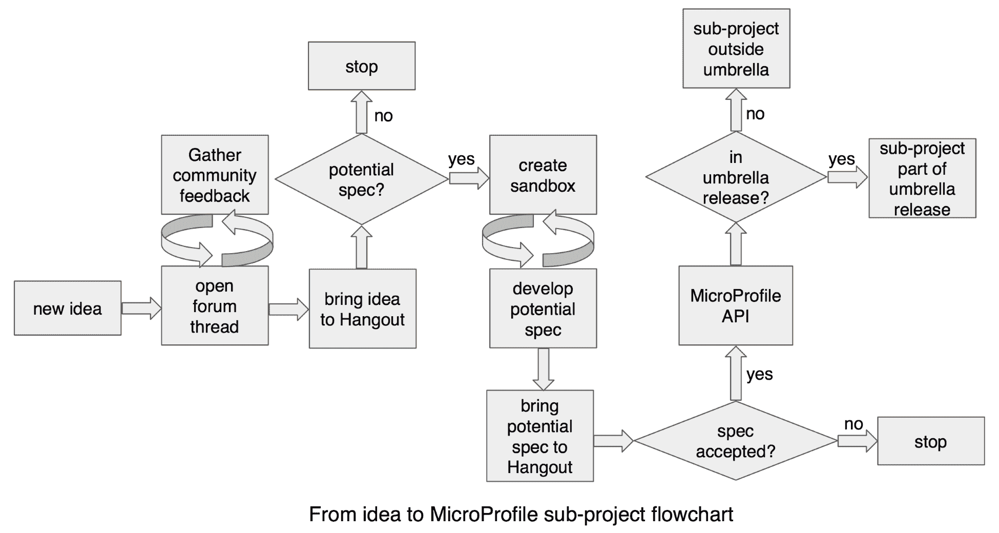
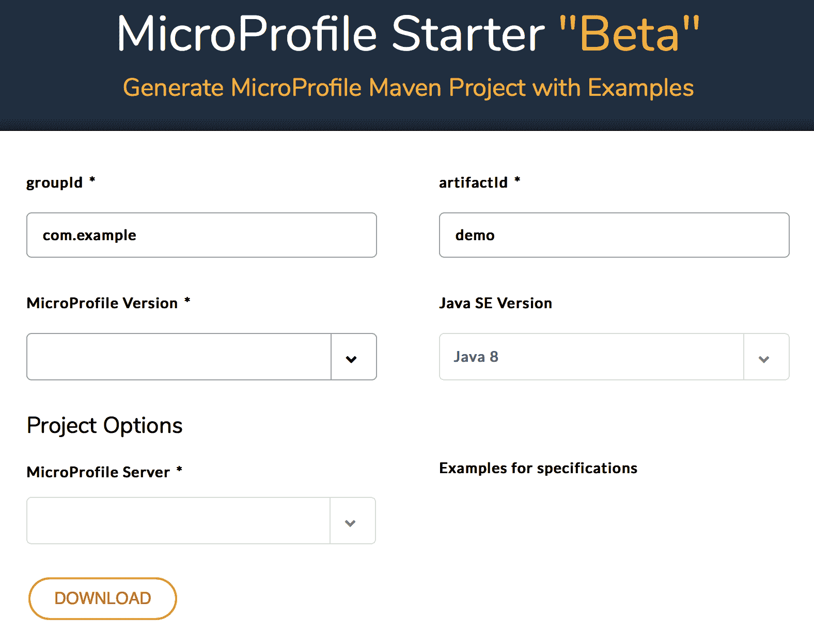
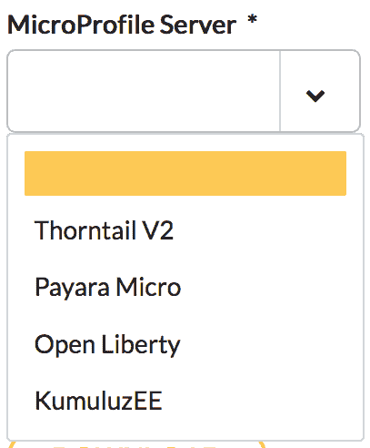
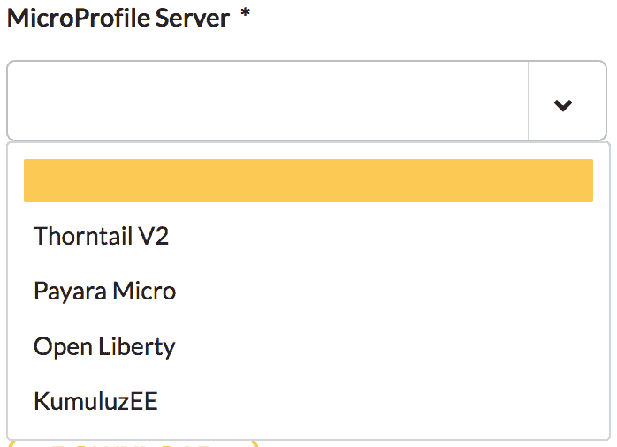
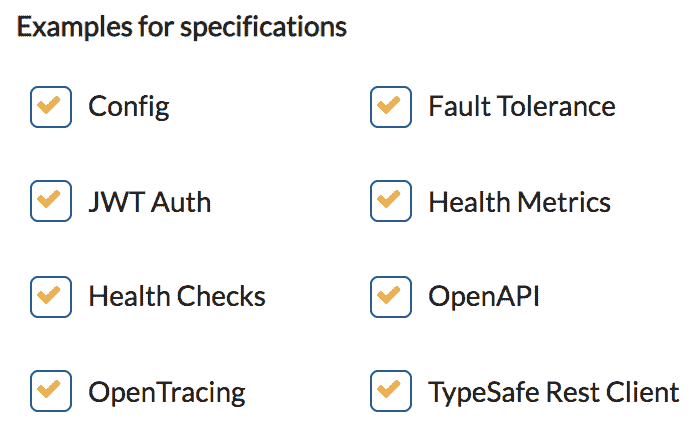
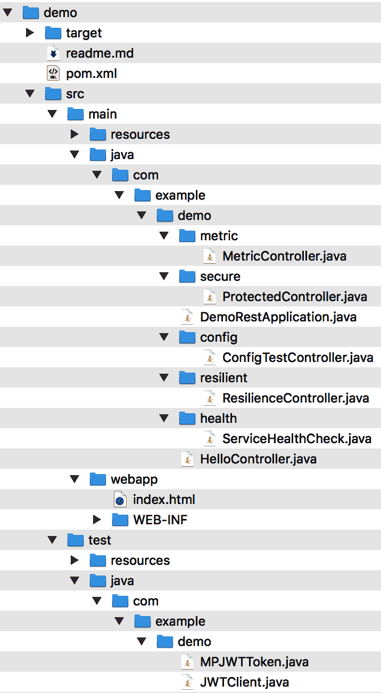

# 治理和贡献

Eclipse MicroProfile 由社区成员治理。换句话说，它不是由单一的供应商来治理。此外，它还收到了来自开发者以及来自各种组织、公司和个体贡献者的贡献。该项目以其轻量级的过程和治理而著称，通过这些过程和治理，实现了创新、快速和敏捷。本章中的主题将帮助您了解 MicroProfile 项目的治理，您还将发现如何也能为 MicroProfile 项目做出贡献。

本章将涵盖以下主题：

+   如何治理 Eclipse MicroProfile 项目

+   社区如何协作并为其持续创新做出贡献……

# 当前的 Eclipse MicroProfile 治理

Eclipse MicroProfile 在其运营和决策过程中是透明的，这些过程旨在非常轻量级。治理重点是创建、创新和以协作方式发展规范。

Eclipse MicroProfile 首先是一个 Eclipse 项目，因此，它遵循 Eclipse 的流程。这包括提交者批准、项目发布、知识产权保护、许可证审查流程等。然而，Eclipse 基金会足够灵活，可以让像 MicroProfile 这样的项目提供一些额外的轻量级流程，以便多个规范可以并行推进，并有方法进行跨规范沟通和对齐规范。

其中一个轻量级过程是 Eclipse MicroProfile 的两周一次的 Hangout 会议/通话（其会议 URL 在 [`eclipse.zoom.us/j/949859967`](https://eclipse.zoom.us/j/949859967)，其录音可以在 Eclipse MicroProfile YouTube 频道上找到，该频道地址为 [`www.youtube.com/channel/UC_Uqc8MYFDoCItFIGheMD_w`](https://www.youtube.com/channel/UC_Uqc8MYFDoCItFIGheMD_w)），该会议对社区中的任何人开放，作为一个论坛，讨论与会者提出的话题并做出决定，包括子项目状态、发布内容、发布日期和子项目创建批准等。需要注意的是，尽管 MicroProfile 看起来像一个标准化组织，但它并不是。MicroProfile 是由社区创建的，它以社区确定的速度在不同子项目中进行创新。MicroProfile 定义的规范鼓励多种实现，这与标准化组织的做法类似。然而，MicroProfile 实际上是一个快速发展的开源项目，其源代码就是规范。

社区沟通、讨论和辩论的主要方式是 Eclipse MicroProfile Google 组([`groups.google.com/forum/#!forum/microprofile`](https://groups.google.com/forum/#!forum/microprofile)). 你可以使用你喜欢的网络浏览器在 Google 组中阅读、发布、回答或开始关于任何与 MicroProfile 相关的主题的论坛消息。你还可以使用该组的电子邮件来发起新的论坛消息。任何人都可以发起新的论坛线程来讨论话题，比如要添加到 MicroProfile 的潜在新功能。在社区在论坛上就新想法进行长时间讨论，并且/或者在 MicroProfile Hangout 通话中讨论后，确定值得进一步辩论，社区决定为这个新想法创建一个工作组，并指定一名负责人或一组负责人，他们通常是处理主题的专家，担任其协调员。

需要指出的一点重要方面是，工作组（或子项目）的负责人或负责人并不单独塑造或决定一个规范的演变或包括哪些功能以及不包括哪些功能。他们没有否决权或在关于他们规范的决策中没有最终决定权。通过分享想法、专业知识、过去经验、现有技术的分析以及最佳实践，工作组将提出他们最好的提案。此外，所有未解决的问题需要由社区讨论，并在需要时在两周一次的 Hangout 会议/通话中提出进一步辩论。通过讨论、协作和来自社区的反馈，分析了许多观点，使最佳选项或选项浮出水面。工作组将建立一个重复的每周或每两周一次的会议，该会议记录在 MicroProfile Google 日历中([`calendar.google.com/calendar/embed?src=gbnbc373ga40n0tvbl88nkc3r4%40group.calendar.google.com`](https://calendar.google.com/calendar/embed?src=gbnbc373ga40n0tvbl88nkc3r4%40group.calendar.google.com)). 这包含所有 MicroProfile Hangout 通话、MicroProfile 子项目通话和 MicroProfile 发布日期等信息。

虽然任何人都可以参加这些会议，但通常有一小部分人作为主题专家参与这些通话。在几次会议之后，工作组决定是否将新功能带到 MicroProfile Hangout 通话中讨论其成为 MicroProfile 子项目的提案。

在 MicroProfile Hangout 电话会议中，一个子项目提案可能会被拒绝或接受。应该说，当子项目提案带到 MicroProfile Hangout 电话会议时，是否应该向前推进的讨论大多数已经完成，所以会议上的决定对子项目工作组来说真的不应该感到惊讶。子项目的拒绝并不意味着它不满足一个特定的发展需求，而是对它的目标与推进 MicroProfile 规范的目标不匹配的肯定，该规范的目标是优化企业 Java 微服务架构。

例如，如果一个子项目提案解决了一个与微服务无关的需求，那么这个子项目提案很可能不会作为 MicroProfile 子项目向前推进。子项目的接受意味着它有效地解决了一个需求，丰富了规范，使其朝着优化企业 Java 微服务架构的目标前进。正是在这个时候，子项目变成了一个官方的 MicroProfile API。一旦子项目变成了一个 MicroProfile API，那么就需要决定它是作为一个独立子项目存在于 umbrella 之外，还是作为包含在 umbrella 中的子项目发布。这个过程的高级流程图如下：



在撰写本书时，这些都是 Eclipse MicroProfile API/子项目（列出项目负责人）：

| **MicroProfile API/子项目名称** | **子项目负责人** |
| --- | --- |
| **MicroProfile 项目负责人** | 约翰·克莱根和凯文·舒特 |
| **配置** | 姜艾米莉和马克·斯特鲁布伯格 |
| **容错** | 姜艾米莉 |
| 健康检查 | 安托万·萨博-迪兰 |
| **JWT 传播** | 斯科特·斯塔克 |
| **指标** | 海因科·鲁普 |
| **OpenAPI** | 阿图尔·德·马加良埃斯 |
| **OpenTracing** | 帕沃·洛法伊 |
| **Rest 客户端** | 约翰·D·阿门特和安迪·麦克莱恩特 |

Eclipse MicroProfile 遵循一个时间盒式的快速增量发布计划，该计划是公开的，列在 Eclipse 基金会 MicroProfile 项目页面([`projects.eclipse.org/projects/technology.microprofile`](https://projects.eclipse.org/projects/technology.microprofile))上。例如，从 1.x 到 2.x 的主要 Eclipse MicroProfile 发布，包括对 MicroProfile API 的重大更新，可能会引入破坏性变化。次要发布，即点发布，包括小的 API 更新或新的 API，以确定的发布日期为准。目前，MicroProfile 社区的发布窗口每年在二月、六月和十一月，适用于次要和/或主要发布。

# 开放贡献的沙箱方法

为潜在的 MicroProfile 子项目创建的工作组也可能被分配一个沙盒，这是 MicroProfile 社区提供尝试新想法的另一个资源。沙盒仓库是一个位于 [`github.com/eclipse/microprofile-sandbox`](https://github.com/eclipse/microprofile-sandbox) 的 GitHub 仓库，用于孵化想法和代码示例，这些最终将变成新规范的独立仓库。任何人都可以打开拉取请求，并使用沙盒进行新想法的实验，以及分享代码和文档，这些可以作为社区 Google 组、MicroProfile 闲聊电话或工作组会议讨论的一部分。保持您的拉取请求开放...

# 伞状发布与伞状之外的项目

Eclipse MicroProfile 是由一系列具有特定焦点的规范组成。例如，Eclipse MicroProfile Config 规范涵盖了所有与为微服务配置参数相关的内容。一个规范的版本可以作为 Eclipse MicroProfile 的伞状发布的一部分包含在内，或者在伞状之外发布。作为一个具体的例子，Eclipse MicroProfile 2.2 的最新伞状发布，于 2019 年 2 月 12 日发布，包括了以下规范：

+   Eclipse MicroProfile Open Tracing 1.3

+   Eclipse MicroProfile Open API 1.1

+   Eclipse MicroProfile Rest Client 1.2

+   Eclipse MicroProfile Fault Tolerance 2.0

+   Eclipse MicroProfile Config 1.3

+   Eclipse MicroProfile Metrics 1.1

+   Eclipse MicroProfile JWT Propagation 1.1

+   Eclipse MicroProfile Health Check 1.0

+   CDI 2.0

+   JSON-P 1.1

+   JAX-RS 2.1

+   JSON-B 1.0

然而，Eclipse MicroProfile 还有其他一些在非伞状发布中发布的规范。例如，我们在第九章“响应式编程与未来发展”中介绍的 Eclipse MicroProfile Reactive Streams Operators 1.0，就是一个最近在非伞状发布中发布的规范。那么，为什么 MicroProfile 允许在伞状之外的规范呢？原因在于，首先在伞状之外发布，可以为社区和最终用户提供使用和测试新技术的机会，因此在被纳入伞状之前，在真实应用中验证这些技术。

# MicroProfile Starter

MicroProfile Starter 是一个示例源代码生成器，其目标是帮助开发者快速开始使用和利用由社区驱动的开源企业 Java 微服务规范 Eclipse MicroProfile，通过在 Maven 项目中生成可工作的示例代码。

自 2016 年中旬项目创建以来，就有了 MicroProfile Starter 的想法，并在 2016 年 Devoxx BE（2016 年 11 月 7 日那周）上公开讨论。在 MicroProfile Starter 项目发布的前两周里，世界各地的开发者通过这个项目创建了超过 1200 个项目，这是对其在全球范围内采用的一个良好和积极的迹象。

# 快速游览 MicroProfile Starter

让我们快速了解一下 MicroProfile Starter：

1.  当你访问**MicroProfile Starter "Beta"**页面，[`start.microprofile.io/`](https://start.microprofile.io/)，你会看到以下登录页面：



对于 Maven 相关的参数，你可以接受默认值（[`maven.apache.org/guides/mini/guide-naming-conventions.html`](https://maven.apache.org/guides/mini/guide-naming-conventions.html)），groupId 和 artifactId，或者按照喜好更改。groupId 参数能唯一标识你的项目，artifactId 是 JAR 文件名，不包含 MicroProfile 版本号。在这个游览中，接受所有默认值。

1.  接下来，从下拉列表中选择 MicroProfile Version：



在这个游览中，选择 MicroProfile 版本 MP 2.1。注意，根据你选择的 MicroProfile 版本，示例规格部分列出的规格数量会有所变化。这个数字取决于每个 MicroProfile 伞状发布中包含多少 API。要了解每个版本中包含哪些 API，请参考 MicroProfile 社区演讲（[`docs.google.com/presentation/d/1BYfVqnBIffh-QDIrPyromwc9YSwIbsawGUECSsrSQB0/edit#slide=id.g4ef35057a0_6_205`](https://docs.google.com/presentation/d/1BYfVqnBIffh-QDIrPyromwc9YSwIbsawGUECSsrSQB0/edit#slide=id.g4ef35057a0_6_205)）。

1.  然后，从下拉列表中选择 MicroProfile Server：



在这个游览中，选择 Thorntail V2，这是红帽用来实现 Eclipse MicroProfile 规范的开源项目。

1.  保留所有**示例规格**复选框的选择（也就是说，不要取消选中任何复选框）：



这将生成包含 MicroProfile 版本 2.1 中所有 API 的示例工作代码。

1.  使用 MicroProfile Starter 生成示例源代码过程的最后一步是点击 DOWNLOAD 按钮，这将创建一个 ZIP 归档文件。确保将`demo.zip`文件保存到你的本地驱动器上。然后在你的本地驱动器上解压`demo.zip`。内容应如下所示：



请注意生成的内容中有一个`readme.md`文件。这个文件包含了如何编译和运行生成代码的说明，这包括一个练习 Eclipse MicroProfile 不同功能的示例网络应用程序。

1.  更改目录到你解压演示项目的位置。在我的情况下，我把它放在了我的`Downloads`目录中：

```java
$ cd Downloads/demo
```

1.  通过输入以下命令编译生成的示例代码：

```java
$ mvn clean package
```

1.  运行微服务：

```java
$ java -jar target/demo-thorntail.jar
```

1.  几秒钟后，你将看到以下消息：

```java
$ INFO  [org.wildfly.swarm] (main) WFSWARM99999: Thorntail is Ready
```

这表明微服务正在运行。

1.  打开你喜欢的网页浏览器，指向`http://localhost:8080/index.html`。

这将打开示例网络应用程序，如下所示：


1.  要查看 MicroProfile Config 的功能，点击注入的配置值。将打开一个窗口标签，显示以下内容：


1.  同样，如果你点击通过查找查看配置值，将显示另一个窗口标签如下：


我们之前看到的参数值的*注入值*和*查找值*定义在`./demo/src/main/resources/META-INF/microprofile-config.properties`文件中，如下所示：

```java
$ cat ./src/main/resources/META-INF/microprofile-config.properties
injected.value=Injected value
value=lookup value
```

1.  假设你需要为`value`参数在开发和系统测试之间使用不同的值。你可以通过在启动微服务时传递命令行参数来实现这一点（首先确保按终端窗口上的*Ctrl* + *C*退出运行中的应用程序）：

```java
$ java -jar target/demo-thorntail.jar -Dvalue=hola
```

1.  现在，当你点击通过查找查看配置值时，将显示另一个窗口标签：


请注意，执行此逻辑的源代码位于生成的`./src/main/java/com/example/demo/config/ConfigTestController.java`文件中。

1.  要查看 MicroProfile Fault Tolerance 的功能，点击超时后的回退。将打开一个窗口标签，显示以下内容：


有关 MicroProfile Config API 的更多信息，请参阅其文档([`github.com/eclipse/microprofile-config/releases/download/1.3/microprofile-config-spec-1.3.pdf`](https://github.com/eclipse/microprofile-config/releases/download/1.3/microprofile-config-spec-1.3.pdf))。

示例代码演示了`@Fallback`注解与`@Timeout`的组合使用。以下是示例代码：

```java
@Fallback(fallbackMethod = "fallback") // fallback handler
   @Timeout(500)
   @GET
   public String checkTimeout() {
     try {
       Thread.sleep(700L);
     } catch (InterruptedException e) {
       //
     }
     return "Never from normal processing";
   }
   public String fallback() {
   return "Fallback answer due to timeout";
   }
```

`@Timeout`注解指定如果方法执行时间超过 500 毫秒，应抛出超时异常。此注解可以与`@Fallback`一起使用，在这种情况下，当发生超时异常时调用回退处理程序。在前面的示例代码中，超时异常总是发生，因为方法正在执行——即，休眠 700 毫秒，这超过了 500 毫秒。

请注意，执行此逻辑的源代码位于生成的`./src/main/java/com/example/demo/resilient/ResilienceController.java`文件中。

有关 MicroProfile 容错 API 的更多信息，请参阅其文档([`github.com/eclipse/microprofile-opentracing/releases/download/1.2/microprofile-opentracing-spec-1.2.pdf`](https://github.com/eclipse/microprofile-opentracing/releases/download/1.2/microprofile-opentracing-spec-1.2.pdf))。

微 Profile 社区欢迎您提供反馈以及与微 Profile Starter 项目的协作或贡献。要提供反馈，您需要点击 MicroProfile Starter "Beta"页面右上角的“提供反馈”按钮（[`start.microprofile.io/`](https://start.microprofile.io/)）并创建一个问题。

微 Profile Starter 项目会将请求的项目和修复按照里程碑进行分组和优先排序，目标是持续发布。MicroProfile Starter 工作组定期召开会议，如果您想用您的开发技能帮助该项目，请发送电子邮件至`microprofile@googlegroups.com`或加入其 Gitter 频道讨论（[`gitter.im/eclipse/microprofile-starter`](https://gitter.im/eclipse/microprofile-starter)）。项目的信息，包括源代码的位置，可以在[`wiki.eclipse.org/MicroProfile/StarterPage`](https://wiki.eclipse.org/MicroProfile/StarterPage)找到。

# 总结

在本章中，我们学习了 Eclipse 微 Profile 项目的轻量级治理流程，其快速的创新方法，以及如何使用沙盒促进协作和鼓励代码开发和文档。我们还了解了其子项目，这些子项目的领导者，以及它们可以作为独立版本发布，或者作为 Eclipse 微 Profile 伞式发布的一部分发布。

此外，您还了解了 MicroProfile Starter，这是一个 Maven 项目生成工具，提供代码示例，以便开发者可以快速启动他们的 MicroProfile 应用程序。最后，我们简要介绍了如何使用 Eclipse MicroProfile Config 构造轻松修改应用程序的属性...

# 问题

1.  微 Profile 社区的主要沟通方式是什么？

1.  双周一次的 MicroProfile Hangout 电话会议的目标是什么？

1.  子项目（微 Profile 规范）负责人/负责人的角色是什么？

1.  一个新的微 Profile 规范提案遵循的过程是什么？

1.  微 Profile 项目遵循的发布计划是什么？

1.  微 Profile 沙盒的目标是什么？

1.  在伞式/平台 MicroProfile 发布下发布项目和在外部发布的项目有什么区别？

1.  微 Profile Starter 是什么，它提供了哪些好处？
