# 微服务简介

本书并非盲目地赞美微服务。相反，它关于我们如何能够利用它们的好处，同时能够处理构建可扩展、有弹性和可管理的微服务的挑战。

作为本书的引言，本章将涵盖以下内容：

+   我如何了解微服务以及我对它们的好处和挑战的经验

+   微服务基础架构是什么？

+   微服务的挑战

+   处理挑战的设计模式

+   可以帮助我们处理这些挑战的软件促进者

+   本书未涵盖的其他重要考虑因素

# 技术要求

本章无需安装。不过，您可能想查看 C4 模型约定，[`c4model.com`](https://c4model.com)，因为本章的插图灵感来自于 C4 模型。

本章不包含任何源代码。

# 我进入微服务的方式

当我第一次在 2014 年了解微服务概念时，我意识到我在开发微服务（好吧，有点）已经好几年了，却不知道自己处理的微服务。我参与了一个始于 2009 年的项目，我们基于一系列分离的功能开发了一个平台。该平台被部署在多个客户的本地服务器上。为了使客户能够轻松选择他们想要从平台中使用的功能，每个功能都是作为**自主软件组件**开发的；也就是说，它有自己的持久数据，并且只使用定义良好的 API 与其他组件通信。

由于我无法讨论这个平台项目的特定功能，我将组件的名称进行了泛化，从**组件 A** 到 **组件 F** 进行标记。平台组成一组组件的如下所示：

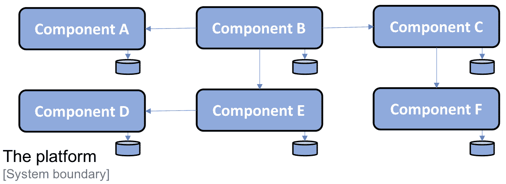

每个组件都是使用 Java 和 Spring Framework 开发的，打包成 WAR 文件，并在 Java EE 网络容器中（例如，Apache Tomcat）部署为 Web 应用程序。根据客户的具体要求，平台可以在单台或多台服务器上部署。双节点部署可能如下所示：

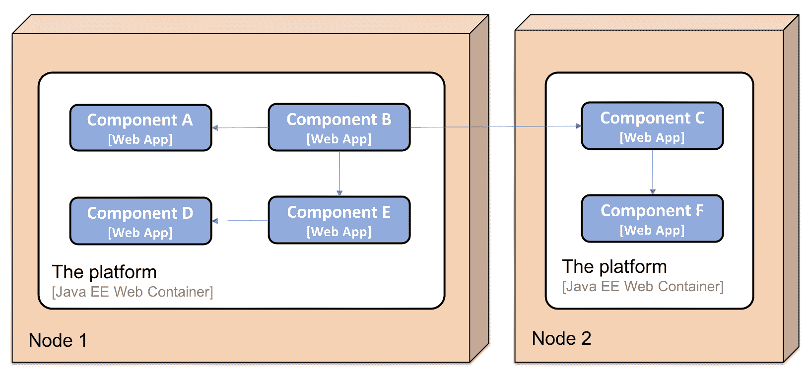

# 自主软件组件的好处

将平台的 functionality 分解为一系列自主软件组件提供了许多好处：

+   客户可以在自己的系统景观中部署平台的某些部分，使用其定义良好的 API 将其与现有系统集成。

    以下是一个示例，其中一个客户决定部署平台中的**组件 A**，**组件 B**，**组件 D** 和 **组件 E**，并将它们与客户系统景观中的两个现有系统**系统 A** 和 **系统 B** 集成：

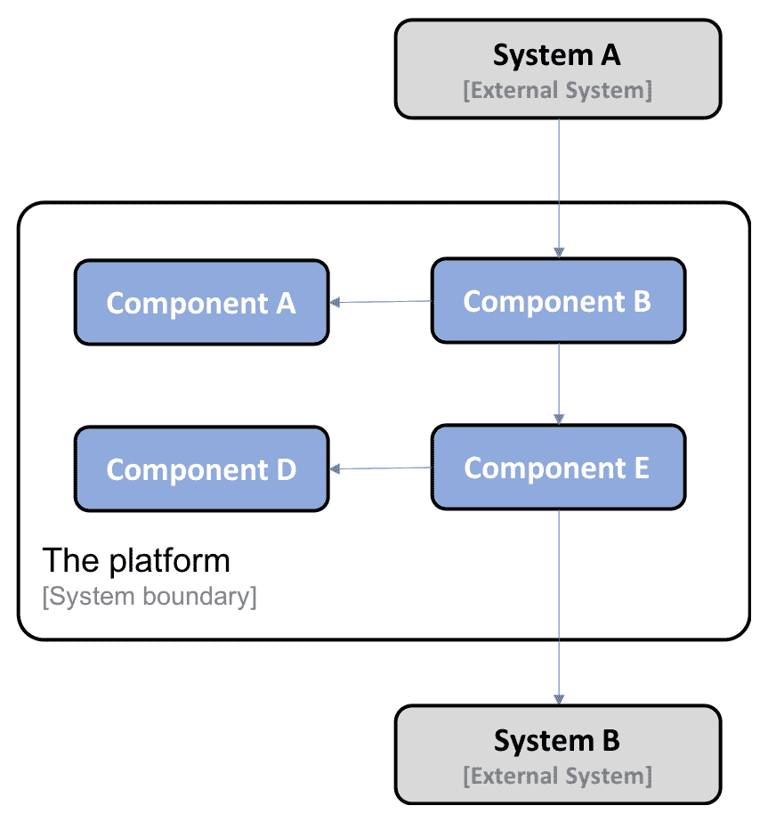

+   另一客户可以选择用其在客户系统景观中已存在的实现替换平台的部分功能，这可能会需要对平台 API 中现有的功能进行一些采用。以下是一个客户用其自己的实现替换了平台中的**组件 C**和**组件 F**的示例：

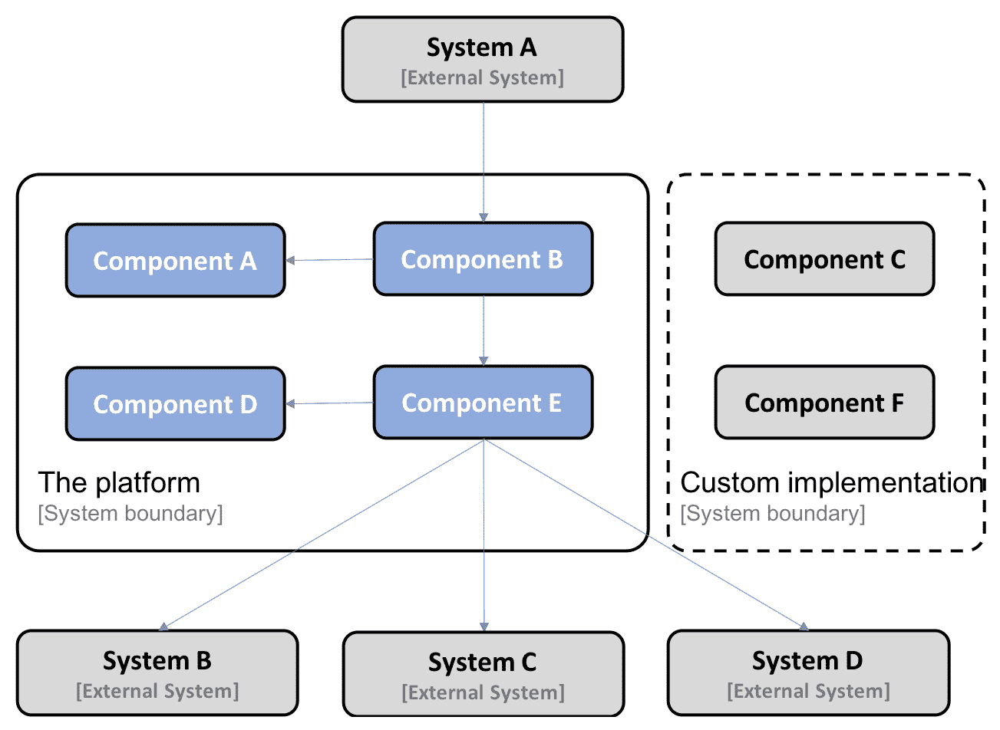

+   平台中的每个组件都可以单独交付和升级。由于使用了定义良好的 API，一个组件可以升级到新版本，而无需依赖于其他组件的生命周期。

    以下是一个示例，其中**组件 A**从版本**v1.1**升级到了**v1.2**。由于它使用了定义良好的 API 调用**组件 A**的**组件 B**，在升级后不需要更改（或者至少是向后兼容的）：

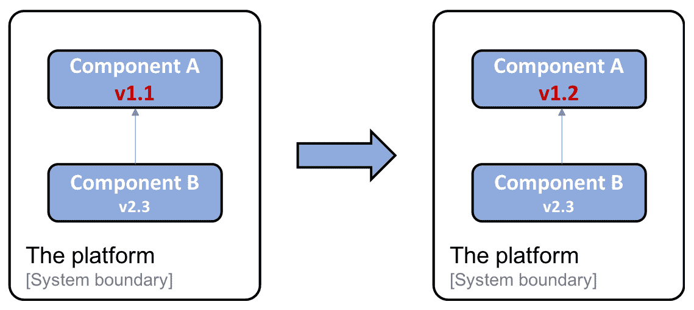

+   由于使用了定义良好的 API，平台中的每个组件也可以独立于其他组件扩展到多台服务器。扩展可以是为了满足高可用性要求或处理更高数量的请求。技术上，这是通过*手动*在运行 Java EE Web 容器的几台服务器前设置负载均衡器来实现的。一个**组件 A**扩展到三个实例的示例如下：

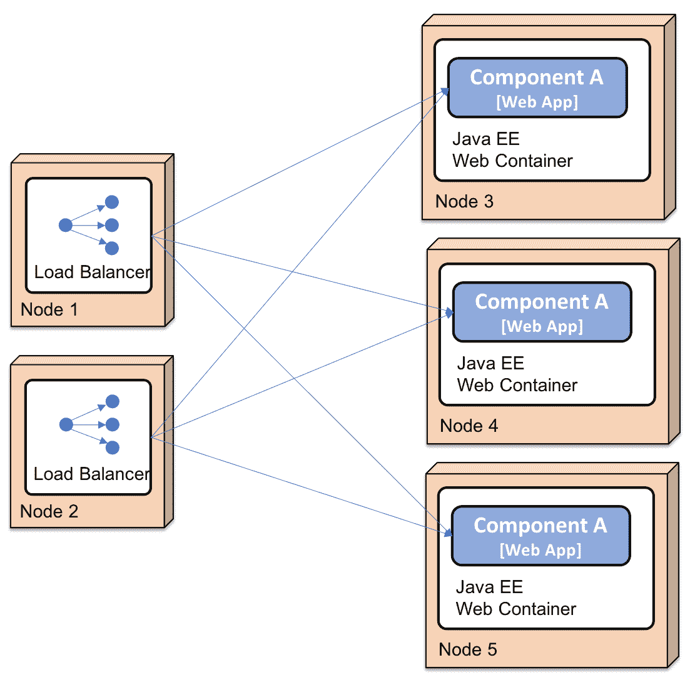

# 自主软件组件的挑战

我们还发现，将平台分解成多个部分引入了许多新的挑战，我们在开发更传统、单片应用程序时并没有暴露（至少没有暴露到同样的程度）到这些挑战：

+   向组件添加新实例需要手动配置负载均衡器并手动设置新节点。这项工作既耗时又易出错。

+   平台最初容易在与它通信的其他系统出现错误。如果一个系统没有及时响应从平台发送的请求，平台很快就会耗尽关键资源，例如，操作系统线程，特别是当暴露于大量并发请求时。这会导致平台中的组件挂起甚至崩溃。由于平台中的大多数通信基于同步通信，一个组件的崩溃可能会导致级联故障；也就是说，崩溃组件的客户端也可能在一段时间后崩溃。这被称为**故障链**。

+   保持组件所有实例中的配置一致并更新迅速成为一个问题，导致大量手动和重复工作。这导致时不时会出现质量问题。

+   与监控单体应用程序单个实例的状态（例如，CPU、内存、磁盘和网络的使用情况）相比，监控平台在延迟问题和硬件使用方面的状态更为复杂。

+   从多个分布式组件中收集日志文件并关联组件相关的日志事件是困难的，但可行的，因为组件的数量是固定的，且事先已知。

随着时间的推移，我们通过开发内部工具和处理这些挑战的良好文档说明，解决了前述列表中提到的绝大多数挑战。操作规模通常在一个级别，在该级别上，手动程序对于发布新版本的组件和处理运行时问题是可接受的，尽管这不是理想的。

# 进入微服务

2014 年了解微服务架构让我意识到其他项目也面临过类似的挑战（部分原因是除了我之前描述的原因之外，例如，大型云服务提供商满足网络规模要求）。许多微服务先驱发表了他们学到的课程细节。从这些教训中学习非常有意思。

许多先驱者最初开发了单体应用，这在商业上使他们非常成功。但随着时间的推移，这些单体应用变得越来越难以维护和进化。它们也挑战性地超出了最大机器的容量（也称为垂直扩展）。最终，先驱们开始寻找将单体应用拆分为更小组件的方法，这些组件可以独立于彼此进行发布和扩展。可以通过水平扩展来扩展小组件，即在多个小型服务器上部署一个组件并在其前面放置一个负载均衡器。如果在云环境中进行，扩展能力是潜在无限的——这只是一个你引入多少虚拟服务器的问题（假设你的组件可以在大量实例上扩展，但稍后再详细介绍）。

2014 年，我还了解了许多新的开源项目，这些项目提供了工具和框架，简化了微服务的开发，并可用于处理基于微服务架构的挑战。其中一些如下：

+   Pivotal 发布了**Spring Cloud**，该框架封装了**Netflix OSS**的部分内容，以提供动态服务发现、配置管理、分布式跟踪、断路器等功能。

+   我还了解到了**Docker** 和容器革命，这对于缩小开发和生产之间的差距非常有益。能够将一个组件包装为一个可部署的运行时工件（例如，一个 Java、`war` 或者 `jar` 文件），也可以作为一个完整的镜像在运行 Docker 的服务器上启动（例如，一个隔离的进程），这对开发和测试来说是一个巨大的进步。

+   一个容器引擎，比如 Docker，不足以在生产环境中使用容器。需要的东西例如能确保所有容器都运行正常，以及能在多台服务器上扩展容器，从而提供高可用性和/或增加计算资源。这类产品被称为**容器编排器**。过去几年中，出现了一系列产品，例如 Apache Mesos、Docker 的 Swarm 模式、亚马逊 ECS、HashiCorp Nomad 和 **Kubernetes**。Kubernetes 最初由谷歌开发。当谷歌发布 v1.0 版本时，他们还把 Kubernetes 捐赠给了 CNCF（[`www.cncf.io/`](https://www.cncf.io/)）。在 2018 年，Kubernetes 成为了一种事实上的标准，既可以预先打包用于本地部署，也可以从大多数主要云服务提供商那里作为服务提供。

+   我最近开始学习关于**服务网格** 的概念以及服务网格如何补充容器编排器，进一步卸载微服务的职责，使它们变得可管理和有弹性。

# 微服务示例架构

由于这本书不能涵盖我刚才提到的所有技术方面，我将重点介绍自 2014 年以来我参与的客户项目中证明有用的部分。我将描述它们如何一起使用，以创建可管理、可扩展和有弹性的协作微服务。

本书的每一章都将关注一个特定的问题。为了演示事物是如何整合在一起的，我将使用一组协作的微服务，我们将在本书中逐步完善它们：

既然我们已经了解了微服务的如何和什么，让我们开始探讨如何定义一个微服务。

# 定义微服务

对我来说，微服务架构是关于将单体应用程序拆分成更小的组件，这实现了两个主要目标：

+   加快开发，实现持续部署

+   更容易扩展，手动或自动

微服务本质上是一个可以独立升级和扩展的自主软件组件。为了能够作为一个自主组件行动，它必须满足以下某些标准：

+   它必须遵循一种无共享架构；也就是说，微服务之间不会在数据库中共享数据！

+   它必须仅通过定义良好的接口进行通信，例如，使用同步服务，或者更 preferably，通过使用 API 和稳定的、文档齐全的消息格式彼此发送消息，并且这些消息格式遵循一个定义好的版本策略来发展。

+   它必须作为独立的运行时进程部署。每个微服务的实例运行在一个单独的运行时进程中，例如，一个 Docker 容器。

+   微服务实例是无状态的，这样对微服务的传入请求可以由其任何一个实例处理。

使用一组微服务，我们可以将部署到多个较小的服务器上，而不是被迫将部署到一个大的单体服务器上，正如我们在部署单体应用时必须做的那样。

考虑到前面提到的条件已经满足，相较于将一个大的单体应用进行扩展，将一个微服务扩展到更多的实例（例如，使用更多的虚拟服务器）会更加容易。利用云服务中可用的自动扩展功能也是一种可能性，但对于一个大的单体应用来说，通常并不可行。与升级一个大的单体应用相比，升级或替换一个微服务也更为容易。

这一点可以通过以下图表来说明，其中一个大单体应用被划分为六个微服务，它们都被部署到一个单独的服务器上。其中一些微服务还独立于其他服务进行了扩展：

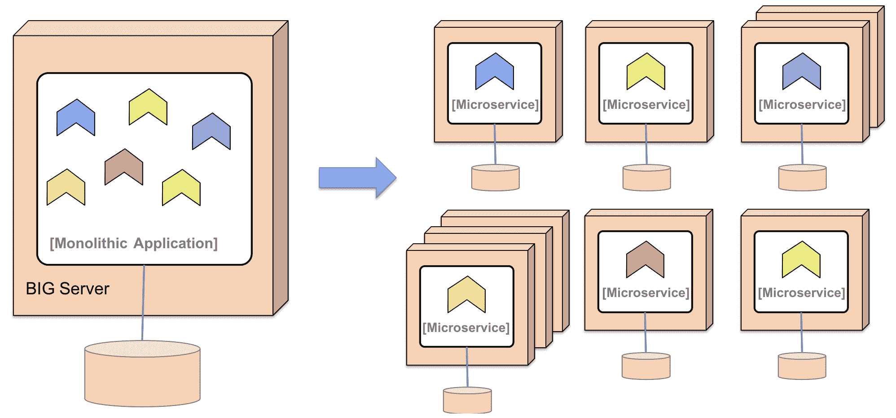

我经常从客户那里收到的一个问题是，“**微服务应该有多大？**”

我试图使用以下经验法则：

+   足够小，以至于能够装进开发者的头脑中

+   足够小，不会影响性能（即，延迟）和/或数据一致性（存储在不同微服务中的数据之间的 SQL 外键不再是你可以轻易假设的东西）。

所以，总结一下，微服务架构本质上是这样一种架构风格：我们将一个单体应用分解为一组协作的自主软件组件。动机是为了实现更快的开发，并使应用的扩展变得更容易。

接下来，我们将转向了解在微服务方面我们将面临的一些挑战。

# 服务发现

**服务发现**模式有以下问题、解决方案和解决方案要求。

# 微服务的挑战

在“**自主软件组件的挑战**”一节中，我们已经看到了一些自主软件组件可能会带来的挑战（它们都适用于微服务），如下所示：

+   许多使用同步通信的小组件可能会导致*连锁故障*问题，尤其是在高负载下。

+   对于许多小组件保持配置的最新状态可能会很有挑战性。

+   跟踪正在处理并涉及许多组件的请求可能很困难，例如，在执行根本原因分析时，每个组件都本地存储日志事件。

+   分析组件级别硬件资源的使用也可能具有挑战性。

+   手动配置和管理许多小型组件可能会变得昂贵且容易出错。

将应用程序分解为一组自主组件的另一个缺点（但通常一开始并不明显）是，它们形成了一个分布式系统。分布式系统以其本质而言，很难处理。这一点已经知道很多年了（但在许多情况下直到证明否则才被忽视）。我用来证明这个事实的最喜欢引语来自彼得·德意志，他在 1994 年提出了以下观点：

***分布式计算的 8 大谬误***：基本上每个人在第一次构建分布式应用程序时都会做出以下八个假设。所有这些最终都被证明是错误的，并且都会造成巨大的麻烦和痛苦的学习经验：*

1.  *网络是可靠的*

1.  *延迟为零*

1.  *带宽是无限的*

1.  *网络是安全的*

1.  *拓扑不会改变*

1.  *有一个管理员*

1.  *传输成本为零*

1.  *网络是同质的*

*-- 彼得·德意志，1994*

**注：**第八个谬误实际上是由詹姆斯·高斯林在后来添加的。更多信息，请访问[`www.rgoarchitects.com/Files/fallacies.pdf`](https://www.rgoarchitects.com/Files/fallacies.pdf)。

一般来说，基于这些错误假设构建微服务会导致解决方案容易出现临时网络故障和其他微服务实例中的问题。当系统景观中的微服务数量增加时，问题的可能性也会上升。一个好的经验法则是，设计你的微服务架构时，假设系统景观中总是有一些东西在出错。微服务架构需要处理这一点，包括检测问题和重新启动失败组件，以及在客户端方面，以便请求不会发送到失败的微服务实例。当问题得到解决时，应恢复对之前失败的微服务的请求；也就是说，微服务客户端需要具有弹性。所有这些当然都需要完全自动化。对于大量的微服务，操作员手动处理这是不可能的！

这个范围很大，但我们将暂时限制自己，并继续研究微服务的设计模式。

# 微服务的设计模式

本节将介绍使用设计模式减轻微服务挑战的方法。在这本书的后面，我们将看到我们如何使用 Spring Boot、Spring Cloud 和 Kubernetes 实现这些设计模式。

设计模式的概念实际上相当古老；它是在 1977 年由克里斯托弗·亚历山大发明的。本质上，设计模式是关于在给定特定上下文时描述一个问题的可重用解决方案。

我们将涵盖的设计模式如下：

+   服务发现

+   边缘服务器

+   响应式微服务

+   集中式配置

+   集中式日志分析

+   分布式追踪

+   熔断器

+   控制循环

+   集中式监控和警报

此列表并非旨在全面，而是我们之前描述的挑战所需的最小设计模式列表。

我们将采用一种轻量级的方法来描述设计模式，并关注以下内容：

+   问题

+   解决方案

+   解决方案要求

在本书的后面部分，我们将更深入地探讨如何应用这些设计模式。这些设计模式的上下文是一个由合作的微服务组成的系统架构，微服务通过同步请求（例如，使用 HTTP）或发送异步消息（例如，使用消息代理）相互通信。

# 问题

客户端如何找到微服务和它们的实例？

微服务实例在启动时通常会被分配动态分配的 IP 地址，例如，当它们在容器中运行时。这使得客户端难以向微服务发起请求，例如，向暴露 HTTP 上的 REST API 的微服务发起请求。请参考以下图表：

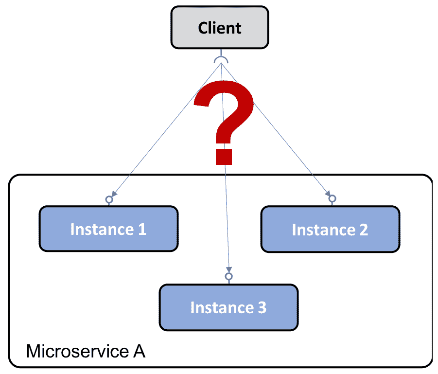

# 解决方案

在系统架构中添加一个新组件——**服务发现**服务——跟踪当前可用的微服务和其实例的 IP 地址。

# 解决方案要求

一些解决方案要求如下：

+   自动注册/注销微服务和它们的实例，因为它们来来去去。

+   客户端必须能够向微服务的逻辑端点发起请求。请求将被路由到可用的微服务实例之一。

+   对微服务的请求必须在可用实例上进行负载均衡。

+   我们必须能够检测到当前不健康的实例；也就是说，请求不会被路由到这些实例。

**实现说明：** 正如我们将看到的，这个设计模式可以使用两种不同的策略来实现：

+   **客户端路由**：客户端使用与服务发现服务通信的库，以找出要发送请求的正确实例。

+   **服务器端路由**：服务发现服务的架构还暴露了一个反向代理，所有请求都发送到该代理。反向代理代表客户端将请求转发到适当的微服务实例。

# 边缘服务器

边缘服务器模式有以下问题、解决方案和解决方案要求。

# 问题

在微服务系统架构中，许多情况下，希望将一些微服务暴露给系统架构的外部，并将其余的微服务隐藏在外部访问之外。必须保护暴露的微服务免受恶意客户端的请求。

# 解决方案

向系统架构中添加一个新组件，即**边缘服务器**，所有传入请求都将通过它：

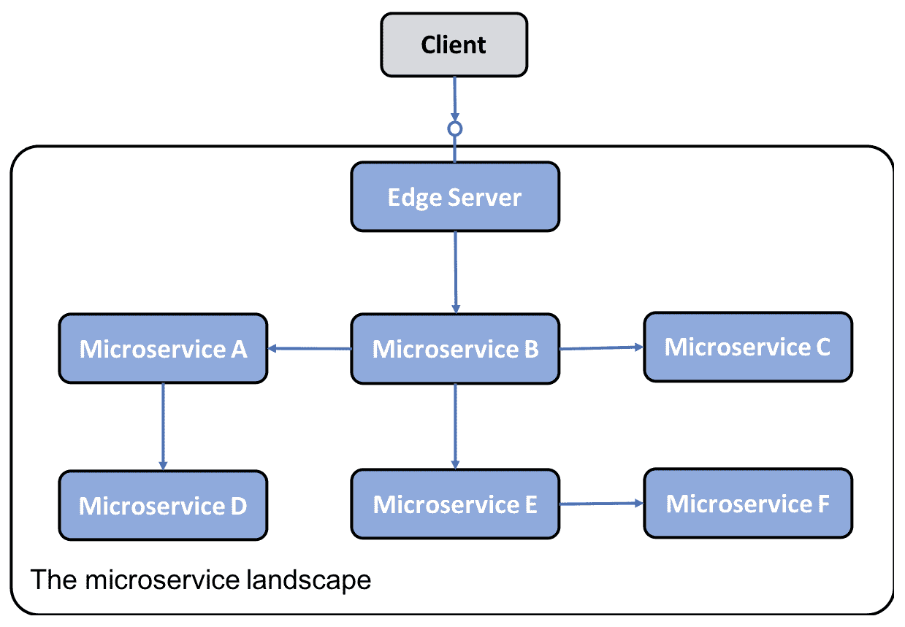

实现说明：边缘服务器通常表现得像反向代理，可以与发现服务集成，提供动态负载均衡功能。

# 解决方案要求

一些解决方案要求如下：

+   隐藏不应暴露在外部上下文中的内部服务；也就是说，只将请求路由到配置为允许外部请求的微服务。

+   暴露外部服务并保护它们免受恶意请求；也就是说，使用标准协议和最佳实践，如 OAuth、OIDC、JWT 令牌和 API 密钥，确保客户端是可信的。

# 反应式微服务

反应式微服务模式有以下问题、解决方案和解决方案要求。

# 问题

传统上，作为 Java 开发者，我们习惯于使用阻塞 I/O 实现同步通信，例如，通过 HTTP 实现的 RESTful JSON API。使用阻塞 I/O 意味着操作系统会为请求的长度分配一个线程。如果并发请求的数量增加（以及/或者请求中涉及的组件数量增加，例如，一系列协作的微服务），服务器可能会在操作系统中耗尽可用的线程，导致问题从更长的响应时间到服务器崩溃。

此外，正如我们在本章中已经提到的，过度使用阻塞 I/O 会使微服务系统容易出现错误。例如，一个服务的延迟增加可能会导致客户端耗尽可用的线程，从而导致它们失败。这反过来又可能导致它们的客户端出现相同类型的问题，这也被称为故障链。请参阅*断路器*部分，了解如何处理与故障链相关的问题。

# 解决方案

使用非阻塞 I/O，确保在等待另一个服务（例如，数据库或另一个微服务）处理时不会分配线程。

# 解决方案要求

一些解决方案要求如下：

+   只要可行，使用异步编程模型；也就是说，发送消息而不等待接收者处理它们。

+   如果偏好同步编程模型，确保使用反应式框架，这些框架可以使用非阻塞 I/O 执行同步请求，即在等待响应时不会分配线程。这将使微服务更容易扩展以处理增加的工作负载。

+   微服务还必须设计成有恢复力，也就是说，能够产生响应，即使它依赖的服务失败了。一旦失败的服务恢复正常运营，它的客户端必须能够继续使用它，这被称为自愈。

在 2013 年，设计这些方式的关键原则在*《反应式宣言》*中得到了确立（[`www.reactivemanifesto.org/`](https://www.reactivemanifesto.org/)）。根据宣言，反应式系统的基石是它们是消息驱动的；也就是说，它们使用异步通信。这使得它们能够是弹性的，也就是说，可伸缩的，并且有恢复力，也就是说，能够容忍失败。弹性和恢复力共同使得一个反应式系统能够是有响应性的，这样它能够及时做出反应。

# 集中配置

集中配置模式有以下问题、解决方案和解决方案要求。

# 问题

一个应用程序，传统上，是与它的配置一起部署的，例如，一组环境变量和/或包含配置信息的文件。考虑到一个基于微服务架构的系统景观，也就是有大量部署的微服务实例，会有一些查询产生：

+   我如何获得所有运行中的微服务实例中现行的配置的完整视图？

+   我如何更新配置并确保所有受影响的微服务实例都被正确更新？

# 解决方案

在系统景观中添加一个新的组件，一个**配置**服务器，以存储所有微服务的配置。

# 解决方案要求

使存储一组微服务的配置信息成为可能，在同一个地方有不同的设置针对不同的环境（例如，`dev`、`test`、`qa`和`prod`）。

# 集中日志分析

集中日志分析有以下问题、解决方案和解决方案要求。

# 问题

传统上，一个应用程序会将日志事件写入存储在运行应用程序的本机机器上的日志文件中。考虑到一个基于微服务架构的系统景观，也就是有大量部署在众多小型服务器上的微服务实例，我们可以提出以下问题：

+   我如何获得系统景观的概览，当每个微服务实例向自己的本地日志文件中写入时，系统景观中发生了什么？

+   我如何找出是否有任何微服务实例遇到麻烦并开始向它们的日志文件中写入错误消息？

+   如果最终用户开始报告问题，我如何找到相关的日志消息；也就是说，我如何确定哪个微服务实例是问题的根源？以下图表说明了这个问题：

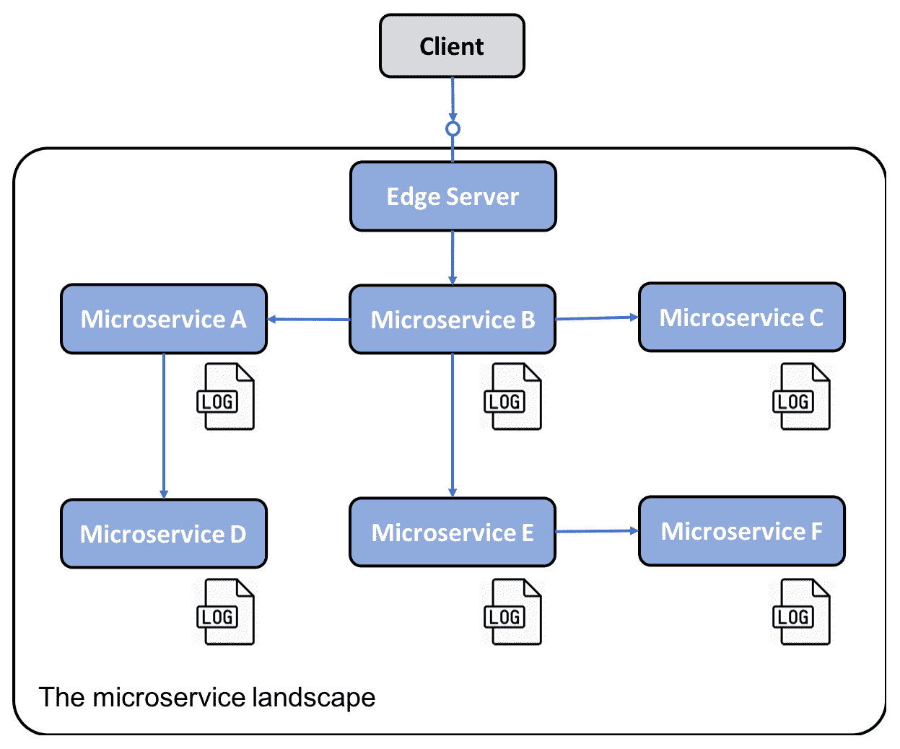

# 解决方案

添加一个新的组件，它可以管理**集中日志**，并能够执行以下操作：

+   检测新的微服务实例并从它们那里收集日志事件

+   在中心数据库中以结构化和可搜索的方式解释和存储日志事件

+   提供 API 和图形工具以查询和分析日志事件

# 分布式追踪

分布式追踪有以下问题、解决方案和解决方案要求。

# 问题

必须能够在处理系统景观的外部调用时跟踪微服务之间的请求和消息。

以下是一些故障场景的例子：

+   如果最终用户开始就特定的故障提起支持案例，我们如何确定导致问题的微服务，即根本原因？

+   如果一个支持案例提到了与特定实体相关的问题，例如，特定的订单号，我们如何找到与处理这个特定订单相关的日志消息——例如，参与处理这个特定订单的所有微服务的日志消息？

以下图表展示了这一点：

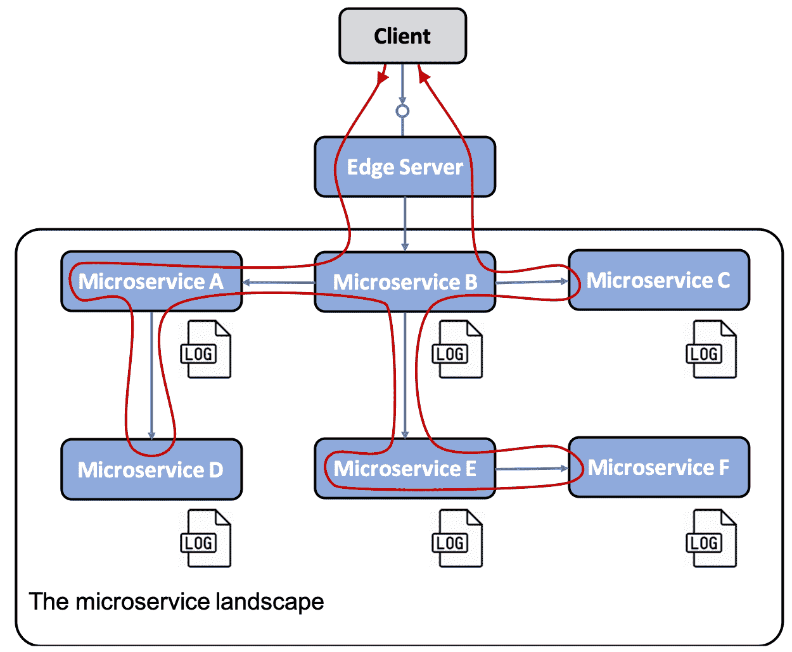

# 解决方案

为了跟踪合作微服务之间的处理过程，我们需要确保所有相关请求和消息都标记有一个共同的关联 ID，并且关联 ID 是所有日志事件的一部分。基于关联 ID，我们可以使用集中的日志服务找到所有相关的日志事件。如果其中一个日志事件还包括与业务相关的标识信息，例如客户、产品、订单等的 ID，我们可以使用关联 ID 找到与该业务标识所有相关的日志事件。

# 解决方案要求

解决方案要求如下：

+   为所有传入或新请求和事件分配唯一的关联 ID，例如，在一个有已知名称的头部中。

+   当一个微服务发出一个外部请求或发送一个消息时，它必须给请求和消息添加一个关联 ID。

+   所有日志事件必须以预定义的格式包括关联 ID，以便集中的日志服务可以从日志事件中提取关联 ID 并使其可搜索。

# 断路器模式

断路器模式将会有以下问题、解决方案和解决方案要求。

# 问题

使用同步交互的微服务系统景观可能会遭受*故障链*。如果一个微服务停止响应，它的客户端也可能遇到问题并且停止响应它们客户端的请求。问题可能会递归地在系统景观中传播，并使其大部分失效。

这尤其在同步请求使用阻塞 I/O 执行时非常常见，即阻塞来自底层操作系统的线程，当请求正在被处理。结合大量并发请求和服务开始意外地缓慢响应，线程池可能会迅速耗尽，导致调用者挂起和/或崩溃。这种失败会不愉快地迅速传播到调用者的调用者，等等。

# 解决方案

添加一个断路器，如果它检测到它调用的服务有问题，则阻止调用者发出新的外出请求。

# 解决方案要求

解决方案要求如下：

+   如果检测到服务问题，打开电路并快速失败（不等待超时）。

+   探针失败修复（也称为**半开电路**）；也就是说，定期让一个请求通过，以查看服务是否再次正常运行。

+   如果探针检测到服务再次正常运行，关闭电路。这种能力非常重要，因为它使系统景观对这些类型的问题具有弹性；也就是说，它具有自我修复能力。

以下图表展示了所有微服务系统景观中的同步通信都通过断路器的情景。所有断路器都是关闭的；也就是说，它们允许流量，除了一个断路器检测到请求所服务的有问题。因此，这个断路器是打开的，并使用快速失败逻辑；也就是说，它不调用失败的服务，等待超时发生。在下面，它会立即返回一个响应，在响应之前可选地应用一些回退逻辑：

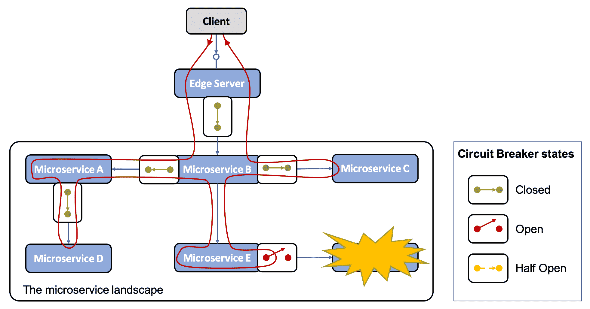

# 控制循环

控制循环模式将有以下问题、解决方案和解决方案要求。

# 问题

在一个有大量微服务实例的系统景观中，这些实例分布在多个服务器上，手动检测和纠正崩溃或挂起的微服务实例等问题非常困难。

# 解决方案

向系统景观添加一个新组件，一个**控制循环**，这个组件不断观察系统景观的实际状态；将其与操作员指定的期望状态进行比较，如有必要，采取行动。例如，如果这两个状态不同，它需要使实际状态等于期望状态：

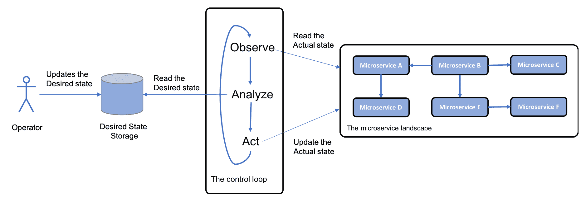

# 解决方案要求

实现说明：在容器的世界里，通常使用如 Kubernetes 之类的*容器编排器*来实现这个模式。我们将在第十五章，*Kubernetes 简介*中了解更多关于 Kubernetes 的内容。

# 集中监控和警报

对于这个模式，我们将有以下问题、解决方案和解决方案要求。

# 问题

如果观察到的响应时间和/或硬件资源的使用变得不可接受地高，找出问题的根本原因可能非常困难。例如，我们需要能够分析每个微服务的硬件资源消耗。

# 解决方案

为了解决这个问题，我们在系统景观中增加了一个新组件，一个**监控服务**，它能够收集每个微服务实例级别的硬件资源使用情况。

# 解决方案要求

解决方案要求如下：

+   它必须能够从系统景观中使用的所有服务器收集指标，包括自动扩展服务器。

+   它必须能够检测到在可用服务器上启动的新微服务实例，并开始从它们收集指标。

+   它必须能够为查询和分析收集的指标提供 API 和图形工具。

下面的屏幕截图显示了 Grafana，它可视化了来自我们稍后在本书中将介绍的监控工具 Prometheus 的指标：

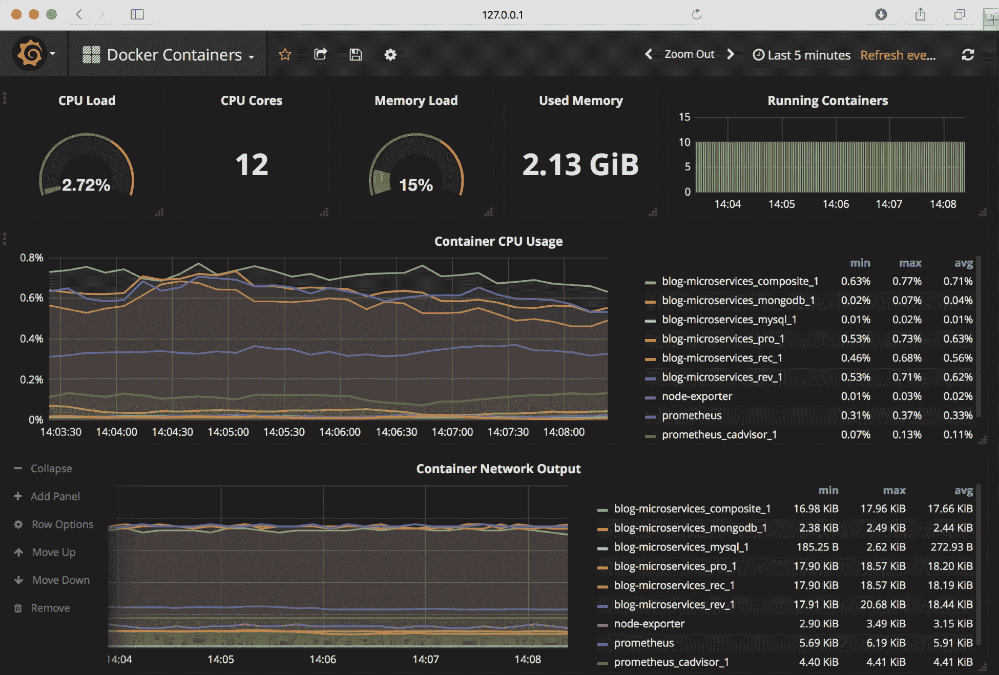

那是一个很长的列表！我相信这些设计模式帮助您更好地理解了微服务的挑战。接下来，我们将转向了解软件使能器。

# 软件使能器

正如我们前面已经提到的，我们有多种非常好的开源工具可以帮助我们满足对微服务的期望，最重要的是，它们可以帮助我们处理与它们相关的新的挑战：

+   Spring Boot

+   Spring Cloud/Netflix OSS

+   Docker

+   Kubernetes

+   Istio（服务网格）

下面的表格将我们需要处理这些挑战的设计模式以及实现该设计模式的相应开源工具进行了映射：

| 设计模式 | Spring Boot | Spring Cloud | Kubernetes | Istio |
| --- | --- | --- | --- | --- |
| 服务发现 | | Netflix Eureka 和 Netflix Ribbon | Kubernetes `kube-proxy` 和服务资源 | |
| 边缘服务器 | | Spring Cloud 和 Spring Security OAuth | Kubernetes Ingress 控制器 | Istio 入口网关 |
| 反应式微服务 | Spring Reactor 和 Spring WebFlux | | | |
| 集中式配置 | | Spring Config Server | Kubernetes `ConfigMaps` 和 Secrets | |

集中式日志分析 | | | Elasticsearch、Fluentd 和 Kibana **注意**：实际上不是 Kubernetes 的一部分

但是可以轻松地与 Kubernetes 一起部署和配置 | |

| 分布式追踪 | | Spring Cloud Sleuth 和 Zipkin | | Jaeger |
| --- | --- | --- | --- | --- |
| 电路 breaker | | Resilience4j | | 异常检测 |
| 控制循环 | | | Kubernetes 控制器管理器 | |

集中式监控和警报 | | | Grafana 和 Prometheus **注意**：实际上不是 Kubernetes 的一部分

但是可以轻松地与 Kubernetes 一起部署和配置 | Kiali、Grafana 和 Prometheus |

请注意，Spring Cloud、Kubernetes 和 Istio 可以用来实现一些设计模式，如服务发现、边缘服务器和集中配置。我们将在本书的后面讨论使用这些替代方案的优缺点。

现在，让我们看看其他一些我们需要考虑的重要事情。

# 其他重要考虑因素

实现微服务架构的成功，还需要考虑许多相关领域。我不会在这本书中涵盖这些领域；相反，我只是在这里简要提及如下：

+   **Dev/Ops 的重要性**：微服务架构的一个好处是，它能够缩短交付时间，在极端情况下甚至允许*持续交付*新版本。为了能够那么快地交付，你需要建立一个组织，在这个组织中，开发和运维人员共同工作，遵循“*你构建它，你运行它*”的宗旨。这意味着开发者不再被允许只是将软件的新版本交给运维团队。相反，开发和运维组织需要更紧密地一起工作，组成具有全面责任的一个微服务（或一组相关的微服务）的整个生命周期的团队。除了组织的`dev`/`ops`部分，团队还需要自动化交付链，即构建、测试、打包和将微服务部署到各种部署环境中的步骤。这被称为建立一个*交付管道*。

+   **组织方面和康威定律**：微服务架构可能如何影响组织的另一个有趣方面是*康威定律*，它陈述如下：

“任何设计系统（定义广泛）的组织都会产生一个其结构是该组织通信结构副本的设计。”

-- Melvyn Conway，1967

这意味着，基于技术专长（例如，UX、业务逻辑和数据库团队）来组织大型应用程序的传统方法会导致一个大的三层应用程序——通常是一个大的单体应用程序，其中有一个可独立部署的 UI 单元、一个处理业务逻辑的单元和一个大数据库。为了成功交付一个基于微服务架构的应用程序，组织需要变成一个或一组相关微服务的团队。这个团队必须拥有那些微服务所需的技能，例如，业务逻辑的语言和框架以及持久化其数据的数据库技术。

+   **将单体应用分解为微服务：**最困难和昂贵的决定之一是如何将单体应用分解为一组协作的微服务。如果这样做错了，你最终会面临如下问题：

    +   **交付缓慢：**业务需求的变化将影响太多的微服务，导致额外的工作。

    +   **性能缓慢：**为了能够执行特定的业务功能，许多请求必须在不同的微服务之间传递，导致响应时间长。

    +   **数据不一致性：**由于相关数据被分离到不同的微服务中，随着时间的推移，由不同微服务管理的数据可能会出现不一致。

寻找微服务适当边界的良好方法是应用**领域驱动设计**及其**边界上下文**概念。根据 Eric Evans 的说法，*边界上下文*是"*一个描述（通常是一个子系统，或特定团队的工作）的边界，在这个边界内定义了一个特定的模型并且适用。"*这意味着由边界上下文定义的微服务将拥有其自身数据的良好定义模型。

+   **API 设计的重要性：**如果一组微服务暴露了一个共同的、对外可用的 API，那么这个 API 必须是易于理解的，并且要符合以下要求：

    +   如果同一个概念在多个 API 中使用，那么在命名和数据类型方面应该有相同的描述。

    +   允许 API 以受控的方式进行演变是非常重要的。这通常需要为 API 应用适当的版本控制方案，例如，[`semver.org/`](https://semver.org/)，并有能力在特定时间段内处理 API 的多个主要版本，允许 API 的客户端按照自己的节奏迁移到新的主要版本。

+   **从本地部署到云的迁移路径：**如今，许多公司仍在本地运行其工作负载，但正在寻找将部分工作负载迁移到云的方法。由于大多数云服务提供商今天都提供 Kubernetes 作为服务，一个吸引人的迁移方法可以是首先将工作负载迁移到本地的 Kubernetes（作为微服务或不是），然后将其重新部署在首选云提供商提供的*Kubernetes 作为服务*上。

+   **微服务和 12 因子应用的良好设计原则：**12 因子应用（[`12factor.net`](https://12factor.net/)）是一组适用于构建可部署在云上的软件的设计原则。其中大多数设计原则适用于独立于部署位置（即云或本地）构建微服务，但并非全部。

第一章就到这里！希望这为您提供了微服务的好基本概念，并帮助您理解本书将涵盖的大规模主题。

# 总结

在这章开头，我描述了我自己对微服务的理解，并简要了解了它们的历史。我们定义了微服务是什么，即具有一些特定要求的一种自主分布式组件。我们还讨论了微服务架构的优点和挑战。

为了应对这些挑战，我们定义了一组设计模式，并简要地将开源产品如 Spring Boot、Spring Cloud 和 Kubernetes 的能力与它们进行了映射。

你现在迫不及待地想开发你的第一个微服务了吧？在下一章中，我们将介绍 Spring Boot 以及与之互补的开源工具，我们将使用它们来开发我们的第一个微服务。
