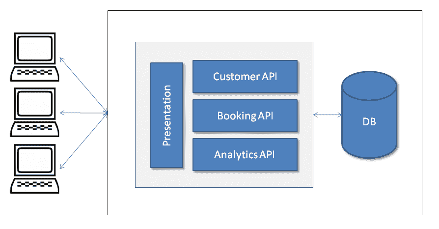
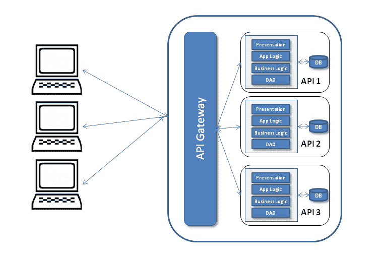
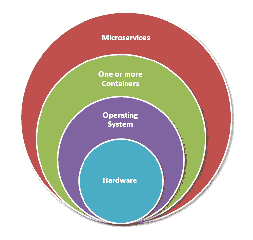
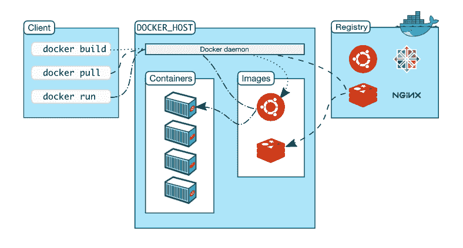

# 解决方案方法

作为先决条件，你应该对微服务和软件架构风格有一个基本的理解。具备基本理解可以帮助你彻底理解概念和本书。

阅读本书后，你可以实现用于本地或云生产部署的微服务，并学习从设计、开发、测试到部署的完整生命周期，以及持续集成和部署。本书专为实际应用和激发您作为解决方案架构师的思维而编写。你的学习将帮助你开发和交付任何类型的场所的产品，包括 SaaS、PaaS 等。我们将主要使用 Java 和基于 Java 的框架工具，如 Spring Boot 和 Jetty，并且我们将使用 Docker 作为容器。

在本章中，你将学习微服务的永恒存在及其演变。它突出了本地和基于云的产品面临的重大问题以及微服务如何解决这些问题。它还解释了在开发 SaaS、企业或大型应用程序过程中遇到的常见问题及其解决方案。

本章我们将学习以下主题：

+   微服务及其简要背景

+   单体架构

+   单体架构的限制

+   微服务提供的优势和灵活性

+   在 Docker 等容器上部署微服务

# 微服务的演变

马丁·福勒解释道：

微服务的术语是在 2011 年 5 月靠近威尼斯的一次软件架构师研讨会上讨论的，以描述与会者认为的一种共同的架构风格，他们中很多人最近都在探索这种风格。2012 年 5 月，同一群人决定将“微服务”（µServices）作为最合适的名称。

让我们回顾一下它是如何在过去几年中发展的。企业架构更多地是从历史的大型机计算，通过客户机-服务器架构（两层到多层）发展到**服务导向架构**（**SOA**）。

从服务导向架构（SOA）到微服务的转变并非由某个行业协会定义的标准，而是许多组织实践的实用方法。SOA 最终演变为微服务。

前 Netflix 架构师阿德里安·科克洛夫特（Adrian Cockcroft）将其描述为：

细粒度 SOA。因此，微服务是强调小型短暂组件的 SOA。

同样，来自设计 X 窗口系统的成员迈克·甘卡兹（Mike Gancarz）的以下引言，定义了 Unix 哲学的一个基本原则，同样适用于微服务范式：

小即是美。

微服务与 SOA 有很多共同的特征，比如对服务和如何让一个服务与另一个服务解耦的关注。SOA 是围绕单体应用集成而演变的，通过暴露大部分基于**简单对象访问协议** (**SOAP**) 的 API。因此，中间件如**企业服务总线** (**ESB**) 对 SOA 非常重要。微服务更简单，尽管它们可能使用消息总线，但只是用于消息传输，其中不包含任何逻辑。它仅仅基于智能端点。

Tony Pujals 对微服务做了很好的定义：

在我的心智模型中，我想象的是自我包含（如同容器）的轻量级进程，通过 HTTP 进行通信，创建和部署相对简单，为消费者提供狭窄焦点的 API。

尽管 Tony 只提到了 HTTP，但事件驱动的微服务可能使用不同的协议进行通信。你可以使用 Kafka 来实现事件驱动的微服务。Kafka 使用的是线协议，一种基于 TCP 的二进制协议。

# 单体架构概述

Microservices 并不是什么新鲜事物，它已经存在了很多年。例如，Stubby 是一个基于**远程** **过程** **调用** (**RPC**) 的通用基础设施，早在 2000 年代初，它就被用于连接 Google 数据中心内和跨数据中心的多个服务。它近期之所以受到关注，是因为它的流行度和可见度。在微服务变得流行之前，开发本地和云应用程序主要采用的是单体架构。

单体架构允许开发不同的组件，如表示层、应用逻辑、业务逻辑和**数据访问对象** (**DAO**)，然后你可以将它们捆绑在**企业存档** (**EAR**) 或**网络存档** (**WAR**) 中，或者将它们存储在单个目录层次结构中（例如，Rails、NodeJS 等）。

许多著名的应用程序，如 Netflix，都是使用微服务架构开发的。此外，eBay、Amazon 和 Groupon 也从单体架构演变为微服务架构。

既然你已经对微服务的背景和历史有了了解，那么让我们讨论一下传统方法，即单体应用开发的局限性，并比较微服务如何解决这些问题。

# 单体架构的限制及其微服务的解决方案

众所周知，变化是永恒的。人类总是寻求更好的解决方案。这就是微服务成为今天这个样子，并可能在未来进一步发展的原因。今天，组织正在使用敏捷方法开发应用程序——这是一个快速的开发环境，并且在云计算和分布式技术发明之后规模也更大了。许多人认为单体架构也可以达到类似的目的，并且与敏捷方法论保持一致，但微服务仍在许多方面为生产就绪应用程序提供了更好的解决方案。

为了理解单体和微服务之间的设计差异，让我们以一个餐厅预订应用程序为例。这个应用程序可能有很多服务，如客户、预订、分析等，以及常规组件，如展示和数据库。

我们将探讨三种不同的设计：传统的单体设计、带服务的单体设计以及微服务设计。

# 传统的单体设计

下面的图表解释了传统的单体应用程序设计。这种设计在 SOA 变得流行之前被广泛使用：

传统的单体应用程序设计

在传统的单体设计中，一切都被打包在同一个档案中，如**展示**代码、**应用逻辑**和**业务逻辑**代码，以及**DAO**和相关代码，这些代码与数据库文件或其他来源交互。

# 带服务的单体设计

在 SOA 之后，基于服务的应用程序开始被开发，每个组件为其他组件或外部实体提供服务。下面的图表展示了带有不同服务的单体应用程序；在这里，服务与**展示**组件一起使用。所有服务、**展示**组件或任何其他组件都被捆绑在一起：

# 服务设计

接下来的第三种设计展示了微服务。在这里，每个组件都代表自主性。每个组件可以独立开发、构建、测试和部署。在这里，即使是应用程序**用户界面**（**UI**）组件也可以是一个客户端，并消费微服务。为了我们的示例，设计层在µService 内部使用。

**API 网关**提供接口，不同的客户端可以访问单个服务，解决以下问题：

当你想要为同一服务发送不同响应给不同客户端时，你会怎么做？例如，一个预订服务可以为移动客户端（最小信息）和桌面客户端（详细信息）发送不同的响应，提供不同的详细信息，对第三个客户端再次发送不同的信息。

一个响应可能需要从两个或更多服务中获取信息：

在观察了所有的高级设计样本图后，你可能会发现，在单体设计中，组件是捆绑在一起的，并且耦合度很高。

所有服务都是同一个捆绑包的一部分。同样，在第二个设计图中，你可以看到第一个图的一个变体，其中所有服务可能都有自己的层并形成不同的 API，但是，如图所示，这些也都是捆绑在一起的。

相反，在微服务中，设计组件是不捆绑在一起的，并且耦合度很低。每个服务都有自己的层和**DB**，并且打包在单独的归档文件中。所有这些部署的服务提供它们特定的 API，如客户（Customers）、预订（Bookings）或客户（Customer）。这些 API 是即取即用的。即便是 UI 也是单独部署的，并且使用微服务进行设计。因此，它比单体应用有众多优势。我还是要提醒你，在某些特殊情况下，单体应用开发是非常成功的，如 Etsy 和点对点电子商务网站。

现在让我们讨论在使用单体应用时您可能会遇到的限制。

# 单一维度的可扩展性

当单体应用规模变大时，它会捆绑在一起扩展所有组件。例如，在餐厅预订桌位的应用中，即使你想要扩展桌位预订服务，它也会扩展整个应用；它不能单独扩展桌位预订服务。它没有充分利用资源。

此外，这种扩展是单一维度的。随着交易量的增加，运行更多应用副本提供了扩展。运维团队可以根据服务器农场或云中的负载，通过负载均衡器调整应用副本的数量。这些副本都会访问相同的数据源，因此增加了内存消耗，而产生的 I/O 操作使缓存效果大打折扣。

微服务赋予了灵活性，只扩展那些需要扩展的服务，并允许资源的最优利用。如我们之前提到的，当需要时，你可以只扩展桌位预订服务，而不影响其他任何组件。它还允许二维扩展；在这里，我们不仅可以增加交易量，还可以通过缓存增加数据量（平台扩展）。

开发团队可以专注于新特性的交付和 shipping，而不是担心扩展问题（产品扩展）。

正如我们之前所看到的，微服务可以帮助你扩展平台、人力和产品维度。这里的人力扩展指的是根据微服务的特定开发和关注需求，增加或减少团队规模。

使用 RESTful Web 服务开发的微服务架构使系统在服务器端是无状态的；这意味着服务器之间的通信不多，这使得系统可以水平扩展。

# 在失败的情况下进行发布回滚

由于单体应用程序要么打包在同一个归档文件中，要么包含在单个目录中，因此它们阻止了代码模块化的部署。例如，许多人都可能有过因一个功能失败而推迟整个发布的痛苦经历。

为了解决这些问题，微服务为我们提供了灵活性，只回滚失败的功能。这是一种非常灵活且高效的方法。例如，假设你是在线购物门户开发团队的一员，并希望基于微服务开发应用程序。你可以根据不同的领域（如产品、支付、购物车等）将应用程序进行划分，并将所有这些组件作为单独的包进行打包。一旦你单独部署了所有这些包，它们将作为可以独立开发、测试和部署的单一组件，并被称为微服务。

现在，让我们看看这如何帮助你。假设在生产环境中推出新功能、增强功能和修复程序后，你发现支付服务存在缺陷需要立即修复。由于你使用的架构是基于微服务的，因此如果你的应用程序架构允许，你可以只回滚支付服务，而不是整个发布，或者在不影响其他服务的情况下将修复程序应用于微服务支付服务。这不仅使你能够恰当地处理失败，而且还帮助您迅速将功能/修复传递给客户。

# 采用新技术的问题

单体应用程序主要是基于项目或产品最初开发阶段主要使用的技术进行开发和增强的。这使得在开发的后期阶段或产品成熟后（例如，几年后）引入新技术变得非常困难。此外，同一项目中依赖不同版本的同一库的不同模块使这更具挑战性。

技术每年都在进步。例如，您的系统可能设计为用 Java 实现，然后几年后，由于业务需求或利用新技术的优势，您可能希望用 Ruby on Rails 或 NodeJS 开发一个新服务。在一个现有的单体应用程序中利用新技术将非常困难。

这不仅仅是代码级别集成的問題，还包括测试和部署。可以通过重写整个应用程序来采用新技术，但这既耗时又冒险。

另一方面，由于其基于组件的开发和设计，微服务为我们提供了使用任何技术的灵活性，无论是新的还是旧的。它不会限制你使用特定的技术，为你的开发和工程活动提供了新的范式。你随时可以使用 Ruby on Rails、NodeJS 或其他任何技术。

那么，这是如何实现的呢？嗯，其实很简单。基于微服务的应用程序代码不会打包成一个单一的归档，也不会存储在单一的目录中。每个微服务都有自己的归档，并且是独立部署的。一个新的服务可以在一个隔离的环境中开发，并且可以没有任何技术问题地进行测试和部署。正如你所知，微服务也有自己的独立进程；它在不存在紧耦合的共享资源冲突的情况下完成其功能，并且进程保持独立。

由于微服务定义上是一个小型的、自包含的功能，它提供了一个尝试新技术的低风险机会。而在单体系统中，情况绝对不是这样。

你还可以让你的微服务作为开源软件提供给他人使用，如果需要，它还可以与闭源专有软件互操作，这是单体应用程序所不可能实现的。

# 与敏捷实践的对齐

毫无疑问，可以使用敏捷实践来开发单体应用程序，而且这样的应用程序正在被开发。可以采用**持续集成（CI）**和**持续部署（CD）**，但问题在于——它是否有效地使用了敏捷实践？让我们来分析以下几点：

+   例如，当有高概率的故事相互依赖，并且有各种场景时，只有在依赖的故事完成后才能开始一个故事。

+   随着代码规模的增加，构建所需的时间也会增加。

+   频繁部署大型单体应用程序是一项难以实现的任务。

+   即使你只更新了一个组件，你也必须重新部署整个应用程序。

+   重新部署可能会对正在运行的组件造成问题，例如，作业调度器可能会改变无论组件是否受其影响。

+   如果单个更改的组件不能正常工作或需要更多的修复，重新部署的风险可能会增加。

+   界面开发者总是需要更多的重新部署，这对于大型单体应用程序来说是非常冒险和耗时的。

微服务可以很轻松地解决前面提到的问题，例如，UI 开发者可能有自己的 UI 组件，可以独立地开发、构建、测试和部署。同样，其他微服务也可能可以独立部署，由于它们具有自主特性，因此降低了系统失败的风险。对于开发来说，另一个优点是 UI 开发者可以利用 JSON 对象和模拟 Ajax 调用来开发 UI，这种方式是隔离的。开发完成后，开发者可以消费实际的 API 并进行功能测试。总结来说，可以说微服务开发是迅速的，并且很好地适应了企业逐步增长的需求。

# 开发容易度 - 可以做得更好

通常，大型单体应用程序的代码对于开发者来说是最难以理解的，新开发者需要时间才能变得高效。即使将大型单体应用程序加载到 IDE 中也是麻烦的，这会使得 IDE 变慢，并降低开发者的效率。

在一个大型单体应用程序中进行更改是困难的，并且由于代码库庞大，需要更多的时间，如果没有进行彻底的影响分析，就会有很高的 bug 风险。因此，在实施更改之前，开发者进行彻底的影响分析是一个前提条件。

在单体应用程序中，随着时间的推移，依赖关系逐渐建立，因为所有组件都捆绑在一起。因此，与代码更改（修改的代码行数）增长相关的风险呈指数级上升。

当代码库很大且有超过 100 个开发者正在工作时，由于之前提到的原因，构建产品和实施新功能变得非常困难。你需要确保一切就绪，并且一切协调一致。在这种情况下，设计良好且文档齐全的 API 会有很大帮助。

Netflix，这个按需互联网流媒体服务提供商，在他们有大约 100 人在开发应用程序时遇到了问题。然后，他们使用了云，并将应用程序拆分成不同的部分。这些最终成为了微服务。微服务源于对速度和敏捷性的渴望，以及独立部署团队的需求。

由于微组件通过暴露的 API 实现了松耦合，可以持续进行集成测试。在微服务的持续发布周期中，变化很小，开发人员可以快速地进行回归测试，然后进行审查并修复发现的缺陷，从而降低了部署的风险。这导致了更高的速度和较低的相关风险。

由于功能分离和单一责任原则，微服务使团队非常高效。你可以在网上找到许多例子，大型项目是用最小的团队规模（如八到十名开发者）开发的。

开发人员可以拥有更小的代码和更好的特性实现，从而与产品的用户建立更强的共情关系。这有助于在特性实现上取得更好的动机和清晰度。与用户的共情关系可以实现更短的反馈循环，更好地快速优先处理特性管道。更短的反馈循环也可以使缺陷检测更快。

每个微服务团队独立工作，可以无需与更多人协调就实施新功能或想法。在微服务设计中，端点失败处理也很容易实现。

最近，在一场会议中，一个团队展示了他们如何在一个为期 10 周的项目中开发了一个基于微服务的运输跟踪应用程序，包括 iOS 和 Android 应用程序，并具有 Uber 类型的跟踪功能。一家大型咨询公司为其客户提供了一个为期七个月的同一应用程序估计。这显示了微服务如何与敏捷方法和持续集成/持续部署（CI/CD）保持一致。

# 微服务构建管道

微服务也可以使用流行的持续集成/持续部署（CI/CD）工具如 Jenkins、TeamCity 等来构建和测试。这与在单体应用中进行构建非常相似。在微服务中，每个微服务都被当作一个小应用程序来对待。

例如，一旦您在仓库（SCM）中提交代码，CI/CD 工具就会触发构建过程：

+   清理代码

+   代码编译

+   执行单元测试

+   合同/验收测试执行

+   构建应用程序归档/容器镜像

+   将归档/容器镜像发布到仓库管理

+   在各种交付环境（如 Dev、QA、Stage 等）上进行部署

+   集成和功能测试执行

+   其他任何步骤

然后，在`pom.xml`（对于 Maven）中，发布构建触发器会更改 SNAPSHOT 或 RELEASE 版本，按照正常的构建触发器描述构建工件。将工件发布到工件仓库。在仓库中为此版本打上标签。如果您使用容器镜像，则将容器镜像作为构建的一部分来构建。

# 使用如 Docker 之类的容器进行部署

由于微服务的设计，您需要一个提供灵活性、敏捷性和平滑性的环境，以便进行持续集成和部署，以及发货。微服务的部署需要速度、隔离管理以及敏捷的生命周期。

产品和软件也可以使用集装箱模型进行运输。集装箱是一种大型标准化容器，专为多式联运而设计。它允许货物使用不同的运输方式——卡车、铁路或船舶，而无需卸载和装载。这是一种存储和运输物品高效且安全的方式。它解决了运输问题，过去这是一个耗时、劳动密集型的过程，重复处理经常会损坏易碎物品。

运输集装箱封装了它们的内容。同样，软件容器正开始被用来封装它们的内容（产品、应用程序、依赖项等）。

以前，**虚拟机**（**VM**）被用来创建可以在需要时部署的软件镜像。后来，像 Docker 这样的容器变得更为流行，因为它们既兼容传统的虚拟站系统，也兼容云环境。例如，在开发人员的笔记本电脑上部署多个虚拟机是不切实际的。构建和引导虚拟机通常是 I/O 密集型的，因此速度较慢。

# 容器

容器（例如，Linux 容器）提供了一个轻量级的运行时环境，该环境包括了虚拟机的核心功能和操作系统的隔离服务。这使得微服务的打包和执行变得容易且流畅。

如以下图表所示，容器作为应用程序（微服务）在**操作系统**内运行。操作系统位于硬件之上，每个操作系统可能具有多个容器，其中一个容器运行应用程序。

容器利用操作系统的内核接口，如**cnames**和**namespaces**，使得多个容器能够在完全隔离的情况下共享同一个内核。这使得不需要为每个使用情况完成一个操作系统安装；结果是它消除了开销。它还使硬件**得到最佳利用**：

容器层图

# Docker

容器技术是当今发展最快的技术之一，Docker 领导这一领域。Docker 是一个开源项目，它于 2013 年启动。2013 年 8 月其互动教程发布后，10,000 名开发者尝试了它。到 2013 年 6 月其 1.0 版本发布时，它已经被下载了 275 万次。许多大型公司已经与 Docker 签署了合作伙伴协议，如微软、红帽、惠普、OpenStack，以及服务提供商如亚马逊网络服务、IBM 和谷歌。

如我们之前提到的，Docker 也利用了 Linux 内核的功能，如 cgroups 和 namespaces，以确保资源隔离和应用及其依赖的打包。这种依赖的打包使得应用能够如预期地在不同的 Linux 操作系统/发行版上运行，支持一定程度的可移植性。此外，这种可移植性允许开发者在任何语言中开发应用程序，然后轻松地将它从笔记本电脑部署到测试或生产服务器。

Docker 原生运行在 Linux 上。然而，你也可以使用 VirtualBox 和 boot2docker 在 Windows 和 MacOS 上运行 Docker。

容器只包括应用程序及其依赖项，包括基本操作系统。这使得它在资源利用方面轻量且高效。开发人员和系统管理员对容器的可移植性和高效资源利用感兴趣。

Docker 容器中的所有内容都在宿主机上以原生方式执行，并直接使用宿主机内核。每个容器都有自己的用户命名空间。

# Docker 的架构

如 Docker 文档所述，Docker 架构采用客户端-服务器架构。如图所示（来源于 Docker 官网：[`docs.docker.com/engine/docker-overview/`](https://docs.docker.com/engine/docker-overview/)），Docker 客户端主要是用户界面，用于终端用户；客户端与 Docker 守护进程进行通信。Docker 守护进程负责构建、运行和分发你的 Docker 容器。Docker 客户端和守护进程可以运行在同一系统或不同机器上。

Docker 客户端和守护进程通过套接字或通过 RESTful API 进行通信。Docker 注册表是公开或私有的 Docker 镜像仓库，你可以从中上传或下载镜像，例如，Docker Hub（[hub.docker.com](https://hub.docker.com/)）是一个公开的 Docker 注册表。

Docker 的架构

Docker 的主要组件包括：

+   **Docker 镜像**：Docker 镜像是一个只读模板。例如，一个镜像可能包含一个带有 Apache 网页服务器和你的网页应用的 Ubuntu 操作系统。Docker 镜像 是 Docker 构建组件之一，镜像用于创建 Docker 容器。Docker 提供了一种简单的方法来构建新的镜像或更新现有镜像。你也可以使用他人创建的镜像，/或扩展它们。

+   **Docker 容器**：Docker 容器是从 Docker 镜像创建的。Docker 的工作原理是，容器只能看到自己的进程，并且在其宿主文件系统之上有自己的文件系统层和网络堆栈，这些管道到宿主网络堆栈。Docker**容器**可以被运行、启动、停止、移动或删除。

# 部署

使用 Docker 进行微服务部署涉及三个部分：

+   应用程序打包，例如，JAR

+   使用 Docker 指令文件，Dockerfile 和命令`docker build`构建包含 JAR 和依赖项的 Docker 镜像。它有助于反复创建镜像。

+   使用命令`docker run`从新构建的镜像中执行 Docker 容器。

前面的信息将帮助你理解 Docker 的基础知识。你将在第五章，*部署与测试*中了解更多关于 Docker 及其实际应用。源代码和参考资料，参考： [`docs.docker.com`](https://docs.docker.com)。

# 总结

在本章中，你已经学习了大型软件项目的高级设计，从传统的单体应用到微服务应用。你还简要了解了微服务的历史、单体应用的局限性以及微服务所提供的优势和灵活性。我希望这一章能帮助你理解单体应用在生产环境中遇到的一些常见问题以及微服务如何解决这些问题。你还了解到了轻量级且高效的 Docker 容器，并看到了容器化是简化微服务部署的绝佳方式。

在下一章中，你将了解到如何从 IDE 设置开发环境，以及其他开发工具和不同的库。我们将处理创建基本项目并设置 Spring Boot 配置来构建和开发我们的第一个微服务。我们将使用 Java 9 作为编程语言和 Spring Boot 来完成项目。
