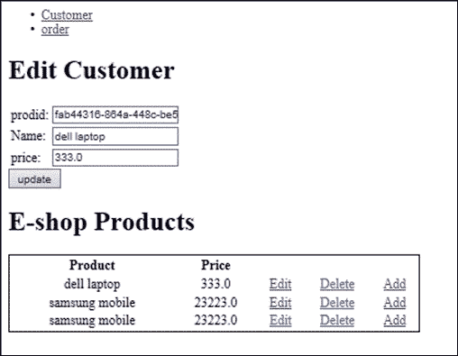
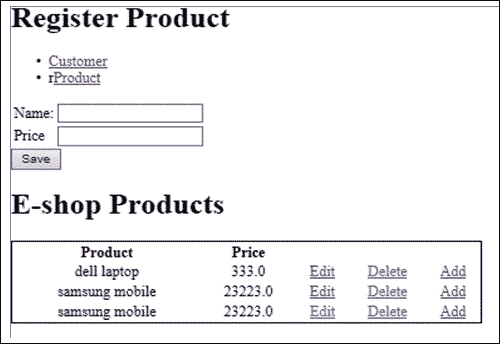
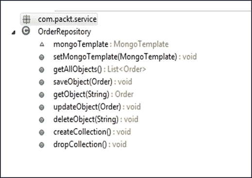

# 第一章。Spring Mongo 集成

MongoDB 是一种流行的 NoSQL 数据库，也是基于文档的。它是使用流行且强大的 C++语言编写的，这使得它成为一种面向文档的数据库。查询也是基于文档的，它还提供了使用 JSON 样式进行存储和检索数据的索引。MongoDB 基于**集合**和**文档**的概念工作。

让我们来看看 MySQL 和 MongoDB 之间的一些术语差异：

| MySQL | MongoDB |
| --- | --- |
| 表 | 集合 |
| 行 | 文档 |
| 列 | 字段 |
| 连接 | 嵌入式文档链接 |

在 MongoDB 中，集合是一组文档。这与 RDBMS 表相同。

在本章中，我们将首先设置 MongoDB NoSQL 数据库，并将集成 Spring 应用程序与 MongoDB 以执行 CRUD 操作。第一个示例演示了更新单个文档值。第二个示例考虑了一个订单用例，其中需要在集合中存储两个文档引用。它演示了使用`objectId`引用引用 MongoDB 的不同文档的灵活性。

只有当应用程序具有大量写操作时，我们才需要使用 NoSQL 数据库。MongoDB 也非常适合云环境，我们可以轻松地复制数据库。

在下一节中，我们将看到如何开始使用 MongoDB，从安装开始，使用 Spring 框架，并集成 MongoDB。为了开始，我们将展示各种用例中的基本**创建、检索、更新和删除**（**CRUD**）操作。

# 安装 MongoDB 并创建数据库

在本节中，我们将安装 MongoDB 并创建一个数据库：

1.  在[`www.mongodb.org/downloads`](http://www.mongodb.org/downloads)下载 MongoDB 数据库。

1.  通过在`bin`文件夹中执行以下命令来配置数据文件夹：

```java
>mongod.exe -dbpath e:\mongodata\db 

```

1.  在另一个命令提示符中启动`mongod.exe`。

1.  执行以下命令：

```java
>show databaseExecute

```

`>show dbs`命令在 MongoDB 中也可以正常工作。

1.  执行以下命令以创建一个名为`eshopdb`的新数据库。

```java
>use new-eshopdb

```

1.  执行`> show dbs`仍然会显示`eshopdb`尚未创建，这是因为它不包含任何集合。一旦添加了集合，我们将在下一步中添加一些集合。

1.  在命令提示符中执行以下代码片段。以下代码片段将向集合中插入示例文档：

```java
db.eshopdb.insert({cust_id:1,name:"kishore",address:"jayangar"})
db.eshopdb.insert({cust_id:2,name:"bapi",address:"HAL Layout"})
db.eshopdb.insert({cust_id:3,name:"srini",address:"abbigere street"})
db.eshopdb.insert({cust_id:4,name:"sangamesha",address: "Kattarigupee layout"})

```

# 为 MongoDB 设置批处理文件

创建批处理文件来启动 MongoDB 总是很容易，最好创建一个脚本文件来启动 Mongo。这样，我们就不会出现配置错误。这也会节省我们很多时间。

1.  创建一个`mongodbstart.bat`文件。

1.  编辑文件并输入以下命令，然后保存：

```java
cd E:\MONGODB\mongo\bin
mongod -dbpath e:\mongodata\db 

```

下次要启动 MongoDB 时，只需单击批处理文件。

## Spring 和 MongoDB 的订单用例

让我们看一下订单用例，以使用 Spring 和 MongoDB 执行简单的 CRUD 操作。我们正在对产品、客户和订单文档执行 CRUD 操作。情景是这样的：客户选择产品并下订单。

以下是订单用例。操作者是应用程序用户，将有以下选项：

+   对产品文档进行 CRUD 操作

+   对客户文档进行 CRUD 操作

+   通过选择产品和客户对订单执行 CRUD 操作

+   在订单文档中保存产品文档对象 ID 和客户文档对象 ID

# 将 Mongo 文档映射到 Spring Bean

Spring 提供了一种简单的方法来映射 Mongo 文档。以下表格描述了 Bean 与 MongoDB 集合的映射：

| Bean | Mongo 集合 |
| --- | --- |
| `Customer.java` | `db.customer.find()` |
| `Order.java` | `db.order.find()` |
| `Product.java` | `db.product.find()` |

# 设置 Spring-MongoDB 项目

我们需要使用 Maven 创建一个简单的 Web 应用程序项目。

1.  在 Maven 命令提示符中执行以下命令：

```java
mvn archetype:generate -DgroupId=com.packtpub.spring -DartifactId=spring-mongo -DarchetypeArtifactId=maven-archetype-webapp

```

1.  创建一个简单的 Maven 项目，使用 web 应用原型。添加最新的 `4.0.2.RELEASE` spring 依赖。

1.  以下是 `pom.xml` 文件的一部分。这些是必须添加到 `pom.xml` 文件中的依赖项。

```java
<!-- Spring dependencies -->
<dependency>
<groupId>org.mongodb</groupId>
<artifactId>mongo-java-driver</artifactId>
<version>2.9.1</version>
</dependency>
<dependency>
<groupId>org.springframework.data</groupId>
<artifactId>spring-data-mongodb</artifactId>
<version>1.2.0.RELEASE</version>
</dependency>
<dependency>
<groupId>org.springframework.data</groupId>
<artifactId>spring-data-mongodb</artifactId>
<version>1.2.0.RELEASE</version>
</dependency>
<dependency>
<groupId>org.springframework</groupId>
<artifactId>spring-core</artifactId>
<version>${spring.version}</}</version>
<scope>runtime</scope>
</dependency>
<dependency>
<groupId>org.springframework</groupId>
<artifactId>spring-context</artifactId>
<version>4.0.2.RELEASE </version>
<scope>runtime</scope>
</dependency>
<dependency>
<groupId>org.springframework</groupId>
<artifactId>spring-context-support</artifactId>
<version>4.0.2.RELEASE </version>
<scope>runtime</scope>
</dependency>
<dependency>
<groupId>org.springframework</groupId>
<artifactId>spring-beans</artifactId>
<version>4.0.2.RELEASE </version>
<scope>runtime</scope>
</dependency>
<dependency>
<groupId>org.springframework</groupId>
<artifactId>spring-web</artifactId>
<version>4.0.2.RELEASE </version>
<scope>runtime</scope>
</dependency>
<dependency>
<groupId>org.springframework</groupId>
<artifactId>spring-webmvc</artifactId>
<version>4.0.2.RELEASE </version>
<scope>runtime</scope>
</dependency>
```

## 应用程序设计

以下表包含用于开发简单 CRUD 应用程序的类。请求从控制器流向模型，然后返回。Repository 类标有 `@Repository` 注解，并使用 `mongoTemplate` 类连接到 MongoDB。

| 控制器 | 模型 | JSP | Bean |
| --- | --- | --- | --- |
| `Customer Controller.java` | `Customer Repository.java` | `customer.jsp``editcutomer.jsp``allcustomers.jsp` | `Customer.java` |
| `Order Controller.java` | `Order Repository.java` | `order.jsp``editorder.jsp``allorders.jsp` | `Order.java` |
| `Product Controller.java` | `Product Repository.java` | `product.jsp``editproduct.jsp``allproducts.jsp` | `Product.java` |

### Spring 与 MongoDB 的应用实现

以下是实现 `Spring4MongoDB_Chapter1` 应用程序的步骤：

1.  创建一个名为 `Spring4MongoDB_Chapter1` 的基于 web 的 Maven 项目。

1.  将项目导入 Eclipse 进行实现。我使用的是 Eclipse Juno。

我们需要创建控制器来映射请求。

控制器请求映射到 `GET` 和 `POST` 方法，如下表所示：

| 请求 | 请求方法 | 模型属性 |
| --- | --- | --- |
| `/product` | `GET` | `productList` |
| `/product/save` | `POST` | `productList` |
| `/product/update` | `POST` | `productList` |
| `/product/geteditproduct` | `GET` | `productAttribute` |
| `/product/deleteproduct` | `GET` | `productAttribute` |
| `/product/getallproducts` | `GET` | `productList` |

以下是 `ProductController.java` 的实现。我们使用 `@Controller` 注解来指示 `ProductController.java` 类是一个控制器类。`@Autowired` 注解将 `ProductRepository` 类与 `ProductController.java` 文件绑定。

`productList` 属性是一个 `Product` 类型的列表，保存要在屏幕上显示的产品。`@PostConstruct` 注解将调用由它装饰的方法。一旦类的构造函数被调用并且所有属性被设置，在调用任何业务方法之前，值得注意的是它只被调用一次。

```java
@Controller
public class ProductController {
  @Autowired
  private ProductRepository respository;
  private List <Product>productList;
  public ProductController() {
    super();
  }
  @PostConstruct
  public void init(){
    this.productList=respository.getAllObjects();
  }
  //to get the list of products
  @RequestMapping(value="/product", method = RequestMethod.GET)
  public String getaddproduct(Model model) {
    model.addAttribute("productList", productList);
    model.addAttribute("productAttribute", new Product());
    return "product";
  }
  //to save the product
  @RequestMapping(value="/product/save", method = RequestMethod.POST)
  public String addproduct(@ModelAttribute Product prod,Model model) {
    if(StringUtils.hasText(prod.getProdid())) {
      respository.updateObject(prod);
    } else {
      respository.saveObject(prod);
    }
    this.productList=respository.getAllObjects();
    model.addAttribute("productList", productList);
    return "product";
  }
  //to update the edited product
  @RequestMapping(value="/product/update", method = RequestMethod.POST)
  public String updatecustomer(@ModelAttribute Product prod,Model model) {
    respository.updateObject(prod);
    this.productList=respository.getAllObjects();
    model.addAttribute("productList", productList);
    return "product";
  }
  //to edit a product based on ID
  @RequestMapping(value = "/product/geteditproduct", method = RequestMethod.GET)
  public String geteditproduct(
  @RequestParam(value = "prodid", required = true) String prodid,
  Model model) {
    model.addAttribute("productList", productList);
    model.addAttribute("productAttribute", respository.getObject(prodid));
    return "editproduct";
  }
  //to delete a product based on ID
  @RequestMapping(value="/product/deleteproduct", method = RequestMethod.GET)
  public String deleteproduct(
  @RequestParam(value = "prodid", required = true) String prodid,Model model) {
    respository.deleteObject(prodid);
    this.productList=respository.getAllObjects();
    model.addAttribute("productList", this.productList);
    return "product";
  }
  //to get all the products
  @RequestMapping(value = "/product/getallproducts", method = RequestMethod.GET)
  public String getallproducts(Model model) {
    this.productList=respository.getAllObjects();
    model.addAttribute("productList", this.productList);
    return "allproducts";
  }
}
```

`Product.java` 文件有一个 `@Document` 注解和一个 `@ID` 注解，它被识别为 MongoDB 集合，将 `Product` 实体映射到 MongoDB 中的产品集合。

```java
@Document
public class Product {
  /*Bean class product with getter and setters*/
  @Id
  private String prodid;
  private Double price;
  private String name;
  public Product() {
    super();
  }
  public String getProdid() {
    return prodid;
  }
  public void setProdid(String prod_id) {
    this.prodid = prod_id;
  }
  public Double getPrice() {
    return price;
  }
  public void setPrice(Double price) {
    this.price = price;
  }
  public String getName() {
    return name;
  }
  public void setName(String name) {
    this.name = name;
  }
}
```

`ProducRepository.java` 文件有 `@Repository` 注解。这是持久层，并告诉 Spring 这个类在数据库上执行操作。连接到 Mongo 在 Mongo 模板中设置。

**ProductRepository.java**

```java
@Repository
public class ProductRepository {
  @Autowired
  MongoTemplate mongoTemplate;
  public void setMongoTemplate(MongoTemplate mongoTemplate) {
    this.mongoTemplate = mongoTemplate;
  }

  public List<Product> getAllObjects() {
    return mongoTemplate.findAll(Product.class);
  }

  /**
  * Saves a {@link Product}.
  */
  public void saveObject(Product Product) {
    Product.setProdid(UUID.randomUUID().toString());
    mongoTemplate.insert(Product);
  }

  /**
  * Gets a {@link Product} for a particular id.
  */
  public Product getObject(String id) {
    return mongoTemplate.findOne(new Query(Criteria.where("_id").is(id)),
    Product.class);
  }

  /**
  * Updates a {@link Product} name for a particular id.
  */
  public void updateObject(Product object) {
    Query query = new Query();
    query.addCriteria(Criteria.where("_id").is(object.getProdid()));
    Product prod_tempObj = mongoTemplate.findOne(query, Product.class);
    System.out.println("cust_tempObj - " + prod_tempObj);
    //modify and update with save()
    prod_tempObj.setName(object.getName());
    prod_tempObj.setPrice(object.getPrice());
    mongoTemplate.save(prod_tempObj);
  }

  /**
  * Delete a {@link Product} for a particular id.
  */
  public void deleteObject(String id) {
    mongoTemplate.remove(new Query(Criteria.where("_id").is(id)),Product.class);
  }

  /**
  * Create a {@link Product} collection if the collection does not already
  * exists
  */
  public void createCollection() {
    if (!mongoTemplate.collectionExists(Product.class)) {
      mongoTemplate.createCollection(Product.class);
    }
  }

  /**
  * Drops the {@link Product} collection if the collection does already exists
  */
  public void dropCollection() {
    if (mongoTemplate.collectionExists(Product.class)) {
      mongoTemplate.dropCollection(Product.class);
    }
  }
}
```

`.jsp` 文件显示可用的产品，并允许用户对 `Product` bean 执行 CRUD 操作。以下截图是使用存储在 MongoDB 中的产品 `ObjectId` 编辑产品信息的输出。



**Product.jsp 文件**

这个文件作为用户的视图层。它包含产品创建表单，并包括一个列出 MongoDB 中存储的所有产品的文件。

```java
<%@ taglib uri="http://java.sun.com/jsp/jstl/core" prefix="c" %>
<%@ taglib uri="http://www.springframework.org/tags/form" prefix="form" %>
<%@ page language="java" contentType="text/html; charset=UTF-8"
    pageEncoding="UTF-8"%>
<!DOCTYPE html PUBLIC "-//W3C//DTD HTML 4.01 Transitional//EN" "http://www.w3.org/TR/html4/loose.dtd">
<html>
<head>
<meta http-equiv="Content-Type" content="text/html; charset=UTF-8">
<title>Register Product</title>
</head>
<body>

<h1>Register Product</h1>
<ul>
<li><a href="/Spring4MongoDB_Chapter1/customer">Customer</a>
</li>
<li>r<a href="/Spring4MongoDB_Chapter1/order">Product</a>
</li></ul>
<form  method="post" action="/Spring4MongoDB_Chapter1/product/save">
  <table>
    <tr>
      <td> Name:</td>
      <td><input type=text name="name"/></td>
    </tr>
    <tr>
      <td>Price</td>
      <td><input type=text name="price"/></td>
    </tr>
      </table>
  <input type="hidden" name="prod_id"  >
  <input type="submit" value="Save" />
</form>
<%@ include file="allproducts.jsp" %>
</body>
</html>
```

如果一切顺利，您应该看到以下屏幕，您可以在其中玩转产品。以下截图是使用 Spring 和 MongoDB 实现的 **注册产品** 和列出产品功能的输出。



以下的 `dispatcher-servlet.xml` 文件显示了组件扫描和 MongoDB 模板的配置。它还显示了 MongoDB 数据库名称的配置。

**dispatcher-servlet.xml**

```java
<?xml version="1.0" encoding="UTF-8"?>
<beans 

  xsi:schemaLocation="http://www.springframework.org/schema/beans
  http://www.springframework.org/schema/beans/spring-beans-4.0.xsd
  http://www.springframework.org/schema/data/mongo
  http://www.springframework.org/schema/data/mongo/spring-mongo-1.0.xsd

  http://www.springframework.org/schema/context 
  http://www.springframework.org/schema/context/spring-context-4.0.xsd">

  <context:component-scan base-package="com.packt" />

  <!-- Factory bean that creates the Mongo instance -->
    <bean id="mongo" class="org.springframework.data.mongodb.core.MongoFactoryBean">
      <property name="host" value="localhost" />
    </bean>
    <mongo:mongo host="127.0.0.1" port="27017" />
    <mongo:db-factory dbname="eshopdb" />

  <bean id="mongoTemplate" class="org.springframework.data.mongodb.core.MongoTemplate">
    <constructor-arg name="mongoDbFactory" ref="mongoDbFactory" />
  </bean>

  <!-- Use this post processor to translate any MongoExceptions thrown in @Repository annotated classes -->
    <bean class="org.springframework.dao.annotation.PersistenceExceptionTranslationPostProcessor" />
    <bean id="jspViewResolver" class="org.springframework.web.servlet.view.InternalResourceViewResolver"
      p:prefix="/WEB-INF/myviews/"
      p:suffix=".jsp" /> 

</beans>
```

您可以看到`mongoDbFactory` bean 已配置 MongoDB 数据库详细信息。您还会注意到`mongoTemplate`也已配置。`mongoTemplate` bean 的属性是`mongoDbFactory` bean，因此在调用模板时连接会建立。

只需在 MongoDB 数据库中运行以下命令以测试订单用例：

+   `db.order.find()`

+   `db.order.remove()`

### 提示

`RoboMongo`是一个免费工具，类似于`Toad`，用于访问 MongoDB 数据库。

# 订单管理用例

让我们考虑这一部分的一个复杂场景。在我们考虑的用例中，订单用例在类中具有客户和产品对象。当用户下订单时，用户将选择产品和客户。

我们的目标是直接将`customer`和`product`类存储在 MongoDB 的`Order`集合中。让我们首先实现具有 getter 和 setter 的`OrderBean`类。

**Order.java**

```java
package com.packt.bean;
import org.springframework.data.annotation.Id;
import org.springframework.data.mongodb.core.mapping.Document;

@Document
public class Order {
  private String order_id;
  private Customer customer;
  private Product product;
  private String date;
  private String order_status;
  private int quantity;

  public Order() {
    super();
  // TODO Auto-generated constructor stub
  }

  @Id
  public String getOrder_id() {
    return order_id;
  }
  public void setOrder_id(String order_id) {
    this.order_id = order_id;
  }

  public String getDate() {
    return date;
  }
  public void setDate(String date) {
    this.date = date;
  }
  public int getQuantity() {
    return quantity;
  }
  public void setQuantity(int quantity) {
    this.quantity = quantity;
  }
  public String getOrder_status() {
    return order_status;
  }
  public void setOrder_status(String order_status) {
    this.order_status = order_status;
  }

  public Customer getCustomer() {
    return customer;
  }
  public void setCustomer(Customer customer) {
    this.customer = customer;
  }
  public Product getProduct() {
    return product;
  }
  public void setProduct(Product product) {
    this.product = product;
  }
}
```

下一步是在`OrderRepository.java`文件中定义方法。



以下是`repository`类中`update`和`save`方法的代码片段。

## 创建和插入订单

我们看到更新`Order`方法接受`Order`对象。我们使用`addCriteria()`方法根据对象 ID 获取特定订单。检索到的`Order`对象存储在`temp`对象中。然后根据传递给方法的对象设置值到`temp`对象。然后调用`mongoTemplate.save(Object)`方法来更新保存的对象。

```java
public void updateObject(Order order) {
  Query query = new Query();
  query.addCriteria(Criteria.where("_id").is(order.getOrder_id()));
  Order order_tempObj = mongoTemplate.findOne(query, Order.class);
    order_tempObj.setCustomer(order.getCustomer());
    order_tempObj.setProduct(order.getProduct());
    order_tempObj.setQuantity(order.getQuantity());
    mongoTemplate.save(order_tempObj);
}
```

`saveObject`方法只接受`Order`对象并在保存之前将 ID 设置为`Order`对象。

我们已经看到如何执行更新和插入。调用以下方法保存订单详情。这表明`mongoTemplate`具有`insert()`和`save()`方法。

```java
public void saveObject(Order Order) {
  Order.setOrder_id(UUID.randomUUID().toString());
  mongoTemplate.insert(Order);
}
```

## 控制器处理请求

`controller`类根据用例具有客户存储库和产品存储库的引用。应用程序用户需要选择客户和产品来下订单。

`OrderController`的初始 Skelton 如下所示：

```java
@Controller
public class OrderController {
  @Autowired
  private OrderRepository respository;
  @Autowired
  private CustomerRepository customerRespository;
  @Autowired
  private ProductRepository productRespository;
  private List<Order> orderList;
  private List<Customer> customerList;
  private List<Product> productList;

  public OrderController() {
    super();
  }
}
```

### 在方法级别添加`@Modelattribute`注解

`controller`类用于处理`Order`请求。在方法中添加了`@ModelAttribute`注解。产品列表和客户列表始终作为模型属性可用于控制器。以下是`OrderController`类的代码片段：

```java
@ModelAttribute("orderList")
  public List<Order> populateOrderList() {
    this.orderList = respository.getAllObjects();
    return this.orderList;
  }
  @ModelAttribute("productList")
  public List<Product> populateProductList() {
    this.productList = productRespository.getAllObjects();
    return this.productList;
  }
  @ModelAttribute("customerList")
  public List<Customer> populateCstomerList() {
    this.customerList = customerRespository.getAllObjects();
    return this.customerList;
  }
```

## OrderController 类的 CRUD 操作

这些方法映射到特定请求，`@ModelAttribute("Order")`，以便在 JSP 级别轻松访问订单对象。您可以观察到在方法级别使用`@ModelAttribute`，这将最小化添加`@ModelAttribute`到方法中。

```java
@RequestMapping(value = "/order", method = RequestMethod.GET)
  // request show add order page
  public String addOrder(@ModelAttribute("Order") Order order,Map<String, Object> model) {
    model.put("customerList", customerList);
    model.put("productList", productList);
    return "order";
  }
  @RequestMapping(value = "/order/save", method = RequestMethod.POST)
  // request to insert the record
  public String addorder(@ModelAttribute("Order") Order order,Map<String, Object> model) {
    order.setCustomer(customerRespository.getObject(order.getCustomer().getCust_id()));
    order.setProduct(product_respository.getObject(order.getProduct().getProdid()));
    respository.saveObject(order);
    model.put("customerList", customerList);
    model.put("productList", productList);
    return "order";
  }

  @RequestMapping(value = "/orde`r/update", method = RequestMethod.POST)
  public String updatecustomer(@ModelAttribute("Order") Order order,
    Map<String, Object> model) {
    order.setCustomer(customerRespository.getObject(order.getCustomer().getCust_id()));
    order.setProduct(product_respository.getObject(order.getProduct().getProdid()));
    respository.updateObject(order);
    model.put("customerList", customerList);
    model.put("productList", productList);
    return "order";
  }
  @RequestMapping(value = "/order/geteditorder", method = RequestMethod.GET)
  public String editOrder(@RequestParam(value = "order_id", required = true) String order_id, @ModelAttribute("Order") Order order,Map<String, Object> model) {
    model.put("customerList", customerList);
    model.put("productList", productList);
    model.put("Order",respository.getObject(order_id));
    return "editorder";
  }
  @RequestMapping(value = "/order/deleteorder", method = RequestMethod.GET)
  public String deleteorder(@RequestParam(value = "order_id", required = true) String order_id, @ModelAttribute("Order") Order order,Map<String, Object> model) {
    respository.deleteObject(order_id);
    model.put("customerList", customerList);
    model.put("productList", productList);
    return "order";
  }
}
```

### JSP 文件

`Order.jsp`文件演示了`@ModelAttribute`的用法，它映射到控制器类中定义的模型订单。setter 方法将值设置给对象，从而最小化了编码。这展示了 Spring 中简化编码过程的功能。

**Orders.jsp**

```java
<h1>Orders </h1>
<ul>
<li><a href="/Spring4MongoDB_Chapter1/customer">Customer</a>
</li>
<li>r<a href="/Spring4MongoDB_Chapter1/product">Product</a>
</li></ul>

<form:form action="/Spring4MongoDB_Chapter1/order/save" modelAttribute="Order"> 
  <table>
    <tr>
      <td>Add your Order:</td>
      <td><form:input path="quantity" size="3"/></td>
    </tr>
    <tr>
      <td>Select Product:</td>
      <td> 
        <form:select path="product.prodid">
        <form:option value="" label="--Please Select"/>
        <form:options items="${productList}" itemValue="prodid" itemLabel="name"/>
        </form:select>
      </td>
    </tr>
    <tr>
      <td>Select Customer:</td>
      <td> 
        <form:select path="customer.cust_id">
        <form:option value="" label="--Please Select"/>
        <form:options items="${customerList}" itemValue="cust_id" itemLabel="name"/>
        </form:select>
      </td>
    </tr>
    <tr>
      <td colspan="2" align="center">
        <input type="submit" value="Submit" />	
      </td>
    </tr>
  </table>
</form:form>

<%@ include file="allorders.jsp" %>
</body>
</html>
```

`allorders.jsp`文件显示订单列表并提供编辑选项。使用 MongoDB 使得显示`orderList`更简单。

**Allorders.jsp**

```java
<h1> E-shop Orders</h1>
<table style="border: 1px solid; width: 500px; text-align:center">
  <thead style="background:#fffcc">
    <tr>
      <th>Order Id</th>
      <th>Customer Name</th>
      <th>Customer Address</th>
      <th>Product Address</th>
      <th>Product Price</th>
      <th>Product Quantity</th>
      <th colspan="2"></th>
    </tr>
  </thead>
  <tbody>

  <c:forEach items="${orderList}" var="order">
    <c:url var="editUrl" value="/order/geteditorder?order_id=${order.order_id}" />
    <c:url var="deleteUrl" value="/order/deleteorder?order_id=${order.order_id}" />
    <c:url var="addUrl" value="/order/" />	
    <tr>
    <td><c:out value="${order.order_id}" /></td>
      <td><c:out value="${order.customer.name}" /></td>
      <td><c:out value="${order.customer.address}" /></td>
        <td><c:out value="${order.product.name}" /></td>
        <td><c:out value="${order.product.price}" /></td>
        <td><c:out value="${order.quantity}" /></td>
      <td><a href="${editUrl}">Edit</a></td>
      <td><a href="${deleteUrl}">Delete</a></td>
      <td><a href="${addUrl}">Add</a></td>
    </tr>
  </c:forEach>
  </tbody>
```

以下是添加订单页面的截图：


以下是编辑订单页面的截图：


# 摘要

在本章中，我们学习了如何安装 MongoDB 并创建数据库和集合。在编写本章时，我们使用了最新版本的 Spring。我们还学习了如何将 Spring MVC 与 MongoDB 集成。我们已经构建了 CRUD 操作。我们还看到了诸如`@Repository`、`@Document`和`@Controller`等注解的用法。在下一章中，让我们看看如何使用`jms`模板集成 Spring 消息代理。
