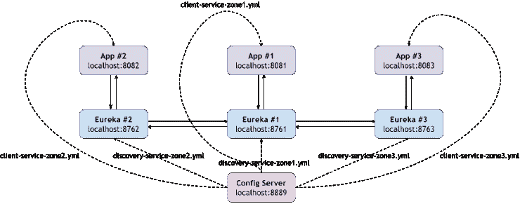
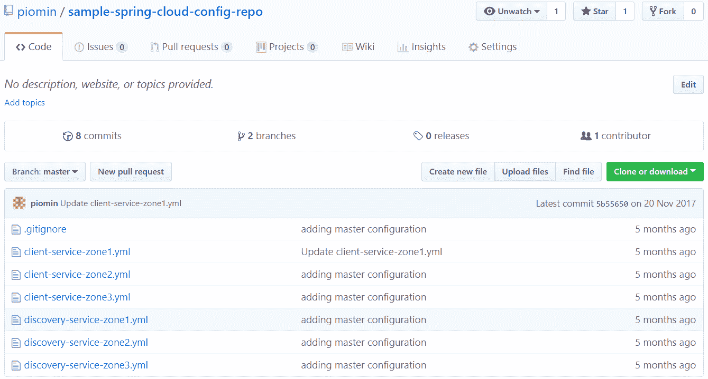
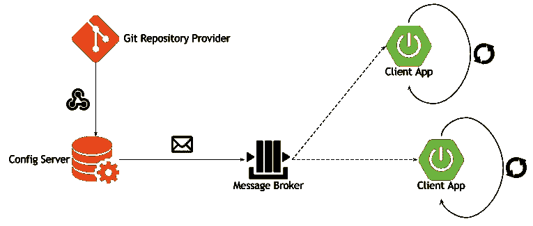
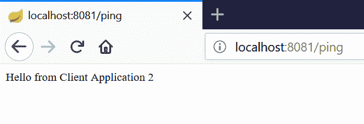
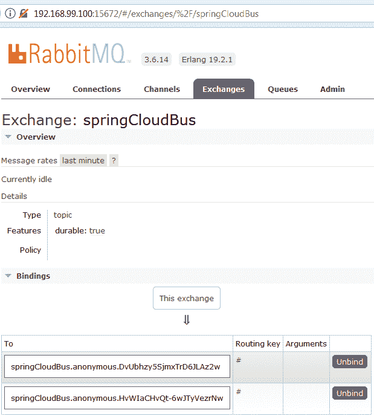
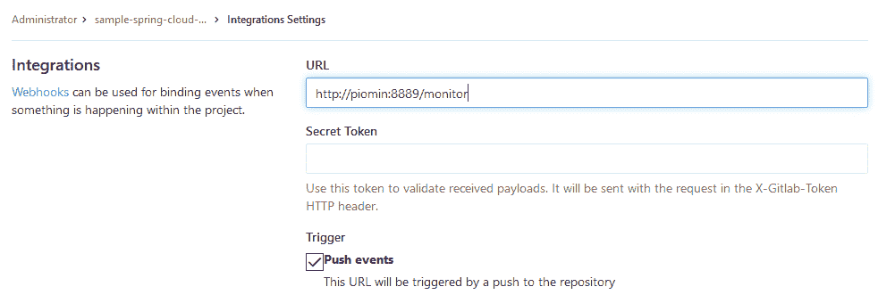

# 使用 Spring Cloud Config 的分布式配置

现在是引入我们架构中的一个新的元素，一个分布式配置服务器的时候了。与服务发现一样，这是微服务周围的的关键概念之一。在上一章中，我们详细讨论了如何准备发现，包括服务器和客户端两侧。但到目前为止，我们总是通过在一个胖 JAR 文件内部放置属性来为应用程序提供配置。这种方法有一个很大的缺点，它需要重新编译和部署微服务的实例。Spring Boot 支持另一种方法，它假定使用一个存储在胖 JAR 外部文件系统中的显式配置。在应用程序启动时，可以通过`spring.config.location`属性轻松地为应用程序配置。这种方法不需要重新部署，但它也不是没有缺点。对于很多微服务，基于显式文件放置在文件系统上的配置管理可能真的非常麻烦。此外，让我们想象一下，每个微服务都有很多实例，并且每个实例都有特定的配置。好吧，用那种方法最好不要去想象。

总之，分布式配置在云原生环境中是一个非常流行的标准。Spring Cloud Config 为分布式系统中的外部化配置提供了服务器端和客户端支持。有了这个解决方案，我们有一个中心位置，可以管理跨所有环境的应用程序的外部属性。这个概念真的很简单，易于实现。服务器所做的不仅仅是暴露 HTTP 和基于资源的 API 接口，返回`property`文件以 JSON、YAML 或属性格式。此外，它还执行返回属性值的解密和加密操作。客户端需要从服务器获取配置设置，如果服务器端启用了此类功能，还需要对其进行解密。

配置数据可能存储在不同的仓库中。`EnvironmentRepository`的默认实现使用 Git 后端。也可以设置其他 VCS 系统，如 SVN。如果你不想利用 VCS 作为后端所提供的特性，你可以使用文件系统或 Vault。Vault 是一个管理秘密的工具，它存储并控制对令牌、密码、证书和 API 密钥等资源的访问。

本章我们将要覆盖的主题有：

+   由 Spring Cloud Config Server 暴露的 HTTP API

+   服务器端的不同的仓库后端类型

+   整合服务发现

+   使用 Spring Cloud Bus 和消息代理自动重新加载配置

# HTTP API 资源介绍

配置服务器提供 HTTP API，可以通过多种方式调用。以下端点可用：

+   `/{application}/{profile}[/{label}]`: 这返回以 JSON 格式数据；标签参数是可选的

+   `/{application}-{profile}.yml`: 这返回 YAML 格式。

+   `/{label}/{application}-{profile}.yml`: 此为前一个端点的变种，其中我们可以传递一个可选的标签参数。

+   `/{application}-{profile}.properties`: 这返回属性文件使用的简单键/值格式。

+   `/{label}/{application}-{profile}.properties`: 此为前一个端点的变种，其中我们可以传递一个可选的标签参数。

从客户端的角度来看，应用程序参数是应用程序的名称，它来自于`spring.application.name`或`spring.config.name`属性，配置文件参数是活动配置文件或由逗号分隔的活动配置文件列表。最后一个可用的参数`label`是一个可选属性，仅在作为后端存储的 Git 中工作时才重要。它设置了配置的 Git 分支名称，默认为`master`。

# 原生配置文件支持

让我们从最简单的例子开始，该例子基于文件系统后端。默认情况下，Spring Cloud Config Server 尝试从 Git 仓库获取配置数据。要启用原生配置文件，我们应该使用`spring.profiles.active`选项将服务器启动设置为`native`。它会在以下位置搜索存储的文件，`classpath:/`、`classpath:/config`、`file:./`、`file:./config`。这意味着属性文件或 YAML 文件也可以放在 JAR 文件内部。为了测试目的，我在`src/main/resources`内部创建了一个 config 文件夹。我们的配置文件将存储在该位置。现在，我们需要回到前一章节的例子。正如您可能记得的，我介绍了集群发现环境的配置，每个客户端服务实例在不同的区域启动。有三个可用的区域和三个客户端实例，每个实例在其`application.yml`文件中都有自己的配置文件。该示例的源代码在`config`分支中可用。这是链接：[`github.com/piomin/sample-spring-cloud-netflix/tree/config`](https://github.com/piomin/sample-spring-cloud-netflix/tree/config)。

[`github.com/piomin/sample-spring-cloud-netflix/tree/config`](https://github.com/piomin/sample-spring-cloud-netflix/tree/config)

我们当前的任务是将该配置迁移到 Spring Cloud Config Server。让我们回顾一下该示例中设置的属性。以下是为客户端应用程序的第一个实例使用的配置文件设置。根据所选配置文件，有一个可变的实例运行端口、一个默认的发现服务器 URL 和一个区域名称：

```java
---
spring:
 profiles: zone1

eureka:
 instance:
   metadataMap:
     zone: zone1
   client:
     serviceUrl:
       defaultZone: http://localhost:8761/eureka/

server: 
 port: ${PORT:8081}
```

在所描述的示例中，我把所有配置文件设置放在了一个单独的`application.yml`文件中，以简化问题。这个文件完全可以被分成三个不同的文件，文件名包含各自配置文件，如`application-zone1.yml`、`application-zone2.yml`和`application-zone3.yml`。当然，这样的名字对于单个应用来说是唯一的，所以如果我们决定将这些文件移动到远程配置服务器，我们需要注意它们的名称。客户端应用程序名称是从`spring.application.name`注入的，在这个例子中，它是`client-service`。所以，总结来说，我在`src/main/resources/config`目录下创建了三个名为`client-service-zone[n].yml`的配置文件，其中[`n`]是实例编号。现在，当你调用`http://localhost:8888/client-service/zone1`端点时，你将以 JSON 格式收到以下响应：

```java
{
 "name":"client-service",
 "profiles":["zone1"],
 "label":null,
 "version":null,
 "state":null,
 "propertySources":[{
 "name":"classpath:/config/client-service-zone1.yml",
 "source":{
 "eureka.instance.metadataMap.zone":"zone1",
 "eureka.client.serviceUrl.defaultZone":"http://localhost:8761/eureka/",
 "server.port":"${PORT:8081}"
 }
 }]
}
```

我们还可以调用`http://localhost:8888/client-service-zone2.properties`获取第二个实例，它将以下响应作为属性列表返回：

```java
eureka.client.serviceUrl.defaultZone: http://localhost:8762/eureka/
eureka.instance.metadataMap.zone: zone2
server.port: 8082
```

最后一个可用的 HTTP API 端点，`http://localhost:8889/client-service-zone3.yml`，返回与输入文件相同的数据。这是第三个实例的结果：

```java
eureka:
 client:
 serviceUrl:
 defaultZone: http://localhost:8763/eureka/
 instance:
 metadataMap:
 zone: zone3
server:
 port: 8083
```

# 构建服务器端应用程序

我们首先讨论了由 Spring Cloud Config Server 提供的基于资源的 HTTP API 以及在该处创建和存储属性的方法。但现在让我们回到基础。与发现服务器一样，Config Server 也可以作为 Spring Boot 应用程序运行。要在服务器端启用它，我们应在`pom.xml`文件中包含`spring-cloud-config-server`在我们的依赖项中：

```java
<dependency>
  <groupId>org.springframework.cloud</groupId>
  <artifactId>spring-cloud-config-server</artifactId>
</dependency>
```

此外，我们应在主应用程序类上启用 Config Server。将服务器端口更改为`8888`是个好主意，因为它是客户端侧`spring.cloud.config.uri`属性的默认值。例如，客户端会自动配置。要更改服务器端口，你应该设置`server.port`属性为`8888`，或者使用`spring.config.name=configserver`属性启动它。`spring-cloud-config-server`库中有一个`configserver.yml`：

```java
@SpringBootApplication
@EnableConfigServer
public class ConfigApplication {

 public static void main(String[] args) {
   new SpringApplicationBuilder(ConfigApplication.class).web(true).run(args);
 }

}
```

# 构建客户端应用程序

如果你把`8888`设置为服务器的默认端口，客户端的配置就非常简单了。你只需要提供`bootstrap.yml`文件，其中包含应用程序名称，并在你的`pom.xml`中包含以下依赖关系。当然，这个规则只适用于本地主机，因为客户端自动配置的 Config Server 地址是`http://localhost:8888`：

```java
<dependency>
  <groupId>org.springframework.cloud</groupId>
  <artifactId>spring-cloud-starter-config</artifactId>
</dependency>
```

如果您为服务器设置了不同于`8888`的端口，或者它运行在与客户端应用程序不同的机器上，您还应该在`bootstrap.yml`中设置其当前地址。以下是引导上下文设置，它允许您从端口`8889`上运行的服务器获取`client-service`的属性。当使用`--spring.profiles.active=zone1`参数运行应用程序时，它将自动获取配置服务器中为`zone1`配置文件设置的属性：

```java
spring: 
 application:
   name: client-service
 cloud:
   config:
     uri: http://localhost:8889
```

# 添加 Eureka 服务器

正如您可能已经注意到的，客户端属性中有一个发现服务网络位置的地址。所以，在启动客户端服务之前，我们应该有一个 Eureka 服务器在运行。当然，Eureka 也有自己的配置，它已经被存储在前一章节的`application.yml`文件中。那个配置，类似于`client-service`，被分成了三个配置文件，每个文件在诸如服务器 HTTP 端口号和要通信的发现对等体列表等属性上与其他文件不同。

现在，我们将这些`property`文件放在配置服务器上。Eureka 在启动时获取分配给所选配置文件的所有的设置。文件命名与已经描述的标准一致，即`discovery-service-zone[n].yml`。在运行 Eureka 服务器之前，我们应该在依赖项中包括`spring-cloud-starter-config`以启用 Spring Cloud Config 客户端，并用以下所示的`bootstrap.yml`替换`application.yml`：

```java
spring: 
 application:
   name: discovery-service
 cloud:
   config:
     uri: http://localhost:8889
```

现在，我们可以通过在`--spring.profiles.active`属性中设置不同的配置文件名称，以对等通信模式运行三个 Eureka 服务器实例。在启动三个`client-service`实例之后，我们的架构如下所示。与前一章节的示例相比，客户端和服务发现服务都从 Spring Cloud Config 服务器获取配置，而不是将其保存在胖 JAR 内的 YML 文件中：



# 客户端引导方法

在前面的示例解决方案中，所有应用程序必须持有配置服务器的网络位置。服务发现的位置作为属性存储在那里。在此时，我们面临一个有趣的问题进行讨论。我们可以问一下我们的微服务是否应该知道 Config Server 的网络地址。在之前的讨论中，我们已经同意所有服务的网络位置的主要位置应该是服务发现服务器。配置服务器也是像其他微服务一样的 Spring Boot 应用程序，所以从逻辑上讲，它应该向 Eureka 注册自己，以使其他必须从 Spring Cloud Config Server 获取数据的服务能够使用自动发现机制。这反过来又要求将服务发现连接设置放在`bootstrap.yml`中，而不是`spring.cloud.config.uri`属性。

在设计系统架构时需要做出的决定之一就是在这两种不同的方法之间进行选择。并不是说一种解决方案比另一种更好。对于使用`spring-cloud-config-client`工件的任何应用程序，其默认行为在 Spring Cloud 命名法中称为**Config First Bootstrap**。当配置客户端启动时，它会绑定到服务器并使用远程属性源初始化上下文。这种方法在本章的第一个示例中已经介绍过。在第二种解决方案中，Config Server 向服务发现注册，所有应用程序可以使用`DiscoveryClient`来定位它。这种方法称为**Discovery First Bootstrap**。让我们实现一个示例来阐述这个概念。

# 配置服务器发现

要访问 GitHub 上的这个示例，你需要切换到`config_with_discovery`分支。这是链接：

[`github.com/piomin/sample-spring-cloud-netflix/tree/config_with_discovery`](https://github.com/piomin/sample-spring-cloud-netflix/tree/config_with_discovery)。

第一次更改与`sample-service-discovery`模块有关。在那里我们不需要`spring-cloud-starter-config`依赖。简单的配置不再从远程属性源获取，而是设置在`bootstrap.yml`中。与之前的示例相比，为了简化练习，我们启动一个单一的独立 Eureka 实例：

```java
spring: 
 application:
   name: discovery-service 

server: 
 port: ${PORT:8761} 

eureka:
 client:
   registerWithEureka: false
   fetchRegistry: false
```

相比之下，我们应该为 Config Server 包含`spring-cloud-starter-eureka`依赖。现在，依赖关系的完整列表如下所示。此外，必须通过在主类上声明`@EnableDiscoveryClient`注解来启用发现客户端，并且通过在`application.yml`文件中将`eureka.client.serviceUrl.defaultZone`属性设置为`http://localhost:8761/eureka/`来提供 Eureka Server 地址：

```java
<dependency>
  <groupId>org.springframework.cloud</groupId>
  <artifactId>spring-cloud-config-server</artifactId>
</dependency>
<dependency>
  <groupId>org.springframework.cloud</groupId>
  <artifactId>spring-cloud-starter-eureka</artifactId>
</dependency>
```

在客户端应用程序方面，不再需要持有配置服务器的地址。只需要设置服务 ID，以防它与 Config Server 不同。根据本例中服务命名惯例，该 ID 是`config-server`。它应该使用`spring.cloud.config.discovery.serviceId`属性覆盖。为了允许发现机制启用发现机制从配置服务器获取远程属性源，我们应该设置`spring.cloud.config.discovery.enabled=true`：

```java
spring: 
 application:
   name: client-service
 cloud:
   config:
     discovery:
       enabled: true
       serviceId: config-server
```

下面是带有 Config Server 的一个实例和三个`client-service`实例注册的 Eureka 仪表板屏幕。客户端的 Spring Boot 应用程序的每个实例都与之前的示例相同，并使用`--spring.profiles.active=zone[n]`参数启动，其中`n`是区域编号。唯一不同的是，Spring Cloud Config Server 提供的所有客户端服务配置文件都有与 Eureka Server 相同的连接地址：


# 仓库后端类型

本章中前面的所有示例都使用了文件系统后端，这意味着配置文件是从本地文件系统或类路径中加载的。这种后端对于教程目的或测试来说非常不错。如果你想在生产环境中使用 Spring Cloud Config，考虑其他选项是值得的。这些选项中的第一个是基于 Git 的仓库后端，它也是默认启用的。它不是唯一一个可以用作配置源仓库的**版本控制系统**（**VCS**）。另一个选项是 SVN，或者我们可以决定创建一个复合环境，这可能包括 Git 和 SVN 仓库。下一个支持的后端类型是基于 HashiCorp 提供的工具 Vault。当管理诸如密码或证书的安全属性时，它特别有用。让我们更详细地看看这里列出的每个解决方案。

# 文件系统后端

我不会写太多关于这个主题的内容，因为已经在之前的示例中讨论过了。它们都展示了如何将属性源存储在类路径中。还有从磁盘加载它们的能力。默认情况下，Spring Cloud Config Server 尝试在应用程序的工作目录或此位置的 config 子目录内定位文件。我们可以使用`spring.cloud.config.server.native.searchLocations`属性来覆盖默认位置。搜索位置路径可能包含`application`、`profile`和`label`的占位符。如果在位置路径中不使用任何占位符，仓库会自动将标签参数作为后缀添加。

因此，配置文件从每个搜索位置和与标签同名的子目录中加载。例如，`file:/home/example/config`与`file:/home/example/config,file:/home/example/config/{label}`相同。可以通过将`spring.cloud.config.server.native.addLabelLocations`设置为`false`来禁用这种行为。

如我前面所提到的，文件系统后端不是生产部署的好选择。如果你将属性源放在 JAR 文件内的类路径中，每次更改都需要重新编译应用程序。另一方面，在 JAR 之外使用文件系统不需要重新编译，但如果你有多个实例的配置服务在高级可用性模式下工作，这种方法可能会有麻烦。在这种情况下，将文件系统跨所有实例共享或将每个运行实例的属性源副本保留。Git 后端免除了这些缺点，这就是为什么它推荐用于生产环境的原因。

# Git 后端

Git 版本控制系统有一些功能使其作为属性源的仓库非常有用。它允许你轻松地管理和审计更改。通过使用众所周知的版本控制机制，如提交、回滚和分支，我们可以比文件系统方法更容易地执行重要的操作。这种后端还有另外两个关键优势。它强制将配置服务器源代码和`property`文件仓库分开。如果你再次查看之前的示例，你会发现`property`文件与应用程序源代码一起存储。也许有些人会说，即使我们使用文件系统后端，也可以将整个配置作为单独的项目存储在 Git 中，并在需要时上传到远程服务器上。当然，你的观点是正确的。但是，当使用与 Spring Cloud Config 结合的 Git 后端时，你可以直接获得这些机制。此外，它还解决了与运行服务器多个实例相关的问题。如果你使用远程 Git 服务器，更改可能很容易在所有运行实例之间共享。

# 不同的协议

要为应用程序设置 Git 仓库的位置，我们应该在`application.yml`中使用`spring.cloud.config.server.git.uri`属性。如果你熟悉 Git，你就会知道克隆可以通过文件、http/https 和 ssh 协议来实现。本地仓库访问允许你快速开始，而不需要远程服务器。它使用文件、前缀进行配置，例如，`spring.cloud.config.server.git.uri=file:/home/git/config-repo`。当在高级可用性模式下运行 Config Server 时，你应该使用远程协议 SSH 或 HTTPS。在这种情况下，Spring Cloud Config 克隆远程仓库，然后基于本地工作副本作为缓存。

# 在 URI 中使用占位符

这里支持所有最近列出的占位符，`application`、`profile`和`label`。我们可以使用占位符为每个应用程序创建一个单一仓库，如`https://github.com/piomin/{application}`，甚至可以为每个配置文件创建，`https://github.com/piomin/{profile}`。这种后端实现将 HTTP 资源的 label 参数映射到 Git 标签，可能指的是提交 ID、分支或标签名。显然，发现对我们感兴趣的功能的最合适方式是通过一个示例。让我们先通过创建一个用于存储应用程序属性源的 Git 仓库开始。

# 构建服务器应用程序

我创建了一个示例配置仓库，您可以在 GitHub 上在此处找到它：

请参阅[`github.com/piomin/sample-spring-cloud-config-repo.git`](https://github.com/piomin/sample-spring-cloud-config-repo.git)。

我将本章中使用的所有属性源放在了这里，这些示例展示了客户端应用程序在不同发现区域对本地配置文件的支持。现在，我们的仓库包含了此列表中可见的文件：



默认情况下，Spring Cloud Config Server 在第一次 HTTP 资源调用后尝试克隆一个仓库。如果你想在启动后强制克隆，你应该将`cloneOnStart`属性设置为`true`。此外，还需要设置仓库连接设置和账户认证凭据：

```java
spring:
 application:
   name: config-server
 cloud:
   config:
     server:
       git:
         uri: https://github.com/piomin/sample-spring-cloud-config-repo.git
         username: ${github.username}
         password: ${github.password}
         cloneOnStart: true
```

在服务器运行后，我们可以调用之前练习中已知端点，例如`http://localhost:8889/client-service/zone1`或`http://localhost:8889/client-service-zone2.yml`。结果与早期测试相同；唯一不同的是数据源。现在，让我们进行另一个练习。正如您可能记得的，当我们首先使用`native`配置文件启用发现引导时，我们必须稍微更改客户端的属性。因为现在我们使用的是 Git 后端，我们可以为这种情况开发一个更聪明的解决方案。在当前方法中，我们将在 GitHub 上的配置仓库中创建`discovery`分支（[`github.com/piomin/sample-spring-cloud-config-repo/tree/discovery`](https://github.com/piomin/sample-spring-cloud-config-repo/tree/discovery)），并将专为应用程序演示发现首先引导机制的文件放置在此分支上。如果您用`label`参数设置为`discovery`调用 Config Server 端点，您将获取我们新分支的数据。尝试调用`http://localhost:8889/client-service/zone1/discovery`和/或`http://localhost:8889/discovery/client-service-zone2.yml`并检查结果*.*

让我们考虑另一种情况。我更改了 `client-service` 第三实例的服务器端口，但出于某种原因，我想恢复到以前的价值。我必须更改并提交 `client-service-zone3.yml` 以使用以前的端口值吗？不用，我只需要在调用 HTTP API 资源时传递 `label` 参数即可。下面截图展示了所执行的更改：


如果我用父提交 ID 调用 API 端点而不是分支名，那么会返回较旧的端口号作为响应。以下是调用 `http://localhost:8889/e546dd6/client-service-zone3.yml` 的结果，其中 `e546dd6` 是之前的提交 ID：

```java
eureka:
  client:
    serviceUrl:
      defaultZone: http://localhost:8761/eureka/
  instance:
    metadataMap:
      zone: zone3
server:
  port: 8083
```

# 客户端配置

在用 Git 后端构建服务器端时，我仅向您展示了 HTTP 资源调用的例子。以下是客户端应用程序的配置示例。我们不仅可以设置 `bootstrap.yml` 中的 `profile` 属性，还可以在 `spring.profiles.active` 运行参数中传递它。这个配置使得客户端从 `discovery` 分支获取属性。我们还可以通过在 `label` 属性中设置某个提交 ID 来决定切换到某个提交 ID，正如我刚才已经提到的：

```java
spring: 
 application:
   name: client-service
 cloud:
   config:
     uri: http://localhost:8889
     profile: zone1
     label: discovery
#    label: e546dd6 // uncomment for rollback
```

# 多个仓库

有时，您可能需要为单个 Config Server 配置多个仓库。我可以想象到您需要将业务配置从典型的技术配置中分离出来的情况。这是完全可能的：

```java
spring:
 cloud:
   config:
     server:
       git:
         uri: https://github.com/piomin/spring-cloud-config-repo/config-repo
         repos:
           simple: https://github.com/simple/config-repo
           special:
             pattern: special*/dev*,*special*/dev*
             uri: https://github.com/special/config-repo
           local:
             pattern: local*
             uri: file:/home/config/config-repo 
```

# Vault 后端

我已经提到了 Vault 作为一个通过统一接口安全访问密钥的工具。为了使 Config Server 使用这种类型的后端，您必须使用 Vault 配置文件 `--spring.profiles.active=vault` 运行它。当然，在运行 Config Server 之前，您需要安装并启动 Vault 实例。我建议您使用 Docker 来做这件事。我知道这是本书中第一次接触 Docker，并不是每个人都熟悉这个工具。我在第十四章*，Docker 支持*中提供了 Docker 的简要介绍，包括其基本命令和用例。所以，如果您是第一次接触这项技术，请先查看这个介绍。对于那些熟悉 Docker 的同学，这里是在开发模式下运行 Vault 容器的命令。我们可以使用 `VAULT_DEV_LISTEN_ADDRESS` 参数或初始生成的根令牌 ID 覆盖默认监听地址：

```java
docker run --cap-add=IPC_LOCK -d --name=vault -e 'VAULT_DEV_ROOT_TOKEN_ID=client' -p 8200:8200 vault 
```

# 开始使用 Vault

Vault 提供了一个命令行界面，可用于向服务器添加新值和从服务器读取它们。下面展示了调用这些命令的示例。然而，我们已经以 Docker 容器的形式运行了 Vault，所以最方便管理密钥的方式是通过 HTTP API：

```java
$ vault write secret/hello value=world
$ vault read secret/hello
```

Vault 在我们实例中的 HTTP API 可以通过`http://192.168.99.100:8200/v1/secret`地址进行访问。调用该 API 的每一个方法时，你需要传递一个令牌作为请求头`X-Vault-Token`。因为我们启动 Docker 容器时在`VAULT_DEV_ROOT_TOKEN_ID`环境变量中设置了这个值，所以它等于`client`。否则，在启动过程中会自动生成，并且可以通过调用命令`docker logs vault`从日志中读取。实际上，要与 Vault 一起工作，我们需要了解两种 HTTP 方法——`POST`和`GET`。调用`POST`方法时，我们可以定义应该添加到服务器的密钥列表。这里所示的`curl`命令中的参数是使用 kv 后端创建的，它像一个键/值存储器：

```java
$ curl -H "X-Vault-Token: client" -H "Content-Type: application/json" -X POST -d '{"server.port":8081,"sample.string.property": "Client App","sample.int.property": 1}' http://192.168.99.100:8200/v1/secret/client-service
```

新添加的值可以通过使用`GET`方法从服务器读取：

```java
$ curl -H "X-Vault-Token: client" -X GET http://192.168.99.100:8200/v1/secret/client-service
```

# 与 Spring Cloud Config 集成

如我之前提到的，我们必须使用`--spring.profiles.active=vault`参数运行 Spring Cloud Config Server，以启用 Vault 作为后端存储。为了覆盖默认的自动配置设置，我们应该在`spring.cloud.config.server.vault.*`键下定义属性。我们示例应用程序的当前配置如下所示。一个示例应用程序可以在 GitHub 上找到；你需要切换到`config_vault`分支([`github.com/piomin/sample-spring-cloud-netflix/tree/config_vault`](https://github.com/piomin/sample-spring-cloud-netflix/tree/config_vault))来访问它：

```java
spring:
 application:
   name: config-server
 cloud:
   config:
     server:
       vault:
         host: 192.168.99.100
         port: 8200
```

现在，你可以调用 Config Server 暴露的端点。你必须在上传请求头中传递令牌，但这次它的名称是`X-Config-Token`：

```java
$ curl -X "GET" "http://localhost:8889/client-service/default" -H "X-Config-Token: client"
```

响应应该与下面显示的相同。这些属性是客户端应用程序所有配置文件的全局默认值。你也可以通过在 Vault HTTP `API`方法中调用带有逗号字符的选定配置文件名称来为选定的配置文件添加特定设置，如下所示，`http://192.168.99.100:8200/v1/secret/client-service,zone1`。如果调用路径中包含了这样的配置文件名称，响应中会返回`default`和`zone1`配置文件的所有属性：

```java
{
    "name":"client-service",
    "profiles":["default"],
    "label":null,
    "version":null,
    "state":null,
    "propertySources":[{
        "name":"vault:client-service",
        "source":{
            "sample.int.property":1,
            "sample.string.property":"Client App",
            "server.port":8081
        }
    }]
} 
```

# 客户端配置

当使用 Vault 作为 Config Server 的后端时，客户端需要传递一个令牌，以便服务器能够从 Vault 检索值。这个令牌应该在客户端配置设置中提供，在`bootstrap.yml`文件中的`spring.cloud.config.token`属性：

```java
spring:
 application:
   name: client-service
 cloud:
   config:
     uri: http://localhost:8889
     token: client
```

# 额外特性

让我们来看看 Spring Cloud Config 的一些其他有用特性。

# 启动失败并重试

有时如果 Config Server 不可用，启动应用程序就没有任何意义。在这种情况下，我们希望能够用异常停止客户端。为了实现这一点，我们必须将引导配置属性`spring.cloud.config.failFast`设置为`true`。这种激进的解决方案并不总是期望的行为。如果 Config Server 只是偶尔不可达，更好的方法是在成功之前一直尝试重新连接。`spring.cloud.config.failFast`属性仍然必须等于`true`，但我们还需要在应用程序类路径中添加`spring-retry`库和`spring-boot-starter-aop`。默认行为假设重试六次，初始退避间隔为 1000 毫秒。您可以使用`spring.cloud.config.retry.*`配置属性覆盖这些设置。

# 保护客户端

与服务发现一样，我们可以通过基本认证来保护 Config Server。使用 Spring Security 可以在服务器端轻松启用。在这种情况下，客户端只需要在`bootstrap.yml`文件中设置用户名和密码：

```java
spring:
 cloud:
   config:
     uri: https://localhost:8889
     username: user
     password: secret
```

# 自动重新加载配置

我们已经讨论了 Spring Cloud Config 最重要的特性。在那一刻，我们实现了示例，说明如何使用不同的后端存储作为存储库。但是，无论我们决定选择文件系统、Git 还是 Vault，我们的客户端应用程序都需要重新启动，才能从服务器获取最新的配置。然而，有时这并不是一个最优的解决方案，尤其是如果我们有许多微服务在运行，其中一些使用相同的通用配置。

# 解决方案架构

即使我们为每个单一的应用程序创建了一个专用的`property`文件，动态地重新加载它而不重新启动的机会也非常有帮助。正如您可能已经推断出的那样，这样的解决方案对 Spring Boot 和因此对 Spring Cloud 都是可用的。在第四章，*服务发现*中，在介绍从服务发现服务器注销时，我引入了一个端点`/shutdown`，可以用于优雅地关闭。还有一个用于 Spring 上下文重启的端点，其工作方式与关闭相似。

客户端端的端点只是需要包含以使 Spring Cloud Config 支持推送通知的更大系统中的一个组件。最受欢迎的源代码仓库提供商，如 GitHub、GitLab 和 Bitbucket，通过提供 WebHook 机制，能够发送有关仓库中变化的通知。我们可以通过提供商的网页控制台，以 URL 和选择的事件类型列表来配置 WebHook。这样的提供商将通过调用 WebHook 中定义的`POST`方法，发送包含提交列表的正文。在 Config Server 端启用监控端点需要在项目中包含 Spring Cloud Bus 依赖。当由于 WebHook 的激活而调用此端点时，Config Server 会准备并发送一个事件，其中包含由最后提交修改的属性源列表。该事件被发送到消息代理。Spring Cloud Bus 为 RabbitMQ 和 Apache Kafka 提供了实现。第一个可以通过包含`spring-cloud-starter-bus-amqp`依赖项启用于项目，第二个可以通过包含`spring-cloud-starter-bus-kafka`依赖项启用于项目。这些依赖项还应该在客户端应用程序中声明，以使能够从消息代理接收消息。我们还可以通过在选择的配置类上使用`@RefreshScope`注解来启用客户端端的动态刷新机制。该解决方案的架构示例如下：



# 使用@RefreshScope 刷新配置

这次我们将从客户端端开始，这很不寻常。示例应用程序可以在 GitHub 上找到([`github.com/piomin/sample-spring-cloud-config-bus.git`](https://github.com/piomin/sample-spring-cloud-config-bus.git))。与之前的示例一样，它使用 Git 仓库作为后端存储，该仓库也是在大 GitHub 上创建的([`github.com/piomin/sample-spring-cloud-config-repo`](https://github.com/piomin/sample-spring-cloud-config-repo))。我在客户端的配置文件中添加了一些新属性，并将更改提交到仓库。以下是客户端当前配置的版本：

```java
eureka:
 instance:
   metadataMap:
     zone: zone1
 client:
   serviceUrl:
     defaultZone: http://localhost:8761/eureka/
server: 
 port: ${PORT:8081}
management:
 security:
   enabled: false 
sample:
 string:
   property: Client App
 int:
   property: 1
```

通过将`management.security.enabled`设置为`false`，我禁用了 Spring Boot Actuator 端点的 Security。这样我们就可以调用这些端点，而无需传递安全凭据。我还添加了两个测试参数，`sample.string.property`和`sample.int.property`，以演示基于它们值的重试机制在示例中。Spring Cloud 为 Spring Boot Actuator 提供了一些额外的 HTTP 管理端点。其中之一是`/refresh`，它负责重新加载引导上下文和刷新注解为`@RefreshScope`的 bean。这是一个 HTTP `POST`方法，可以在`http://localhost:8081/refresh`的客户端实例上调用。在测试该功能之前，我们需要使发现和 Config Servers 运行。客户端应用程序应该使用`--spring.profiles.active=zone1`参数启动。下面是测试属性`sample.string.property`和`sample.int.property`被注入到字段中的类：

```java
@Component
@RefreshScope
public class ClientConfiguration {

 @Value("${sample.string.property}")
 private String sampleStringProperty;
 @Value("${sample.int.property}")
 private int sampleIntProperty; 

 public String showProperties() {
   return String.format("Hello from %s %d", sampleStringProperty, sampleIntProperty);
 }

}
```

这个 bean 被注入到`ClientController`类中，并在`ping`方法中调用，该方法在`http://localhost:8081/ping`上暴露：

```java
@RestController
public class ClientController {

 @Autowired
 private ClientConfiguration conf; 

 @GetMapping("/ping")
 public String ping() {
     return conf.showProperties();
 } 

}
```

现在，让我们更改`client-service-zone1.yml`中的测试属性值并提交它们。如果你调用 Config Server HTTP 端点`/client-service/zone1`，你将看到最新的值作为响应返回。但是，当你调用客户端应用程序上暴露的`/ping`方法时，你仍然会看到以下屏幕左侧显示的较旧值。为什么？尽管 Config Server 可以自动检测仓库更改，但客户端应用程序没有触发器是无法自动刷新的。它需要重启以读取最新的设置，或者我们可以通过调用前面描述的`/refresh`方法强制重新加载配置：


在客户端应用程序上调用`/refresh`端点后，你将在日志文件中看到配置已重新加载。现在，如果你再调用一次`/ping`，最新的属性值将返回在响应中。这个例子说明了 Spring Cloud 应用程序的热重载是如何工作的，但它显然不是我们的目标解决方案。下一步是启用与消息代理的通信：



# 从消息代理中消费事件

我已经提到，我们可以选择两种与 Spring Cloud Bus 集成的消息代理。在这个例子中，我将向你展示如何运行和使用 RabbitMQ。让我简单说一下这个解决方案，因为这是我们书中第一次接触到它。RabbitMQ 已经成为最受欢迎的消息代理软件。它用 Erlang 编写，实现了**高级消息队列协议** (**AMQP**)。即使我们谈论的是如集群或高可用性这样的机制，它也易于使用和配置。

在您的机器上运行 RabbitMQ 最方便的方式是通过一个 Docker 容器。有两个端口已经暴露在容器外。第一个用于客户端连接（`5672`）第二个专用于管理仪表板（`15672`）。我还用管理标签运行了镜像以启用 UI 仪表板，这在默认版本中是不可用的：

```java
docker run -d --name rabbit -p 5672:5672 -p 15672:15672 rabbitmq:management
```

为了支持我们的示例客户端应用程序的 RabbitMQ 代理，我们应该在`pom.xml`中包含以下依赖项：

```java
 <dependency>
     <groupId>org.springframework.cloud</groupId>
     <artifactId>spring-cloud-starter-bus-amqp</artifactId>
 </dependency>
```

那个库包含了自动配置设置。因为我是在 Windows 上运行 Docker，所以我需要覆盖一些默认属性。完整的服务配置存储在一个 Git 仓库中，所以更改只影响远程文件。我们应该在之前使用的客户端属性源中添加以下参数：

```java
spring:
 rabbitmq:
   host: 192.168.99.100
   port: 5672
   username: guest
   password: guest
```

如果你运行客户端应用程序，RabbitMQ 会自动创建一个交换区和一个队列。你可以通过登录到位于`http://192.168.99.100:15672`的管理仪表板轻松查看这一点。默认的用户名和密码是`guest/guest`。以下是来自我 RabbitMQ 实例的屏幕截图。有一个名为`SpringCloudBus`的交换区被创建，与客户端队列和 Config Server 队列有两个绑定（我已经运行了下一节描述的更改）。在这个阶段，我不想深入了解 RabbitMQ 及其架构的细节。这样的讨论的好地方将是 Spring Cloud Stream 项目的第十一章，*消息驱动的微服务*：



# 监控 Config Server 上的仓库更改

Spring Cloud Config Server 在前面描述的过程中必须执行两项任务。首先，它必须检测存储在 Git 仓库中的`property`文件的变化。这可能通过暴露一个特殊的端点来实现，该端点将通过 WebHook 由仓库提供商调用。第二步是准备并向可能已更改的应用程序发送一个`RefreshRemoteApplicationEvent`。这需要我们建立与消息代理的连接。`spring-cloud-config-monitor`库负责启用`/monitor`端点。为了支持 RabbitMQ 代理，我们应该包含与客户端应用程序相同的启动工件：

```java
<dependency>
 <groupId>org.springframework.cloud</groupId>
 <artifactId>spring-cloud-config-monitor</artifactId>
</dependency>
<dependency>
 <groupId>org.springframework.cloud</groupId>
 <artifactId>spring-cloud-starter-bus-amqp</artifactId>
</dependency>
```

不仅如此。配置监视器还应在`application.yml`中激活。因为每个仓库提供商在 Spring Cloud 中都有专门的实现，所以有必要选择哪个应该被启用：

```java
spring:
 application:
   name: config-server
 cloud:
   config:
     server:
       monitor:
         github:
           enabled: true
```

更改检测机制可以自定义。默认情况下，它检测与应用程序名称匹配的文件中的更改。要覆盖此行为，你需要提供一个自定义的`PropertyPathNotificationExtractor`实现。它接受请求头和正文参数，并返回一个已更改的文件路径列表。为了支持来自 GitHub 的通知，我们可以使用`spring-cloud-config-monitor`提供的`GithubPropertyPathNotificationExtractor`：

```java
@Bean
public GithubPropertyPathNotificationExtractor githubPropertyPathNotificationExtractor() {
    return new GithubPropertyPathNotificationExtractor();
}
```

# 手动模拟更改事件

监控端点可以通过配置在 Git 仓库提供商（如 GitHub、Bitbucket 或 GitLab）上的 WebHook 来调用。在本地主机上运行的应用程序测试这种功能是麻烦的。结果是我们可以通过手动调用`POST /monitor`来轻松模拟这种 WebHook 的激活。例如，`Github`命令应该在请求中包含`X-Github-Event`头。带有`property`文件中更改的 JSON 体应该如下所示：

```java
$ curl -H "X-Github-Event: push" -H "Content-Type: application/json" -X POST -d '{"commits": [{"modified": ["client-service-zone1.yml"]}]}' http://localhost:8889/monitor
```

现在，让我们更改并提交`client-service-zone1.yml`文件中的一个属性值，例如`sample.int.property`。然后，我们可以使用前一个示例命令中显示的参数调用`POST /monitor`方法。如果你根据我的描述配置了所有内容，你应该在客户端应用程序侧看到以下日志行`Received remote refresh request. Keys refreshed [sample.int.property]`。如果你调用客户端微服务暴露的`/ping`端点，它应该返回更改属性的最新值。

# 使用 GitLab 实例在本地测试

对于那些不喜欢模拟事件的人来说，我提出一个更实用的练习。然而，我要指出这不仅需要你的开发技能，还需要对持续集成工具的基本了解。我们将从使用 GitLab 的 Docker 镜像在本地运行一个 GitLab 实例开始。GitLab 是一个开源的基于 Web 的 Git 仓库管理器，具有 wiki 和问题跟踪功能。它与 GitHub 或 Bitbucket 等工具非常相似，但可以轻松部署在你的本地机器上：

```java
docker run -d --name gitlab -p 10443:443 -p 10080:80 -p 10022:22 gitlab/gitlab-ce:latest
```

网页仪表板可在`http://192.168.99.100:10080`访问。第一步是创建一个管理员用户，然后使用提供的凭据登录。我不会详细介绍 GitLab。它有一个用户友好且直观的图形界面，所以我确信您不需要花费太多努力就能掌握它。无论如何，继续前进，我在 GitLab 中创建了一个名为`sample-spring-cloud-config-repo`的项目。它可以从`http://192.168.99.100:10080/root/sample-spring-cloud-config-repo.git`克隆。我在那里提交了与 GitHub 上我们的示例存储库中相同的配置文件集。下一步是定义一个 WebHook，当有推送通知时调用 Config Server 的`/monitor`端点。要为项目添加新的 WebHook，您需要前往设置 | 集成部分，然后将 URL 字段填写为服务器地址（使用您的 hostname 而不是 localhost 代替）。保留推送事件复选框的选择：



与使用 GitHub 作为后端存储提供商的 Config Server 实现相比，我们需要在`application.yml`中更改启用的监控类型，当然也要提供不同的地址：

```java
spring:
 application:
   name: config-server
 cloud:
   config:
     server:
       monitor:
         gitlab:
           enabled: true
       git:
         uri: http://192.168.99.100:10080/root/sample-spring-cloud-config-repo.git
         username: root
         password: root123
         cloneOnStart: true 
```

我们还应该注册另一个实现`PropertyPathNotificationExtractor`的 bean：

```java
@Bean
public GitlabPropertyPathNotificationExtractor gitlabPropertyPathNotificationExtractor() {
    return new GitlabPropertyPathNotificationExtractor();
}
```

最后，您可能需要在配置文件中做一些更改并推送它们。WebHook 应该被激活，客户端应用程序的配置应该被刷新。这是本章的最后一个例子；我们可以继续到结论。

# 摘要

在本章中，我描述了 Spring Cloud Config 项目的最重要特性。与服务发现一样，我们从基础开始，讨论了客户端和服务器端的简单用例。我们探讨了 Config Server 的不同后端存储类型。我实现了示例，说明了如何使用文件系统、Git，甚至第三方工具如 Vault 作为`property`文件的存储库。我特别关注与其他组件的互操作性，如服务发现或大型系统中的多个微服务实例。最后，我向您展示了如何基于 WebHooks 和消息代理无需重新启动应用程序来重新加载配置。总之，阅读本章后，您应该能够将 Spring Cloud Config 作为微服务架构的一个组成部分使用，并利用其主要特性。

在讨论了使用 Spring Cloud 的服务发现和配置服务器实现之后，我们可以继续研究服务间的通信。在接下来的两章中，我们将分析一些基本和更高级的示例，这些示例说明了几个微服务之间的同步通信。
