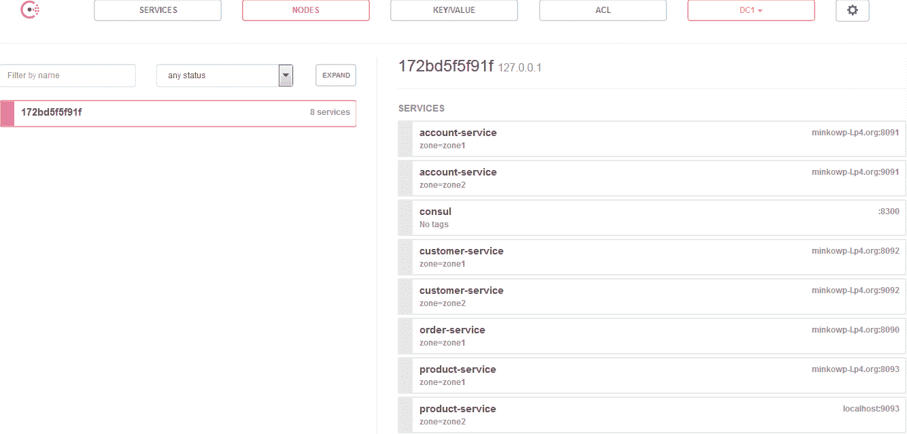
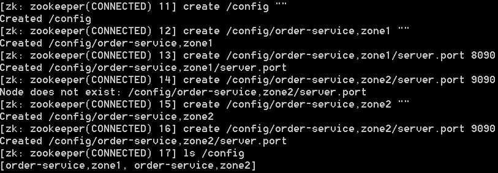

# 额外的配置和发现功能

我们在第四章*服务发现*和第五章*使用 Spring Cloud Config 进行分布式配置*中详细讨论了服务发现和分布式配置。我们讨论了两个解决方案。第一个，Eureka，由 Netflix OSS 提供，并被 Spring Cloud 用于服务发现。第二个是仅致力于分布式配置的 Spring Cloud Config 项目。然而，市场上有一些有趣的产品，它们有效地结合了这两项功能。目前，Spring Cloud 支持其中的两个：

+   **Consul**：这个产品是由 HashiCorp 构建的。它是一个高可用的分布式解决方案，旨在连接和配置跨动态、分布式基础设施的应用程序。Consul 是一个相当复杂的产品，具有多个组件，但其主要功能是在任何基础设施上发现和配置服务。

+   **Zookeeper**：这个产品是由 Apache 软件基金会构建的。它是一个用 Java 编写的分布式、层次化的键/值存储。它旨在维护配置信息、命名和分布式同步。与 Consul 相比，它更像是原始的键/值存储，而不是现代的服务发现工具。然而，Zookeeper 仍然非常受欢迎，特别是对于基于 Apache 软件栈的解决方案。

支持该领域内的另外两个流行产品仍处于开发阶段。以下项目尚未添加到官方 Spring Cloud 发行版中：

+   **Kubernetes**：这是一个开源解决方案，旨在自动化容器化应用程序的部署、扩展和管理，最初由 Google 创建。目前这个工具非常受欢迎。最近，Docker 平台开始支持 Kubernetes。

+   **Etcd**：这是一个用 Go 编写的分布式可靠键/值存储，用于存储分布式系统中最关键的数据。许多公司和软件产品在生产环境中使用它，例如 Kubernetes。

在本章中，我将只介绍官方支持的两个解决方案，即 Consul 和 Zookeeper。Kubernetes，它不仅仅是键/值存储或服务注册表，将在第十四章*Docker 支持*中讨论。

# 使用 Spring Cloud Consul

Spring Cloud Consul 项目通过自动配置为 Consul 和 Spring Boot 应用程序提供集成。通过使用众所周知的 Spring Framework 注解风格，我们可以在微服务环境中启用和配置常见模式。这些模式包括使用 Consul 代理的服务发现，使用 Consul 键/值存储的分布式配置，使用 Spring Cloud Bus 的分布式事件，以及 Consul 事件。该项目还支持基于 Netflix 的 Ribbon 的客户端负载均衡器和一个基于 Netflix 的 Zuul 的 API 网关。在我们讨论这些特性之前，我们首先必须运行和配置 Consul 代理。

# 运行 Consul 代理

我们将从在本地机器上以最简单的方式启动 Consul 代理开始。使用 Docker 容器独立开发模式可以很容易地设置。以下是命令，它将从一个在 Docker Hub 上可用的官方 HashiCorp 镜像启动 Consul 容器：

```java
docker run -d --name consul -p 8500:8500 consul
```

启动后，Consul 可以在地址`http://192.168.99.100:8500`下访问。它暴露了 RESTful HTTP API，即主要接口。所有 API 路由都带有`/v1/`前缀。当然，不直接使用 API 也是可以的。还有一些编程库可以更方便地消费 API。其中之一是`consul-api`，这是用 Java 编写的客户端，也是 Spring Cloud Consul 内部使用的。还有由 Consul 提供的 web UI 仪表板，在相同的地址下，但上下文路径不同，为`/ui/`。它允许查看所有注册的服务和节点，查看所有健康检查及其当前状态，以及读取和设置键/值数据。

如我在本节前言中提到的，我们将使用 Consul 的三个不同功能——代理、事件和 KV 存储。每个功能都由一组端点代表，分别是`/agent`、`/event`和`/kv`。最有趣的代理端点是与服务注册相关的那些。以下是这些端点的列表：

| **方法** | **路径** | **描述** |
| --- | --- | --- |
| `GET` | `/agent/services` | 它返回已注册到本地代理的服务列表。如果 Consul 以集群模式运行，该列表可能与在集群成员之间执行同步之前由`/catalog`端点报告的列表不同。 |
| `PUT` | `/agent/service/register` | 它向本地代理添加了一个新服务。代理负责管理本地服务，并向服务器发送更新以执行全局目录的同步。 |
| `PUT` | `/agent/service/deregister/:service_id` | 它从本地代理中移除具有`service_id`的服务。代理负责在全球目录中注销该服务。 |

`/kv`端点用于管理简单的键/值存储，这对于存储服务配置或其他元数据特别有用。值得注意的是，每个数据中心都有自己的 KV 存储，因此为了在多个节点之间共享它，我们应该配置 Consul 复制守护进程。无论如何，这里是为管理键/值存储列出的三个端点：

| **方法** | **路径** | **描述** |
| --- | --- | --- |
| `GET` | `/kv/:key` | 它返回给定键名的值。如果请求的键不存在，则返回 HTTP 状态 404 作为响应。 |
| `PUT` | `/kv/:key` | 它用于向存储中添加新键，或者只是用键名更新现有键。 |
| `DELETE` | `/kv/:key` | 它是用于删除单个键或具有相同前缀的所有键的最后 CRUD 方法。 |

Spring Cloud 使用 Consul 事件来提供动态配置重载。其中有两个简单的 API 方法。第一个，`PUT /event/fire/:name`，触发一个新的事件。第二个，`GET /event/list`，返回一个事件列表，可能通过名称、标签、节点或服务名称进行过滤。

# 客户端集成

要在您的项目中激活 Consul 服务发现，您应该将启动器`spring-cloud-starter-consul-discovery`包含在依赖项中。如果您希望启用与 Consul 的分布式配置，只需包含`spring-cloud-starter-consul-config`。在某些情况下，您可能在客户端应用程序中使用这两个功能。然后，您应该声明对`spring-cloud-starter-consul-all`工件的依赖关系：

```java
<dependency>
    <groupId>org.springframework.cloud</groupId>
    <artifactId>spring-cloud-starter-consul-all</artifactId>
</dependency>
```

默认情况下，Consul 代理预计将在`localhost:8500`地址下可用。如果对于您的应用程序不同，您应该在`application.yml`或`bootstrap.yml`文件中提供适当的地址：

```java
spring:
 cloud:
  consul:
   host: 192.168.99.100
   port: 18500
```

# 服务发现

通过在主类上使用泛型的 Spring Cloud `@EnableDiscoveryClient`注解，可以使应用程序启用 Consul 发现。你应该记得从第四章，*服务发现*，因为与 Eureka 相比没有区别。默认服务名称也来自`${spring.application.name}`属性。在 GitHub 上的[`github.com/piomin/sample-spring-cloud-consul.git`](https://github.com/piomin/sample-spring-cloud-consul.git)存储库中提供了使用 Consul 作为发现服务器的微服务示例。系统的架构与前几章中的示例相同。有四个微服务，`order-service`、`product-service`、`customer-service`和`account-service`，并且 API 网关在`gateway-service`模块中实现。对于服务间通信，我们使用 Feign 客户端和 Ribbon 负载均衡器：

```java
@SpringBootApplication
@EnableDiscoveryClient
@EnableFeignClients
public class CustomerApplication {

    public static void main(String[] args) {
        new SpringApplicationBuilder(CustomerApplication.class).web(true).run(args);
    }

}
```

默认情况下，Spring Boot 应用程序在 Consul 中注册，实例 ID 是`spring.application.name`、`spring.profiles.active`、`server.port`属性值的拼接。在大多数情况下，确保 ID 是唯一的就足够了，但如果需要自定义模式，可以通过`spring.cloud.consul.discovery.instanceId`属性轻松设置：

```java
spring:
 cloud:
  consul:
   discovery:
    instanceId: ${spring.application.name}:${vcap.application.instance_id:${spring.application.instance_id:${random.value}}}
```

启动所有示例微服务后，查看 Consul UI 控制台。您应该会在那里看到四个不同的服务注册，如下面的屏幕截图所示：


另外，您可以使用 RESTful HTTP API 端点`GET /v1/agent/services`查看已注册服务的列表。这是 JSON 响应的一个片段：

```java
"customer-service-zone1-8092": {
 "ID": "customer-service-zone1-8092",
 "Service": "customer-service",
 "Tags": [],
 "Address": "minkowp-l.p4.org",
 "Port": 8092,
 "EnableTagOverride": false,
 "CreateIndex": 0,
 "ModifyIndex": 0
},
"order-service-zone1-8090": {
 "ID": "order-service-zone1-8090",
 "Service": "order-service",
 "Tags": [],
 "Address": "minkowp-l.p4.org",
 "Port": 8090,
 "EnableTagOverride": false,
 "CreateIndex": 0,
 "ModifyIndex": 0
}
```

现在，您可以轻松地通过使用`pl.piomin.services.order.OrderControllerTest` JUnit 测试类向`order-service`发送一些测试请求来测试整个系统。一切应该都会正常工作，与使用 Eureka 进行发现相同。

# 健康检查

Consul 通过调用`/health`端点检查每个注册实例的健康状态。如果您不想在类路径中提供 Spring Boot Actuator 库，或者您的服务存在一些问题，它将会在网页控制台上显示出来：


如果出于任何原因健康检查端点在不同的上下文路径下可用，您可以通过`spring.cloud.consul.discovery.healthCheckPath`属性覆盖该路径。还可以通过定义`healthCheckInterval`属性来更改状态刷新间隔，例如，使用`10s`表示秒或`2m`表示分钟。

```java
spring:
 cloud:
  consul:
   discovery:
    healthCheckPath: admin/health
    healthCheckInterval: 20s
```

# 区域

我假设您还记得我们在第四章《服务发现》中关于 Eureka 的分区机制的讨论。当主机位于不同位置时，它很有用，您希望实例在同一区域之间进行通信。Spring Cloud Consul 的官方文档（[`cloud.spring.io/spring-cloud-static/spring-cloud-consul/1.2.3.RELEASE/single/spring-cloud-consul.html`](http://cloud.spring.io/spring-cloud-static/spring-cloud-consul/1.2.3.RELEASE/single/spring-cloud-consul.html)）没有提到这种解决方案，幸运的是这意味着它没有实现。Spring Cloud 提供了一个基于 Consul 标签的分区机制。应用程序的默认区域可以通过`spring.cloud.consul.discovery.instanceZone`属性进行配置。它设置了在`spring.cloud.consul.discovery.defaultZoneMetadataName`属性中配置的标签，并传递给传入的值。默认的元数据标签名是`zone`。

让我们回到示例应用程序。我将所有配置文件扩展了两个配置文件，`zone1`和`zone2`。这是`order-service`的`bootstrap.yml`文件：

```java
spring: 
 application:
  name: order-service
 cloud:
  consul:
   host: 192.168.99.100
   port: 8500

---
spring:
 profiles: zone1
 cloud:
  consul:
   discovery:
    instanceZone: zone1
server: 
 port: ${PORT:8090}

---
spring:
 profiles: zone2
  cloud:
   consul:
    discovery:
     instanceZone: zone2
server: 
 port: ${PORT:9090}
```

每个微服务在两个不同的区域都有两个运行实例。在用`mvn clean install`命令构建整个项目后，你应该使用`zone1`或`zone2`活动配置启动 Spring Boot 应用程序，例如，`java -jar --spring.profiles.active=zone1 target/order-service-1.0-SNAPSHOT.jar`。您可以在节点部分查看带有区域标签的注册实例的完整列表。Consul 仪表板的观点在以下屏幕快照中可见：



我们架构的最后一部分是一个基于 Zuul 的 API 网关。我们还在不同的区域运行两个`gateway-service`实例。我们想省略在 Consul 中的注册，并只允许获取配置，该配置由 Ribbon 客户端在执行负载均衡时使用。以下是`gateway-service`的`bootstrap.yml`文件的一个片段。通过设置属性`spring.cloud.

consul.discovery.register`和`spring.cloud.consul.discovery.

registerHealthCheck`设置为`false`：

```java
---
spring:
 profiles: zone1
 cloud:
 consul:
 discovery:
 instanceZone: zone1
 register: false
 registerHealthCheck: false
server: 
 port: ${PORT:8080}

---
spring:
 profiles: zone2
 cloud:
 consul:
 discovery:
 instanceZone: zone2
 register: false
 registerHealthCheck: false
server: 
 port: ${PORT:9080}
```

# 客户端设置自定义

可以通过配置文件中的属性自定义 Spring Cloud Consul 客户端。本章前面部分已经介绍了其中一些设置。其他有用设置列在下面的表格中。它们都带有`spring.cloud.consul.discovery`前缀：

| **属性** | **默认值** | **描述** |
| --- | --- | --- |
| `enabled` | `true` | 它设置应用程序是否启用 Consul 发现 |
| `failFast` | `true` | 如果为真，则在服务注册时抛出异常；否则，记录警告 |
| `hostname` | - | 它在 Consul 中注册实例时设置实例的主机名 |
| `preferIpAddress` | `false` | 它强制应用程序在注册时发送其 IP 地址，而不是主机名 |
| `scheme` | `http` | 它设置服务是否通过 HTTP 或 HTTPS 协议可用 |
| `serverListQueryTags` | - | 它允许通过单个标签过滤服务 |
| `serviceName` | - | 它覆盖了服务名称，默认情况下从`spring.application.name`属性中获取 |
| `tags` | - | 它设置在注册服务时使用的标签及其值的列表 |

# 运行在集群模式下

到目前为止，我们总是启动一个独立的 Consul 实例。虽然在开发模式下这是一个合适的解决方案，但在生产环境中是不够的。在那里，我们希望能够有一个可扩展的、生产级别的服务发现基础设施，由一些在集群内部协同工作的节点组成。Consul 提供了基于八卦协议的集群支持，该协议用于成员之间的通信，以及基于 Raft 共识协议的领导选举。我不想深入了解这个过程，但关于 Consul 架构的一些基本知识应该澄清。

我们已经谈论过 Consul 代理，但它到底是什么以及它的作用并没有被解释。代理是 Consul 集群上每个成员上的长运行守护进程。它可以在客户端或服务器模式下运行。所有代理都负责运行检查并保持服务在不同节点上注册并全局同步。

我们在本节中的主要目标是使用 Docker 镜像设置和配置 Consul 集群。首先，我们将启动一个容器，它作为集群的领导者。与独立的 Consul 服务器相比，当前使用的 Docker 命令只有一个区别。我们设置了环境变量`CONSUL_BIND_INTERFACE=eth0`，以将集群代理的网络地址从`127.0.0.1`更改为对其他成员容器可用的地址。我的 Consul 服务器现在在内部地址`172.17.0.2`上运行。要查看您的地址（它应该相同），您可以运行命令`docker logs consul`。容器启动后立即记录了适当的信息：

```java
docker run -d --name consul-1 -p 8500:8500 -e CONSUL_BIND_INTERFACE=eth0 consul
```

了解这个地址非常重要，因为现在我们必须将其作为集群加入参数传递给每个成员容器的启动命令。通过将`0.0.0.0`设置为客户端地址，我们还将其绑定到所有接口。现在，我们可以使用`-p`参数轻松地将客户端代理 API 暴露在容器外：

```java
docker run -d --name consul-2 -p 8501:8500 consul agent -server -client=0.0.0.0 -join=172.17.0.2
docker run -d --name consul-3 -p 8502:8500 consul agent -server -client=0.0.0.0 -join=172.17.0.2
```

在两个容器中运行 Consul 代理后，您可以在领导者的容器上执行以下命令，以查看集群成员的完整列表：


Consul 服务器代理暴露在`8500`端口上，而成员代理在`8501`和`8502`端口上。即使微服务实例将自己注册到一个成员代理上，它对集群中的所有成员都是可见的：


我们可以通过更改配置属性轻松地更改 Spring Boot 应用程序的默认 Consul 代理地址：

```java
spring: 
 application:
  name: customer-service
 cloud:
  consul:
   host: 192.168.99.100
   port: 8501
```

# 分布式配置

使用 Spring Cloud Consul Config 库在类路径中的应用程序在引导阶段从 Consul 键/值存储中获取配置。也就是说，默认存储在`/config`文件夹中。当我们创建一个新的键时，我们必须设置一个文件夹路径。然后，该路径用于识别键并将它分配给应用程序。Spring Cloud Config 尝试根据应用程序名称和活动配置文件解析存储在文件夹中的属性。假设我们在`bootstrap.yml`文件中将`spring.application.name`属性设置为`order-service`，并且将`spring.profiles.active`运行参数设置为`zone1`，它将按照以下顺序查找属性源：`config/order-service,zone1/`, `config/order-service/`, `config/application,zone1/`, `config/application/`。所有前缀为`config/application`的文件夹都是为所有没有服务特定属性源的应用程序提供的默认配置。

# 管理 Consul 中的属性

将一个键添加到 Consul 中最舒适的方式是通过它的网页控制台。另一种方式是使用`/kv` HTTP 端点，这在章节的开始部分已经描述过了。当使用网页控制台时，你必须去到 KEY/VALUE 部分。然后，你可以查看所有当前存在的键，也可以通过提供其完整路径和值（任何格式）来创建一个新的。这个功能在下面的截图中可视化：


每一个键可能被更新或删除：


为了访问使用存储在 Consul 中的属性源的示例应用程序，你应该切换到与之前示例相同的仓库中的配置分支。我为每个微服务创建了键`server.port`和`spring.cloud.consul.discovery.instanceZone`，而不是在`application.yml`或`bootstrap.yml`文件中定义它。

# 客户端自定义

Consul Config 客户端可以通过以下属性进行自定义，这些属性前面带有`spring.cloud.consul.config`前缀：

+   `enabled`：通过将此属性设置为`false`，您可以禁用 Consul Config。如果您包含`spring-cloud-starter-consul-all`，它启用了发现和分布式配置，这个属性很有用。

+   `fail-fast`：这设置了在配置查找期间是否抛出异常或连接失败时是否记录警告。设置为`true`可以让应用程序正常启动。

+   `prefix`：这设置了所有配置值的基础文件夹。默认是`/config`。

+   `defaultContext`：这设置了所有没有特定配置的应用程序使用的文件夹名称。默认是`/application`。例如，如果你重写它为`app`，属性应该在`/config/apps`文件夹中搜索。

+   `profileSeparator`：默认情况下，一个配置文件使用逗号和一个应用名称进行分隔。这个属性允许你覆盖那个分隔符的值。例如，如果你设置它为`::`，你应该创建文件夹`/config/order-service::zone1/`。这是一个例子：

```java
spring:
 cloud:
  consul:
   config:
    enabled: true
    prefix: props
    defaultContext: app
    profileSeparator: '::'
```

有时，您可能希望将创建在 YAML 或 Properties 格式的属性块，与单独的键/值对相对比。在这种情况下，你应该将`spring.cloud.consul.config.format`属性设置为`YAML`或`PROPERTIES`。然后，应用程序会在带有数据键的文件夹中查找配置属性，例如，`config/order-service,zone1/data`，`config/order-service/data`，`config/application,zone1/data`或`config/application/data`。默认数据键可以通过`spring.cloud.consul.config.data-key`属性进行更改。

# 观察配置更改

在前一部分讨论的示例中，应用程序启动时加载配置。如果你希望重新加载配置，你应该向`/refresh`端点发送 HTTP `POST`请求。为了查看我们应用程序的刷新如何工作，我们修改了负责创建一些测试数据的应用程序代码片段。到目前为止，它作为带有硬编码内存对象的存储库（`@Bean`）提供。请看以下代码：

```java
@Bean
CustomerRepository repository() {
    CustomerRepository repository = new CustomerRepository();
    repository.add(new Customer("John Scott", CustomerType.NEW));
    repository.add(new Customer("Adam Smith", CustomerType.REGULAR));
    repository.add(new Customer("Jacob Ryan", CustomerType.VIP));
    return repository;
}
```

我们的目标是将此处可见的代码移动到使用 Consul 键/值功能的配置存储中。为了实现这一点，我们必须为每个对象创建三个键，键名分别为`id`、`name`和`type`。配置从带有`repository`前缀的属性加载：

```java
@RefreshScope
@Repository
@ConfigurationProperties(prefix = "repository")
public class CustomerRepository {

    private List<Customer> customers = new ArrayList<>();

    public List<Customer> getCustomers() {
        return customers;
    }

    public void setCustomers(List<Customer> customers) {
        this.customers = customers;
    }
    // ...
}
```

下一步是在 Consul web 仪表板上为每个服务定义适当的键。以下是为包含`Customer`对象的列表的示例配置。列表在应用程序启动时初始化：


你可以更改每个属性的值。由于 Consul 具有监视键前缀的能力，更新事件会自动发送到应用程序。如果有新的配置数据，则会发布刷新事件到队列中。所有队列和交换机都在应用程序启动时由 Spring Cloud Bus 创建，该组件作为`spring-cloud-starter-consul-all`项目的依赖项包含在内。如果你的应用程序接收到此类事件，它将在日志中打印以下信息：

```java
Refresh keys changed: [repository.customers[1].name]
```

# 使用 Spring Cloud Zookeeper

Spring Cloud 支持各种作为微服务架构一部分的产品。在阅读本章时，你可以了解到 Consul 作为发现工具与 Eureka 进行了比较，与 Spring Cloud Config 作为分布式配置工具进行了比较。Zookeeper 是另一个可能作为前面列出的选择之一替代的解决方案。与 Consul 一样，它可用于服务发现和分布式配置。为了在项目中启用 Spring Cloud Zookeeper，你应该包含用于服务发现功能的`spring-cloud-starter-zookeeper-discovery`启动器，或用于配置服务器功能的`spring-cloud-starter-zookeeper-config`。或者，您可以声明一个`spring-cloud-starter-zookeeper-all`依赖项，为应用程序激活所有功能。不要忘记包含`spring-boot-starter-web`，它仍然需要提供 web 功能：

```java
<dependency>
    <groupId>org.springframework.cloud</groupId>
    <artifactId>spring-cloud-starter-zookeeper-all</artifactId>
</dependency>
<dependency>
    <groupId>org.springframework.boot</groupId>
    <artifactId>spring-boot-starter-web</artifactId>
</dependency>
```

Zookeeper 连接设置是自动配置的。默认情况下，客户端尝试连接到`localhost:2181`。为了覆盖它，你应该定义`spring.cloud.zookeeper.connect-string`属性，并使用当前服务器网络地址：

```java
spring:
 cloud:
  zookeeper:
   connect-string: 192.168.99.100:2181
```

正如 Spring Cloud Consul 一样，Zookeeper 支持 Spring Cloud Netflix 提供的所有最受欢迎的通信库，如 Feign、Ribbon、Zuul 或 Hystrix。在我们开始样本实现之前，首先必须启动 Zookeeper 实例。

# 运行 Zookeeper

正如你可能会猜到的，我将使用 Docker 镜像在本地机器上启动 Zookeeper。下面的命令启动了 Zookeeper 服务器实例。由于它<q>快速失败</q>，最好的方法总是重新启动它：

```java
docker run -d --name zookeeper --restart always -p 2181:2181 zookeeper
```

与本领域之前讨论的解决方案，如 Consul 或 Eureka 相比，Zookeeper 没有提供简单的 RESTful API 或一个 web 管理控制台，使我们能够轻松管理它。它有一个官方的 API 绑定用于 Java 和 C。我们还可以使用其命令行界面，这可以在 Docker 容器内轻松启动。这里显示的命令使用命令行客户端启动容器，并将其连接到 Zookeeper 服务器容器：

```java
docker run -it --rm --link zookeeper:zookeeper zookeeper zkCli.sh -server zookeeper
```

Zookeeper CLI 允许执行一些有用的操作，如下所示：

+   **创建 znode**：要使用给定路径创建 znode，请使用命令`create /path /data`。

+   **获取数据**：命令`get /path`返回与 znode 相关的数据和元数据。

+   **监控 znode 的变化**：如果 znode 或 znode 的子节点数据发生变化，这将显示一个通知。监控只能与`get`命令一起设置。

+   **设置数据**：要设置 znode 数据，请使用命令`set /path /data`。

+   **创建 znode 的子节点**：这个命令与创建单个 znode 的命令类似。唯一的区别是子 znode 的路径包括了父路径`create /parent/path/subnode/path /data`。

+   **列出 znode 的子节点**：这可以通过`ls /path`命令来显示。

+   **检查状态**：这可以通过命令`stat /path`来查看。状态描述了指定 znode 的元数据，如时间戳或版本号。

+   **删除/删除 znode**：命令`rmr /path`删除了所有子节点的 znode。

在那个片段中，术语*znode*第一次出现。在存储数据时，Zookeeper 使用树状结构，每个节点称为**znode**。这些 znode 的名称基于从根节点开始的路径。每个节点都有一个名字。可以使用从根节点开始的绝对路径来访问它。这个概念与 Consul 文件夹类似，并已用于在键/值存储中创建键。

# 服务发现

最受欢迎的 Apache Zookeeper 的 Java 客户端库是 Apache Curator。它提供了一个 API 框架和工具，使使用 Apache Zookeeper 变得更容易。它还包括常见用例和扩展的食谱，例如服务发现或 Java 8 异步 DSL。Spring Cloud Zookeeper 利用了其中一个扩展来实现服务发现。Curator 库在 Spring Cloud Zookeeper 中的使用对开发者完全透明，因此我在这里不想再详细描述。

# 客户端实现

客户端的使用与其他与服务发现相关的 Spring Cloud 项目相同。应用程序的主类或`@Configuration`类应使用`@EnableDiscoveryClient`注解。默认的服务名称、实例 ID 和端口分别从`spring.application.name`、Spring 上下文 ID 和`server.port`获取。

示例应用程序的源代码可以在 GitHub 仓库中找到，网址为[`github.com/piomin/sample-spring-cloud-zookeeper.git`](https://github.com/piomin/sample-spring-cloud-zookeeper.git)。本质上，它与为 Consul 引入的示例系统没有区别，除了依赖 Spring Cloud Zookeeper 发现。它仍然由四个微服务组成，它们相互通信。现在，在克隆仓库后，使用`mvn clean install`命令来构建它。然后，使用`java -jar`命令运行每个服务的活动配置文件名称，例如，`java -jar --spring.profiles.active=zone1 order-service/target/order-service-1.0-SNAPSHOT.jar`。

您可以通过使用 CLI 命令`ls`和`get`来查看已注册服务和实例的列表。Spring Cloud Zookeeper 默认将在`/services`根目录下注册所有实例。这可以通过设置`spring.cloud.zookeeper.discovery.root`属性来更改。您可以通过使用带有命令行客户端的 Docker 容器来查看当前注册的服务列表：


# Zookeeper 依赖项

Spring Cloud Zookeeper 具有一项额外的功能，称为**Zookeeper 依赖项**。依赖项是指在 Zookeeper 中注册的其他应用程序，它们通过 Feign 客户端或 Spring `RestTemplate`进行调用。这些依赖项可以作为应用程序的属性提供。在包含`spring-cloud-starter-zookeeper-discovery`启动器到项目后，通过自动配置启用此功能。通过将`spring.cloud.zookeeper.dependency.enabled`属性设置为`false`可以禁用它。

Zookeeper 依赖机制的配置由`spring.cloud.zookeeper.dependencies.*`属性提供。以下是`order-service`中的`bootstrap.yml`文件的一个片段。这个服务与所有其他可用服务集成：

```java
spring: 
 application:
  name: order-service
 cloud:
  zookeeper:
   connect-string: 192.168.99.100:2181
  dependency:
   resttemplate:
    enabled: false
  dependencies:
   account:
    path: account-service
    loadBalancerType: ROUND_ROBIN
    required: true
   customer:
    path: customer-service
    loadBalancerType: ROUND_ROBIN
    required: true
   product:
    path: product-service
    loadBalancerType: ROUND_ROBIN
    required: true
```

让我们仔细看看前面的配置。每个调用服务的主属性是别名，然后可以被 Feign 客户端或`@LoadBalanced RestTemplate`用作服务名称：

```java
@FeignClient(name = "customer")
public interface CustomerClient {

    @GetMapping("/withAccounts/{customerId}")
    Customer findByIdWithAccounts(@PathVariable("customerId") Long customerId); 

}
```

配置中的下一个非常重要的字段是路径。它设置了在 Zookeeper 中注册依赖项的路径。所以，如果该属性的值为`customer-service`，这意味着 Spring Cloud Zookeeper 尝试在路径`/services/customer-service`下查找适当的服务 znode。还有一些其他属性可以自定义客户端的行为。其中之一是`loadBalancerType`，用于应用负载均衡策略。我们可以选择三种可用的策略——`ROUND_ROBIN`、`RANDOM`和`STICKY`。我还为每个服务映射设置了`required`属性为`true`。现在，如果您的应用程序在启动时无法检测到所需的依赖项，它将无法启动。Spring Cloud Zookeeper 依赖项还允许管理 API 版本（`contentTypeTemplate`和`versions`属性）和请求头（`headers`属性）。

默认情况下，Spring Cloud Zookeeper 为与依赖项的通信启用`RestTemplate`。在可用的分支依赖中([`github.com/piomin/sample-spring-cloud-zookeeper/tree/dependencies`](https://github.com/piomin/sample-spring-cloud-zookeeper/tree/dependencies))，我们使用 Feign 客户端而不是`@LoadBalanced RestTemplate`。为了禁用该功能，我们应该将属性`spring.cloud.zookeeper.dependency.resttemplate.enabled`设置为`false`。

# 分布式配置

配置管理使用 Zookeeper 与 Spring Cloud Consul Config 中描述的配置非常相似。默认情况下，所有的属性源都存储在`/config`文件夹中（在 Zookeeper 的术语中叫做 znode）。让我再强调一次。假设我们在`bootstrap.yml`文件中将`spring.application.name`属性设置为`order-service`，并且将`spring.profiles.active`运行参数设置为`zone1`，它将按照以下顺序尝试定位属性源：`config/order-service,zone1/`、`config/order-service/`、`config/application,zone1/`、`config/application/`。存储在以`config/application`为前缀的命名空间中的文件夹中的属性，可供所有使用 Zookeeper 进行分布式配置的应用程序使用。

要访问示例应用程序，你需要切换到[`github.com/piomin/sample-spring-cloud-zookeeper.git`](https://github.com/piomin/sample-spring-cloud-zookeeper.git)仓库的分支配置。这里可见的本地`application.yml`或`bootstrap.yml`文件中定义的配置，现在已移动到 Zookeeper 中：

```java
---
spring:
 profiles: zone1
server: 
 port: ${PORT:8090}

---
spring:
 profiles: zone2
server: 
 port: ${PORT:9090}
```

必须使用 CLI 创建所需的 znode。以下是创建给定路径的 znode 的 Zookeeper 命令列表。我使用了`create /path /data`命令：



# 摘要

在本章中，我引导你了解了两个 Spring Cloud 项目——Consul 和 Zookeeper 的主要功能。我不仅关注 Spring Cloud 的功能，还向你讲解了如何启动、配置和维护其工具的实例。我们甚至讨论了更高级的场景，比如使用 Docker 设置由多个成员组成的集群。在那里，你有机会看到 Docker 作为开发工具真正的力量。它允许我们仅通过三个简单命令初始化一个由三个成员组成的集群，而无需任何其他配置。

当使用 Spring Cloud 时，Consul 似乎是 Eureka 的一个重要的发现服务器替代品。对于 Zookeeper 我无法这么说。正如你可能已经注意到的，我写了很多关于 Consul 而不是 Zookeeper 的内容。此外，Spring Cloud 将 Zookeeper 视为第二选择。它仍然没有实现区域机制或监视配置变化的能力，这与 Spring Cloud Consul 不同。你不应该对此感到惊讶。Consul 是为满足最新架构的需求而设计的现代解决方案，如基于微服务的系统，而 Zookeeper 是一个作为分布式环境中运行的应用程序的服务发现工具的关键/值存储。然而，如果你在你的系统中使用 Apache Foundation 堆栈，考虑这个工具是有价值的。借助这一点，你可以利用 Zookeeper 与其他 Apache 组件（如 Camel 或 Karaf）的集成，并轻松发现使用 Spring Cloud 框架创建的服务。

总之，在阅读了本章之后，你应该能够在你基于微服务的架构中使用 Spring Cloud Consul 和 Spring Cloud Zookeeper 的主要功能。你还应该知道 Spring Cloud 中所有可用发现和配置工具的主要优点和缺点，以便为你的系统选择最合适的解决方案。
