# 第二章。使用 Spring Boot 构建微服务

开发微服务不再那么乏味，这要归功于强大的 Spring Boot 框架。Spring Boot 是一个用于开发 Java 生产就绪微服务的框架。

本章将从上一章中解释的微服务理论转移到实际操作，通过审查代码示例来介绍 Spring Boot 框架，并解释 Spring Boot 如何帮助构建符合上一章讨论的原则和特征的 RESTful 微服务。最后，将回顾 Spring Boot 提供的一些功能，使微服务达到生产就绪状态。

在本章结束时，您将学到：

+   设置最新的 Spring 开发环境

+   使用 Spring 框架开发 RESTful 服务

+   使用 Spring Boot 构建完全合格的微服务

+   使用 Spring Boot 构建生产就绪的微服务的有用功能

# 建立开发环境

为了明确微服务的概念，将构建一对微服务。为此，假定已安装以下组件：

+   **JDK 1.8**：[`www.oracle.com/technetwork/java/javase/downloads/jdk8-downloads-2133151.html`](http://www.oracle.com/technetwork/java/javase/downloads/jdk8-downloads-2133151.html)

+   **Spring Tool Suite 3.7.2**（**STS**）：[`spring.io/tools/sts/all`](https://spring.io/tools/sts/all)

+   **Maven 3.3.1**：[`maven.apache.org/download.cgi`](https://maven.apache.org/download.cgi)

也可以使用其他 IDE，如 IntelliJ IDEA、NetBeans 或 Eclipse。同样，也可以使用其他构建工具，如 Gradle。假设 Maven 仓库、类路径和其他路径变量已正确设置以运行 STS 和 Maven 项目。

本章基于以下版本的 Spring 库：

+   Spring 框架`4.2.6.RELEASE`

+   Spring Boot`1.3.5.RELEASE`

### 提示

下载代码包的详细步骤在本书的前言中有提到。看一看。

本书的代码包也托管在 GitHub 上，网址为[`github.com/PacktPublishing/Spring-Microservices`](https://github.com/PacktPublishing/Spring-Microservices)。我们还有其他丰富的书籍和视频代码包可供使用，网址为[`github.com/PacktPublishing/`](https://github.com/PacktPublishing/)。去看看吧！

# 开发 RESTful 服务-传统方法

在深入研究 Spring Boot 之前，本示例将回顾传统的 RESTful 服务开发。

STS 将用于开发此 REST/JSON 服务。

### 注意

此示例的完整源代码可在本书的代码文件中的`legacyrest`项目中找到。

以下是开发第一个 RESTful 服务的步骤：

1.  启动 STS 并为该项目设置一个工作区。

1.  导航到**File** | **New** | **Project**。

1.  选择**Spring Legacy Project**，如下截图所示，然后点击**Next**：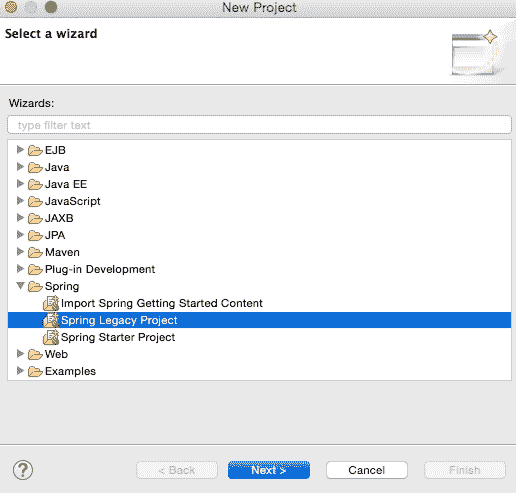

1.  选择**Spring MVC Project**，如下图所示，然后点击**Next**：

1.  选择一个顶级包名称。本示例使用`org.rvslab.chapter2.legacyrest`作为顶级包。

1.  然后，点击**Finish**。

1.  这将在 STS 工作区中创建一个名为`legacyrest`的项目。

在继续之前，需要编辑`pom.xml`。

1.  将 Spring 版本更改为`4.2.6.RELEASE`，如下所示：

```java
<org.springframework-version>4.2.6.RELEASE</org.springframework-version>
```

1.  在`pom.xml`文件中添加**Jackson**依赖项，用于 JSON 到 POJO 和 POJO 到 JSON 的转换。请注意，使用`2.*.*`版本以确保与 Spring 4 的兼容性。

```java
<dependency>
    <groupId>com.fasterxml.jackson.core</groupId>
    <artifactId>jackson-databind</artifactId>
    <version>2.6.4</version>
</dependency>
```

1.  需要添加一些 Java 代码。在**Java Resources**下的**legacyrest**中，展开包并打开默认的**HomeController.java**文件：

1.  默认实现更加面向 MVC 项目。重写`HomeController.java`以响应 REST 调用返回 JSON 值将会奏效。生成的`HomeController.java`文件将类似于以下内容：

```java
@RestController
public class HomeController {
  @RequestMapping("/")
  public Greet sayHello(){
    return new Greet("Hello World!");
  }
}
class Greet { 
  private String message;
  public Greet(String message) {
    this.message = message;
  }
  //add getter and setter
}
```

检查代码，现在有两个类：

+   `Greet`：这是一个简单的 Java 类，具有用于表示数据对象的 getter 和 setter。`Greet`类中只有一个属性，即`message`。

+   `HomeController.java`：这只是一个 Spring 控制器 REST 端点，用于处理 HTTP 请求。

请注意，在`HomeController`中使用的注释是`@RestController`，它会自动注入`@Controller`和`@ResponseBody`，并具有与以下代码相同的效果：

```java
@Controller
@ResponseBody
public class HomeController { }
```

1.  项目现在可以通过右键单击**legacyrest**，导航到**Run As** | **Run On Server**，然后选择默认服务器（**Pivotal tc Server Developer Edition v3.1**）来运行。

这应该会自动启动服务器并在 TC 服务器上部署 Web 应用程序。

如果服务器正常启动，控制台将显示以下消息：

```java
INFO : org.springframework.web.servlet.DispatcherServlet - FrameworkServlet 'appServlet': initialization completed in 906 ms
May 08, 2016 8:22:48 PM org.apache.catalina.startup.Catalina start
INFO: Server startup in 2289 ms

```

1.  如果一切正常，STS 将打开一个浏览器窗口到`http://localhost:8080/legacyrest/`，并在浏览器中显示 JSON 对象。右键单击并导航到**legacyrest** | **Properties** | **Web Project Settings**，并查看**Context Root**以识别 Web 应用程序的上下文根：

另一个构建选项是使用 Maven。右键单击项目，导航到**Run As** | **Maven install**。这将在目标文件夹下生成`chapter2-1.0.0-BUILD-SNAPSHOT.war`。这个 war 文件可以部署在任何 Servlet 容器中，如 Tomcat、JBoss 等。

# 从传统的 Web 应用程序转向微服务

仔细检查前面的 RESTful 服务将会揭示这是否真的构成了微服务。乍一看，前面的 RESTful 服务是一个完全合格的可互操作的 REST/JSON 服务。然而，它在本质上并不是完全自治的。这主要是因为该服务依赖于底层的应用服务器或 Web 容器。在前面的例子中，一个 war 文件被明确创建并部署在 Tomcat 服务器上。

这是一种传统的开发 RESTful 服务的方法，作为 Web 应用程序。然而，从微服务的角度来看，人们需要一种机制来开发可执行的服务，即带有嵌入式 HTTP 监听器的自包含 JAR 文件。

Spring Boot 是一个工具，可以方便地开发这种类型的服务。Dropwizard 和 WildFly Swarm 是替代的无服务器 RESTful 堆栈。

# 使用 Spring Boot 构建 RESTful 微服务

Spring Boot 是 Spring 团队的一个实用框架，可以快速轻松地启动基于 Spring 的应用程序和微服务。该框架在决策制定方面采用了一种有见地的方法，从而减少了编写大量样板代码和配置所需的工作量。使用 80-20 原则，开发人员应该能够使用许多默认值快速启动各种 Spring 应用程序。Spring Boot 进一步为开发人员提供了定制应用程序的机会，通过覆盖自动配置的值。

Spring Boot 不仅提高了开发速度，还提供了一套生产就绪的运维功能，如健康检查和指标收集。由于 Spring Boot 掩盖了许多配置参数并抽象了许多底层实现，它在一定程度上减少了错误的机会。Spring Boot 根据类路径中可用的库识别应用程序的性质，并运行打包在这些库中的自动配置类。

许多开发人员错误地将 Spring Boot 视为代码生成器，但实际上并非如此。Spring Boot 只自动配置构建文件，例如 Maven 的 POM 文件。它还根据某些默认值设置属性，例如数据源属性。看一下以下代码：

```java
<dependency>
    <groupId>org.springframework.boot</groupId>
    <artifactId>spring-boot-starter-data-jpa</artifactId>
</dependency>
<dependency>
    <groupId>org.hsqldb</groupId>
    <artifactId>hsqldb</artifactId>
    <scope>runtime</scope>
</dependency>
```

例如，在前面的案例中，Spring Boot 知道项目设置为使用 Spring Data JPA 和 HSQL 数据库。它会自动配置驱动程序类和其他连接参数。

Spring Boot 的一个伟大成果之一是几乎消除了传统的 XML 配置的需求。Spring Boot 还通过将所有所需的运行时依赖项打包到一个大的可执行 JAR 文件中来实现微服务的开发。

# 开始使用 Spring Boot

Spring Boot 基于应用程序开发的不同方式有很多：

+   使用 Spring Boot CLI 作为命令行工具

+   使用 STS 等 IDE 提供 Spring Boot，这些都是默认支持的

+   使用 Spring Initializr 项目在[`start.spring.io`](http://start.spring.io)

本章将探讨这三种选项，开发各种示例服务。

# 使用 CLI 开发 Spring Boot 微服务

开发和演示 Spring Boot 功能的最简单方法是使用 Spring Boot CLI，一个命令行工具。执行以下步骤：

1.  通过从[`repo.spring.io/release/org/springframework/boot/spring-boot-cli/1.3.5.RELEASE/spring-boot-cli-1.3.5.RELEASE-bin.zip`](http://repo.spring.io/release/org/springframework/boot/spring-boot-cli/1.3.5.RELEASE/spring-boot-cli-1.3.5.RELEASE-bin.zip)下载`spring-boot-cli-1.3.5.RELEASE-bin.zip`文件来安装 Spring Boot 命令行工具。

1.  将文件解压缩到您选择的目录中。打开终端窗口，并将终端提示更改为`bin`文件夹。

确保将`bin`文件夹添加到系统路径中，以便可以从任何位置运行 Spring Boot。

1.  使用以下命令验证安装。如果成功，Spring CLI 版本将打印在控制台上：

```java
$spring –-version
Spring CLI v1.3.5.RELEASE

```

1.  作为下一步，将在 Groovy 中开发一个快速的 REST 服务，Spring Boot 默认支持。为此，使用任何编辑器复制并粘贴以下代码，并将其保存为`myfirstapp.groovy`在任何文件夹中：

```java
@RestController
class HelloworldController {
    @RequestMapping("/")
    String sayHello() {
        "Hello World!"
    }
}
```

1.  要运行这个 Groovy 应用程序，转到保存`myfirstapp.groovy`的文件夹，并执行以下命令。服务器启动日志的最后几行将类似于以下内容：

```java
$spring run myfirstapp.groovy 

2016-05-09 18:13:55.351  INFO 35861 --- [nio-8080-exec-1] o.s.web.servlet.DispatcherServlet        : FrameworkServlet 'dispatcherServlet': initialization started
2016-05-09 18:13:55.375  INFO 35861 --- [nio-8080-exec-1] o.s.web.servlet.DispatcherServlet        : FrameworkServlet 'dispatcherServlet': initialization completed in 24 ms

```

1.  打开浏览器窗口，转到`http://localhost:8080`；浏览器将显示以下消息：

**你好，世界！**

没有创建 war 文件，也没有运行 Tomcat 服务器。Spring Boot 自动选择了 Tomcat 作为 Web 服务器，并将其嵌入到应用程序中。这是一个非常基本的、最小的微服务。在前面的代码中使用的`@RestController`注解将在下一个示例中进行详细讨论。

# 使用 STS 开发 Spring Boot Java 微服务

在本节中，将演示使用 STS 开发另一个基于 Java 的 REST/JSON Spring Boot 服务。

### 注意

本示例的完整源代码可作为本书的代码文件中的`chapter2.bootrest`项目获得。

1.  打开 STS，在**Project Explorer**窗口中右键单击，导航到**New** | **Project**，然后选择**Spring Starter Project**，如下图所示，并单击**Next**：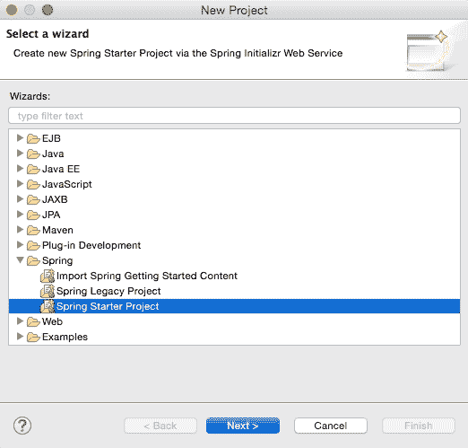

Spring Starter Project 是一个基本模板向导，提供了许多其他启动库供选择。

1.  将项目名称命名为`chapter2.bootrest`或者您选择的其他名称。选择打包方式为 JAR 非常重要。在传统的 web 应用中，会创建 war 文件然后部署到 servlet 容器，而 Spring Boot 会将所有依赖项打包到一个独立的、自包含的 JAR 文件中，并带有嵌入式 HTTP 监听器。

1.  在**Java 版本**下选择 1.8。建议 Spring 4 应用程序使用 Java 1.8。更改其他 Maven 属性，如**Group**、**Artifact**和**Package**，如下图所示：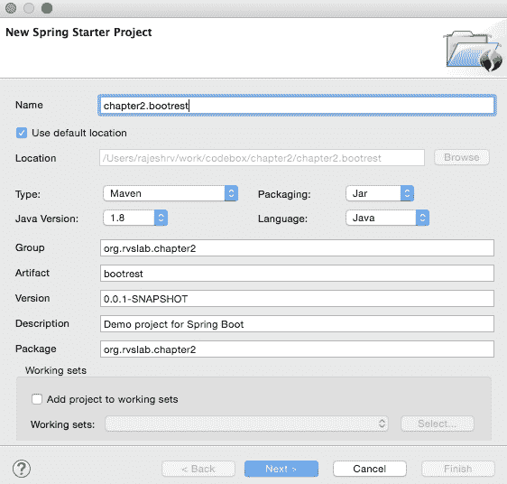

1.  完成后，点击**下一步**。

1.  向导将显示库选项。在这种情况下，由于正在开发 REST 服务，选择**Web**下的**Web**。这是一个有趣的步骤，告诉 Spring Boot 正在开发一个 Spring MVC web 应用程序，以便 Spring Boot 可以包含必要的库，包括 Tomcat 作为 HTTP 监听器和其他所需的配置：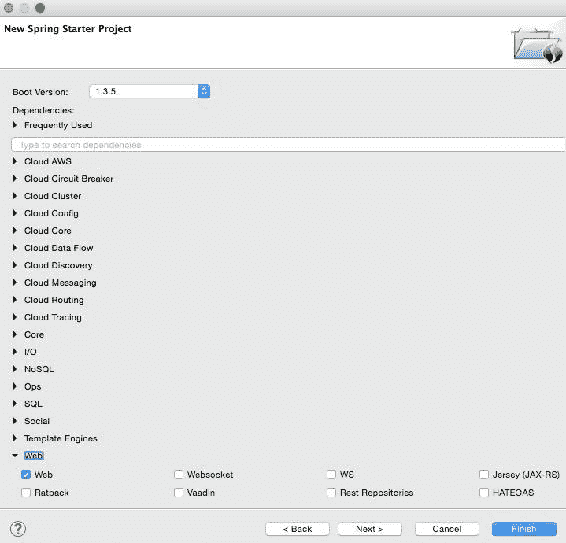

1.  点击**完成**。

这将在 STS 的**项目资源管理器**中生成一个名为`chapter2.bootrest`的项目：

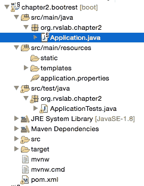

1.  花一点时间检查生成的应用程序。感兴趣的文件包括：

+   `pom.xml`

+   `Application.java`

+   `Application.properties`

+   `ApplicationTests.java`

## 检查 POM 文件

父元素是`pom.xml`文件中的一个有趣的方面。看一下以下内容：

```java
<parent>
  <groupId>org.springframework.boot</groupId>
    <artifactId>spring-boot-starter-parent</artifactId>
    <version>1.3.4.RELEASE</version>
</parent>
```

`spring-boot-starter-parent`模式是 Maven 依赖管理使用的**材料清单**（**BOM**）模式。BOM 是一种特殊的 POM 文件，用于管理项目所需的不同库版本。使用`spring-boot-starter-parent` POM 文件的优势在于开发人员无需担心找到不同库的兼容版本，比如 Spring、Jersey、JUnit、Logback、Hibernate、Jackson 等等。例如，在我们的第一个传统示例中，需要添加一个特定版本的 Jackson 库来与 Spring 4 一起使用。在这个示例中，这些都由`spring-boot-starter-parent`模式处理。

starter POM 文件具有一系列 Boot 依赖项、合理的资源过滤和 Maven 构建所需的合理插件配置。

### 提示

参考[`github.com/spring-projects/spring-boot/blob/1.3.x/spring-boot-dependencies/pom.xml`](https://github.com/spring-projects/spring-boot/blob/1.3.x/spring-boot-dependencies/pom.xml)查看 starter parent（版本 1.3.x）中提供的不同依赖项。如果需要，所有这些依赖项都可以被覆盖。

starter POM 文件本身不会向项目添加 JAR 依赖项，而是只会添加库版本。随后，当依赖项添加到 POM 文件中时，它们会引用该 POM 文件中的库版本。以下是一些属性的快照：

```java
<spring-boot.version>1.3.5.BUILD-SNAPSHOT</spring-boot.version>
<hibernate.version>4.3.11.Final</hibernate.version>
<jackson.version>2.6.6</jackson.version>
<jersey.version>2.22.2</jersey.version>
<logback.version>1.1.7</logback.version>
<spring.version>4.2.6.RELEASE</spring.version>
<spring-data-releasetrain.version>Gosling-SR4</spring-data-releasetrain.version>
<tomcat.version>8.0.33</tomcat.version>
```

审查依赖部分，可以看到这是一个干净整洁的 POM 文件，只有两个依赖，如下所示：

```java
<dependencies>
   <dependency>
  <groupId>org.springframework.boot</groupId>
  <artifactId>spring-boot-starter-web</artifactId>
   </dependency>

   <dependency>
  <groupId>org.springframework.boot</groupId>
  <artifactId>spring-boot-starter-test</artifactId>
  <scope>test</scope>
   </dependency>
</dependencies>
```

选择 web 后，`spring-boot-starter-web`会添加 Spring MVC 项目所需的所有依赖项。它还包括对 Tomcat 的依赖，作为嵌入式 HTTP 监听器。这提供了一种有效的方式来获取所有所需的依赖项作为一个单独的捆绑包。可以用其他库替换单个依赖项，例如用 Jetty 替换 Tomcat。

与 web 类似，Spring Boot 提供了许多`spring-boot-starter-*`库，比如`amqp`，`aop`，`batch`，`data-jpa`，`thymeleaf`等等。

`pom.xml`文件中最后需要审查的是 Java 8 属性。默认情况下，父 POM 文件会添加 Java 6。建议将 Java 版本覆盖为 8 用于 Spring：

```java
<java.version>1.8</java.version>
```

## 检查 Application.java

Spring Boot 默认在`src/main/java`下生成了一个`org.rvslab.chapter2.Application.java`类来引导，如下所示：

```java
@SpringBootApplication
public class Application {
    public static void main(String[] args) {
        SpringApplication.run(Application.class, args);
    }
}
```

`Application`中只有一个`main`方法，按照 Java 约定，在启动时将被调用。`main`方法通过在`SpringApplication`上调用`run`方法来引导 Spring Boot 应用程序。将`Application.class`作为参数传递，告诉 Spring Boot 这是主要组件。

更重要的是，这是由`@SpringBootApplication`注解完成的。`@SpringBootApplication`注解是一个顶级注解，封装了另外三个注解，如下面的代码片段所示：

```java
@Configuration
@EnableAutoConfiguration
@ComponentScan
public class Application {
```

`@Configuration`注解提示包含的类声明一个或多个`@Bean`定义。`@Configuration`注解是元注解`@Component`的提示；因此，它是组件扫描的候选对象。

`@EnableAutoConfiguration`注解告诉 Spring Boot 根据类路径中可用的依赖项自动配置 Spring 应用程序。

## 检查 application.properties

默认的`application.properties`文件放置在`src/main/resources`下。这是一个重要的文件，用于配置 Spring Boot 应用程序的任何必需属性。目前，这个文件是空的，将在本章的后面一些测试用例中重新访问。

## 检查 ApplicationTests.java

要检查的最后一个文件是`src/test/java`下的`ApplicationTests.java`。这是一个占位符，用于针对 Spring Boot 应用程序编写测试用例。

要实现第一个 RESTful 服务，添加一个 REST 端点，如下所示：

1.  可以编辑`src/main/java`下的`Application.java`，并添加一个 RESTful 服务实现。RESTful 服务与之前的项目中所做的完全相同。在`Application.java`文件的末尾添加以下代码：

```java
@RestController
class GreetingController{
  @RequestMapping("/")
  Greet greet(){
    return new Greet("Hello World!");
  }
}
class Greet {
  private String message;
public Greet() {}

  public Greet(String message) {
    this.message = message;
  }
//add getter and setter
}
```

1.  要运行，导航到**Run As** | **Spring Boot App**。Tomcat 将在`8080`端口上启动：

我们可以从日志中注意到：

+   Spring Boot 获得了自己的进程 ID（在本例中为`41130`）

+   Spring Boot 会自动在本地主机的 Tomcat 服务器上启动，端口为`8080`。

1.  接下来，打开浏览器，指向`http://localhost:8080`。这将显示 JSON 响应，如下面的截图所示：

传统服务和这个服务之间的一个关键区别是，Spring Boot 服务是自包含的。为了更清楚地说明这一点，可以在 STS 之外运行 Spring Boot 应用程序。打开一个终端窗口，转到项目文件夹，并运行 Maven，如下所示：

```java
$ maven install

```

这将在项目的目标文件夹下生成一个 fat JAR 文件。从命令行运行应用程序会显示：

```java
$java -jar target/bootrest-0.0.1-SNAPSHOT.jar

```

正如大家所看到的，`bootrest-0.0.1-SNAPSHOT.jar`是自包含的，可以作为独立的应用程序运行。在这一点上，JAR 文件只有 13MB。尽管应用程序不过是一个简单的“Hello World”，但刚刚开发的 Spring Boot 服务实际上遵循了微服务的原则。

## 测试 Spring Boot 微服务

有多种方法可以测试 REST/JSON Spring Boot 微服务。最简单的方法是使用 Web 浏览器或指向 URL 的 curl 命令，如下所示：

```java
curl http://localhost:8080

```

有许多工具可用于测试 RESTful 服务，例如 Postman、Advanced REST client、SOAP UI、Paw 等。

在这个例子中，为了测试服务，将使用 Spring Boot 生成的默认测试类。

在`ApplicatonTests.java`中添加一个新的测试用例会导致：

```java
@RunWith(SpringJUnit4ClassRunner.class)
@SpringApplicationConfiguration(classes = Application.class)
@WebIntegrationTest
public class ApplicationTests {
  @Test
  public void testVanillaService() {
    RestTemplate restTemplate = new RestTemplate();
    Greet greet = restTemplate.getForObject("http://localhost:8080", Greet.class);
    Assert.assertEquals("Hello World!", greet.getMessage());
  }
}
```

请注意，在类级别添加了`@WebIntegrationTest`，并删除了`@WebAppConfiguration`。`@WebIntegrationTest`注解是一个方便的注解，可以确保测试针对一个完全运行的服务器。或者，`@WebAppConfiguration`和`@IntegrationTest`的组合将产生相同的结果。

还要注意，`RestTemplate`用于调用 RESTful 服务。`RestTemplate`是一个实用程序类，它抽象了 HTTP 客户端的底层细节。

要测试这一点，可以打开一个终端窗口，转到项目文件夹，并运行`mvn install`。

# 使用 Spring Initializr 开发 Spring Boot 微服务–HATEOAS 示例

在下一个示例中，将使用 Spring Initializr 创建一个 Spring Boot 项目。Spring Initializr 是 STS 项目向导的一个可插拔替代品，并提供了一个 Web UI 来配置和生成 Spring Boot 项目。Spring Initializr 的一个优点是它可以通过网站生成一个项目，然后可以导入到任何 IDE 中。

在本示例中，将研究基于 REST 的服务的**HATEOAS**（**应用程序状态的超文本作为引擎**）概念和**HAL**（**超文本应用语言**）浏览器。

HATEOAS 是一种 REST 服务模式，其中导航链接作为有效负载元数据的一部分提供。客户端应用程序确定状态并遵循作为状态的一部分提供的过渡 URL。这种方法在响应式移动和 Web 应用程序中特别有用，其中客户端根据用户导航模式下载附加数据。

HAL 浏览器是一个方便的 API 浏览器，用于浏览`hal+json`数据。HAL 是一种基于 JSON 的格式，它建立了表示资源之间超链接的约定。HAL 有助于使 API 更具可探索性和可发现性。

### 注意

此示例的完整源代码可在本书的代码文件中的`chapter2.boothateoas`项目中找到。

以下是使用 Spring Initilizr 开发 HATEOAS 示例的具体步骤：

1.  要使用 Spring Initilizr，转到[`start.spring.io`](https://start.spring.io)：

1.  填写详细信息，例如是否为 Maven 项目，Spring Boot 版本，组和 artifact ID，如前所示，并点击**切换到完整版本**链接下的**生成项目**按钮。选择**Web**，**HATEOAS**和**Rest Repositories HAL Browser**。确保 Java 版本为 8，并且包类型选择为**JAR**：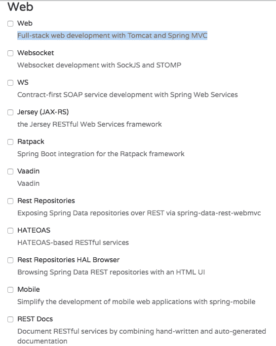

1.  选择后，点击**生成项目**按钮。这将生成一个 Maven 项目，并将项目下载为 ZIP 文件到浏览器的下载目录中。

1.  解压文件并将其保存到您选择的目录中。

1.  打开 STS，转到**文件**菜单，点击**导入**：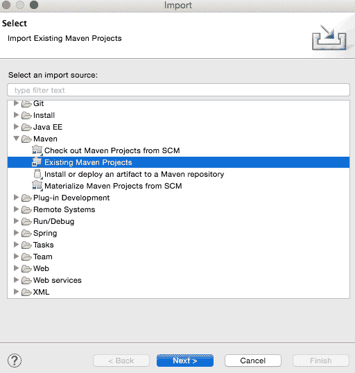

1.  转到**Maven** | **现有 Maven 项目**，然后点击**下一步**。

1.  点击**根目录**旁边的**浏览**，选择解压的文件夹。点击**完成**。这将把生成的 Maven 项目加载到 STS 的**项目资源管理器**中。

1.  编辑`Application.java`文件，添加一个新的 REST 端点，如下所示：

```java
@RequestMapping("/greeting")
@ResponseBody
public HttpEntity<Greet> greeting(@RequestParam(value = "name", required = false, defaultValue = "HATEOAS") String name) {
       Greet greet = new Greet("Hello " + name);
       greet.add(linkTo(methodOn(GreetingController.class).greeting(name)).withSelfRel());

       return new ResponseEntity<Greet>(greet, HttpStatus.OK);
}
```

1.  请注意，这与上一个示例中的`GreetingController`类相同。但是，这次添加了一个名为`greeting`的方法。在这个新方法中，定义了一个额外的可选请求参数，并将其默认为`HATEOAS`。以下代码将链接添加到生成的 JSON 代码中。在这种情况下，它将链接添加到相同的 API 中：

```java
greet.add(linkTo(methodOn(GreetingController.class).greeting(name)).withSelfRel());
```

为了做到这一点，我们需要将`Greet`类从`ResourceSupport`扩展，如下所示。其余的代码保持不变：

```java
class Greet extends ResourceSupport{
```

1.  `add`方法是`ResourceSupport`中的一个方法。`linkTo`和`methodOn`方法是`ControllerLinkBuilder`的静态方法，用于在控制器类上创建链接的实用程序类。`methodOn`方法将执行一个虚拟方法调用，而`linkTo`将创建一个指向控制器类的链接。在这种情况下，我们将使用`withSelfRel`将其指向自身。

1.  这将基本上生成一个默认的链接`/greeting?name=HATEOAS`。客户端可以读取链接并发起另一个调用。

1.  将其作为 Spring Boot 应用程序运行。一旦服务器启动完成，将浏览器指向`http://localhost:8080`。

1.  这将打开 HAL 浏览器窗口。在**Explorer**字段中，输入`/greeting?name=World!`并单击**Go**按钮。如果一切正常，HAL 浏览器将显示响应详细信息，如下面的屏幕截图所示：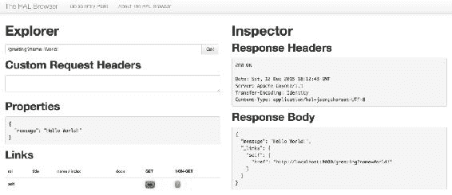

如屏幕截图所示，**响应主体**部分显示了一个带有`href`指向同一服务的链接。这是因为我们将引用指向自身。还要查看**链接**部分。**self**旁边的小绿色框是可导航链接。

在这个简单的例子中并没有太多意义，但在有许多相关实体的大型应用程序中可能会很方便。使用提供的链接，客户端可以轻松地在这些实体之间来回导航。

# 接下来是什么？

到目前为止，已经审查了许多基本的 Spring Boot 示例。本章的其余部分将从微服务开发的角度考虑一些重要的 Spring Boot 功能。在接下来的几节中，我们将看看如何处理动态可配置属性，更改默认的嵌入式 Web 服务器，为微服务添加安全性，并在处理微服务时实现跨源行为。

### 注意

此示例的完整源代码可作为本书的代码文件中的`chapter2.boot-advanced`项目获得。

# Spring Boot 配置

在本节中，重点将放在 Spring Boot 的配置方面。已经开发的`chapter2.bootrest`项目将在本节中进行修改，以展示配置功能。复制并粘贴`chapter2.bootrest`并将项目重命名为`chapter2.boot-advanced`。

## 了解 Spring Boot 自动配置

Spring Boot 使用约定优于配置，通过扫描类路径中可用的依赖库。对于 POM 文件中的每个`spring-boot-starter-*`依赖项，Spring Boot 执行默认的`AutoConfiguration`类。`AutoConfiguration`类使用`*AutoConfiguration`词法模式，其中`*`表示库。例如，JPA 存储库的自动配置是通过`JpaRepositoriesAutoConfiguration`完成的。

使用`--debug`运行应用程序以查看自动配置报告。以下命令显示了`chapter2.boot-advanced`项目的自动配置报告：

```java
$java -jar target/bootadvanced-0.0.1-SNAPSHOT.jar --debug

```

以下是一些自动配置类的示例：

+   `ServerPropertiesAutoConfiguration`

+   `RepositoryRestMvcAutoConfiguration`

+   `JpaRepositoriesAutoConfiguration`

+   `JmsAutoConfiguration`

如果应用程序有特殊要求，并且您想完全控制配置，可以排除某些库的自动配置。以下是一个排除`DataSourceAutoConfiguration`的示例：

```java
@EnableAutoConfiguration(exclude={DataSourceAutoConfiguration.class})
```

## 覆盖默认配置值

还可以使用`application.properties`文件覆盖默认配置值。STS 提供了一个易于自动完成的上下文帮助`application.properties`，如下面的屏幕截图所示：

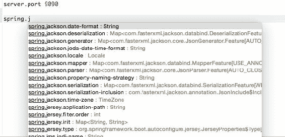

在前面的屏幕截图中，`server.port`被编辑为设置为`9090`。再次运行此应用程序将在端口`9090`上启动服务器。

## 更改配置文件的位置

为了与十二要素应用程序保持一致，配置参数需要从代码中外部化。Spring Boot 将所有配置外部化到`application.properties`中。然而，它仍然是应用程序构建的一部分。此外，可以通过设置以下属性从包外部读取属性：

```java
spring.config.name= # config file name  
spring.config.location= # location of config file
```

在这里，`spring.config.location`可以是本地文件位置。

以下命令使用外部提供的配置文件启动 Spring Boot 应用程序：

```java
$java -jar target/bootadvanced-0.0.1-SNAPSHOT.jar --spring.config.name=bootrest.properties

```

## 读取自定义属性

在启动时，`SpringApplication`加载所有属性并将它们添加到 Spring `Environment`类中。在`application.properties`文件中添加自定义属性。在这种情况下，自定义属性的名称为`bootrest.customproperty`。将 Spring `Environment`类自动装配到`GreetingController`类中。编辑`GreetingController`类以从`Environment`中读取自定义属性，并添加日志语句以将自定义属性打印到控制台。

执行以下步骤来完成此操作：

1.  在`application.properties`文件中添加以下属性：

```java
bootrest.customproperty=hello
```

1.  然后，编辑`GreetingController`类如下：

```java
@Autowired
Environment env;

Greet greet(){
    logger.info("bootrest.customproperty "+ env.getProperty("bootrest.customproperty"));
    return new Greet("Hello World!");
}
```

1.  重新运行应用程序。日志语句将在控制台中打印自定义变量，如下所示：

```java
org.rvslab.chapter2.GreetingController   : bootrest.customproperty hello
```

## 使用.yaml 文件进行配置

作为`application.properties`的替代，可以使用`.yaml`文件。与平面属性文件相比，YAML 提供了类似 JSON 的结构化配置。

要查看此操作，请简单地将`application.properties`替换为`application.yaml`并添加以下属性：

```java
server
  port: 9080
```

重新运行应用程序以查看端口在控制台中打印。

## 使用多个配置文件。

此外，可以有不同的配置文件，如开发、测试、暂存、生产等。这些是逻辑名称。使用这些，可以为不同的环境配置相同属性的不同值。当在不同环境中运行 Spring Boot 应用程序时，这非常方便。在这种情况下，从一个环境切换到另一个环境时不需要重新构建。

更新`.yaml`文件如下。Spring Boot 根据点分隔符对配置文件进行分组：

```java
spring:
    profiles: development
server:
      port: 9090
---

spring:
    profiles: production
server:
      port: 8080
```

按照以下方式运行 Spring Boot 应用程序以查看配置文件的使用：

```java
mvn -Dspring.profiles.active=production install
mvn -Dspring.profiles.active=development install

```

可以使用`@ActiveProfiles`注解以编程方式指定活动配置文件，这在运行测试用例时特别有用，如下所示：

```java
@ActiveProfiles("test")
```

## 读取属性的其他选项

可以以多种方式加载属性，例如以下方式：

+   命令行参数`(-Dhost.port =9090)`

+   操作系统环境变量

+   JNDI (`java:comp/env`)

# 更改默认的嵌入式 Web 服务器

嵌入式 HTTP 监听器可以轻松自定义如下。默认情况下，Spring Boot 支持 Tomcat、Jetty 和 Undertow。在以下示例中，Tomcat 被替换为 Undertow：

```java
<dependency>
    <groupId>org.springframework.boot</groupId>
    <artifactId>spring-boot-starter-web</artifactId>
    <exclusions>
        <exclusion>
            <groupId>org.springframework.boot</groupId>
            <artifactId>spring-boot-starter-tomcat</artifactId>
        </exclusion>
    </exclusions>
</dependency>
<dependency>
    <groupId>org.springframework.boot</groupId>
    <artifactId>spring-boot-starter-undertow</artifactId>
</dependency>
```

# 实现 Spring Boot 安全

保护微服务非常重要。在本节中，将审查一些保护 Spring Boot 微服务的基本措施，使用`chapter2.bootrest`来演示安全功能。

## 使用基本安全保护微服务

向 Spring Boot 添加基本身份验证非常简单。将以下依赖项添加到`pom.xml`中。这将包括必要的 Spring 安全库文件：

```java
<dependency>
  <groupId>org.springframework.boot</groupId> 
  <artifactId>spring-boot-starter-security</artifactId>
</dependency>
```

打开`Application.java`并在`Application`类中添加`@EnableGlobalMethodSecurity`。此注解将启用方法级安全性：

```java
@EnableGlobalMethodSecurity
@SpringBootApplication
public class Application {
    public static void main(String[] args) {
        SpringApplication.run(Application.class, args);
    }
}
```

默认的基本身份验证假定用户为`user`。默认密码将在启动时打印在控制台上。或者，可以在`application.properties`中添加用户名和密码，如下所示：

```java
security.user.name=guest
security.user.password=guest123
```

在`ApplicationTests`中添加一个新的测试用例，测试安全服务的结果，如下所示：

```java
  @Test
  public void testSecureService() {  
    String plainCreds = "guest:guest123";
    HttpHeaders headers = new HttpHeaders();
    headers.add("Authorization", "Basic " + new String(Base64.encode(plainCreds.getBytes())));
    HttpEntity<String> request = new HttpEntity<String>(headers);
    RestTemplate restTemplate = new RestTemplate();

    ResponseEntity<Greet> response = restTemplate.exchange("http://localhost:8080", HttpMethod.GET, request, Greet.class);
    Assert.assertEquals("Hello World!", response.getBody().getMessage());
  }
```

如代码所示，创建一个新的`Authorization`请求头，使用 Base64 编码用户名密码字符串。

使用 Maven 重新运行应用程序。请注意，新的测试用例通过了，但旧的测试用例出现了异常。早期的测试用例现在在没有凭据的情况下运行，结果服务器拒绝了请求，并显示以下消息：

```java
org.springframework.web.client.HttpClientErrorException: 401 Unauthorized

```

## 使用 OAuth2 保护微服务

在本节中，我们将看一下 OAuth2 的基本 Spring Boot 配置。当客户端应用程序需要访问受保护的资源时，客户端向授权服务器发送请求。授权服务器验证请求并提供访问令牌。这个访问令牌对每个客户端到服务器的请求进行验证。来回发送的请求和响应取决于授权类型。

### 提示

在[`oauth.net`](http://oauth.net)阅读有关 OAuth 和授权类型的更多信息。

在这个示例中将使用资源所有者密码凭据授权方法：

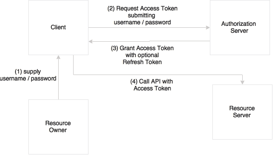

在这种情况下，如前图所示，资源所有者提供客户端用户名和密码。然后客户端通过提供凭据信息向授权服务器发送令牌请求。授权服务器授权客户端并返回访问令牌。在每个后续请求中，服务器验证客户端令牌。

要在我们的示例中实现 OAuth2，请执行以下步骤：

1.  首先，按照以下步骤更新`pom.xml`以添加 OAuth2 依赖：

```java
<dependency>
  <groupId>org.springframework.security.oauth</groupId>
  <artifactId>spring-security-oauth2</artifactId>
  <version>2.0.9.RELEASE</version>
</dependency>
```

1.  接下来，在`Application.java`文件中添加两个新的注释`@EnableAuthorizationServer`和`@EnableResourceServer`。`@EnableAuthorizationServer`注释创建一个授权服务器，其中包含一个内存存储库，用于存储客户端令牌并为客户端提供用户名、密码、客户端 ID 和密钥。`@EnableResourceServer`注释用于访问令牌。这将启用一个通过传入的 OAuth2 令牌进行身份验证的 Spring 安全过滤器。

在我们的示例中，授权服务器和资源服务器是相同的。然而，在实践中，这两者将分开运行。看一下以下代码：

```java
@EnableResourceServer
@EnableAuthorizationServer
@SpringBootApplication
public class Application {
```

1.  将以下属性添加到`application.properties`文件中：

```java
security.user.name=guest
security.user.password=guest123
security.oauth2.client.clientId: trustedclient
security.oauth2.client.clientSecret: trustedclient123
security.oauth2.client.authorized-grant-types: authorization_code,refresh_token,password
security.oauth2.client.scope: openid
```

1.  然后，添加另一个测试用例来测试 OAuth2，如下所示：

```java
  @Test
  public void testOAuthService() {
        ResourceOwnerPasswordResourceDetails resource = new ResourceOwnerPasswordResourceDetails();
        resource.setUsername("guest");
        resource.setPassword("guest123");
          resource.setAccessTokenUri("http://localhost:8080/oauth/token");
        resource.setClientId("trustedclient");
        resource.setClientSecret("trustedclient123");
        resource.setGrantType("password");

        DefaultOAuth2ClientContext clientContext = new DefaultOAuth2ClientContext();
        OAuth2RestTemplate restTemplate = new OAuth2RestTemplate(resource, clientContext);

        Greet greet = restTemplate.getForObject("http://localhost:8080", Greet.class);

        Assert.assertEquals("Hello World!", greet.getMessage());
  }
```

如前面的代码所示，通过传递封装在资源详细信息对象中的资源详细信息来创建一个特殊的 REST 模板`OAuth2RestTemplate`。这个 REST 模板在 OAuth2 过程中处理访问令牌。访问令牌 URI 是令牌访问的端点。

1.  使用`mvn install`重新运行应用程序。前两个测试用例将失败，而新的测试用例将成功。这是因为服务器只接受启用了 OAuth2 的请求。

这些是 Spring Boot 开箱即用提供的快速配置，但不足以达到生产级别。我们可能需要定制`ResourceServerConfigurer`和`AuthorizationServerConfigurer`使其达到生产就绪。尽管如此，方法仍然是一样的。

# 为微服务启用跨源访问

当来自一个来源的客户端端网页应用程序从另一个来源请求数据时，通常会受到限制。启用跨源访问通常被称为**CORS**（**跨源资源共享**）。


这个示例显示了如何启用跨源请求。对于微服务来说，由于每个服务都有自己的来源，很容易出现客户端端网页应用程序从多个来源消费数据的问题。例如，浏览器客户端访问来自 Customer 微服务的 Customer 和来自 Order 微服务的 Order History 的情况在微服务世界中非常常见。

Spring Boot 提供了一种简单的声明性方法来启用跨源请求。以下示例显示了如何启用微服务以启用跨源请求：

```java
@RestController
class GreetingController{
  @CrossOrigin
  @RequestMapping("/")
  Greet greet(){
    return new Greet("Hello World!");
  }
}
```

默认情况下，所有的来源和标头都被接受。我们可以通过给予特定来源访问的方式进一步定制跨源注释。`@CrossOrigin`注释使方法或类能够接受跨源请求：

```java
@CrossOrigin("http://mytrustedorigin.com")
```

可以使用`WebMvcConfigurer` bean 并定制`addCorsMappings(CorsRegistry registry)`方法来启用全局 CORS。

# 实现 Spring Boot 消息传递

在理想情况下，所有微服务之间的交互都应该使用发布-订阅语义进行异步处理。Spring Boot 提供了一种无忧的机制来配置消息传递解决方案：

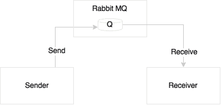

在这个例子中，我们将创建一个带有发送者和接收者的 Spring Boot 应用程序，它们都通过一个外部队列连接。执行以下步骤：

### 注意

这个例子的完整源代码可以在本书的代码文件中的`chapter2.bootmessaging`项目中找到。

1.  使用 STS 创建一个新项目来演示这个功能。在这个例子中，不要选择**Web**，而是在**I/O**下选择**AMQP**：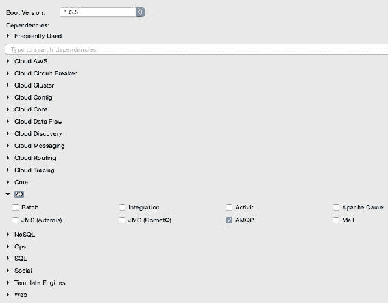

1.  这个例子也需要 Rabbit MQ。从[`www.rabbitmq.com/download.html`](https://www.rabbitmq.com/download.html)下载并安装最新版本的 Rabbit MQ。

本书中使用的是 Rabbit MQ 3.5.6。

1.  按照网站上记录的安装步骤进行操作。准备就绪后，通过以下命令启动 RabbitMQ 服务器：

```java
$./rabbitmq-server

```

1.  对`application.properties`文件进行配置更改，以反映 RabbitMQ 的配置。以下配置使用 RabbitMQ 的默认端口、用户名和密码：

```java
spring.rabbitmq.host=localhost
spring.rabbitmq.port=5672
spring.rabbitmq.username=guest
spring.rabbitmq.password=guest
```

1.  在`src/main/java`目录下的`Application.java`文件中添加一个消息发送组件和一个`org.springframework.amqp.core.Queue`类型的名为`TestQ`的队列。`RabbitMessagingTemplate`是发送消息的一种便捷方式，它将抽象出所有的消息语义。Spring Boot 提供了所有的样板配置来发送消息：

```java
@Component 
class Sender {
  @Autowired
  RabbitMessagingTemplate template;
  @Bean
  Queue queue() {
    return new Queue("TestQ", false);
  }
  public void send(String message){
    template.convertAndSend("TestQ", message);
  }
}
```

1.  要接收消息，只需要使用`@RabbitListener`注解。Spring Boot 会自动配置所有必需的样板配置：

```java
@Component
class Receiver {
    @RabbitListener(queues = "TestQ")
    public void processMessage(String content) {
       System.out.println(content);
    }
}
```

1.  这个练习的最后一部分是将发送者连接到我们的主应用程序，并实现`CommandLineRunner`的`run`方法来启动消息发送。当应用程序初始化时，它会调用`CommandLineRunner`的`run`方法，如下所示：

```java
@SpringBootApplication
public class Application implements CommandLineRunner{

  @Autowired
  Sender sender;

    public static void main(String[] args) {
        SpringApplication.run(Application.class, args);
    }

    @Override
    public void run(String... args) throws Exception {
      sender.send("Hello Messaging..!!!");
    }
}
```

1.  将应用程序作为 Spring Boot 应用程序运行并验证输出。以下消息将打印在控制台上：

```java
Hello Messaging..!!!

```

# 开发全面的微服务示例

到目前为止，我们考虑的例子不过是一个简单的“Hello world”。结合我们所学到的知识，本节演示了一个端到端的 Customer Profile 微服务实现。Customer Profile 微服务将展示不同微服务之间的交互。它还演示了具有业务逻辑和基本数据存储的微服务。

在这个例子中，将开发两个微服务，Customer Profile 和 Customer Notification 服务：


如图所示，Customer Profile 微服务公开了用于**创建、读取、更新和删除**（CRUD）客户以及用于注册客户的注册服务的方法。注册过程应用了某些业务逻辑，保存了客户资料，并向 Customer Notification 微服务发送了一条消息。Customer Notification 微服务接受了注册服务发送的消息，并使用 SMTP 服务器向客户发送了一封电子邮件。异步消息传递用于将 Customer Profile 与 Customer Notification 服务集成起来。

Customer 微服务类的领域模型图如下所示：


`CustomerController`在图中是 REST 端点，调用一个组件类`CustomerComponent`。组件类/bean 处理所有业务逻辑。`CustomerRepository`是一个 Spring data JPA repository，用于处理`Customer`实体的持久化。

### 注意

此示例的完整源代码可作为本书代码文件中的`chapter2.bootcustomer`和`chapter2.bootcustomernotification`项目获得。

1.  创建一个新的 Spring Boot 项目，并将其命名为`chapter2.bootcustomer`，与之前的方式相同。在启动模块选择屏幕中选择如下屏幕截图中的选项：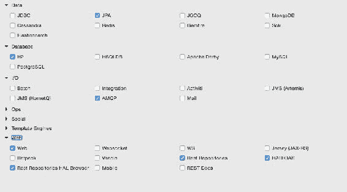

这将创建一个带有 JPA、REST 存储库和 H2 作为数据库的 Web 项目。H2 是一个微型的内存嵌入式数据库，可以轻松演示数据库功能。在现实世界中，建议使用适当的企业级数据库。此示例使用 JPA 定义持久性实体和 REST 存储库来公开基于 REST 的存储库服务。

项目结构将类似于以下屏幕截图：

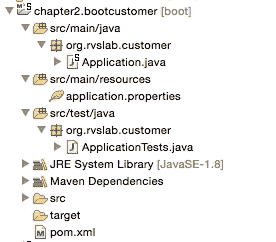

1.  通过添加名为`Customer`的实体类来开始构建应用程序。为简单起见，`Customer`实体类只添加了三个字段：自动生成的`id`字段，`name`和`email`。看一下以下代码：

```java
@Entity
class Customer {
  @Id
  @GeneratedValue(strategy = GenerationType.AUTO)
  private Long id;
  private String name;
  private String email;
```

1.  添加一个存储库类来处理客户的持久化处理。`CustomerRepository`扩展了标准的 JPA 存储库。这意味着所有 CRUD 方法和默认查找方法都由 Spring Data JPA 存储库自动实现，如下所示：

```java
@RepositoryRestResource
interface CustomerRespository extends JpaRepository <Customer,Long>{
  Optional<Customer> findByName(@Param("name") String name);
}
```

在这个示例中，我们向存储库类添加了一个新的方法`findByName`，它基本上根据客户名称搜索客户，并在有匹配名称时返回`Customer`对象。

1.  `@RepositoryRestResource`注解通过 RESTful 服务启用存储库访问。这也将默认启用 HATEOAS 和 HAL。由于 CRUD 方法不需要额外的业务逻辑，我们将其保留为没有控制器或组件类的状态。使用 HATEOAS 将帮助我们轻松地浏览客户存储库方法。

请注意，没有在任何地方添加配置来指向任何数据库。由于 H2 库在类路径中，所有配置都是由 Spring Boot 根据 H2 自动配置默认完成的。

1.  通过添加`CommandLineRunner`来初始化存储库并插入一些客户记录，更新`Application.java`文件，如下所示：

```java
@SpringBootApplication
public class Application {
    public static void main(String[] args) {
        SpringApplication.run(Application.class, args);
    }

    @Bean
  CommandLineRunner init(CustomerRespository repo) {
  return (evt) ->  {
    repo.save(new Customer("Adam","adam@boot.com"));
    repo.save(new Customer("John","john@boot.com"));
  repo.save(new Customer("Smith","smith@boot.com"));
    repo.save(new Customer("Edgar","edgar@boot.com"));
    repo.save(new Customer("Martin","martin@boot.com"));
    repo.save(new Customer("Tom","tom@boot.com"));
    repo.save(new Customer("Sean","sean@boot.com"));
  };
  }
}
```

1.  `CommandLineRunner`被定义为一个 bean，表示当它包含在`SpringApplication`中时应该运行。这将在启动时向数据库插入六个样本客户记录。

1.  此时，将应用程序作为 Spring Boot 应用程序运行。打开 HAL 浏览器，并将浏览器指向`http://localhost:8080`。

1.  在**资源管理器**部分，指向`http://localhost:8080/customers`，然后点击**Go**。这将在 HAL 浏览器的**响应主体**部分列出所有客户。

1.  在**资源管理器**部分，输入`http://localhost:8080/customers?size=2&page=1&sort=name`，然后点击**Go**。这将自动在存储库上执行分页和排序，并返回结果。

由于页面大小设置为`2`，并且请求了第一页，它将以排序顺序返回两条记录。

1.  查看**链接**部分。如下屏幕截图所示，它将方便地导航**first**，**next**，**prev**和**last**。这些是通过存储库浏览器自动生成的 HATEOAS 链接完成的：

1.  还可以通过选择适当的链接，如`http://localhost:8080/customers/2`，来探索客户的详细信息。

1.  作为下一步，添加一个控制器类`CustomerController`来处理服务端点。在这个类中只有一个端点`/register`，用于注册客户。如果成功，它将返回`Customer`对象作为响应，如下所示：

```java
@RestController
class CustomerController{

  @Autowired
  CustomerRegistrar customerRegistrar;

  @RequestMapping( path="/register", method = RequestMethod.POST)
  Customer register(@RequestBody Customer customer){
    return customerRegistrar.register(customer);
  }
}
```

1.  添加了一个`CustomerRegistrar`组件来处理业务逻辑。在这种情况下，组件中只添加了最少的业务逻辑。在这个组件类中，注册客户时，我们只会检查数据库中是否已经存在客户名称。如果不存在，我们将插入一个新记录，否则，我们将发送一个错误消息，如下所示：

```java
@Component 
class CustomerRegistrar {

  CustomerRespository customerRespository;

  @Autowired
  CustomerRegistrar(CustomerRespository customerRespository){
    this.customerRespository = customerRespository;
  }

  Customer register(Customer customer){
    Optional<Customer> existingCustomer = customerRespository.findByName(customer.getName());
    if (existingCustomer.isPresent()){
      throw new RuntimeException("is already exists");
    } else {
      customerRespository.save(customer); 
    }
    return customer;
  }
}
```

1.  重新启动 Boot 应用程序，并通过 URL `http://localhost:8080` 使用 HAL 浏览器进行测试。

1.  将**Explorer**字段指向`http://localhost:8080/customers`。在**Links**部分查看结果：

1.  点击**self**旁边的**NON-GET**选项。这将打开一个表单来创建一个新的客户：

1.  填写表格，并按照图中所示更改**操作**。点击**发出请求**按钮。这将调用注册服务并注册客户。尝试给出重复的名称以测试负面情况。

1.  让我们通过将客户通知服务集成到通知客户的示例的最后部分来完成示例。当注册成功时，通过异步调用客户通知微服务向客户发送电子邮件。

1.  首先更新`CustomerRegistrar`以调用第二个服务。这是通过消息传递完成的。在这种情况下，我们注入了一个`Sender`组件，通过将客户的电子邮件地址传递给发送者，向客户发送通知，如下所示：

```java
@Component 
@Lazy
class CustomerRegistrar {

  CustomerRespository customerRespository;
  Sender sender;

  @Autowired
  CustomerRegistrar(CustomerRespository customerRespository, Sender sender){
    this.customerRespository = customerRespository;
    this.sender = sender;
  }

  Customer register(Customer customer){
    Optional<Customer> existingCustomer = customerRespository.findByName(customer.getName());
    if (existingCustomer.isPresent()){
      throw new RuntimeException("is already exists");
    } else {
      customerRespository.save(customer); 
      sender.send(customer.getEmail());
    } 
    return customer;
  }
}
```

1.  发送者组件将基于 RabbitMQ 和 AMQP。在本例中，`RabbitMessagingTemplate`被用作上一个消息示例中所探讨的方式；请看以下内容：

```java
@Component 
@Lazy
class Sender {

  @Autowired
  RabbitMessagingTemplate template;

  @Bean
  Queue queue() {
    return new Queue("CustomerQ", false);
  }

  public void send(String message){
    template.convertAndSend("CustomerQ", message);
  }
}
```

`@Lazy`注解是一个有用的注解，它有助于增加启动时间。这些 bean 只有在需要时才会被初始化。

1.  我们还将更新`application.property`文件，以包括与 Rabbit MQ 相关的属性，如下所示：

```java
spring.rabbitmq.host=localhost
spring.rabbitmq.port=5672
spring.rabbitmq.username=guest
spring.rabbitmq.password=guest
```

1.  我们准备发送消息。为了消费消息并发送电子邮件，我们将创建一个通知服务。为此，让我们创建另一个 Spring Boot 服务，`chapter2.bootcustomernotification`。在创建 Spring Boot 服务时，请确保选择了**AMQP**和**Mail**启动器库。**AMQP**和**Mail**都在**I/O**下。

1.  `chapter2.bootcustomernotification`项目的包结构如下所示：

1.  添加一个`Receiver`类。`Receiver`类等待客户端的消息。这将接收客户资料服务发送的消息。在收到消息时，它会发送一封电子邮件，如下所示：

```java
@Component
class Receiver {  
  @Autowired
  Mailer mailer;

  @Bean
  Queue queue() {
    return new Queue("CustomerQ", false);
  }

  @RabbitListener(queues = "CustomerQ")
    public void processMessage(String email) {
       System.out.println(email);
       mailer.sendMail(email);
    }
}
```

1.  添加另一个组件来向客户发送电子邮件。我们将使用`JavaMailSender`通过以下代码发送电子邮件：

```java
@Component 
class Mailer {
  @Autowired
  private  JavaMailSender  javaMailService;
    public void sendMail(String email){
      SimpleMailMessage mailMessage=new SimpleMailMessage();
      mailMessage.setTo(email);
      mailMessage.setSubject("Registration");
      mailMessage.setText("Successfully Registered");
      javaMailService.send(mailMessage);
    }
}
```

在幕后，Spring Boot 会自动配置`JavaMailSender`所需的所有参数。

1.  要测试 SMTP，需要一个 SMTP 的测试设置来确保邮件发送出去。在本例中，将使用 FakeSMTP。您可以从[`nilhcem.github.io/FakeSMTP`](http://nilhcem.github.io/FakeSMTP)下载 FakeSMTP。

1.  下载`fakeSMTP-2.0.jar`后，通过执行以下命令运行 SMTP 服务器：

```java
$ java -jar fakeSMTP-2.0.jar

```

这将打开一个 GUI 来监视电子邮件消息。点击监听端口文本框旁边的**启动服务器**按钮。

1.  使用以下配置参数更新`application.properties`以连接到 RabbitMQ 以及邮件服务器：

```java
spring.rabbitmq.host=localhost
spring.rabbitmq.port=5672
spring.rabbitmq.username=guest
spring.rabbitmq.password=guest

spring.mail.host=localhost
spring.mail.port=2525
```

1.  我们准备测试我们的微服务端到端。启动两个 Spring Boot 应用程序。打开浏览器，并通过 HAL 浏览器重复客户端创建步骤。在这种情况下，提交请求后，我们将能够在 SMTP GUI 中看到电子邮件。

在内部，客户资料服务异步调用客户通知服务，后者又将电子邮件消息发送到 SMTP 服务器：

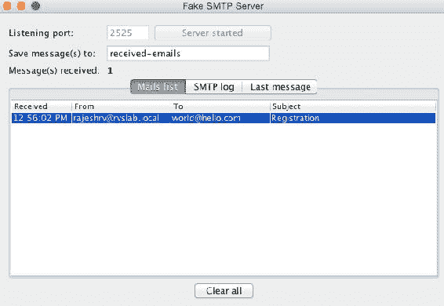

# Spring Boot actuator

前面的部分探讨了开发微服务所需的大部分 Spring Boot 功能。在本节中，将探讨 Spring Boot 的一些适用于生产的操作方面。

Spring Boot actuator 提供了一个出色的开箱即用的机制，用于监控和管理生产中的 Spring Boot 应用程序：

### 注意

此示例的完整源代码可在本书的代码文件中的`chapter2.bootactuator`项目中找到。

1.  创建另一个**Spring Starter Project**，命名为`chapter2.bootactuator`。这次，在**Ops**下选择**Web**和**Actuators**。与`chapter2.bootrest`项目类似，添加一个带有`greet`方法的`GreeterController`端点。

1.  启动应用程序作为 Spring Boot 应用程序。

1.  将浏览器指向`localhost:8080/actuator`。这将打开 HAL 浏览器。然后，查看**Links**部分。

在**Links**部分下有许多链接可用。这些链接是由 Spring Boot actuator 自动公开的：


一些重要的链接列举如下：

+   `dump`：执行线程转储并显示结果

+   `mappings`：列出所有 HTTP 请求映射

+   `info`：显示有关应用程序的信息

+   `health`：显示应用程序的健康状况

+   `autoconfig`：显示自动配置报告

+   `metrics`：显示从应用程序收集的不同指标

## 使用 JConsole 进行监控

或者，我们可以使用 JMX 控制台查看 Spring Boot 信息。从 JConsole 连接到远程 Spring Boot 实例。Boot 信息将显示如下：


## 使用 SSH 进行监控

Spring Boot 提供了使用 SSH 远程访问 Boot 应用程序的功能。以下命令从终端窗口连接到 Spring Boot 应用程序：

```java
$ ssh -p 2000 user@localhost

```

可以通过在`application.properties`文件中添加`shell.auth.simple.user.password`属性来自定义密码。更新后的`application.properties`文件将类似于以下内容：

```java
shell.auth.simple.user.password=admin
```

通过前面的命令连接时，可以访问类似的 actuator 信息。以下是通过 CLI 访问的指标信息示例：

+   `help`：列出所有可用选项

+   `dashboard`：这是一个显示大量系统级信息的有趣功能

# 配置应用程序信息

可以在`application.properties`中设置以下属性来自定义与应用程序相关的信息。添加后，重新启动服务器并访问 actuator 的`/info`端点以查看更新后的信息，如下所示：

```java
info.app.name=Boot actuator
info.app.description= My Greetings Service
info.app.version=1.0.0
```

# 添加自定义健康模块

向 Spring Boot 应用程序添加新的自定义模块并不复杂。为了演示这一特性，假设如果一个服务在一分钟内获得超过两个事务，那么服务器状态将被设置为服务外。

为了自定义这一点，我们必须实现`HealthIndicator`接口并重写`health`方法。以下是一个快速而简单的实现来完成这项工作：

```java
class TPSCounter {
  LongAdder count;
  int threshold = 2;
  Calendar expiry = null; 

  TPSCounter(){
    this.count = new LongAdder();
    this.expiry = Calendar.getInstance();
    this.expiry.add(Calendar.MINUTE, 1);
  }

  boolean isExpired(){
    return Calendar.getInstance().after(expiry);
  }

  boolean isWeak(){
    return (count.intValue() > threshold);
  }

  void increment(){
     count.increment();
  }
}
```

上述类是一个简单的 POJO 类，用于在窗口中维护事务计数。`isWeak`方法检查特定窗口中的事务是否达到了其阈值。`isExpired`方法检查当前窗口是否已过期。`increment`方法简单地增加计数器值。

下一步，实现我们的自定义健康指示器类`TPSHealth`。通过扩展`HealthIndicator`来完成：

```java
@Component
class TPSHealth implements HealthIndicator {
  TPSCounter counter;

@Override
    public Health health() {
        boolean health = counter.isWeak(); // perform some specific health check
        if (health) {
            return Health.outOfService().withDetail("Too many requests", "OutofService").build();
        }
        return Health.up().build();
    }

    void updateTx(){
    if(counter == null || counter.isExpired()){
      counter = new TPSCounter();

    }
    counter.increment();
    }
}
```

`health`方法检查计数器是否弱。弱计数器意味着服务处理的事务比其可以处理的要多。如果它是弱的，它将把实例标记为服务外。

最后，我们将把`TPSHealth`自动装配到`GreetingController`类中，然后在`greet`方法中调用`health.updateTx()`，如下所示：

```java
  Greet greet(){
    logger.info("Serving Request....!!!");
    health.updateTx(); 
    return new Greet("Hello World!");
  }
```

转到 HAL 浏览器中的`/health`端点，并查看服务器的状态。

现在，打开另一个浏览器，指向`http://localhost:8080`，并多次调用服务。返回`/health`端点并刷新以查看状态。它应该更改为服务外。

在此示例中，除了收集健康状态之外，没有采取其他行动，即使状态为服务外，新的服务调用仍将继续。但是，在现实世界中，程序应读取`/health`端点并阻止进一步的请求发送到此实例。

## 构建自定义指标

类似于健康状况，还可以自定义指标。以下示例显示了如何添加计数器服务和计量器服务，仅用于演示目的：

```java
  @Autowired   
  CounterService counterService;

  @Autowired
  GaugeService gaugeService;
```

在问候方法中添加以下方法：

```java
  this.counterService.increment("greet.txnCount");
  this.gaugeService.submit("greet.customgauge", 1.0);
```

重新启动服务器，转到`/metrics`以查看已添加的新计量器和计数器是否已反映在其中。

# 记录微服务

传统的 API 文档方法是编写服务规范文档或使用静态服务注册表。对于大量的微服务，很难保持 API 文档的同步。

微服务可以用许多方式记录。本节将探讨如何使用流行的 Swagger 框架记录微服务。以下示例将使用 Springfox 库生成 REST API 文档。Springfox 是一组 Java 和 Spring 友好的库。

创建一个新的**Spring Starter Project**，并在库选择窗口中选择**Web**。将项目命名为`chapter2.swagger`。

### 注意

此示例的完整源代码可在本书的代码文件中的`chapter2.swagger`项目中找到。

由于 Springfox 库不是 Spring 套件的一部分，请编辑`pom.xml`并添加 Springfox Swagger 库依赖项。将以下依赖项添加到项目中：

```java
<dependency>
    <groupId>io.springfox</groupId>
    <artifactId>springfox-swagger2</artifactId>
    <version>2.3.1</version>
</dependency>  
<dependency>
    <groupId>io.springfox</groupId>
    <artifactId>springfox-swagger-ui</artifactId>
    <version>2.3.1</version>
</dependency>
```

创建一个类似于之前创建的服务的 REST 服务，但还要添加`@EnableSwagger2`注释，如下所示：

```java
@SpringBootApplication
@EnableSwagger2
public class Application {
```

这就是基本的 Swagger 文档所需的全部内容。启动应用程序，并将浏览器指向`http://localhost:8080/swagger-ui.html`。这将打开 Swagger API 文档页面：


如图所示，Swagger 列出了**问候控制器**上可能的操作。单击**GET**操作。这将展开**GET**行，提供尝试操作的选项。

# 摘要

在本章中，您了解了 Spring Boot 及其构建生产就绪应用程序的关键功能。

我们探讨了上一代 Web 应用程序，以及 Spring Boot 如何使开发人员更容易开发完全合格的微服务。我们还讨论了服务之间的异步基于消息的交互。此外，我们探讨了如何通过实际示例实现微服务所需的一些关键功能，例如安全性、HATEOAS、跨源、配置等。我们还看了 Spring Boot 执行器如何帮助运营团队，以及如何根据需要自定义它。最后，还探讨了记录微服务 API。

在下一章中，我们将更深入地研究在实施微服务时可能出现的一些实际问题。我们还将讨论一个能力模型，该模型在处理大型微服务实施时对组织有所帮助。
