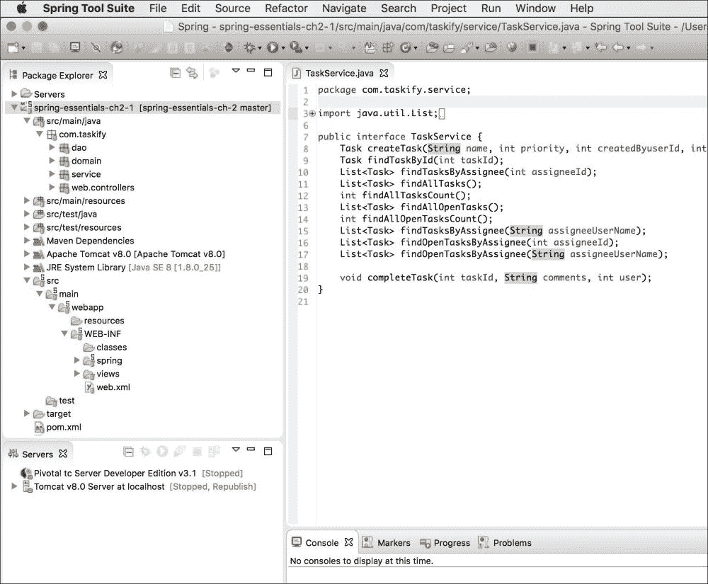
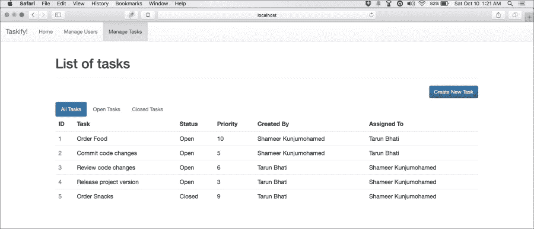
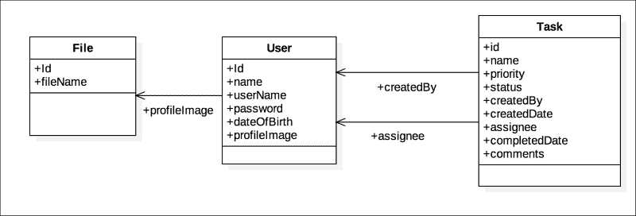
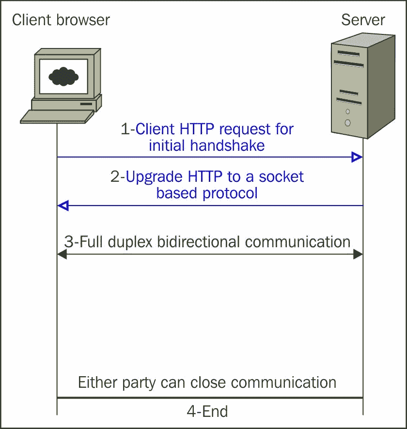
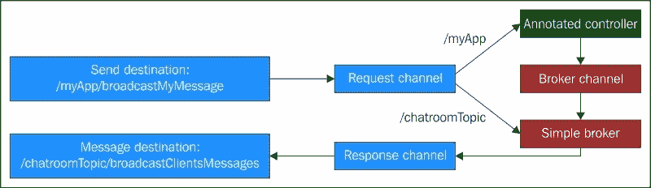
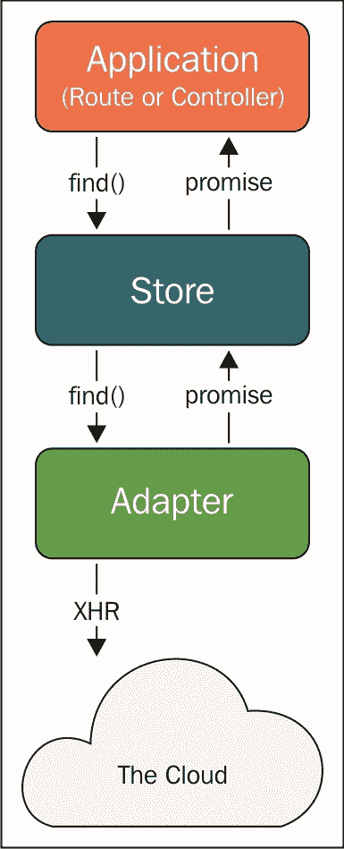

# 第一部分。模块 1

> **Spring 基础知识**
> 
> *使用 Spring 框架和面向方面的编程构建关键任务的企业应用程序*

# 第一章。开始使用 Spring Core

Spring 框架是企业 Java 中最受信任和广泛使用的应用程序开发框架。最初作为复杂 J2EE 的简单轻量级替代方案引入，Spring 现在已经发展成为一个真正现代的应用程序开发平台。Spring 及其子项目为端到端应用程序开发提供了出色的基础，具有甚至超过最新 Java EE 提供的功能，如移动开发、社交网络和大数据，除了传统的 Java web、服务器端或独立应用程序。自诞生以来已经超过十年，Spring 继续激发全球范围内的技术和技术人员。

尽管 Spring 极大地简化了 Java 开发，但软件开发人员和架构师仍需要深入了解其核心概念和特性，以便推断出 Spring 家族的最佳用法。Spring 提供给复杂的 Java 开发带来的简单性是其提供的优秀 API 和模块形式的智能抽象的结果。Spring 组件解除了开发人员对常见技术和基础设施管道任务的所有技术复杂性和繁重工作。正如官方 Spring 文档所说，Spring 提供了全面的基础设施支持，以便您可以专注于您的应用程序。

本书试图使您的 Spring 学习更加轻松和愉快。

本章为您提供了 Spring 框架核心的坚实基础，引导您了解其核心概念、组件和模块，并附有相关的示例代码片段，以说明每个功能的最佳和最实用的用法，以解决您的日常编程问题。

在本章中，我们将涵盖以下主题：

+   Spring 的景观

+   设置开发环境

+   您的第一个 Spring 应用程序

+   核心概念

+   IoC（控制反转）容器

+   详细介绍 bean

+   使用 bean 定义配置文件

+   处理资源

+   SpEL（Spring 表达式语言）

+   面向方面的编程

# Spring 的景观

Spring 涵盖了由不同类型的应用程序处理的各种技术方面，从简单的独立 Java 应用程序到您可以想象的最复杂的、关键任务的分布式企业系统。与大多数其他开源或专有框架不同，它专注于特定技术关注点，如 Web、消息传递或远程调用，Spring 成功地涵盖了几乎所有业务应用程序的技术方面。在大多数情况下，Spring 利用和集成了经过验证的现有框架，而不是重新发明解决方案，以实现端到端的覆盖。Spring 高度模块化，因此，它非侵入性地允许您挑选您需要的模块或功能，以成为 JVM 上所有开发需求的一站式商店。

整个 Spring 框架组合分为三个主要元素：

+   Spring 框架

+   Spring 工具套件

+   Spring 子项目

Spring 不断改进，并且随着每个新版本变得越来越模块化，以便您可以只使用所需的模块。

### 注意

本书基于 Spring 4 版本。

## Spring 框架模块

核心 Spring 框架为 Java 开发提供了基本的基础设施，构建在其核心的**控制反转**（**IoC**）容器之上。IoC 容器是为应用程序提供**依赖注入**（**DI**）的基础设施。依赖注入和 IoC 容器的概念将在本章后面详细解释。核心 Spring 框架分为以下模块，提供一系列服务：

| 模块 | 摘要 |
| --- | --- |
| 核心容器 | 提供 IoC 和依赖注入功能。 |
| AOP 和仪器 | 为 Spring 应用程序中的横切关注点提供符合 AOP Alliance 标准的特性。 |
| 消息 | 为基于消息的应用程序提供了 Spring Integration 项目上的消息抽象。 |
| 数据访问/集成 | 数据访问/集成层包括 JDBC、ORM、OXM、JMS 和事务模块。 |
| Web | Spring MVC、web socket 和 portlet API 上的 Web 技术抽象。 |
| 测试 | 使用 JUnit 和 TestNG 框架支持单元测试和集成测试。 |

## Spring 工具套件（STS）

STS 是基于 Eclipse 的 Spring 开发**IDE**（**集成开发环境**）。你可以从[`spring.io/tools/sts/all`](http://spring.io/tools/sts/all)下载预打包的 STS，或者从同一位置的更新站点更新现有的 Eclipse 安装。STS 为 Spring 开发提供了各种高生产力的功能。实际上，Java 开发人员可以使用他们选择的任何 IDE。几乎所有的 Java IDE 都支持 Spring 开发，并且大多数都有可用于 Spring 的插件。

## Spring 子项目

Spring 有许多子项目，解决各种应用基础设施需求。从配置到安全，从 Web 应用到大数据，从生产力到**企业应用集成**（**EAI**），无论你的技术痛点是什么，你都会发现一个 Spring 项目来帮助你进行应用开发。Spring 项目位于[`spring.io/projects`](http://spring.io/projects)。

你可能立即发现有用的一些显著项目包括 Spring Data（JPA、Mongo、Redis 等）、Spring Security、Spring Web Services、Spring Integration、Spring for Android 和 Spring Boot。

# Spring 框架背后的设计概念

Spring 框架的设计受到一系列设计模式和最佳实践的启发，这些设计模式和框架已经在行业中发展，以解决面向对象编程的复杂性，包括：

+   简单、非侵入式、轻量级的**POJO**（**Plain Old Java Objects**）编程，无需复杂的应用服务器

+   通过应用*面向接口编程*和*组合优于继承*的概念来实现松耦合的依赖关系，这些是设计模式和框架的基本设计原则

+   由对象组成的高度可配置系统，具有外部化的依赖注入

+   模板化的抽象以消除重复的样板代码

+   声明性地编织横切关注点，而不污染业务组件

Spring 将已建立的设计原则和模式实现到其优雅的组件中，并促进它们作为 Spring 构建的应用程序的默认设计方法。这种非侵入式的方法让你能够构建松耦合的组件和以清晰、模块化的代码编写的对象组成的健壮且易于维护的系统。Spring 框架的组件、模板和库实现了本章前面解释的目标和概念，让你可以专注于核心业务逻辑。

# 设置开发环境

Spring 项目通常是基于 Maven、Gradle 或 Ivy（这些是构建自动化和依赖管理工具）的 Java 项目创建的。你可以使用 STS 或带有 Spring 工具支持的 Eclipse 轻松创建基于 Maven 的 Spring 项目。你需要确保你的`pom.xml`（Maven 配置）文件至少包含对`spring-context`的依赖：

```java
<dependencies>
  <dependency>
    <groupId>org.springframework</groupId>
    <artifactId>spring-context</artifactId>
    <version>${spring-framework.version}</version>
  </dependency>
  ...
</dependencies>
```

当然，你应该根据项目类型和要求向模块添加进一步的依赖，比如`spring-tx`、`spring-data-jpa`、`spring-webmvc`和`hibernate`。

除非你明确指定存储库位置，否则你的项目将使用 Maven 的中央存储库。或者，你可以在`pom.xml`文件中指定 Spring 的官方 Maven 存储库（例如，用于里程碑和快照）：

```java
<repositories>
    <repository>
        <id>io.spring.repo.maven.milestone</id>
        <url>http://repo.spring.io/milestone/</url>
        <snapshots><enabled>false</enabled></snapshots>
    </repository>
</repositories>
```

您可以根据需要使用 Spring 的`release`、`milestone`和`snapshot`仓库。

如果你使用 Gradle 作为你的构建系统，你可以在`build.gradle`文件中声明你的依赖关系，如下所示：

```java
dependencies {
    compile('org.springframework:spring-context')
    compile('org.springframework:spring-tx')
    compile('org.hibernate:hibernate-entitymanager')
    testCompile('junit:junit')
}
```

如果你喜欢使用 Ivy 依赖管理工具，那么你的 Spring 依赖配置将如下所示：

```java
<dependency org="org.springframework"
    name="spring-core" rev="4.2.0.RC3" conf="compile->runtime"/>
```

# 你的第一个 Spring 应用程序

现在让我们从一个非常简单的 Spring 应用程序开始。这个应用程序只是用欢迎消息向用户打招呼。从技术上讲，它演示了如何配置一个 Spring `ApplicationContext`（IoC 容器），其中只有一个 bean，并在应用程序中调用该 bean 的方法。该应用程序有四个部分（当然还有项目构建文件）：

+   `GreetingService.java`：一个 Java 接口—只有一个方法

+   `GreetingServiceImpl.java`：`GreetingService`的简单实现

+   `Application.java`：带有`main`方法的应用程序

+   `application-context.xml`：您的应用程序的 Spring 配置文件

以下是你的应用程序的服务组件。服务实现只是向日志记录器打印一个问候消息：

```java
interface GreetingService {
   void greet(String message);
}

public class GreetingServiceImpl implements GreetingService {
   Logger logger = LoggerFactory.getLogger(GreetingService.class);

   public void greet(String message) {
      logger.info("Greetings! " + message);
   }
}
```

现在让我们来看一下`application-context.xml`文件，这是你的 Spring 配置文件，在这里你可以在下面的清单中注册`GreetingService`作为 Spring bean：

```java
<?xml version="1.0" encoding="UTF-8"?>
<beans 

   xsi:schemaLocation="http://www.springframework.org/schema/beans http://www.springframework.org/schema/beans/spring-beans.xsd">
   <bean id="Greeter"
      class="com.springessentialsbook.chapter1.GreetingServiceImpl">
   </bean>
</beans>
```

最后，你可以从你的 Spring 应用程序中调用`GreetingService.greet()`方法，如下面的代码所示：

```java
public class Application {

   public static void main(String[] args) {
      ApplicationContext context = new ClassPathXmlApplicationContext(new String[] {"application-context.xml"});
      GreetingService greeter = (GreetingService) context.getBean("Greeter");
     greeter.greet("I am your first Spring bean instance, configured purely with XML metadata. I am resolved by name.");
   }
}
```

我们将从这个非常简单且相当自解释的应用程序开始，探索并征服强大的 Spring 框架。我们将在接下来的章节中讨论和详细说明这个应用程序背后的概念，以及更多内容。

## 控制反转解释

IoC 是一种设计原则，它将面向对象程序的对象与它们的依赖关系（协作者）解耦，也就是说，它们所使用的对象。通常，这种解耦是通过将对象创建和依赖注入的责任外部化到外部组件（如 IoC 容器）来实现的。

这个概念经常被比作好莱坞原则，“不要打电话给我们，我们会打电话给你。”在编程世界中，它建议主程序（或组件）不要自己实例化它的依赖关系，而是让一个组装器来完成这项工作。

这立即将程序与紧密耦合的依赖关系造成的许多问题解耦，并让程序员能够快速使用抽象依赖关系（*按接口编程*）开发他们的代码。稍后，在运行时，外部实体，如 IoC 容器，解析它们在某处指定的具体实现，并在运行时注入它们。

你可以在我们刚刚看到的示例中看到这个概念的实现。你的主程序（`Application.java`）不是实例化`GreetingService`依赖关系；它只是请求`ApplicationContext`（IoC 容器）返回一个实例。在编写`Application.java`时，开发人员不需要考虑`GreetingService`接口实际上是如何实现的。Spring `ApplicationContext`负责对象的创建，并在运行时透明地注入任何其他功能，保持应用程序代码的清晰。

由 IoC 容器管理的对象不会自己控制它们的依赖关系的创建和解析；相反，这种控制被转移给了容器本身；因此有了“控制反转”的术语。

IoC 容器根据配置组装应用程序的组件。它处理受管对象的生命周期。

# 依赖注入

依赖注入是控制反转的一种特定形式。它是一种更加正式的设计模式，对象的依赖关系是由组装器注入的。DI 通常以三种主要风格进行：构造函数注入、属性（setter）注入，或者有时接口注入。IoC 和 DI 经常可以互换使用。

DI 提供了几个好处，包括有效解耦依赖关系、更清晰的代码和增强的可测试性。

## Spring IoC 容器

Spring 的核心模块，`spring-core`、`spring-beans`、`spring-context`、`spring-context-support`和`spring-expression`，共同组成了核心容器。Spring IoC 容器被设计为以下接口的实现：

+   `org.springframework.beans.factory.BeanFactory`

+   `org.springframework.context.ApplicationContext`

`BeanFactory`接口提供了配置框架和基本功能，而`ApplicationContext`作为`BeanFactory`的扩展，添加了更多的企业特定功能，例如更容易集成 Spring 的 AOP 功能、消息资源处理（用于国际化）和事件发布。

Spring 为各种上下文提供了几种`ApplicationContext`的具体实现。以下表列出了其中最受欢迎的几种：

| 应用上下文 | 典型的应用程序类型 |
| --- | --- |
| `ClassPathXmlApplicationContext` | 独立 |
| `AnnotationConfigApplicationContext` | 独立 |
| `FileSystemXmlApplicationContext` | 独立 |
| `GenericWebApplicationContext` | Web |
| `XmlWebApplicationContext` | Web |
| `XmlPortletApplicationContext` | Web portlet |

在 Spring 中，由 IoC 容器管理的对象称为**bean**。IoC 容器处理 Spring bean 的组装和生命周期。Bean 在容器消耗的配置元数据中定义，容器实例化和组装它们以组成您的应用程序。

## 配置元数据

Spring 支持三种形式的配置元数据来配置您的 bean：

+   基于 XML 的配置元数据

+   基于注解的配置元数据

+   基于 Java 的配置元数据

您在之前看到的示例代码清单使用了基于 XML 的配置元数据。您可以在单个应用程序中随时混合和匹配不同形式的元数据。例如，您可以定义主要元数据为根 XML 文件，该文件组合了一组基于注解的元数据，这些元数据反过来定义了来自不同层的 bean。

### 基于 XML 的配置元数据

在之前的 Spring 应用程序示例中看到的`application-context.xml`文件是基于 XML 的配置元数据的一个非常简单的示例。Bean 被配置为顶级`<beans>`元素内的`<bean/>`元素。

代表服务层（核心业务逻辑，也称为**Service**类）、数据访问对象（**DAOs**）、管理的网络后备 bean（如 Struts 操作实例和 JSF 管理的 bean）、基础设施对象（如 Hibernate 会话工厂和 JMS 队列）等等，都是 Spring bean 的绝佳候选对象。细粒度的领域对象通常不被配置为 Spring bean，因为通常是 DAO 和业务逻辑的责任来创建和加载领域对象——Hibernate 实体是典型的例子。

您可以创建一个合并（根）`ApplicationContext` XML 文件，导入表示应用程序各层的其他 XML 文件：

```java
<?xml version="1.0" encoding="UTF-8"?>
<beans ...>

   <import resource="/xml-data-access-objects.xml"/>
   <import resource="/xml-services.xml"/>
   <import resource="/web-beans.xml"/>
   <import resource="/rest-endpoints.xml"/>
...
   <bean id="systemSettings" class="com...SystemSettings">
</beans>
```

### 基于注解的配置元数据

这种方法依赖于字节码元数据来连接组件，而不是基于 XML 的尖括号声明。Bean 的配置是在 bean 本身的源级别上定义的，以类、字段或方法级别的注解形式。

让我们来看一个通过源级别注解配置的最简单的 Spring bean：

```java
@Component("Greeter")
public class GreetingServiceImpl implements GreetingService {

   Logger logger = LoggerFactory.getLogger(GreetingService.class);

   public void greet(String message) {
      logger.info("Greetings! " + message);
   }
}
```

这只是与*您的第一个 Spring 应用程序*部分中显示的相同的`GreetingServiceImpl`的带注释版本，在那里它纯粹以 XML 形式在`application-context.xml`文件中配置。在前面的清单中，注解`@Component`使其成为 Spring bean。现在，它不需要在 XML 中定义，但您应该指示您的`ApplicationContext`考虑注解，如下面的代码所示：

```java
<context:component-scan base-package="com.springessentialsbook"/>
```

在您的`application-context.xml`文件中的此代码片段会强制`ApplicationContext`扫描整个应用程序，包括其所有依赖项，甚至包括 JAR 文件中的组件，这些组件被注释为 Spring bean 的各种原型，例如`@Component`，`@Service`，`@Repository`和`@Controller`。除了组件扫描，`ApplicationContext`还会查找该 bean 中的所有注释，包括类、属性、构造函数和方法级别（包括 setter 方法），以便在启动时将依赖项和其他行为注入到您的 bean 中。

注意，如果您为`base-package`属性提供了更广泛的包名称，组件扫描可能会耗费时间；建议提供更具体的包名称进行扫描（例如，一组逗号分隔的包名称），以便更好地控制。您甚至可以使用`<context:include-filter/>`和`<context:exclude-filter/>`进一步缩小组件扫描的范围。

启用注释配置的另一个简单指令是`<context:annotation-config/>`。它只会查找应用程序上下文中注册的 bean 上的注释，不会检测组件，而如果您使用`<context:component-scan/>`，它会处理组件扫描和其他注释，这将在本章后面进行介绍，因此您不需要显式声明`<context:annotation-config/>`。因此，基于注释的配置的最佳方法是使用`<context:annotation-config/>`。

### 基于 XML 与基于注释的配置

基于 XML 的配置与基于注释的配置相比具有一些优势。最大的优势是所有 bean 定义都在一个地方，而不是分散在许多类甚至 JAR 依赖项中。XML 允许您拆分元数据文件，然后使用`<import/>`将它们组合起来。使用 XML，您可以配置任何类，包括 Spring bean 等第三方类，并将依赖项和其他服务注入其中，这在注释的情况下是不可能的。此外，您可以将同一类定义为多个不同的 bean，每个 bean 具有不同的名称、依赖项、配置等。

基于注释的元数据也比 XML 配置具有一些优势。它更简洁，更容易开发和维护，因为您的注释和 DI 就在源代码中。关于类的所有信息都在一个地方。

对于更大的应用程序，最佳选择是混合方法，其中更可重用的 bean（在多个项目之间共享的库）和第三方组件在 XML 中进行配置，而范围较小的 bean 则进行注释。

### 组件原型注释

Spring 为代表各种角色的 bean 提供了更多的组件原型。主要的原型是`@Component`，其他所有原型都是其更具体用例的特殊化：

| 原型 | 描述 |
| --- | --- |
| `@Component` | 所有 Spring 管理的组件（bean）的通用类型。 |
| `@Service` | 服务层组件的标记元注释。目前，Spring 将其视为`@Component`，没有特殊功能。 |
| `@Repository` | 用作持久化层中的 DAO。Spring Data 库提供了额外的功能。 |
| `@Controller` | 处理 Web MVC 端点，以处理映射到特定 URL 的 HTTP 请求。 |
| `@RestController` | 用于 RESTful Web 服务的专用控制器，属于 Web MVC 的一部分。它是一个元注释，结合了`@Controller`和`@ResponseBody`。 |

可以通过从头开始定义元注释或组合现有注释来创建自定义原型。

### 基于 Java 的配置元数据

从 Spring 3.0 开始，您可以纯粹在 Java 类中配置 Spring 元数据，完全避免任何 XML 配置，同时增强基于注解的元数据。您可以在任何 Java 类上用`@Configuration`注解进行注解，并在工厂方法上用`@Configuration`注解进行注解，该工厂方法实例化`@Component`注解或任何其他专门的 bean 来定义应用程序上下文。让我们看一个简单的例子：

```java
@Configuration
@ComponentScan(basePackages = "com.springessentialsbook")
public class SpringJavaConfigurator {

    @Autowired
    private GreetingService greeter;

    @Autowired
    private BannerService banner;

    @Bean
    public BannerService createBanner() {
        return new BannerService();
    }

    public BannerService getBanner() {
        return this.banner;
    }

    public void run() {
        this.banner.displayBanner();
        this.greeter.greet("I am the Greeter Spring bean, configured with Java Configuration.");
    }
}
```

在`SpringJavaConfigurator.java`中，Java 配置类配置 Spring bean，替换了`application-context.xml`文件。您的 Spring 应用程序可以直接依赖于这个`Configuration`类来加载`ApplicationContext`。

通常，您使用`AnnotationConfigApplication`实例来实例化应用程序上下文：

```java
ApplicationContext ctx = new AnnotationConfigApplicationContext(
  SpringJavaConfigurator.class);
SpringJavaConfigurator app = ctx.getBean(SpringJavaConfigurator.class);
app.run();
BannerService banner = ctx.getBean(BannerService.class);
banner.displayBanner();
```

当`@Configuration`类作为构造函数参数提供时，`@Configuration`类本身将被注册为 bean 定义，类中声明的所有`@Bean`方法也将被注册为 bean 定义。Spring 将扫描整个项目及其依赖项，寻找`@Component`或其特殊化（之前列出的其他原型），将`@ComponentScan(basePackages = "…")`中提供的参数值与所有其他相关注解进行匹配，并构建应用程序上下文。

JavaConfig 元数据的优势在于您可以对 Spring 配置进行编程控制，同时将整个 DI 和 bean 配置分离到单独的 Java 类中。使用 JavaConfig，您可以消除管理许多 XML 文件的复杂性。您可以在开发过程中尽早检测到任何配置问题，因为 JavaConfig 在编译时就会失败，而在 XML 的情况下，您只能在应用程序启动时了解配置问题。

### JSR 330 标准注解

除了 Spring 特定的注解外，Spring 还支持 JSR 330 标准注解用于 DI，从 Spring 3.0 开始。您只需要在 Maven 或 Gradle 配置中包含`javax.inject`构件。

JSR 330 标准注解在 Spring 中有以下等价物：

| Spring | JSR-330 (javax.inject.*) | 目标级别/用法 |
| --- | --- | --- |
| `@Component` | `@Named` | 类型（类） |
| `@Autowired` | `@Inject` | 属性和 setter 方法 |
| `@Qualifier` | `@Named` | 类型、属性和 setter 方法 |
| `@Scope("singleton")` | `@Singleton` | 用于 bean 声明的元注解 |

虽然 Spring bean 的默认作用域是`singleton`，但 JSR 330 的默认作用域类似于 Spring 的`prototype`。但是，为了保持一致，Spring 将 Spring 中的 JSR 330 注解的 bean 视为`singleton`，除非使用`@Scope("..")`显式声明为 prototype。

JSR 330 没有一些基于 Spring 的 DI 注解的等价物，例如`@Value`，`@Required`和`@Lazy`。我们将在本章后面更多地讨论 bean 作用域。

# 详细的 bean

Spring 应用程序由一组 bean 组成，这些 bean 执行特定于应用程序层的功能，并由 IoC 容器管理。您可以使用 XML、注解或 JavaConfig 的配置元数据定义您的 bean。

### 注意

Spring bean 的默认作用域是`singleton`。这意味着单个实例在应用程序中的任何位置之间共享。要注意在`singleton`类中保持状态（类级数据），因为一个客户端设置的值将对所有其他客户端可见。这种`singleton`类的最佳用例是无状态服务。

Bean 通过`id`属性唯一标识，也可以通过 bean 定义中提供的任何值（逗号、分号或空格分隔）的`name`属性，甚至作为`alias`定义。您可以在应用程序中的任何位置引用 bean，使用`id`或在 bean 定义中指定的任何名称或别名。

并不总是必须为 bean 提供`id`或名称。如果没有提供，Spring 将为其生成一个唯一的 bean 名称；但是，如果您想要用名称或`id`引用它，那么您必须提供一个。

如果没有提供`id`或名称，Spring 将尝试按类型自动装配 bean。这意味着`ApplicationContext`将尝试匹配具有相同类型或实现的 bean，如果它是一个接口。

如果一个 bean 是该类型的唯一注册 bean，或者标记为`@Primary`（对于 XML 为`primary="true"`），则可以按类型引用该 bean。通常，对于嵌套的 bean 定义和自动装配的协作者，除非您在定义之外引用它，否则不需要定义名称。

您可以使用`<alias/>`标签在 bean 定义之外为 bean 创建别名，如下所示：

```java
<alias name="fromName" alias="toName"/>
```

## Bean 定义

您定义的用于描述 bean 的 bean 定义对象具有以下元数据：

| 属性 | 描述 |
| --- | --- |
| `class` | bean 的完全限定类名。 |
| `id` | bean 的唯一标识符。 |
| `name` | 一个或多个由逗号、分号或空格分隔的唯一名称。通常，`id`和名称将是相同的，您可以提供其中一个。列表中的其他名称将成为别名。 |
| `parent` | 从父 bean 定义继承配置数据的父 bean。 |
| `scope` | 这决定了对象的范围。Spring bean 的默认范围是`singleton`。这意味着在调用之间共享单个实例。我们将在后面讨论更多关于 bean 范围的内容。 |
| `constructor args` | 用于基于构造函数的 DI 的 bean 引用或名称。 |
| `properties` | 用于基于 setter 的 DI 的值或引用。 |
| `autowire`模式 | 指示 bean 是否以及如何自动装配与协作者的关系。自动装配将在后面讨论。 |
| `primary` | 这表示在发现多个匹配项时，bean 应被视为主要的自动装配候选项。 |
| `depends-on` | 这会强制在此 bean 之前实例化依赖的 bean。 |
| `lazy-init` | 如果为 true，则在首次请求时创建 bean 实例。 |
| `init-method` | 初始化回调方法。这是一个没有`args void`方法，将在实例创建后调用的方法。 |
| `destroy-method` | 销毁回调方法。这是一个没有`args void`方法，将在销毁之前调用的方法。 |
| `factory-method` | bean 本身上的静态实例工厂方法，除非提供了`factory-bean`。 |
| `factory-bean` | 作为此 bean 的实例工厂的另一个 bean 引用。通常与`factory-method`属性一起使用。 |

让我们看一个 XML 形式的示例 bean 定义：

```java
<bean id="xmlTaskService" class="com...XmlDefinedTaskService"
init-method="init" destroy-method="cleanup">
   <constructor-arg ref="userService"/>
   <constructor-arg>
      <bean class="com...TaskInMemoryDAO"></bean>
   </constructor-arg>
</bean>
```

在这个示例的`application-context`文件中，bean `xmlTaskService`是通过构造函数进行自动装配的，也就是说，依赖项是通过构造函数注入的。第一个构造函数参数是指现有的 bean 定义，第二个是一个没有`id`的内联 bean 定义。该 bean 具有`init-method`和`destroy-method`指向其自己的方法。

现在，让我们来看一个带有稍微不同特性的注释 bean：

```java
@Service
public class AnnotatedTaskService implements TaskService {

...
   @Autowired
   private UserService userService;

   @Autowired
   private TaskDAO taskDAO;

   @PostConstruct
   public void init() {
      logger.debug(this.getClass().getName() + " started!");
   }

   @PreDestroy
   public void cleanup() {
      logger.debug(this.getClass().getName() + " is about to destroy!");
   }

   public Task createTask(String name, int priority, int createdByuserId, int assigneeUserId) {
      Task task = new Task(name, priority, "Open",
         userService.findById(createdByuserId), null,
         userService.findById(assigneeUserId));
      taskDAO.createTask(task);
      logger.info("Task created: " + task);
      return task;
   }
...
}
```

这个`@Service` bean 在其字段（属性）上使用`@Autowired`注解自动装配其依赖项。请注意`@PostConstruct`和`@PreDestroy`注解，这是之前的 XML bean 定义示例中`init-method`和`destroy-method`的等价物。这些不是 Spring 特定的，而是 JSR 250 注解。它们与 Spring 非常配合。

## 实例化 bean

Bean 定义是实例化 bean 实例的配方。根据`scope`、`lazy`和`depends-on`等元数据属性，Spring 框架决定何时以及如何创建实例。我们将在后面详细讨论。在这里，让我们看一下实例创建的“如何”。

### 使用构造函数

任何具有或不具有构造函数参数但没有`factory-method`的 bean 定义都是通过其自己的构造函数实例化，使用`new`运算符：

```java
<bean id="greeter" class="com...GreetingBean"></bean>
```

现在让我们看一个带有默认基于构造函数实例化的注释`@Component`：

```java
@Component("greeter")
public class GreetingService {
...
}
```

### 具有静态工厂方法

在这种情况下，将调用同一类中标记为`factory-method`的静态方法来创建一个实例：

```java
<bean id="Greeter" class="...GreetingBean" factory-method="newInstance"></bean>
```

使用 Java 配置时，您可以使用`@Bean`注解而不是工厂方法：

```java
@Configuration
@ComponentScan(basePackages = "com.springessentialsbook")
public class SpringJavaConfigurator {
...
   @Bean
   public BannerService createBanner() {
      return new BannerServiceImpl();
   }
...
}
```

### 使用实例工厂方法

在这种情况下，bean 定义不需要 class 属性，但您可以指定`factory-bean`属性，这是另一个 bean，其中一个非静态方法作为`factory-method`：

```java
<bean id="greeter"  factory-bean="serviceFactory" factory-method="createGreeter"/>
<bean id="serviceFactory"  class="...ServiceFactory">
<!— ... Dependencies ... -->
</bean>
```

## 注入 bean 依赖

IoC 容器的主要目的是在将对象（bean）返回给调用实例的客户端之前解析对象（bean）的依赖关系。Spring 根据 bean 配置透明地执行此操作。当客户端接收 bean 时，除非指定为不需要（`@Autowired(required = false)`），否则所有依赖项都已解析，并且可以立即使用。

Spring 支持两种主要的 DI 变体 - 基于构造函数和基于 setter 的 DI - 开箱即用。

### 基于构造函数的依赖注入

在基于构造函数的 DI 中，将依赖项注入到 bean 作为构造函数参数。基本上，容器调用定义的构造函数，传递参数的解析值。最佳实践是通过构造函数解析强制依赖项。让我们看一个简单的 POJO `@Service`类的示例，这是基于构造函数的 DI 的一个准备好的候选者：

```java
public class SimpleTaskService implements TaskService {
...
   private UserService userService;
   private TaskDAO taskDAO;

   public SimpleTaskService(UserService userService, TaskDAO taskDAO) {
      this.userService = userService;
      this.taskDAO = taskDAO;
   }
...
}
```

现在，让我们在 XML 中将其定义为 Spring bean：

```java
<bean id="taskService" class="com...SimpleTaskService"">
   <constructor-arg ref="userService" />
   <constructor-arg ref="taskDAO"/>
</bean>
```

Spring 容器通过构造函数解析依赖项的类型。对于前面的示例，您不需要传递参数的索引或类型，因为它们是复杂类型。

然而，如果您的构造函数具有简单类型，例如基本类型（`int`，`long`和`boolean`），基本包装类型（`java.lang.Integer`，`Long`等）或`String`，可能会出现类型和索引的歧义。在这种情况下，您可以显式指定每个参数的类型和索引，以帮助容器匹配参数，如下所示：

```java
<bean id="systemSettings" class="com...SystemSettings">
   <constructor-arg index="0" type="int" value="5"/>
   <constructor-arg index="1" type="java.lang.String" value="dd/mm/yyyy"/>
   <constructor-arg index="2" type="java.lang.String" value="Taskify!"/>
</bean>
```

记住，索引编号从零开始。基于 setter 的注入也是如此。

### 基于 setter 的依赖注入

在构造函数（带或不带`args`）被调用后，容器会调用您的 bean 的 setter 方法。让我们看看如果依赖项通过 setter 方法注入，假设`SystemSettings`现在有一个`no-args`构造函数，那么前面的`SystemSettings`的 bean 定义会是什么样子：

```java
<bean id="systemSettings" class="com...SystemSettings">
   <property name="openUserTasksMaxLimit" value="5"/>
   <property name="systemDateFormat" value="dd/mm/yyyy"/>
   <property name="appDisplayName" value="Taskify!"/>
</bean>
```

Spring 在`ApplicationContext`启动时验证 bean 定义，并在配置错误的情况下失败并提供适当的消息。给定给内置类型的属性的字符串值，例如`int`，`long`，`String`和`boolean`，在创建 bean 实例时会自动转换和注入。

## 基于构造函数或基于 setter 的 DI - 哪种更好？

这些 DI 方法中哪种更好纯粹取决于您的场景和一些要求。以下最佳实践可能提供指导：

1.  对于强制依赖项，请使用基于构造函数的 DI，以便在首次调用时准备好使用您的 bean。

1.  当您的构造函数被填充了大量的参数时，这是一种比喻性的糟糕代码味道。是时候将您的 bean 分解成更小的单元以便于维护。

1.  仅在可选依赖项或需要稍后重新注入依赖项时使用基于 setter 的 DI，也许使用 JMX。

1.  避免循环依赖，当您的 bean（bean A）的依赖项（例如，bean B）直接或间接地再次依赖于相同的 bean（bean A），并且所有涉及的 bean 都使用基于构造函数的 DI 时。您可以在这里使用基于 setter 的 DI。

1.  您可以为同一个 bean 混合使用基于构造函数和基于 setter 的 DI，考虑到强制、可选和循环依赖。

在典型的 Spring 应用程序中，您可以看到使用两种方法注入依赖项，但这取决于情况，考虑到前面的准则。

## 使用命名空间快捷方式使 bean 定义更清晰

您可以使用`p:(property)`和`c:(constructor)`命名空间使 bean 定义更清晰、更具表现力，如下所示。`p`命名空间使您能够使用`<bean/>`元素的属性来描述您的属性值（或协作 bean 引用），而不是嵌套的`<property/>`元素，而`c`命名空间允许您将构造函数`args`声明为`<bean/>`元素的属性：

```java
<beans     xsi:schemaLocation="http://www.springframework.org/schema/beans http://www.springframework.org/schema/beans/spring-beans.xsd http://www.springframework.org/schema/context/spring-context.xsd">

   <bean id="p-taskService" class="com...SimpleTaskService" c:userService-ref="userService" c:taskDAO-ref="taskDAO"/>

   <bean id="p-systemSettings" class="com...SystemSettings"
      p:openUserTasksMaxLimit="5"
      p:systemDateFormat"dd/mm/yyyy"
      p:appDisplayName="Taskify!"/>
</beans>
```

前面列表中的 bean 定义更清晰，但更具表现力。`c:`和`p:`命名空间都遵循相同的约定。在使用`<bean/>`元素之前，您需要在 XML 根元素(`<beans/>`)中声明两者。请注意，您需要使用`-ref`后缀来引用 bean。

## 将列表作为依赖项连接

偶尔，我们需要将静态数据集注入为 bean 的依赖项。Spring 提供了一种自然的方法来连接列表。看看这个例子：

```java
<bean id="systemSettings" class="com...SystemSettings">
. . .
  <constructor-arg>
    <list>
      <value>admin@taskify.ae</value>
      <value>it@taskify.ae</value>
      <value>devops@taskify.ae</value>
    </list>
  </constructor-arg>
</bean>
```

上面的例子简单地连接了一个`java.util.List<String>`。如果您的列表包含一组 bean，您可以将`<value>`替换为`<ref>`或`<bean>`。

## 将 Map 作为依赖项连接

您也可以以类似的方式注入`java.util.Map`实例。看看这个例子：

```java
<bean id="systemSettings" class="com...SystemSettings">
. . .
  <property name="emails">
    <map>
      <entry key="admin" value="admin@taskify.ae"></entry>
      <entry key="it" value="it@taskify.ae"></entry>
      <entry key="devops" value="devops@taskify.ae"></entry>
    </map>
  </property>
</bean>
```

您可以将 bean 注入为值，将`<value>`替换为`<ref>`或`<bean>`。

## 自动装配依赖项

Spring 可以通过检查`ApplicationContext`中存在的 bean 定义来自动装配 bean 的依赖项，如果您指定了自动装配模式。在 XML 中，您可以指定`<bean/>`元素的`autowire`属性。或者，您可以使用`@Autowired`注解来自动装配依赖项。Spring 支持四种自动装配模式：`no`、`byName`、`byType`和`constructor`。

### 注意

Spring bean 的默认自动装配是`byType`。如果您正在自动装配一个接口，Spring 将尝试找到配置为 Spring bean 的该接口的实现。如果有多个，Spring 将查找配置的`primary`属性来解决；如果找不到，它将失败，并抱怨模糊的 bean 定义。

以下是自动装配构造函数参数的示例：

```java
@Service
public class AnnotatedTaskService implements TaskService {
...
   @Autowired
   public AnnotatedTaskService(UserService userService, TaskDAO taskDAO) {
      this.userService = userService;
      this.taskDAO = taskDAO;
   }
...
}
```

或者，您可以在字段级别进行自动装配，如下所示：

```java
@Service
public class AnnotatedTaskService implements TaskService {
...
   @Autowired
   private UserService userService;
   @Autowired
   private TaskDAO taskDAO;
...
}
```

自动装配可以通过`@Qualifier`注解和 required 属性进行微调：

```java
@Autowired(required = true)
@Qualifier("taskDAO")
private UserService userService;
```

您也可以在构造函数级别使用`@Qualifier`：

```java
@Autowired
public AnnotatedTaskService(@Qualifier("userService") UserService userService, @Qualifier("taskDAO") TaskDAO taskDAO) {
   this.userService = userService;
   this.taskDAO = taskDAO;
}
```

## Bean 范围

在定义一个带有其依赖项和其他配置值的 bean 时，您可以选择在 bean 定义中指定 bean 的范围。范围决定了 bean 的生命周期。Spring 提供了六种内置的范围，并支持创建自定义范围。如果没有明确指定，bean 将假定为`singleton`范围，这是默认范围。以下表列出了内置的 Spring 范围：

| 范围 | 描述 |
| --- | --- |
| `singleton` | 这确保容器内只有一个实例。这是默认范围。 |
| `prototype` | 每次请求 bean 时都会创建一个新实例。 |
| `request` | 具有每个新 HTTP 请求的生命周期。 |
| `session` | 具有每个新 HTTP 会话的生命周期。 |
| `globalSession` | 在 portlet 环境中具有 HTTP 会话的范围。 |
| `application` | 具有`ServletContext`的生命周期。对于`ServletContext`来说是`singleton`。 |

虽然`singleton`和`prototype`在所有环境中都适用，但 request、session 和 application 只在 web 环境中适用。`globalSession`范围适用于 portlet 环境。

在 XML bean 定义中，范围是通过`<bean/>`元素的`scope`属性设置的：

```java
<bean id="userPreferences" class="com...UserPreferences" scope="session">... </bean>
```

您可以将 bean 作用域注释为@Component 或其派生类，例如@Service 和@Bean，如下列表所示：

```java
@Component
@Scope("request")
public class TaskSearch {...}
```

通常，服务类和 Spring 数据存储库被声明为`singleton`，因为它们根据最佳实践构建为无状态。

## 使用作用域 bean 进行依赖注入

不同作用域的 bean 可以在配置元数据中作为协作者进行连接。例如，如果您将会话作用域的 bean 作为`singleton`的依赖项，并且面临一致性问题，那么会话作用域的 bean 的第一个实例将在所有用户之间共享。这可以通过在作用域 bean 的位置使用作用域代理来解决：

```java
<bean id="userPreferences" class="com...UserPreferences" scope="session">
   <aop:scoped-proxy />
</bean>
<bean id="taskService" class="com...TaskService">
   <constructor-arg ref="userPreferences"/>
</bean>
```

每次注入作用域 bean 时，Spring 都会在 bean 周围创建一个新的 AOP 代理，以便从确切的作用域中选择实例。前述列表的注释版本将如下所示：

```java
@Component
@Scope(value = "session", proxyMode = ScopedProxyMode.TARGET_CLASS)
public class UserPreferences { ... }

public class AnnotatedTaskService implements TaskService {
...
   @Autowired
   private UserPreferences userPreferences;
...
}
```

## 创建自定义作用域

有时，Spring 提供的作用域不足以满足您的特定需求。Spring 允许您为您的场景创建自定义作用域。例如，如果您想在整个业务流程中保留一些信息，您将需要创建一个新的流程作用域。以下步骤将帮助您实现这一目标：

1.  创建一个扩展`org.springframework.beans.factory.config.Scope`的 Java 类。

1.  在应用程序上下文（XML 或注释）中定义为 Spring bean。

1.  使用`CustomScopeConfigurer`在 XML 中以编程方式或注册作用域 bean 到您的`ApplicationContext`。

# 连接到 bean 生命周期

在企业应用程序开发中，开发人员通常希望在业务服务的构建之后和销毁之前执行一些额外的功能。Spring 提供了多种与 bean 生命周期中这些阶段交互的方法。

## 实现 InitializingBean 和 DisposableBean

Spring IoC 容器在任何 Spring bean 上调用`org.springframework.beans.factory.InitializingBean`的`afterPropertiesSet()`和`org.springframework.beans.factory.DisposableBean`的`destroy()`回调方法并实现它们：

```java
public class UserServiceImpl implements UserService, InitializingBean, DisposableBean {
...
   @Override
   public void afterPropertiesSet() throws Exception {
      logger.debug(this + ".afterPropertiesSet() invoked!");
      // Your initialization code goes here..
   }

   @Override
   public void destroy() throws Exception {
      logger.debug(this + ".destroy() invoked!");
      // Your cleanup code goes here..
   }
...
}
```

## 在@Component 上注释@PostConstruct 和@PreDestroy

Spring 支持在注释支持的环境中的任何 Spring bean 上使用 JSR 250 `@PostConstruct`和`@PreDestroy`注释，如下所示。Spring 鼓励使用这种方法而不是实现 Spring 特定的接口，如前一节所述：

```java
@Service
public class AnnotatedTaskService implements TaskService {
...
   @PostConstruct
   public void init() {
      logger.debug(this.getClass().getName() + " started!");
   }

   @PreDestroy
   public void cleanup() {
      logger.debug(this.getClass().getName() + " is about to destroy!");
   }
...
}
```

## <bean/>的 init-method 和 destroy-method 属性

如果您只使用 XML bean 配置元数据，则最佳选择是在<bean/>标签上声明`init-method`和`destroy-method`属性：

```java
<bean id="xmlTaskService" class="com...XmlDefinedTaskService" init-method="init" destroy-method="cleanup">
...
</bean>
```

# 容器级别的默认 init-method 和 default-destroy-method

您甚至可以设置容器级别的默认`init`和`destroy`方法，这样您就不需要为每个 bean 设置它。只有在 bean 存在时，容器才会调用这些方法：

```java
<beans default-init-method="init" default-destroy-method="cleanup">
...
</beans>
```

# 使用 bean 定义配置文件

对于商业项目，通常需要能够维护两个或更多特定于环境的配置和 bean，只在相应的环境中选择性地激活。例如，数据源、电子邮件服务器和安全设置等对象可能在开发、测试和生产环境中不同。您希望在不触及应用程序代码的情况下以外部方式声明地切换它们。开发人员传统上会编写复杂的脚本和属性文件，使用单独的构建来完成这项工作。Spring 在这里通过使用 bean 定义配置文件和属性的环境抽象来拯救您。

Bean 定义配置文件是一种通过该机制为不同环境配置应用程序上下文的方法。您可以在 XML 中或使用注释将 bean 定义分组到命名配置文件下，并在每个环境中激活一个或多个配置文件。如果您没有明确指定，可以设置默认配置文件以启用。

让我们看一下以下示例列表，该列表配置了开发和生产环境的数据源：

```java
@Configuration
@ComponentScan(basePackages = "com.springessentialsbook")
public class ProfileConfigurator {

   @Bean
   @Profile("dev")
   public DataSource devDataSource() {
      return new EmbeddedDatabaseBuilder()
         .setType(EmbeddedDatabaseType.HSQL) .addScript("scripts/tasks-system-schema.sql") .addScript("scripts/tasks-master-data.sql") .build();
   }
   @Bean
   @Profile("prod")
   public DataSource productionDataSource() throws Exception {
      Context ctx = new InitialContext();
      return (DataSource) ctx.lookup("java:comp/env/jdbc/datasource/tasks");
   }
}
```

实际上，对于生产环境，将此配置文件外部化为 XML 会是一个更好的主意，您可以允许您的 DevOps 团队为不同的环境修改它，并禁止他们触及您的 Java 代码。XML 配置将如下所示：

```java
<?xml version="1.0" encoding="UTF-8"?>
<beans 

  xsi:schemaLocation="...">
  <!-- other bean definitions -->
  <beans profile="dev">
    <jdbc:embedded-database id="dataSource">
      <jdbc:script location="classpath:scripts/tasks-system-schema.sql"/>
      <jdbc:script location="classpath:scripts/tasks-master-data.sql"/>
    </jdbc:embedded-database>
  </beans>

  <beans profile="production">
    <jee:jndi-lookup id="dataSource" jndi-name="java:comp/env/jdbc/datasource"/>
  </beans>
</beans>
```

您可以创建尽可能多的配置文件；每个开发人员通常会维护自己的配置文件，配置文件以其自己的名称命名，例如`@Profile("mary")`。您也可以同时激活多个配置文件；这取决于您如何组织它们，以避免冲突或在配置文件之间重复定义 bean。

现在您可以在每个（`dev`、`test`或`prod`）环境中根据需要激活一个或多个配置文件，使用以下任一方法：

1.  以编程方式调用`ctx.getEnvironment().setActiveProfiles("p1", "p2", ..)`。

1.  将属性`spring.profile.active`设置为以逗号分隔的配置文件名作为值的环境变量、JVM 系统属性或`web.xml`中的 Servlet 上下文参数。

1.  在启动应用程序时，将`-Dspring.profile.active="p1,p2, .."`添加为命令行或 Java 参数。

# 将属性注入 Spring 环境

除了使用配置文件分离环境特定配置之外，您仍然需要将许多属性外部化，例如数据库 URL、电子邮件和日期格式，以便更轻松地处理。然后这些属性要么直接注入到 bean 中，要么在运行时由 bean 从环境中读取。Spring 的环境抽象与`@PropertySource`注解使这在 Spring 应用程序中成为可能。

`@PropertySource`注解提供了一个方便和声明性的机制，用于向 Spring 的环境添加`PropertySource`。

```java
@Configuration
@PropertySource("classpath:application.properties")
@ComponentScan(basePackages = "com.springessentialsbook")
public class SpringJavaConfigurator {
...
   @Autowired
   @Lazy
   private SystemSettings systemSettings;

   @Autowired
   private Environment env;

   @Bean
   public SystemSettings getSystemSettings() {
      String dateFormat = env.getProperty("system.date-format");
      String appDisplayName = env.getProperty("app.displayname");

      return new SystemSettings(dateFormat, appDisplayName);
   }
…
}
```

# 使用`PropertyPlaceholderConfigurer`外部化属性

`PropertyPlaceholderConfigurer`是另一个方便的实用程序，用于将 bean 定义中的属性值外部化到使用标准`java.util.Properties`格式的单独文件中。它将 XML bean 定义中的占位符替换为配置的属性文件中的匹配属性值，如下所示。这是外部化配置文件的最佳方式，例如数据源配置、电子邮件设置等。DevOps 团队将只编辑这些属性文件，而不会影响您的代码：

```java
<bean class="org.springframework.beans.factory.config.PropertyPlaceholderConfigurer">
    <property name="locations" value="classpath:datasource.properties"/>
</bean>

<bean id="dataSource" destroy-method="close"
        class="org.apache.commons.dbcp.BasicDataSource">
    <property name="driverClassName" value="${jdbc.driverClassName}"/>
    <property name="url" value="${jdbc.url}"/>
    <property name="username" value="${jdbc.username}"/>
    <property name="password" value="${jdbc.password}"/>
</bean>
```

以下是`PropertyPlaceholder`的另一个更简单的声明：

```java
<context:property-placeholder location="classpath:datasource.properties"/>
```

# 处理资源

Spring Framework 提供了出色的支持，用于访问低级资源，从而解决了 Java 标准`java.net.URL`和标准处理程序的许多限制。`org.springframework.core.io.Resource`包及其许多具体实现构成了 Spring Framework 强大资源处理的坚实基础。

Spring 本身广泛使用资源抽象，在许多`ApplicationContext`的实现中——在自己的代码中作为通用实用类使用资源是非常有用的。您将在 Spring 的开箱即用资源实现中找到以下资源实现：

| 资源实现 | 描述 |
| --- | --- |
| `UrlResource` | 它包装了`java.net.URL`，用于访问可以通过 URL 访问的任何内容，例如文件（`file:///`）、HTTP 目标（`http://`）和 FTP 目标（`ftp://`）。 |
| `ClassPathResource` | 用于使用前缀`classpath:`从类路径访问任何资源。 |
| `FileSystemResource` | 这是`java.io.File`的资源实现。 |
| `ServletContextResource` | 这是从父 bean 定义继承配置数据的父 bean。 |
| `InputStreamResource` | 这是给定`InputStream`的资源实现。 |

通常，您不会直接实例化这些资源；相反，您可以使用`ResourceLoader`接口来为您完成这项工作。所有的`ApplicationContext`都实现了`ResourceLoader`接口；因此，任何`ApplicationContext`都可以用来获取资源实例。其代码如下：

```java
ApplicationContext context = new ClassPathXmlApplicationContext(new String[] {"application-context.xml"});
Resource classPathResource = ctx.getResource("classpath:scripts/tasks-schema.sql");

Resource fileResource = ctx.getResource("file:///scripts/master-data.sql");

Resource urlResource = ctx.getResource("http://country.io/names.json");
```

您可以通过简单地将资源的文件名或 URL 作为参数传递来将资源注入到您的 bean 中，如下所示。`ApplicationContext`，它是一个`ResourceLoader`接口，将根据您提供的 URL 创建适当的资源实现的实例：

```java
@Value("http://country.io/names.json")
private Resource countriesResource;
```

以下是注入资源的 XML 版本：

```java
<property name="countriesResource" value="http://country.io/names.json"/>
```

# Spring 表达式语言

表达式语言通常用于简单的脚本编写，以在非面向对象的上下文中操作对象图。例如，如果我们想要从 JSP，XML 或 XHTML 页面读取数据或调用 Java 对象的方法，JSP EL 和**统一表达式语言（UEL）**就派上用场了。这些表达式语言允许页面作者以简单易用的方式访问外部数据对象，与基于标签的语言（如 XML 和 HTML）兼容。

**Spring 表达式语言**（**SpEL**），其语言语法类似于 UEL，是一个用于在运行时查询和操作对象图的强大表达式语言。它提供了额外的功能，最显著的是方法调用和基本的字符串模板功能。

SpEL 可以在 Spring 系列项目以及许多与 Spring 集成的技术中广泛使用。它可以直接在 Spring 配置元数据文件中使用，无论是在 XML 中还是在 Java 注解中，都可以使用`#{expression-string}`的形式。当与相应的技术（如 JSF，JSP 和 Thymeleaf）集成时，您可以在许多视图技术中使用 SpEL，例如 JSP，XML 和 XHTML。

## SpEL 功能

SpEL 表达式语言支持以下功能：

+   布尔，关系和三元运算符

+   正则表达式和类表达式

+   访问属性，数组，列表和映射

+   方法和构造函数调用

+   变量，赋值和 bean 引用

+   数组构造，内联列表和映射

+   用户定义的函数和模板表达式

+   集合，投影和选择

## SpEL 注解支持

SpEL 可以用来指定字段，方法和方法或构造函数参数的默认值，使用`@Value`注解。以下示例清单包含了一些在字段级别使用 SpEL 表达式的优秀用法：

```java
@Component
@Scope("prototype")
public class TaskSnapShot {

   Value("#{taskService.findAllTasks().size()}")
   private String totalTasks;

   @Value("#{taskService.findAllTasks()}")
   private List<Task> taskList;

   @Value("#{ new java.util.Date()}")
   private Date reportTime;

   @Value("#{taskService.findAllTasks().?[status == 'Open']}")
   private List<Task> openTasks;
...

}
```

相同的方法也可以用于 XML bean 定义。

## SpEL API

通常，大多数用户使用 SpEL 来评估嵌入在 XML，XHTML 或注解中的表达式。虽然 SpEL 作为 Spring 组合中表达式评估的基础，但它也可以在非 Spring 环境中使用 SpEL API 独立使用。SpEL API 提供了引导基础设施，以在任何环境中以编程方式使用 SpEL。

SpEL API 的类和接口位于`org.springframework.expression`的（子）包中。它们提供了规范和默认的 SpEL 实现，可以直接使用或扩展。

以下接口和类构成了 SpEL API 的基础：

| 类/接口 | 描述 |
| --- | --- |
| `Expression` | 表达式的规范，能够独立于任何语言（如 OGNL 或 UEL）对上下文对象进行评估。它封装了先前解析的表达式字符串的细节。 |
| `SpelExpression` | 一个符合 SpEL 的，已解析的表达式，可以独立评估或在指定上下文中使用。 |
| `ExpressionParser` | 解析表达式字符串（模板以及标准表达式字符串）为可以评估的编译表达式。 |
| `SpelExpressionParser` | SpEL 解析器。实例可重用且线程安全。 |
| `EvaluationContext` | 表达式在评估上下文中执行，当在表达式评估过程中遇到引用时会解析引用。 |
| `StandardEvaluationContext` | 默认的`EvaluationContext`实现，使用反射来解析对象的属性/方法/字段。如果这对你的使用不够，你可以扩展这个类来注册自定义的`ConstructorResolver`、`MethodResolver`和`PropertyAccessor`对象，并重新定义 SpEL 如何评估表达式。 |
| `SpelCompiler` | 编译常规解析表达式，而不是解释形式到包含字节码的类进行评估。这是一种更快的方法，但仍处于早期阶段，截至 Spring 4.1，它尚不支持每种类型的表达式。 |

让我们来看一个使用 SpEL API 评估表达式的例子：

```java
@Component
public class TaskSnapshotBuilder {

   @Autowired
   private TaskService taskService;

   public TaskSnapShot buildTaskSnapShot() {
      TaskSnapShot snapshot = new TaskSnapShot();

      ExpressionParser parser = new SpelExpressionParser();
      EvaluationContext context = new StandardEvaluationContext(taskService);
      Expression exp = parser.parseExpression("findAllTasks().size()");
      snapshot.setTotalTasks(exp.getValue(context).toString());

      exp = parser.parseExpression("findAllTasks()");
      snapshot.setTaskList((List<Task>)exp.getValue(context));

      exp = parser.parseExpression("new java.util.Date()");
      snapshot.setReportTime((Date)exp.getValue(context));

      exp = parser.parseExpression("findAllTasks().?[status == 'Open']");
      snapshot.setOpenTasks((List<Task>)exp.getValue(context));

      return snapshot;
   }

}
```

在正常情况下，在 Spring 应用程序中通常不需要直接使用 SpEL API；使用注解或 XML bean 定义的 SpEL 会是更好的选择。SpEL API 主要用于在运行时动态加载外部业务规则。

# 面向切面编程

大多数软件应用程序通常都有一些次要但至关重要的功能，比如安全、事务和审计日志，跨越多个逻辑模块。最好不要将这些横切关注点混合在核心业务逻辑中。**面向切面编程**（**AOP**）可以帮助你实现这一点。

**面向对象编程**（**OOP**）是关于将复杂软件程序模块化，对象是持有核心业务逻辑和数据的基本单元。AOP 是为了在不污染原始对象结构的情况下，在应用程序的模块之间透明地添加更复杂的功能。AOP 将横切关注点编织到程序中，无论是在编译时还是运行时，而不修改基本代码本身。AOP 让面向对象的程序保持干净，只关注核心业务问题。

## 静态和动态 AOP

在 AOP 中，框架会将横切关注点透明地编织到主程序中。这种编织过程有两种不同的方式：静态和动态。在静态 AOP 的情况下，正如其名称所示，切面直接编译到静态文件中，即在编译时编译为 Java 字节码。这种方法性能更好，因为在运行时没有特殊的拦截。但缺点是每次更改代码都需要重新编译整个应用程序。AspectJ 是最全面的 AOP 实现之一，提供了切面的编译时编织。

在动态 AOP 的情况下，编织过程是在运行时动态执行的。不同的框架实现方式不同，但最常见的方式是使用代理或包装器来为被建议的对象允许根据需要调用建议。这是一种更灵活的方法，因为你可以根据数据在运行时应用具有不同行为的 AOP，而这在静态 AOP 的情况下是不可能的。如果使用 XML 文件定义 AOP 构造（基于模式的方法），则无需重新编译主应用程序代码。动态 AOP 的缺点是由于额外的运行时处理而导致的非常微不足道的性能损失。

Spring AOP 是基于代理的，即它遵循动态 AOP 的方式。Spring 提供了与 AspectJ 集成以使用静态 AOP 的功能。

## AOP 概念和术语

理解 AOP 概念和术语为 AOP 提供了一个很好的起点；它帮助你想象 AOP 可以在应用程序中的哪些地方以及如何应用。

+   **切面**：横跨多个类或模块的关注点。事务和安全是例子。Spring 事务是作为切面实现的。

+   **连接点**：程序执行过程中要插入额外逻辑的点，使用 AOP。方法执行和类实例化是例子。

+   建议：在特定连接点执行的切面（代码或方法）采取的行动。不同类型的建议包括`before`、`after`和`around`建议。通常，一个切面有一个或多个建议。

+   切入点：定义或匹配一组连接点的表达式。与切入点相关联的建议在匹配的任何连接点上执行。Spring 默认支持 AspectJ 切入点表达语言。例如，`execution(* com.xyz.service.*.*(..))`。

+   目标对象：被建议的对象。如果使用动态 AOP，这将是一个代理对象。

+   编织：在编译时、加载时或运行时将切面插入目标对象，使其在建议时。AspectJ 支持编译时织入，Spring 在运行时进行编织。

+   引入：向被建议的对象添加新方法或字段的过程，无论是否使其实现接口。

## Spring AOP - 定义和配置样式

Spring 提供了基于代理的 AOP 的动态实现，纯粹在 Java 中开发。它既不需要像 AspectJ 那样特殊的编译过程，也不控制类加载器层次结构，因此可以部署在任何 Servlet 容器或应用服务器中。

尽管不像 AspectJ 那样是一个完整的 AOP 框架，Spring 提供了 AOP 大多数常见特性的简单易用的抽象。它仅支持方法执行连接点；字段拦截未实现。Spring 与 AspectJ 紧密集成，如果您想要建议非常精细的切面定向，Spring AOP 没有涵盖的部分，可以通过添加更多的 AspectJ 特定功能来扩展而不破坏核心 Spring AOP API。

Spring AOP 默认使用标准 JDK 动态代理进行切面定向。JDK 动态代理允许代理任何接口（或一组接口）。如果要代理类而不是接口，可以切换到 CGLIB 代理。如果目标对象没有实现接口，Spring 会自动切换到使用 CGLIB。

从 Spring 2.0 开始，您可以遵循基于模式的方法或`@AspectJ`注释样式来编写自定义切面。这两种样式都提供了完全类型化的建议和使用 AspectJ 切入点语言，同时仍然使用 Spring AOP 进行编织。

## XML 基于模式的 AOP

使用基于模式的 AOP 时，需要将`aop`命名空间标签导入到您的`application-context`文件中，如下所示：

```java
<beans 

    xsi:schemaLocation="
        http://www.springframework.org/schema/beans http://www.springframework.org/schema/beans/spring-beans.xsd
        http://www.springframework.org/schema/aop http://www.springframework.org/schema/aop/spring-aop.xsd">
<!-- bean definitions here -->
</beans>
```

## @AspectJ 基于注释的 AOP

`@AspectJ`指的是将切面声明为常规 Java 类并进行注释的风格。Spring 解释相同的注释作为 AspectJ 5，使用由 AspectJ 提供的库进行切入点解析和匹配。Spring AOP 不依赖于 AspectJ 编译器或织入器。

使用`@AspectJ`注释样式时，首先需要在 Spring 配置中启用`@AspectJ`支持，无论是在 XML 还是 Java 配置中。此外，您需要确保在类路径中添加`aspectjweaver.jar`。在 Java `@Configuration`注释中添加`@EnableAspectJAutoProxy`注释将在项目中启用`@AspectJ`支持：

```java
@Configuration
@ComponentScan(basePackages = "com.springessentialsbook")
@EnableAspectJAutoProxy
public class AOPJavaConfigurator {
...
}
```

或者，如果您使用基于 XML 的配置，可以通过在您的`application-context`文件中添加`<aop:aspectj-autoproxy/>`元素来启用`@AspectJ`支持。

## 声明@Aspect 注释

您的切面是一个简单的 POJO，可以使用`@Aspect`（`org.aspectj.lang.annotation.Aspect`）进行注释，或者在`application-context` XML 文件的`<aop:config>`部分下声明为`<aop:aspect/>`。请记住，标记为`@Aspect`的类应该在应用程序上下文 XML 文件中使用注释或`<bean/>`声明声明为 Spring bean。

这是一个带注释的切面，一个 Spring 组件被注释为`@Aspect`：

```java
@Component("auditLoggerAspect")
@Aspect
public class AuditLoggerAspect {
...
}
```

请注意，`@Aspect`也是一个 Spring bean。它可以是`@Component`的任何专业化。

现在，让我们看一下 Aspect 声明的 XML 替代方案：

```java
<aop:config>
   <aop:aspect id="audLogAspect" ref="auditLoggerAspect">
</aop:config>
<bean id="auditLoggerAspect" class="com...AuditLoggerAspect"/>
```

Aspect 可能具有方法和字段，就像任何其他类一样。它们还可以包含切入点、advice 和 introduction（inter-type）声明。Aspect 本身不能成为其他 Aspect 的 Advice 的目标；它们被排除在自动代理之外。

### 切入点

切入点由两部分组成，如下面的代码片段所示：一个方法签名（在`Aspect`类中具有`void`返回类型的空方法）和一个表达式，匹配我们感兴趣的确切方法执行。请记住，Spring AOP 仅支持方法执行连接点：

```java
@Pointcut("execution(* com.springessentialsbook.service.TaskService.createTask(..))") //Pointcut expression
private void createTaskPointCut() {} //Signature
```

切入点表达式遵循标准的 AspectJ 格式。您可以参考 AspectJ 切入点表达式参考以获取详细的语法。下一节将为您构建 Spring AOP 的切入点提供坚实的基础。

#### 切入点设计器

Spring AOP 仅支持原始 AspectJ **切入点设计器**（**PCDs**）的子集，用于切入点表达式，如下表所示：

| PCD | 描述 |
| --- | --- |
| `execution` | 方法执行连接点；Spring AOP 的默认 PCD |
| `within` | 匹配一系列类型、包等中的方法 |
| `this` | 匹配给定类型的代理实例 |
| `target` | 与给定类型匹配目标对象 |
| `args` | 匹配具有给定参数类型的方法 |
| `@target` | 匹配具有给定注解的类的方法 |
| `@args` | 匹配具有给定注解的参数（s）的方法 |
| `@within` | 匹配具有给定注解的类型内的方法 |
| `@annotation` | 匹配具有给定注解的方法 |

除了上表之外，Spring 还支持额外的非 AspectJ PCD，`bean`，它可用于直接引用 Spring bean 或使用逗号分隔的 bean 列表`bean(idsOrNamesOfBean)`。

请注意，由于 Spring AOP 的代理性质，切入点仅拦截`public`方法。如果您想要拦截`protected`和`private`方法甚至构造函数，请考虑使用 AspectJ 编织（与 Spring 集成）。

#### 切入点示例

切入点表达式可以使用`&&`、`||`和`!`进行组合。您也可以通过名称引用切入点表达式。让我们看一些例子：

```java
@Pointcut("execution(* com.taskify.service.*.*(..))")
private void allServiceMethods() {}

@Pointcut("execution(public * *(..))")
private void anyPublicOperation() {}

@Pointcut("anyPublicOperation() && allServiceMethods()")
private void allPublicServiceMethods() {}

@Pointcut("within(com.taskify.service..*)")
private void allServiceClasses() {}

@Pointcut("execution(* set*(..))")
private void allSetMethods() {}

@Pointcut("execution(* com.taskify.service.TaskService.*(..))")
private void allTaskServiceMethods() {}

@Pointcut("target(com.taskify.service.TaskService)")
private void allTaskServiceImplMethods() {}


@Pointcut("@within(org.springframework.transaction.annotation.Transactional)")
private void allTransactionalObjectMethods() {}

@Pointcut("@annotation(org.springframework.transaction.annotation.Transactional)")
private void allTransactionalAnnotatedMethods() {}

@Pointcut("bean(simpleTaskService)")
private void allSimpleTaskServiceBeanMethods() {}
```

点切定义的 XML 版本如下：

```java
<aop:config>
  ...
   <aop:pointcut id="allTaskServicePointCut"
         expression="execution(*com.taskify.service..TaskService.*(..))"/>
</aop:config>
```

### Advices

Advice 是在切入点表达式匹配的方法执行之前、之后或周围注入的操作。与 Advice 相关联的切入点表达式可以是上面示例中列出的命名或定义的切入点，也可以是在适当位置声明的切入点表达式，即，advice 和切入点可以一起声明。

让我们看一个引用名为`Pointcut`的切入点表达式的 Advice 的示例：

```java
@Pointcut("execution(* com.taskify.service.TaskService.*(..))")
private void allTaskServiceMethods() {}

@Before("allTaskServiceMethods()")
private void logBeforeAllTaskServiceMethods() {
  logger.info("*** logBeforeAllTaskServiceMethods invoked ! ***");
}
```

以下代码清单将连接点和 Advice 结合在一起。这是最常见的方法：

```java
@After("execution(* com.taskigy.service.TaskService.*(..))")
private void logAfterAllTaskServiceMethods() {
  logger.info("***logAfterAllTaskServiceMethods invoked ! ***");
}
```

下表列出了可用的 Advice 注释：

| Advice 注释 | 描述 |
| --- | --- |
| `@Before` | 方法执行前运行。 |
| `@After` | 方法退出后运行（最终）。 |
| `@AfterReturning` | 方法返回时运行，没有异常。您可以将返回值与 Advice 绑定为方法参数。 |
| `@AfterThrowing` | 方法通过抛出异常退出后运行。您可以将异常与 Advice 绑定为方法参数。 |
| `@Around` | 目标方法实际上在此 Advice 中运行。它允许您在 Advice 方法内部操纵方法执行。 |

#### @Around Advice

`@Around` Advice 可以更好地控制方法的执行，因为拦截的方法实际上在 Advice 方法内部运行。Advice 的第一个参数必须是`ProceedingJoinPoint`。您需要在 Advice 主体内调用`ProceedingJoinPoint`的`proceed()`方法，以执行目标方法；否则，方法将不会被调用。在方法执行返回给您并返回给您的 Advice 后，不要忘记在 Advice 方法中返回结果。看一个`@Around` advice 的示例：

```java
@Around("execution(* com.taskify.service.**.find*(..))")
private Object profileServiceFindAdvice(ProceedingJoinPoint jPoint) throws Throwable {
    Date startTime = new Date();
    Object result = jPoint.proceed(jPoint.getArgs());
    Date endTime = new Date();
    logger.info("Time taken to execute operation: " + jPoint.getSignature() + " is " + (endTime.getTime() - startTime.getTime()) + " ms");
    return result;
}
```

#### 访问 Advice 参数

有两种不同的方法可以在 Advice 方法中访问您正在建议的方法的参数：

+   将连接点声明为第一个参数

+   在切入点定义中绑定`args`

让我们看看第一种方法：

```java
@Before("execution(* com.taskify.service.TaskService.createTask(..)")
private void logBeforeCreateTaskAdvice(JoinPoint joinpoint) {
   logger.info("***logBeforeCreateTaskAdvice invoked ! ***");
   logger.info("args = " + Arrays.asList(joinpoint.getArgs()));
}
```

您可以看到`joinpoint.getArgs()`返回拦截方法传递的所有参数的`Object[]`。现在，让我们看看如何将命名参数绑定到 Advice 方法：

```java
@Before("createTaskPointCut() and args(name, priority, createdByuserId, assigneeUserId)")
private void logBeforeCreateTaskAdvice(String name, int priority, int createdByuserId, int assigneeUserId) {

  logger.info("name = " + name + "; priority = " + priority + ";
  createdByuserId = " + createdByuserId);
}
```

请注意，`joinpoint`表达式通过名称匹配参数。您可以在方法签名中将`joinpoint`对象作为可选的第一个参数，而不在表达式中指定它：这样您将同时拥有`joinpoint`和参数，从而实现更多的操作。

# 使用 Spring 进行测试

可测试性的程度显示了任何框架的优雅和成熟程度。一个更可测试的系统更易于维护。Spring 框架为应用程序的端到端测试提供了全面的支持，包括单元测试和集成测试。Spring 推广**测试驱动开发**（**TDD**），促进集成测试，并倡导一套最佳实践来测试 bean。这是使用 Spring 构建严肃应用程序的另一个令人信服的理由。

Spring bean 基于 POJO 的编程模型和松耦合的特性使得即使没有 Spring 在中间，也更容易参与 JUnit 和 TestNG 测试。此外，Spring 提供了许多测试支持组件、实用工具和模拟对象，以使测试更容易。

## 模拟对象

Spring 提供了许多容器特定组件的模拟实现，以便可以在服务器或容器环境之外测试 bean。`MockEnvironment`和`MockPropertySource`对于测试依赖于环境的 bean 非常有用。为了测试依赖于 HTTP 通信的 bean，Spring 在`org.springframework.mock.http`和`org.springframework.mock.http.client`包中提供了客户端和服务器端的模拟类。

另一组有用的类可以在`org.springframework.mock.jndi`中找到，用于运行依赖于 JNDI 资源的测试套件。`org.springframework.mock.web`包含基于 Servlet 3.0 的 Web 组件的模拟对象，如 Web 上下文、过滤器、控制器和异步请求处理。

## 单元测试和集成测试实用工具

Spring 提供了一些通用和特定上下文的单元测试和集成测试的实用工具。`org.springframework.test.util`包含一组实用类，用于各种测试目的，包括反射、AOP、JSON 和 XML 操作。`org.springframework.test.web`及其嵌套子目录中的类包含了一套全面的实用类，用于测试依赖于 Web 环境的 bean。另一组用于`ApplicationContext`特定用途的实用类可以在`org.springframework.test.context`及其子包中找到。它们的支持包括在测试环境中加载和缓存 Web、Portlet 或应用程序上下文；解析配置文件；加载属性源和 SQL 脚本；管理测试环境的事务等等。

在前面列出的包下的支持类和注解有助于轻松自然地测试 Spring 应用程序。对 Spring 测试支持的全面讨论超出了本书的范围。然而，了解 Spring 对单元测试和集成测试的全面支持对于使用 Spring 开发优雅的代码和可维护的应用程序至关重要。

# 摘要

在本章中，我们成功地涵盖了核心 Spring Framework 的所有主要技术和概念。我们现在能够开发由强大的 Spring IoC 容器中松耦合的 bean 组成的健壮的独立 Spring 应用程序。我们知道如何使用 Spring AOP 的非常灵活的切入点表达式在应用程序的不同层之间透明地应用横切关注点。我们可以使用 Spring Expression Language 操纵 Spring bean，这有助于保持代码清晰和易于维护。我们学会了使用 bean 定义配置文件和属性文件来维护多个特定于环境的 bean 配置。现在，我们已经准备好进行专业的 Spring 开发了。

本章提供的源代码包含了多个 Spring 项目，演示了配置 Spring 以及使用场景的不同方式。本章列出的示例都是从这些项目中提取出来的。

在下一章中，我们将探索 Spring Web 模块，在基于 Web 的环境中利用本章学到的知识。本章学到的主题将成为接下来章节中所有高级主题的基础。

# 第二章。使用 Spring Web MVC 构建 Web 层

Web 应用程序开发是企业系统的一个主要关注领域。在云和大数据时代，Web 应用程序承受着越来越多的并发用户访问的巨大压力，这些用户来自多种设备，如手机、平板以及传统的桌面 Web 浏览器。现代 Web 应用程序必须满足一系列新的非功能性需求，如可伸缩性、性能、生产力、响应性和多设备支持。

Spring MVC 是 Spring 的一个 Web 框架，从头开始完美构建，以解决现代 Web 应用程序的问题。作为一个轻量级高性能的 Web 框架，Spring MVC 旨在从一开始就具有高生产力，灵活，并且能够适应各种视图技术。作为强大的 Spring Framework 的一部分，它与所有 Java EE 技术和其他开源框架都很好地集成。就像 Spring 系列下的任何技术一样，Spring MVC 也通过一组明确定义的注解、命名空间 XML 标签和 Web 支持组件来促进 POJO 编程。

本章向您介绍了 Spring MVC 及其强大的功能，描述了如何设置它，并指导您如何使用相关示例进行高级用法、配置和优化。在这些示例中，我们将主要使用注解以简化操作。在本章结束时，您将能够使用 Spring MVC 构建具有基于 HTML 的用户界面以及具有 JSON 和 XML 格式的 RESTful API 的 Web 应用程序。

# Spring MVC 的特点

Spring MVC 捆绑了一套引人注目的功能和优势，超过了竞争对手的 Web 技术。了解这些将有助于您决定是否选择 Spring MVC 来满足您的需求。以下列表涵盖了大部分内容：

+   简单的配置和与 Spring Framework 的本地集成，利用 Spring 和其他开源库的强大功能

+   基于 Java Web 技术构建，如 Servlets、JSP 和 JSTL，并且可以部署到任何标准的 Servlet 容器中，比如 Tomcat

+   基于**模型-视图-控制器**（**MVC**）架构模式实现，使用简单的注解和命名空间 XML 标签清晰地分离关注点

+   对 MVC 组件的约定优于配置的显式支持

+   支持大量的视图技术，如 JSP、Thymeleaf、Handlebars、Velocity、FreeMarker、PDF、Excel 和 JasperReports

+   声明性输入验证、数据绑定和异常处理

+   灵活的 URL 映射，自动将请求和响应转换为各种格式，如 JSON、XML 和 HTML

+   支持非阻塞异步请求处理和 HTTP 流式传输

+   支持国际化、主题和多部分文件上传

+   与 Spring Security 的轻松集成和全面的可测试性

+   增加性能的 HTTP 缓存

+   一个简单而强大的 JSP 标签库

Spring MVC 的杰出之处在于其简单的编程模型，这是从核心 Spring 框架本身继承的特性。熟悉任何标准 Web 框架的开发人员会发现 Spring MVC 非常熟悉和易于学习。

# 模型-视图-控制器模式

MVC 是一种广泛用于构建交互式 Web 和桌面应用程序的成熟的架构模式。在大多数软件平台上有许多实现这种模式的框架。MVC 将应用程序分为三个核心元素，实际上代表层，分离这三个核心元素之间的关注点，并定义它们如何相互通信。


**Model**表示数据，**View**显示**Model**，**Controller**处理用户操作。模型可以是任何数据，包括存储在数据库中的数据。它通常表示具有彼此清晰定义关系的域对象集合。根据应用程序的设计，一个**Model**可以在多个视图中显示。

**Controller**充当**View**和**Model**之间的中介。它通常具有一组处理程序，用于视图生成的每个事件。**Controller**将用户操作委托给适当的处理程序，然后最终重定向到另一个视图，以显示该操作的结果。

由于不同技术平台上的框架以不同的方式使用 MVC 模式，因此有许多 MVC 模式的实现。Spring MVC 以最简单和最少侵入性的方式实现了它，并自然地将其与核心 Spring 框架集成在一起。

# 您的第一个 Spring MVC 应用程序

让我们开始创建一个非常简单的 Spring MVC Web 应用程序。为了学习的目的，我们将开发*Taskify*的 Web 版本，这是我们在第一章中开始的任务管理系统，*开始使用 Spring Core*。本章中的示例使用**Spring Tool Suite**（**STS**）作为 IDE，但您也可以使用您喜欢的 IDE，如 IntelliJ 和 NetBeans。几乎所有的 Java IDE 都支持 Spring 开发；它们中的大多数都有插件来管理 Spring 项目和构件。

首先，按照以下步骤进行；然后，我们将探索代码：

1.  打开 STS 或 Eclipse→创建一个新项目→输入项目名称→选择一个模板，要么是**Spring MVC 项目**，要么是**简单的 Spring Web Maven**→指定顶级包名称→完成。您的项目结构将被生成。

1.  确保您的`pom.xml`文件包含`spring-context`、`spring-mvc`、`servlet-api`、`jsp-api`和`jstl`库的 Maven 依赖项。请注意，只有在使用 JSP 作为视图技术时，才需要`jsp-api`和`jstl`。

1.  如果尚未生成，请在`WEB-INF`下创建`web.xml`，内容如下：

```java
<?xml version="1.0" encoding="UTF-8"?>
<web-app 

  xsi:schemaLocation="http://xmlns.jcp.org/xml/ns/javaee
  http://xmlns.jcp.org/xml/ns/javaee/web-app_3_1.xsd" version="3.1">
<!-- \ Root Container shared by Servlets and Filters -->
  <context-param>
    <param-name>contextConfigLocation</param-name>
    <param-value>/WEB-INF/spring/root-context.xml</param-value>
  </context-param>

<!-- Loads Spring Container shared by all Servlets and Filters -->
  <listener>
    <listener-class>
      org.springframework.web.context.ContextLoaderListener
    </listener-class>
  </listener>

  <!-- Processes application requests -->
  <servlet>
    <servlet-name>appServlet</servlet-name>
    <servlet-class>
      org.springframework.web.servlet.DispatcherServlet
    </servlet-class>
    <init-param>
      <param-name>contextConfigLocation</param-name>
      <param-value>/WEB-INF/spring/servlet-context.xml</param-value>
    </init-param>
    <load-on-startup>1</load-on-startup>
  </servlet>

  <servlet-mapping>
    <servlet-name>appServlet</servlet-name>
    <url-pattern>/</url-pattern>
  </servlet-mapping>
</web-app>
```

1.  如果尚未生成，请创建一个`root-context.xml`文件，内容如下：

```java
<?xml version="1.0" encoding="UTF-8"?>
<beans 

  xsi:schemaLocation="http://www.springframework.org/schema/beans http://www.springframework.org/schema/beans/spring-beans.xsd">

  <!-- Root Context: defines all shared beans go here -->
</beans>
```

1.  如果尚未生成，请创建一个`servlet-context.xml`文件，内容如下：

```java
<?xml version="1.0" encoding="UTF-8"?>
<beans:beans  ...>

  <!-- Enables the Spring MVC @Controller programming model -->
  <annotation-driven />
  <context:component-scan base package="com.taskify"/>

  <!-- Handles HTTP GET requests for /resources/** by serving up static resources in ${webappRoot}/resources directory -->
  <resources mapping="/resources/**" location="/resources/" />

  <!-- Resolves views selected for rendering by @Controllers to
      .jsp resources in the /WEB-INF/views directory -->
  <beans:bean class=
  "org.springframework.web.servlet.view.InternalResourceViewResolver">
    <beans:property name="prefix" value="/WEB-INF/views/" />
    <beans:property name="suffix" value=".jsp" />
  </beans:bean>
</beans:beans>
```

1.  现在，在`com.taskify.web.controllers`包下创建一个名为`HomeController`的 Java 类，内容如下：

```java
@Controller
public class HomeController {
  private static final Logger logger = LoggerFactory.getLogger(HomeController.class);
  @Autowired
  private TaskService taskService;
  // Simply selects the home view to render by returning // name.
  @RequestMapping(value = "/", method = RequestMethod.GET)
  public String home(Locale locale, Model model) {
    logger.info("Welcome to Taskify! Locale is {}.", locale);
    model.addAttribute("totalTasks",
    taskService.findAllTasksCount() );
    model.addAttribute("totalOpenTasks", taskService.findAllOpenTasksCount() );
    return "home";
  }
}
```

1.  在`~WEB-INF/views`下创建一个名为`home.jsp`的 JSP 视图，内容如下：

```java
<%@ taglib uri="http://java.sun.com/jsp/jstl/core" prefix="c"%>
<%@ page session="false"%>
<html>
  <head>
    <jsp:include page="/WEB-INF/views/theme.jsp"></jsp:include>
    <title>Taskify :: Home</title>
  </head>
  <body>
    <jsp:include page="/WEB-INF/views/navbar.jsp"></jsp:include>
    <div class="container">
      <h1>Welcome to Taskify!</h1><hr />
      <P>There are ${totalOpenTasks}(${totalTasks}) open tasks.</P>
    </div>
  </body>
</html>
```

1.  确保您的项目中有`TaskService`类（从第一章中复制），以及它的具体实现，其中实现了`findAllTasksCount()`和`findAllOpenTasksCount()`方法。

1.  现在您的项目已准备就绪，请确保已安装并配置了 Apache Tomcat（或其他任何）服务器与您的 IDE。您可以从[`tomcat.apache.org/`](http://tomcat.apache.org/)下载 Tomcat 并在您的 PC 上安装。

1.  STS 和 Eclipse 允许您通过右键单击**Run As** → **Run on Server**从 IDE 中运行 Java Web 应用程序。解决所有错误（如果有），然后再次运行。

1.  您应该看到您的 Web 应用程序的主屏幕（在`http://localhost:8080/chapter2/`），如下所示：

# 设置 Spring MVC 应用程序

让我们通过分析前一节*您的第一个 Spring MVC 应用程序*中列出的应用程序构件来弄清楚 Spring MVC Web 应用程序是如何配置的。它包含了构建 Spring MVC Web 应用程序所需的所有必要构件。

## Spring MVC 应用程序的项目结构

创建项目结构和必要的构件的最简单方法是使用 STS 创建 Spring MVC 项目，如前一节所述。或者，您可以使用各种在线存储库中提供的 Maven 原型之一。STS 使用这样一个捆绑的原型。以下是在 STS 中查看的 Spring MVC 应用程序的典型项目结构：



该结构代表一个单一 WAR Web 应用程序，其中所有服务和数据访问组件与 Web 控制器共存。在更大的应用程序中，许多这样的组件可能是不同 JAR 库项目的一部分，可以在多个 Web 应用程序之间共享，然后作为 Maven 依赖项添加到消费 Web 应用程序中，并使用`<import/>`标签或注释配置将其导入到 Web 应用程序上下文 XML 文件中的 bean。

现在，让我们详细检查*您的第一个 Spring MVC 应用程序*中列出的每个构件。

## web.xml 文件-使 web 应用程序 Spring 化

`web.xml`文件是标准的 Java Web 描述符，其中注册了构成 Java Web 应用程序的基本 Web 组件，这些组件与 Servlet 容器一起使用。在这里配置了`ServletContextListener`和`ServletFilter`组件。

Spring MVC 应用程序也在`web.xml`中配置和引导。在`web.xml`示例中，`ContextLoaderListener`注册为`ServletContextListener`，引导 Spring 的根`WebApplicationContext`。在上一章中，我们看到了一个简单的控制台应用程序如何在主方法内部使用`ClassPathXmlApplicationContext`引导 Spring 上下文。在 Web 应用程序的情况下，遵循`ContextLoaderListener`加载`WebApplicationContext`。请记住，Spring MVC 应用程序不仅仅是另一个基于 Servlet 的应用程序，而是 Spring 集成在 Web 上下文中。

```java
   <listener>
      <listener-class>
         org.springframework.web.context.ContextLoaderListener
      </listener-class>
   </listener>
```

以下监听器查找`context-param`标签`contextConfigLocation`，这是 Spring 根 bean 定义 XML 文件的位置，如前面的`web.xml`文件中所示：

```java
<context-param>
   <param-name>contextConfigLocation</param-name>
   <param-value>/WEB-INF/spring/root-context.xml</param-value>
</context-param>
```

在`web.xml`文件中配置的下一个非常重要的 Spring 组件是`DispatcherServlet`，它是 Spring MVC 应用程序的集中入口点，将每个请求映射到适当的处理程序。`DispatcherServlet`是前端控制器设计模式的实现，它是应用程序中所有 HTTP 请求的单一集中入口点。它内部将它们委托给请求类型的实际处理程序。以下是先前`web.xml`列表中的摘录：

```java
<servlet>
   <servlet-name>appServlet</servlet-name>
   <servlet-class>
      org.springframework.web.servlet.DispatcherServlet
   </servlet-class>
   <init-param>
      <param-name>contextConfigLocation</param-name>
      <param-value>
         /WEB-INF/spring/appServlet/servlet-context.xml
      </param-value>
   </init-param>
   <load-on-startup>1</load-on-startup>
</servlet>

<servlet-mapping>
   <servlet-name>appServlet</servlet-name>
   <url-pattern>/</url-pattern>
</servlet-mapping>
```

`DispatcherServlet`的前面 Servlet 注册将根 URL 映射到`DispatcherServlet`，以便每个进入服务器的 HTTP 请求都将首先由`DispatcherServlet`处理。此外，它指定了此 Servlet 的 Spring 应用程序上下文文件的位置。

### 注意

您的应用程序可以具有任意数量的`DispatcherServlet`定义，具有唯一的 Servlet 名称，具体取决于您希望根据功能模块在逻辑上如何划分 URL 子上下文。大多数应用程序只会定义一个`DispatcherServlet`。

## Spring MVC 应用程序中的 ApplicationContext 文件

Spring MVC 应用程序只是具有 Spring 本地集成的基于 Servlet 的 Web MVC 实现。因此，它需要像任何其他 Spring 应用程序一样的 Spring 豆子定义，正如我们在前一章中所看到的。在 Spring MVC 应用程序的情况下，除了应用程序特定的豆子之外，还会有一些特定于框架的豆子在上下文中注册。

为了将豆子组织在不同的逻辑类别下，例如特定于 Web 的（`DispatcherServlet`）以及共享的豆子，可以使用多个豆子定义。例如，`DispatcherServlet`可以有自己的应用程序上下文文件，其中定义了帮助其处理的豆子（仅适用于 Web 上下文），还可以有一个根应用程序上下文文件，其中定义了不特定于 Web 层但在许多层之间共享的豆子。

在之前章节列出的示例中，作为*您的第一个 Spring MVC 应用程序*的一部分，您可以看到两个 Spring 豆子定义 XML 文件，`root-context.xml`和`servlet-context.xml`。`root-context.xml`文件代表通过`ContextLoaderListener`加载的根`WebApplicationContext`。这是您定义或导入共享豆子的地方，例如服务豆子和数据访问对象。

`servlet-context.xml`文件在启动时由`DispatcherServlet`加载。文件名`servlet-context.xml`是示例清单中明确给出的文件名。默认情况下，`DispatcherServlet`会寻找具有模式`[servlet-name]-servlet.xml`的 XML 豆子定义文件，也就是说，如果没有明确指定，`appServlet`将在`WEB-INF`文件夹的根目录中寻找名为`appServlet-servlet.xml`的文件。通常，此文件包含控制此 Servlet 行为的豆子定义。例如，您可以在文件`servlet-context.xml`中看到资源和视图解析器豆子定义。您可以看到示例清单中配置的视图解析器仅支持 JSP 视图。

## HomeController - 主屏幕的@Controller

`HomeController`是一个带有`@Controller`注释的简单 POJO。此注释将其注册为具有一组注释处理程序方法的 Web 控制器。它可以在类级别具有`@RequestMapping`注释，以指示其中所有处理程序方法的根 URL。`home()`方法是根 URL `http://<context-root>/`的请求处理程序。

由于`@Controller`注释是另一个 Spring 豆子，因此您可以将任何其他豆子注入其中作为依赖项。示例清单显示`HomeController`具有对`TaskService`的自动装配依赖项。在`home()`方法中，调用了`TaskService`方法，最后，将返回值设置为`Model`属性，以供请求的后续部分使用并在视图中使用。

您的应用程序将有许多这样的控制器，用于服务相关 URL 端点的组。将`HomeController`视为您的基本示例。一个控制器可以有多个处理请求的方法，用于服务不同的 URL。

## home.jsp 文件 - 登陆屏幕

`home.jsp`文件是根（`/`）URL 的视图工件。请注意`Model`属性如何在 JSP 视图中绑定：

```java
<P>There are ${totalOpenTasks}(${totalTasks}) open tasks.</P>
```

## 处理传入请求

任何命中应用程序根 URL 的请求首先由`DispatcherServlet`接收，然后将其委托给`HomeController.home()`，该方法处理请求并返回视图名称（在本例中为`home`）。然后，`DispatcherServlet`根据在`servlet-context.xml`中指定的资源和视图配置选择`home.jsp`文件并进行渲染，传递在`HomeController.home()`中创建的模型实例的属性。

# Spring MVC 的架构和组件

通过您的第一个 Spring MVC 应用程序后，现在是时候从架构的角度来看 Spring MVC 应用程序了。


Spring MVC 组件

顾名思义，Spring MVC 遵循着著名的 MVC 架构模式。这种模式通过将责任分为三个主要角色来确保关注点的分离：

+   **模型**：代表数据和业务逻辑

+   **视图**：代表呈现

+   **控制器**：处理客户端请求并将其委托给视图以返回给客户端进行呈现

我们在这里谈论的“模型”不一定是持久数据（数据模型）本身；相反，它代表了客户端和服务器应用程序的不同层之间传递的信息，这些信息构成了任何系统的基本构件。

除了“模型”、“视图”和“控制器”组件之外，`DispatcherServlet`在 Spring MVC 架构中也扮演着至关重要的角色。它充当了前端控制器，这是许多 MVC 框架采用的流行 J2EE 设计模式。实际上，`DispatcherServlet`不仅仅是一个前端控制器。这将在下一节中详细解释。

在 Spring MVC 应用程序中，`DispatcherServlet`首先接收通过 HTTP 命中服务器的客户端请求的 URL。通过`HandlerMapping`配置的帮助，`DispatcherServlet`根据 URL 模式找到适当的**控制器**方法，并将请求委托给它。控制器处理请求，可选地填充**模型**对象，并返回要呈现的**视图**的名称。`DispatcherServlet`然后选择**视图**并将其呈现回客户端，将**模型**的属性应用于**视图**中的占位符。

前面段落提到的只是 Spring MVC 的典型请求处理流程。然而，它非常灵活，有很多选项来支持不同类型的视图技术和输入输出结构和格式，包括文件、流等等。我们将在接下来的部分中更详细地探讨它们。

# 解释了 DispatcherServlet

`DispatcherServlet`是任何 Spring MVC 应用程序的入口。它继承自`javax.servlet.http.HttpServlet`，通常在`web.xml`文件中进行声明式配置。虽然您可以有多个具有唯一 URL 模式的`DispatcherServlet`的定义，但大多数 Spring MVC 应用程序只有一个`DispatcherServlet`，其`context-root` URL（`/`），也就是说，所有请求都将由`DispatcherServlet`处理。

从 Servlet 3.0 开始，除了在`web.xml`文件中进行声明式配置外，`DispatcherServlet`还可以通过实现或扩展 Spring 提供的这三个支持类之一来进行编程配置：

+   `WebAppInitializer`接口

+   `AbstractDispatcherServletInitializer`抽象类

+   `AbstractAnnotationConfigDispatcherServletInitializer`抽象类

以下代码清单演示了如何直接在应用程序中实现`WebAppInitializer`：

```java
public class ApplicationInitializer implements WebApplicationInitializer {

  private static final Logger logger = LoggerFactory.getLogger(ApplicationInitializer.class);

  @Override
  public void onStartup(ServletContext servletContext) throws ServletException {

    logger.info("===== Application is starting up! ========");
    XmlWebApplicationContext appContext = new XmlWebApplicationContext();
    appContext.setConfigLocation("/WEB- INF/spring/appServlet/servlet- context.xml");

    ServletRegistration.Dynamic registration = servletContext.addServlet("rootDispatcher", new DispatcherServlet(appContext));
    registration.setLoadOnStartup(1);
    registration.addMapping("/");
  }
```

## WebApplicationContext - Web 的 ApplicationContext

`DispatcherServlet`使用了一个名为`WebApplicationContext`的专门的`ApplicationContext`，具有许多 web 请求处理功能。它知道它关联的是哪个`ServletContext`，并且还能够解析主题。这个接口有具体的实现，用于特定的上下文，比如 XML，`@Configuration`注解的类和 portlet。默认情况下，`DispatcherServlet`使用`XMLWebApplicationContext`。当`DispatcherServlet`加载时，它会查找`WebApplicationContext`的 bean 配置文件并对其进行初始化。

`WebApplicationContext`对象是分层的。每个 Spring MVC 应用程序都有一个根`ApplicationContext`（可以在`web.xml`文件中的`context-param`标签中配置为`contextConfigLocation`），每个 Servlet，包括`DispatcherServlet`，都有自己的子上下文（可以通过自己的`init-param`，`contextConfigLocation`进行配置）。理想情况下，Servlet 特定的子上下文具有自定义该 Servlet 的 bean，而根`ApplicationContext`具有所有共享的 bean。

## 支持 DispatcherServlet 的 bean 及其角色

收到 web 请求后，`DispatcherServlet`在请求处理的过程中依次执行一系列操作，借助一组支持 bean 的帮助。此表列出了这些特殊 bean 及其职责：

| Bean | 职责 |
| --- | --- |
| `HandlerMapping` | 将传入的 web 请求映射到处理程序和前后处理器 |
| `HandlerAdapter` | 调用解析参数和依赖项的处理程序，例如 URL 映射控制器方法端点的注释参数 |
| `HandlerExceptionResolver` | 允许以编程方式处理异常并将异常映射到视图 |
| `ViewResolver` | 将逻辑视图名称解析为视图实例 |
| `LocaleResolver` | 解析客户端的区域设置以实现国际化 |
| `LocaleContextResolver` | `LocaleResolver`的更丰富的扩展，带有时区信息 |
| `ThemeResolver` | 解析应用程序中配置的主题，以增强用户体验 |
| `MultipartResolver` | 处理 HTTP 请求中的多部分文件上传 |
| `FlashMapManager` | 管理 FlashMap 实例，用于在重定向的请求之间存储临时 Flash 属性 |

`DispatcherServlet`非常灵活；我们甚至可以为所有这些 bean 创建和配置自定义实现。但是，Spring MVC 默认提供了一组很好的实现，因此除非绝对需要，否则您不需要自定义或提供自己的实现。这些默认实现可以在`org.springframework.web.servlet.DispatcherServlet.properties`中找到。如果您用自己的实现覆盖了这些 bean 中的任何一个，您的实现将覆盖默认值。

# 详细的控制器

控制器，其方法带有`@RequestMapping`注解，处理 web 请求。它们以多种形式接受输入数据，并将其转换为`Model`属性，以供视图消费，然后显示给客户端。它们将用户连接到服务层 bean，其中定义了应用程序行为。

Spring MVC 中的控制器具有以下签名：

```java
public interface Controller {

   ModelAndView handleRequest(HttpServletRequest request, HttpServletResponse response) throws Exception;
}
```

控制器被设计为一个接口，允许您创建任何类型的实现。从 Spring 版本 2.5 开始，您可以通过使用`@Controller`对任何类进行注释，将其转换为控制器。这使您无需实现任何特定的接口或扩展特定于框架的类：

```java
@Controller
public class HomeController {

   @RequestMapping(value = "/", method = RequestMethod.GET)
   public String home(Model model) {
      logger.info("Welcome to Taskify", locale);
      return "home";
   }
}
```

`@Controller`注解将给定类指定为控制器的角色。Spring MVC 应用程序会自动检测其类路径中的所有控制器，并在启用组件扫描时将它们注册到`WebApplicationContext`中，如下所示：

```java
<context:component-scan base-package="com.taskify" />
```

`@Controller`，`@RequestMapping`和一组其他注解构成了 Spring MVC 的基础。这些注解允许控制器具有灵活的方法名称和签名。我们将在下一节中详细探讨它们。

## 使用@RequestMapping 映射请求 URL

`@RequestMapping`注解将请求 URL 映射到整个`@Controller`类或其处理程序方法。它可以应用于类级别和方法级别。通常，您将类级别的@RequestMapping 注解应用于映射一组相关的 URL，例如具有多个操作的表单，而方法级别的@RequestMapping 注解用于特定操作，例如创建、读取、更新、删除、上传和下载。让我们来看一个典型的基于表单的控制器，其中包含纯 REST 模型的各种操作（`GET`，`POST`，`PUT`和`DELETE`）：

```java
@Controller
@RequestMapping("/users")
public class UserController {

   @Autowired
   private UserService userService;

   @RequestMapping(method = RequestMethod.GET)
   public String listAllUsers(Locale locale, Model model) {
      model.addAttribute("users", userService.findAllUsers());
      return "user/list";
   }

   @RequestMapping(path = "/new", method = RequestMethod.GET)
   public String newUserForm(Model model) {
      User user = new User();
      user.setDateOfBirth(new Date());
      model.addAttribute("user", user);
      return "user/new";
   }

   @RequestMapping(path = "/new", method = RequestMethod.POST)
   public String saveNewUser(@ModelAttribute("user") User user, Model model) {
      userService.createNewUser(user);
      return "redirect:/user";
   }
   @RequestMapping(path = "/{id}", method = RequestMethod.GET)
   public ModelAndView viewUser(@PathVariable("id") Long id) {
      return new ModelAndView("user/view").addObject("user", userService.findById(id));
   }

   @RequestMapping(path = "/{id}/edit", method = RequestMethod.GET)
   public String editUser(@PathVariable("id") Long id, Model model) {
      model.addAttribute("user", userService.findById(id));
      return "user/edit";
   }

   @RequestMapping(path = "/{id}", method = RequestMethod.PUT)
   public String updateUser(@PathVariable("id") Long id, @ModelAttribute("user") User user, Model model) {
      userService.updateUser(user);
      model.addAttribute("user", userService.findById(user.getId()));
      return "redirect:/user/" + id;
   }

   @RequestMapping(path = "/{id}", method = RequestMethod.DELETE)
   public String deleteUser(@PathVariable("id") Long id, Model model) {
      User existingUser = userService.findById(id);
      userService.deleteUser(existingUser);
      return "redirect:/user";
   }
}
```

在上述代码中列出的`UserController`具有作为请求处理程序的方法，用于表示对用户实体进行 CRUD 操作的 URL，并借助`UserService`作为依赖项注入到控制器中。由于这个控制器是基于 Web 视图的，处理程序方法填充模型并返回视图名称或`ModelAndView`对象以供进一步显示。最后两个处理程序方法`updateUser()`和`deleteUser()`在返回响应后重定向请求。它们在最后执行 URL 重定向，将响应返回给客户端。

请注意，`UserController`有一个根 URL（`/user`），处理程序方法具有更窄的映射，使用 HTTP 方法的组合。它们由以下表中看到的确切 URL 调用：

| URL | 处理程序方法 | HTTP 方法 | 匹配的 URL（示例） |
| --- | --- | --- | --- |
| `/` | `listAllUsers` | `GET` | `http://localhost:8080/user` |
| `/new` | `newuserForm` | `GET` | `http://localhost:8080/user/new` |
| `/new` | `saveNewUser` | `POST` | `http://localhost:8080/user/new` |
| `/{id}` | `viewUser` | `GET` | `http://localhost:8080/user/123` |
| `/{id}/edit` | `editUser` | `GET` | `http://localhost:8080/user/123/edit` |
| `/{id}` | `updateUser` | `PUT` | `http://localhost:8080/user/123` |
| `/{id}` | `deleteUser` | `DELETE` | `http://localhost:8080/user/123` |

默认情况下支持`GET`和`POST`方法，与 HTML（因此浏览器）对其他两种方法的有限支持一致。但是，要使`PUT`和`DELETE`方法工作，您需要在`web.xml`文件中注册`HiddenHttpMethodFilter`。使用以下代码：

```java
<filter>
   <filter-name>httpMethodFilter</filter-name>
   <filter-class>org.springframework.web.filter. HiddenHttpMethodFilter</filter-class>
</filter>

<filter-mapping>
   <filter-name>httpMethodFilter</filter-name>
   <servlet-name>rootDispatcher</servlet-name>
</filter-mapping>
```

`HiddenHttpMethodFilter`即使在没有 Spring MVC 的情况下也可以工作；您可以将其与任何 Java Web 框架甚至纯 Servlet 应用程序一起使用。

## 带有@PathVariable 注解的 URI 模板模式

在上述代码中的示例`UserController`列表中，您可能已经注意到处理请求时使用变量名称替换为值的模板化 URL 模式。例如：

```java
@RequestMapping(path = "/{id}/edit", method = RequestMethod.GET)
public String editUser(@PathVariable("id") Long id, Model mdl) { … }
```

在这里，模板变量`id`被映射到`@PathVariable`注解。它被包含在大括号中，并被注释为映射的方法参数。URL 可以有任意数量的路径变量。它们支持正则表达式以及 Apache Ant 风格的路径模式。它们帮助您在经典的 REST 模型中构建完美的 URI 端点。

## 使用@RequestParam 注解绑定参数

与 URI 字符串内联的请求参数可以使用@RequestParam 注解与方法参数进行映射。请参阅`TaskController`中的以下摘录：

```java
@Controller
public class TaskController {
...
   @RequestMapping(path = "/tasks", method = RequestMethod.GET)
   public String list(@RequestParam(name = "status", required = false) String status, Model model) {
      model.addAttribute("status", status);
      model.addAttribute("tasks", taskService.findAllTasks(status));
      return "task/list";
   }
...
}
```

调用上述处理程序的典型 URL 是`http:<context-root>/tasks?status=Open`。

`@RequestParam`有四个属性：`name`，`required`，`value`和`defaultValue`。`name`是一个必需的属性，其他所有属性都是可选的。默认情况下，所有请求参数都需要设置为`true`，除非您将它们指定为`false`。Spring 会自动将@RequestParam 的值转换为参数类型。

## 请求处理程序方法参数

`@RequestMapping`方法可以具有灵活的方法签名；支持混合框架，自定义对象和注解。如果在方法参数中找到，它们将在请求处理期间自动注入。以下是一些受支持的框架类和注解的列表；请参阅 Spring 官方文档或`RequestMapping`的 Javadoc 以获取完整列表。

| 支持的类 | 注解 |
| --- | --- |
| `javax.servlet.ServletRequest` | `@PathVariable` |
| `javax.servlet.ServletRequest` | `@RequestVariable` |
| `javax.servlet.http.HttpSession` | `@RequestParam` |
| `org.springframework.ui.Model` | `@RequestHeader` |
| `org.springframework.validation.BindingResult` | `@RequestBody` |
| `Java.util.Map` | `@RequestPart` |
| `Java.io.InputStream` | `@InitBinder` |

虽然框架类不需要任何特定的注解，但自定义类通常需要在处理程序适配器中伴随受支持的注解之一，以将传入的 Web 请求对象转换/格式化为类实例。

## 请求处理程序方法返回类型

与灵活的参数类型类似，由`@RequestMapping`注解的方法可以具有自定义类型（通常注释为`@ResponseBody`）或许多受支持的框架类之一。以下列表包含许多受支持的类型之一：

+   `org.springframework.web.servlet.ModelAndView`

+   `org.springframework.ui.Model`

+   `java.util.Map`

+   `org.springframework.web.servlet.View`

+   `java.lang.String`

+   `void`

+   `java.util.concurrent.Callable<?>`

+   `org.springframework.http.HttpEntity`

## 设置模型属性

`Model`属性用于视图的显示和与表单元素的绑定。它们可以在控制器和处理程序方法级别设置。

任何具有非 void 返回类型的方法都可以被注释为`@ModelAttribute`，以使方法返回类型成为由声明的 Controller 解析的所有视图的`Model`属性。看一个例子：

```java
@ModelAttribute(value = "users")
public List<User> getUsersList() {
   return userService.findAllUsers();
}
```

特定于视图的模型属性在视图解析的处理程序方法内设置。以下是一个例子：

```java
@RequestMapping(path = "/tasks/new", method = RequestMethod.GET)
public String newTaskForm(Model model) {
   model.addAttribute("task", new Task());
   return "task/new";
}
```

## 为 JSON 和 XML 媒体构建 RESTful 服务

Web 应用程序通常需要将其一些服务公开为 Web API，使用 XML 或 JSON 数据格式，或两者兼而有之，以供浏览器以及移动设备和平板电脑的 AJAX 请求消费。

**REpresentational State Transfer** (**REST**), 是一种建立与原生 Web 协议和方法一致的 Web API 的已建立的架构风格。使用 REST，数据被表示为资源，可以使用 HTTP 的无状态协议通过 URI 访问和操作。REST 坚持使用 HTTP 方法`POST`，`GET`，`PUT`和`DELETE`来映射对资源的创建，读取，更新和删除操作（CRUD）。

Spring MVC 非常容易构建简单的 API 端点，以消费和生成不同的媒体类型，如文本，JSON 和 XML。`@Controller`注解中的请求处理程序方法可以使用以下两个步骤接受 JSON，XML 或任何其他媒体类型：

1.  在`RequestMapping`方法中将属性`consumes`设置为适当的媒体类型（例如`consumes = {"text/plain", "application/json"})`。

1.  使用`@RequestBody`注释所需类型的方法参数。Web 请求应包含在步骤 1（`consumes`；JSON，XML 等）中提到的格式的数据，并在处理期间由`HttpMessageConverter`解析为此类型。

类似地，请求处理程序方法可以使用以下两个步骤生成 JSON，XML 或任何其他媒体类型：

1.  在`RequestMapping`方法中将属性`produces`设置为适当的媒体类型（例如`consumes = {"text/plain", "application/json"})`。

1.  在处理程序方法的返回类型或方法声明本身（紧邻`@RequestMapping`）旁边使用`@ResponseBody`进行注解。处理程序将返回值转换为`RequestMapping`中指定的数据格式。

`RequestMapping`的`consumes`和`produces`属性将主映射缩小到给定的媒体类型（例如`consumes = "application/xml"`）或一系列媒体类型（例如`consumes = {"text/plain", "application/json"}`）。

除了属性之外，确保`pom.xml`文件中存在以下库：

```java
<dependency>
   <groupId>com.fasterxml.jackson.core</groupId>
   <artifactId>jackson-databind</artifactId>
   <version>2.6.2</version>
</dependency>
```

以下是一个接受 JSON 请求并返回 JSON 响应的示例处理程序方法：

```java
@RequestMapping(path = "/tasks/new.json", method=RequestMethod.POST, consumes = "application/json", produces = "application/json")
@ResponseBody
public CreateTaskResponse createNewTaskJSON(@RequestBody CreateTaskRequest createRequest) {
   Task task = new Task();
   task.setName(createRequest.getTaskName());
   ...
   return new CreateTaskResponse(taskService.createTask(task));
}
```

这个处理程序方法期望带有 JSON 内容的 web 请求：

```java
{
   "taskName":"Project estimation",
   "priority": 2,
   "creatorId": 1,
   "assigneeId": 2,
   "comments": "Involve the team in the process"
}
```

现在，同样的方法可以稍作修改以支持 XML 内容，`consumes`和`produces`。看一下以下清单：

```java
@RequestMapping(path = "/tasks/new.xml", method = RequestMethod.POST, consumes = "application/xml", produces = "application/xml")
@ResponseBody
public CreateTaskResponse createNewTaskXML(@RequestBody CreateTaskRequest createRequest) {
   Task task = new Task()
   task.setName(createRequest.getTaskName());
   . . .
   return new CreateTaskResponse(taskService.createTask(task));
}
```

确保在`RequestBody`和`ResponseBody`类型的根部分（在这种情况下是`CreateTaskRequest`和`CreateTaskResponse`）存在 JAXB 注解`@XmlRootElement`。

您可以通过向处理程序 URI 发送以下内容的 web 请求来调用前面的 XML 处理程序：

```java
<CreateTaskRequest>
   <taskName>Estimate the project</taskName>
   <priority>2</priority>
   <creatorId>1</creatorId>
   <assigneeId>2</assigneeId>
   <comments>Involve the team in the process</comments>
</CreateTaskRequest>
```

## 使用 RestController 构建 RESTful 服务

`RestController`是一个方便的构建 REST API 端点的约定，可以提供自定义媒体类型，比如 JSON 或 XML。它将`@Controller`与`@ResponseBody`结合在一起，也就是说，在处理程序方法中不需要注解`@ResponseBody`。`@RequestMapping`方法默认假定`@ResponseBody`语义。

让我们看看当 JSON 处理程序方法成为`@RestController`注解的一部分时是什么样子：

```java
@RestController
public class TaskRestController {
   . . .
  @RequestMapping(path="/api/tasks/new.json", method=RequestMethod.POST, consumes="application/json",produces= "application/json")
  public CreateTaskResponse createNewTaskJSON(@RequestBody CreateTaskRequest createRequest) {
    Task task = new Task();
    task.setName(createRequest.getTaskName());
    . . .
    return new CreateTaskResponse(taskService.createTask(task));
  }}
}
```

请注意，映射中唯一的区别是缺少`@ResponseBody`注解。最佳实践是在 REST 控制器内定义 REST API。

# Spring MVC 中的异步请求处理

在 API、AJAX 客户端和设备的时代，Web 服务器的流量呈指数增长。找到使服务器更具可伸缩性的方法是服务器供应商面临的持续挑战。传统的**每个 HTTP 连接一个线程**策略对于更多并发用户访问并不具备良好的可伸缩性。在这种模型中，每个请求都会阻塞 Servlet 容器分配的线程池中的一个线程，直到请求完全处理完毕（到目前为止所示的示例都遵循这种模型）。当 AJAX 客户端（其中一个屏幕经常会发出多个并发连接请求）与长时间运行的进程结合在一起时，由于线程饥饿问题，服务器很容易因为没有空闲线程可用而耗尽。这使得应用程序在负载增加时不可用。

异步 HTTP 请求处理是一种利用 Java 平台 NIO API 的非阻塞 I/O 能力的技术。在这种模型中，服务器线程在整个请求处理过程中不会一直附加到持久的 HTTP 连接上。一旦接收到请求，Servlet 容器就会释放容器线程，并将进一步处理委托给另一个应用程序（在这种情况下是 Spring）管理的线程，以便容器线程可以自由地为新的传入请求提供服务。这种非阻塞请求处理模型节省了大量服务器资源，并稳定地增加了服务器的可伸缩性。

Servlet 3.0 引入了异步处理支持，Spring 从 Spring 3.2 开始实现了这种支持。截至 4.2，Spring 提供了两种定义异步请求处理程序的简单方法：

+   返回`java.util.concurrent.Callable`实例而不是值，并在`Callable`的`call`方法中生成实际的返回值，也就是由 Spring 管理的线程，而不是 Servlet 容器。

+   返回 Spring 特定的`DeferredResult`类型的实例，并在任何其他线程或外部事件中生成实际的返回值，比如 JMS 或 Quartz 调度程序

这两种方法都会尽早释放容器线程，并使用外部线程异步地继续长时间运行的事务。让我们来看一个使用`Callable`的示例：

```java
@RequestMapping(path="/tasks/new.xml",method= RequestMethod.POST, consumes = "application/xml", produces = "application/xml")
@ResponseBody
public Callable<CreateTaskResponse> createNewTaskXMLAsyncCallable( @RequestBody CreateTaskRequest createRequest) {
   return new Callable<CreateTaskResponse>() {

      @Override
      public CreateTaskResponse call() throws Exception {
         Task task = new Task();
         task.setName(createRequest.getTaskName());
         . . .
         Task persistedTask = taskService.createTask(task);
         // Send an email here...
         // Send some push notifications here...
         . . .
         return new CreateTaskResponse(persistedTask);
      }
   };
}
```

在这种方法中，您可以看到处理程序方法在收到请求后立即返回`Callable`对象，而不等待`Callable.call()`方法执行。Spring MVC 使用`TaskExecutor`在另一个线程中调用`call()`方法，并在`call()`方法返回值后将响应分派回 Servlet 容器。

以下是如何使用`DeferredResult`的示例：

```java
@RequestMapping(path = "/tasks/new-async-deferred.json", method = RequestMethod.POST, consumes = "application/json", produces = "application/json")
@ResponseBody
public DeferredResult<CreateTaskResponse> createNewTaskJSONAsyncDeferredResult( @RequestBody CreateTaskRequest createRequest) {

   DeferredResult<CreateTaskResponse> defResult = new DeferredResult<>();
   CompletableFuture.runAsync(new Runnable() {
      @Override
      public void run() {
         Task task = new Task();
         task.setName(createRequest.getTaskName());
         . . .
         Task persistedTask = taskService.createTask(task);
         // Send an email here...
         // Send some push notifications here...
         defResult.setResult(newCreateTaskResponse(persistedTask));
      }
   });
   return deferredResult;
}
```

请记住，您必须在`DispatcherServlet`以及在`web.xml`文件（或者您定义它们的任何地方，也许是在 JavaConfig 类中）中声明的所有 Servlet 过滤器中启用异步处理支持，才能使其工作。以下代码显示了如何在`web.xml`中设置它：

```java
<servlet>
   <servlet-name>appServlet</servlet-name>
   <servlet-class>
      org.springframework.web.servlet.DispatcherServlet</servlet-class>
   . . .
   <async-supported>true</async-supported>
</servlet>
```

您可以根据自己的方便选择前面提到的任何方法来启用异步处理。考虑为了高可伸缩性和性能，设计所有非平凡的服务都能异步工作。

# 处理视图

Spring MVC 提供了一个非常灵活的视图解析机制，它与 MVC 框架的其他元素完全解耦。它不会强迫您使用特定的视图技术；相反，它使您更容易使用您自己喜欢的技术。它甚至允许您在视图层混合和匹配多种技术。Spring MVC 提供了对 JPS、XSLT 和 Velocity 视图的开箱即用支持。

## 解析视图

在典型的 Spring MVC 应用程序中，开发人员选择自己喜欢的视图技术，并相应地使用解析使用该技术构建的视图的`ViewResolver`。

在 Spring MVC 应用程序中负责解析视图的组件是`org.springframework.web.servlet.ViewResolver`。它将逻辑视图名称映射到物理视图资源和所选择的视图技术。

控制器的所有请求处理方法必须通过返回视图名称、视图对象或`ModelAndView`对象来解析逻辑视图名称。`org.springframework.web.servlet.View`对象准备`HttpRequest`以消费所选择的视图技术。

Spring MVC 提供了一组方便的视图解析器，可以直接使用：

| ViewResolver | Description |
| --- | --- |
| `AbstractCachingViewResolver` | 这是`ViewResolver`实现的一个方便的基类。为了更好的性能，它会在解析视图对象后缓存视图对象。 |
| `XmlViewResolver` | 这个解析器使用专用 XML 文件中的 bean 定义来解析视图定义。该文件由资源位置指定。默认情况下，它位于`WEB-INF/views.xml`。 |
| `ResourceBundleViewResolver` | 这个解析器使用`ResourceBundle`中指定的 bean 定义来定义视图。默认的基本名称是`views.properties`。 |
| `UrlBasedViewResolver` | 这个解析器用于解析具有匹配 URL 中物理资源的视图名称。它的两个支持属性，前缀和后缀，帮助定位资源。 |
| `InternalResourceViewResolver` | 这个解析器用于解析带有 JSTL 支持的 Servlets 和 JSPs。它是`UrlBasedViewResolver`的子类。 |
| `VelocityViewResolver` | 这个解析器用于解析 Velocity 模板，是`UrlBasedViewResolver`的子类。 |
| `FreeMarkerViewResolver` | 这个解析器用于解析 FreeMarker 模板。它是`UrlBasedViewResolver`的子类。 |
| `JasperReportsViewResolver` | 这个解析器用于解析不同格式的 JasperReport 视图，比如 CSV、HTML、XLS 和 XLSX。 |
| `TilesViewResolver` | 这个解析器用于解析版本 2 和 3 的 Tiles 视图。 |

本章的示例应用程序使用`UrlBasedViewResolver`来解析 JSP 视图。当您在 Web 应用程序中使用多个视图技术时，您可以使用`ResourceBundleViewResolver`。

## 解析 JSP 视图

**Java Server Pages** (**JSP**), 是 Java EE 的主要网页模板技术，是一种简单易用的工具，用于基于 JVM 的动态网页内容的快速开发。建立在 Servlet 技术之上，JSP 可以直接访问整个 Java API。JSP 通过允许用户以自然的 HTML 格式设计网页，然后在脚本块中嵌入所需的 Java 代码，大大简化了网页作者的工作。

**Java Server Pages Tag Library** (**JSTL**) 是一组标准化的类似 HTML 标签，非常适用于 JSP 页面。JSTL 消除了在 JSP 页面中混合 Java 代码的需要，因此使得 JSP 页面更加清洁和易于编写。

Spring MVC 使用 `InternalResourceViewResolver` 解析 JSP 页面。在前面的部分 *Your first Spring MVC application* 中，我们已经为 JSP 配置了 `ViewResolver` 类。

```java
<beans:bean class="org.springframework.web.servlet.view.InternalResourceViewResolver">
  <beans:property name="prefix" value="/WEB-INF/views/" />
  <beans:property name="suffix" value=".jsp" />
</beans:bean>
```

Spring MVC 建议将视图文件（在这种情况下是 JSP）放在 `WEB-INF` 目录下，以避免直接客户端访问。`ViewResolver` 会从物理位置发现视图文件，并在解析后默认缓存它们，这有助于提高性能。

## 使用 JSTL 在 JSP 页面中绑定 Model 属性

视图可以访问从关联处理程序方法和控制器设置的 `Model` 属性。这些 `Model` 属性可以在 JSP 视图中使用 JSTL 显示。在下面的示例中，使用 JSTL 列出了 `Model` 属性 `tasks`：

```java
<%@ taglib uri="http://java.sun.com/jsp/jstl/core" prefix="c"%>
...
<table class="table table-hover">
  <thead>
    <tr>
      <th>ID</th>
      <th>Task</th>
      <th>Status</th>
      <th>Priority</th>
      <th>Created By</th>
      <th>Assigned To</th>
    </tr>
  </thead>
  <tbody>
    <c:if test="${not empty tasks}">
      <c:forEach var="task" items="${tasks}">
        <tr>
          <td>
            <a href='<c:url value="/tasks/${task.id}"/>'>${task.id}</a>
          </td>
          <td>${task.name}</td>
          <td>${task.status}</td>
          <td>${task.priority}</td>
          <td>${task.createdBy.name}</td>
          <td>${task.assignee.name}</td>
        </tr>
      </c:forEach>
    </c:if>
  </tbody>
</table>
...
```

您可能已经注意到了在前面 JSP 提取的 `/tasks/list.jsp` 视图中声明和使用 JSTL 标签。以下是在浏览器中以适当样式呈现的方式：



# Spring 和 Spring 表单标签库

Spring 捆绑了一组标签，用于更轻松地编写普通 JSP 页面和 JSP 表单，分别在 `spring.tld` 和 `spring-form.tld` 中定义。`spring.tld` 描述了常用于 JSP 页面的通用目的的 JSP 标签，列在以下表中：

| Spring tag | Description |
| --- | --- |
| `<spring:bind/>` | 这允许绑定在本地声明的 bean 或 `Model` 属性的绑定路径中的属性，并为封闭的主体内容提供 `BindStatus` 对象。 |
| `<spring:escapeBody/>` | 这为主体应用了 HTML 转义和 JavaScript 转义。 |
| `<spring:hasBindErrors/>` | 如果存在绑定错误，则提供错误实例。 |
| `<spring:htmlEscape/>` | 这为当前 JSP 页面设置了 HTML 转义值。 |
| `<spring:message/>` | 这会显示给定代码的消息，通常是从资源包中解析出来的。 |
| `<spring:nestedPath/>` | 这将 `ModelAttribute` 的嵌套路径设置为 `<spring:bind/>` 标签内部的标签。 |
| `<spring:theme/>` | 这使用给定代码加载主题资源。 |
| `<spring:transform/>` | 这会转换 `<spring:bind/>` 标签内部的属性，并将它们导出到给定范围的变量中。 |
| `<spring:url/>` | 这会使用 URI 模板变量创建一个 URL。它是基于 JSTL `c:url` 标签建模的。 |
| `<spring:eval/>` | 这会评估 SpEL 表达式。 |

Spring `form` 标签为 HTML 表单提供数据绑定。它们与控制器中的请求处理程序紧密集成。通常，它们代表名称相似的 HTML `form` 元素，并共享常见属性：

| Form tag | Sample |
| --- | --- |
| `<form:input/>` | `<form:input path="name" placeholder="任务名称"/>` |
| `<form:textarea/>` | `<form:textarea path="comments" id="txtComments" rows="5" cols="30" />` |
| `<form:select/>``<form:option/>` and`<form:options/>` | `<form:select path="createdBy" id="selectCreatedBy">``<form:option value="-1" label="选择"/>``<form:options items="${users}" itemValue="id" itemLabel="name" />``</form:select>` |
| `<form:label/>` | `<form:label for="txtTaskName" path="name">任务名称</form:label>` |
| `<form:hidden/>>` | `<form:hidden path="taskId" id="hdnTaskId"/>` |
| `<form:password/>` | `<form:password path="userPassword"/>` |
| `<form:radiobutton/>` | `<form:radiobutton path="sex" value="Male"/>` |
| `<form:radiobuttons/>` | `<form:radiobuttons path="sex" items="${sexOptions}"/>` |
| `<form:checkbox/>` | `<form:checkbox path="task.priority" value="1"/>` |
| `<form:checkboxes/>` | `<form:checkboxes path="task.priority" value="${taskPriorities}"/>` |
| `<form:password/>` | `<form:password path="password" />` |
| `<form:errors/>` | `<form:errors path="createdBy.id" />` |

# 在 JSP 中组合表单

Spring 表单可以在 JSP 页面中使用`<spring>`和`<form>`标签进行组合。为了举例说明，让我们看一个使用 Spring 和 form 标签库以及 JSTL 的 JSP 表单。以下是`views/task/new.jsp`的简化版本：

```java
<%@ taglib uri="http://java.sun.com/jsp/jstl/core" prefix="c"%>
<%@ taglib prefix="spring" uri="http://www.springframework.org/tags"%>
<%@ taglib prefix="form" uri="http://www.springframework.org/tags/form"%>
...
<form:form action="new" method="post" commandName="task">
  <spring:bind path="name">
    <div class="form-group${status.error ? ' has-error' : ''}">
      <label for="txtTaskName">Task-name</label>
      <form:input path="name" class="form-control" id="txtTaskName" placeholder="Task Name" />
      <form:errors path="name" cssClass="control-label" />
    </div>
  </spring:bind>
  <div class="form-group">
    <label for="txtComments">Comments</label>
    <form:textarea path="comments" class="form-control" id="txtComments" placeholder="Comments" rows="5" cols="30" />
  </div>
  <spring:bind path="createdBy.id">
    <div class="form-group${status.error ? ' has-error' : ''}">
      <label for=" slCrtBy ">Created By</label>
      <form:select path="createdBy" id="slCrtBy" class="form-control">
        <form:option value="-1" label="-- Select --">
        </form:option>
        <form:options items="${users}" itemValue="id" itemLabel="name" />
      </form:select>
      <form:errors path="createdBy.id" cssClass="control-label" />
    </div>
  </spring:bind>
  <button type="submit" class="btn btn-success">Save</button>
  <a href='<c:url value="/tasks"/>' class="btn btn-primary">Cancel</a>
</form:form>
```

如前面的代码清单所示，您必须在使用 Spring 表单标签之前，在 JSP 页面的顶部声明 JSTL、Spring 和 form 标签库指令。

所有`<form>`元素都应该在`<form:form/>`容器元素内。`<form:form/>`的`commandName`属性值将`Model`属性与控制器的处理方法中的名称绑定。解析前述 JSP 表单的处理方法如下所示：

```java
@RequestMapping(path = "/tasks/new", method = RequestMethod.GET)
public String newTaskForm(Model model) {
   model.addAttribute("task", new Task());
   model.addAttribute("priorities", priorities); // This is a collection
   model.addAttribute("users", userService.findAllUsers());
   return "task/new";
}
```

注意`Model`属性`task`，它与 JSP 页面中的`<form:form/>`标签绑定。表单提交到以下处理方法，该方法再次将`Task`对象序列化以进行持久化：

```java
@RequestMapping(path = "/tasks/new", method = RequestMethod.POST)
public String createNewTask(@ModelAttribute("task") @Valid Task task, BindingResult result, Model model) {
   if(result.hasErrors()) {
      return "task/new";
   } else {
      taskService.createTask(task);
      return "redirect:/tasks";
   }
}
```

# 验证表单

Spring MVC 使用 Spring 的`Validator`框架使表单验证变得更加容易。您可能已经注意到了前一节中列出的处理方法中的`@Valid`注解和`BindingResult.hasErrors()`方法调用的使用。它们是验证框架的一部分。

让我们按照以下步骤为`Task`对象创建一个验证器：

1.  在构建文件（`pom.xml`）中添加 Validation API 的 Maven 依赖项，`javax.validation`。

1.  确保在 bean 定义中为`validation-errors`属性文件定义了`MessageSourceBean`：

```java
<beans:bean id="messageSource" class="org.springframework.context.
support.ReloadableResourceBundleMessageSource">
   <beans:property name="defaultEncoding" value="UTF-8" />
   <beans:property name="basenames" value="classpath:validation-errors" />
</beans:bean>
```

1.  确保在根资源位置有一个名为`validation-errors.properties`的文件，并包含以下示例内容。您可以根据需要添加任意数量的错误消息。

```java
error.invalid={0} is in invalid format.
error.required={0} is required.
```

1.  创建`Validator`类`TaskValidator`：

```java
public class TaskValidator implements Validator {

   @Override
   public boolean supports(Class<?> clazz) {
      return clazz.isAssignableFrom(Task.class);
   }

   @Override
   public void validate(Object target, Errors errors) {
      Task task = (Task) target;
      ValidationUtils.rejectIfEmptyOrWhitespace(errors, "name", "error.required", new Object[] { "Task name" });
      ValidationUtils.rejectIfEmpty(errors, "createdBy.id", "error.required", new Object[] { "Created user" });
   }
}
```

1.  使用`InitBinder`在`TaskController`类中注册`TaskValidator`类：

```java
@InitBinder("task")
public void initBinder(WebDataBinder binder) {
   binder.addValidators(new TaskValidator());
}
```

1.  在处理方法中，使用`javax.validation.Valid`的`@Valid`注解注释`ModelAttribute`。

1.  在请求处理方法中处理验证错误，就像前一节中列出的`createNewTask()`方法一样。

1.  为您正在验证的每个表单字段添加一个`<form:errors/>`标签，就像`/tasks/new.jsp`文件中所示的那样。

在验证错误的情况下，表单将如下所示：


# 处理文件上传

大多数 Web 应用程序都需要多部分文件上传功能。Spring MVC 使得处理这个繁琐的功能变得非常容易。它提供了两个内置的`MultiPartResolvers`实现：`CommonsMulipartResolver`用于 Apache Commons FileUpload 和`StandardServletMultipartResolver`用于 Servlet 3.0 API。

由于大多数现代 Web 应用程序使用 Servlet 3.0 容器，让我们看看如何使用`StandardServletMultipartResolver`处理文件上传功能，以下是一个示例：

1.  在`servlet-context.xml`文件中注册您的`MultipartResolver`（或者如果您使用 Java 配置，则以编程方式添加它）：

```java
<beans:bean id="multipartResolver" class="org.springframework.web.multipart.support.StandardServletMultipartResolver">
</beans:bean>
```

1.  在`web.xml`（或 JavaConfig）文件中为您的`DispatcherServlet`添加多部分配置支持：

```java
<servlet>
  <servlet-name>appServlet</servlet-name>
...
  <multipart-config>
    <location>/tmp/servlet-uploads</location>
    <max-file-size>20848820</max-file-size>
    <max-request-size>418018841</max-request-size>
    <file-size-threshold>1048576</file-size-threshold>
  </multipart-config>
</servlet>
```

1.  确保您在上一节中提供的位置确实存在。如果不存在，请创建该目录。

1.  创建带有输入文件元素的 Web 表单。此示例 JSP 片段上传用户的个人资料图片：

```java
<form:form action="../${user.id}/profileForm" method="post" enctype="multipart/form-data">
   <div class="form-group">
      <label for="txtUserName">Choose File</label>
      <input type="file" name="profileImage"/>
   </div>
   <button type="submit" class="btn btn-success">Upload</button>
   <a href="../${user.id}" class="btn btn-primary">Cancel</a>
</form:form>
```

1.  在控制器中创建请求处理方法：

```java
@RequestMapping(path = "/{userId}/profileForm", method = RequestMethod.POST)
public String uploadProfileImage(@PathVariable("userId") Long userId, @RequestParam("profileImage") MultipartFile file) throws IOException {

   User user = userService.findById(userId);
   String rootDir = FILE_ROOT_DIR + "/" + user.getId();

   if (!file.isEmpty()) {
      java.io.File fileDir = new java.io.File(fileSaveDirectory);
      if (!fileDir.exists()) {
         fileDir.mkdirs();
      }
      FileCopyUtils.copy(file.getBytes(), new java.io.File(rootDir  + "/" + file.getOriginalFilename()));

      File profileImageFile = this.userService.addProfileImage(userId, file.getOriginalFilename());
   }
   return "redirect:/users/" + userId;
}
```

# 解析 Thymeleaf 视图

Thymeleaf 是一个基于 Java 的 XML/HTML/HTML5 模板引擎库，用于构建 Web 应用程序。它允许更快地处理模板，并由于解析视图文件的智能缓存而提高性能。请参考官方的 Thymeleaf 文档了解 Thymeleaf 页面编写。

您需要在 Maven 依赖项中添加 Thymeleaf 和 Spring（`org.thymeleaf`）才能在项目中使用 Thymeleaf。可以使用以下代码片段在项目中解析 Thymeleaf 视图：

```java
<beans:bean class="org.thymeleaf.spring4.view.ThymeleafViewResolver">
   <beans:property name="templateEngine" ref="templateEngine" />
   <beans:property name="order" value="1" />
   <beans:property name="viewNames" value="*.html,*.xhtml" />
</beans:bean>

<beans:bean id="templateResolver" class= "org.thymeleaf.templateresolver.ServletContextTemplateResolver">
   <beans:property name="prefix" value="/WEB-INF/templates/" />
   <beans:property name="suffix" value=".html" />
   <beans:property name="templateMode" value="HTML5" />
</beans:bean>

<beans:bean id="templateEngine" class="org.thymeleaf.spring4.SpringTemplateEngine">
   <beans:property name="templateResolver" ref="templateResolver" />
</beans:bean>
```

# 更多视图技术

Spring MVC 支持一组令人印象深刻的视图技术；在项目中添加正确的 Maven 依赖项后，您可以使用其中任何一个。Spring 为大多数视图技术提供了开箱即用的视图解析器。以下是 Spring MVC 支持的其他视图技术列表：

+   Velocity 和 FreeMarker

+   Groovy 标记模板

+   JavaScript 模板（在 Nashhorn 上）：Handlebars、Mustache、ReactJS 和 EJS

+   JRuby 上的 ERB 模板和 Jython 上的 String 模板

+   XML 视图和 XSLT（内置）

+   Tiles

+   PDF（iText）和 Excel（Apache POI）

+   JasperReports

+   Feed 视图

在大多数情况下，您需要在同一个应用程序中混合和匹配视图技术。例如，您可能会在普通 HTML 屏幕上使用 JSP，但仍然需要 JasperReports 来报告屏幕，并可能需要将一些报告下载为 PDF 和 Excel 文件。使用 Spring MVC 可以确保所有这些功能可以轻松集成。

# 总结

在本章中，我们学习了如何使用 Spring MVC 构建高度可扩展和动态的 Web 应用程序。从设置项目和配置`WebApplicationContext`以适当的分层开始，我们探索了设计控制器的不同方式，并为 Web 和 API 端点映射请求处理程序，包括异步处理和多部分文件上传，使用易于配置的组件。现在，我们可以使用`<spring>`和`<form>`标签组合美丽的 JSP 页面，并使用验证 API 启用表单验证。

到目前为止，我们一直在内存中保存数据，而不用担心将其持久化在某个地方。在下一章中，我们将深入企业应用程序开发的数据层，学习有关 ACID 事务的各种数据访问和持久化机制，包括有和没有 ACID 事务。从这一点开始，我们将处理更严重的问题。

# 第三章。使用 Spring 访问数据

数据访问或持久化是数据驱动应用程序的一个重要技术特性。这是一个需要仔细设计和专业知识的关键领域。现代企业系统使用各种各样的数据存储机制，从传统的关系数据库（如 Oracle、SQL Server 和 Sybase）到更灵活的无模式数据库（如 MongoDB、Cassandra 和 Couchbase）。Spring 框架为多种机制的数据持久化提供了全面的支持，从方便的模板组件到流行的**ORM**（**对象关系映射**）工具和库的智能抽象，使它们更容易使用。Spring 的数据访问支持是选择其开发 Java 应用程序的另一个重要原因。

Spring 框架为开发人员提供了以下主要数据持久化机制的选择：

+   Spring JDBC

+   ORM 数据访问

+   Spring Data

此外，Spring 将前述方法统一标准化为称为`@Repository`的统一**DAO**（**数据访问对象**）表示法。

使用 Spring 的另一个引人注目的原因是它的一流事务支持。Spring 提供一致的事务管理，抽象了不同的事务 API，如 JTA、JDBC、JPA、Hibernate、JDO 和其他特定于容器的事务实现。

为了使开发和原型设计更容易，Spring 提供了嵌入式数据库支持、智能抽象（`DataSource`）和优秀的测试集成。本章探讨了 Spring 框架提供的各种数据访问机制以及其在独立和 Web 环境中对事务管理的全面支持，同时提供相关示例。

### 注意

为什么要使用 Spring 数据访问而不是 JDBC？

JDBC（Java 数据库连接）是 Java 标准版 API，用于从 Java 到关系数据库的数据连接，是一个非常低级的框架。通过 JDBC 访问数据通常很麻烦；开发人员需要编写的样板代码使得代码容易出错。此外，JDBC 异常处理对于大多数用例来说是不够的；数据访问需要简化但广泛和可配置的异常处理。Spring JDBC 封装了经常重复的代码，极大地简化了开发人员的代码，并让他/她直接专注于业务逻辑。Spring 数据访问组件抽象了技术细节，包括查找和管理持久性资源，如连接、语句和结果集，并接受特定的 SQL 语句和相关参数来执行操作。Spring 数据访问组件在底层使用相同的 JDBC API，同时为客户端提供了简化、直接的接口。这种方法为 Spring 应用程序提供了更清晰、因此更易于维护的数据访问层。

# 配置 DataSource

从任何 Java 应用程序连接到数据库的第一步是获取由 JDBC 指定的连接对象。`DataSource`是 Java SE 的一部分，是`java.sql.Connection`对象的通用工厂，表示与数据库的物理连接，并且是生成连接的首选方式。`DataSource`处理事务管理、连接查找和池功能，解除了开发人员对这些基础设施问题的负担。

`DataSource`对象通常由数据库驱动程序供应商实现，并通常通过 JNDI 查找。应用服务器和 Servlet 引擎提供了它们自己的`DataSource`实现和/或连接器到由数据库供应商提供的`DataSource`对象。通常在基于 XML 的服务器描述符文件中配置，服务器提供的`DataSource`对象通常提供内置的连接池和事务支持。作为开发人员，您只需在服务器配置文件中以 XML 方式声明式地配置您的数据源，并通过 JNDI 从应用程序中查找它们。

在 Spring 应用程序中，您将`DataSource`引用配置为 Spring bean，并将其作为依赖项注入到 DAO 或其他持久性资源中。Spring 的`<jee:jndi-lookup/>`标签（来自[`www.springframework.org/schema/jee`](http://www.springframework.org/schema/jee)命名空间）允许您轻松查找和构建 JNDI 资源，包括从应用服务器内部定义的`DataSource`对象。对于部署在 J2EE 应用服务器中的应用程序，建议使用容器提供的 JNDI`DataSource`对象。

```java
<jee:jndi-lookup id="taskifyDS" jndi-name="java:jboss/datasources/taskify"/>
```

对于独立应用程序，您需要创建自己的`DataSource`实现或使用第三方实现，如 Apache Commons DBCP、C3P0 或 BoneCP。以下是使用 Apache Commons DBCP2 的示例`DataSource`配置。它还提供了可配置的连接池功能。

```java
<bean id="taskifyDS" class="org.apache.commons.dbcp2.BasicDataSource" destroy-method="close">
    <property name="driverClassName" value="${driverClassName}" />
    <property name="url" value="${url}" />
    <property name="username" value="${username}" />
    <property name="password" value="${password}" />
    <property name="initialSize" value="3" />
    <property name="maxTotal" value="50" />
    ...
</bean>
```

确保在构建文件中添加相应的依赖项以使用您的`DataSource`实现。以下是 DBCP2 的示例：

```java
<dependency>
    <groupId>org.apache.commons</groupId>
    <artifactId>commons-dbcp2</artifactId>
    <version>2.1.1</version>
</dependency>
```

Spring 提供了`DriverManagerDataSource`，这是`DataSource`的一个简单实现，仅用于测试和开发目的，而不用于生产。请注意，它不提供连接池。以下是如何在应用程序中配置它。

```java
<bean id="taskifyDS" class="org.springframework.jdbc.datasource.DriverManagerDataSource">
    <property name="driverClassName" value="${driverClassName}" />
    <property name="url" value="${url}" />
    <property name="username" value="${username}" />
    <property name="password" value="${password}" />
</bean>
```

也可以使用基于 Java 的配置进行配置，如下所示：

```java
@Bean
DataSource getDatasource() {
    DriverManagerDataSource dataSource = new DriverManagerDataSource(pgDsProps.getProperty("url"));
    dataSource.setDriverClassName( pgDsProps.getProperty("driverClassName"));
    dataSource.setUsername(pgDsProps.getProperty("username"));
    dataSource.setPassword(pgDsProps.getProperty("password"));
    return dataSource;
}
```

### 注意

不要在生产环境中使用`DriverManagerDataSource`。对于独立应用程序，请使用 DBCP、C3P0 和 BoneCP 等第三方数据源，对于 J2EE 容器，请使用容器提供的 JNDI `DataSource`。它们更可靠，并且提供了高效的连接池功能。

# 使用嵌入式数据库

对于原型和测试环境，使用基于 Java 的嵌入式数据库是一个好主意，可以快速启动项目并轻松配置。它们轻量且易于测试。Spring 原生支持 HSQL、H2 和 Derby 数据库引擎。以下是嵌入式 HSQL 数据库的示例`DataSource`配置：

```java
@Bean
DataSource getHsqlDatasource() {
    return new 
        EmbeddedDatabaseBuilder().setType(EmbeddedDatabaseType.HSQL)
         .addScript("db-scripts/hsql/db-schema.sql")
         .addScript("db-scripts/hsql/data.sql")
         .addScript("db-scripts/hsql/storedprocs.sql")
         .addScript("db-scripts/hsql/functions.sql")
         .setSeparator("/").build();
}
```

其 XML 版本如下所示：

```java
<jdbc:embedded-database id="dataSource" type="HSQL">
  <jdbc:script location="classpath:db-scripts/hsql/ db-schema.sql" />
    . . . 
</jdbc:embedded-database>
```

# 在 Spring Data 层处理异常

在传统的基于 JDBC 的应用程序中，异常处理基于`java.sql.SQLException`，这是一个受检异常。它强制开发人员仔细编写`catch`和`finally`块，以便正确处理并避免资源泄漏，比如保持数据库连接处于打开状态。Spring 基于`RuntimeException`的智能异常层次结构使开发人员摆脱了这一噩梦。以`DataAccessException`为根，Spring 捆绑了一系列有意义的异常，翻译了传统的 JDBC 异常。Spring 还以一致的方式涵盖了 Hibernate、JPA 和 JDO 异常。

Spring 使用`SQLErrorCodeExceptionTranslator`，它继承自`SQLExceptionTranslator`，用于将`SQLException`翻译为`DataAccessExceptions`。我们可以扩展此类以自定义默认翻译。我们可以通过将自定义实现注入到持久性资源（如稍后将介绍的`JdbcTemplate`）中来替换默认的翻译器。请参阅以下代码清单，了解如何在代码中定义`SQLExceptionTranslator`类：

```java
String userQuery = "select * from TBL_NONE where name = ?";
SQLExceptionTranslator excTranslator = new SQLExceptionTranslator() {

  @Override
  public DataAccessException translate(String task, String sql, SQLException ex) {
    logger.info("SUCCESS --- SQLExceptionTranslator.translate invoked !!");
    return new BadSqlGrammarException("Invalid Query", userQuery, ex){};
  }
};
```

前面的代码片段捕获任何`SQLException`并将其转换为基于 Spring 的`BadSqlGrammarException`实例。然后，这个自定义的`SQLExceptionTranslator`需要在使用之前传递给`Jdbctemplate`，如下面的代码所示：

```java
JdbcTemplate jdbcTemplate = new JdbcTemplate(dataSource);
jdbcTemplate.setExceptionTranslator(excTranslator);
Map<String, Object> result = jdbcTemplate.queryForMap(userQuery, new Object[] {"abc"});
```

现在，任何无效的查询都将调用自定义的`SQLExceptionTranslator`类。您可以根据自己的需求自定义其行为。

# DAO 支持和@Repository 注释

访问数据的标准方式是通过执行数据访问层下的持久性功能的专门 DAO。Spring 通过提供 DAO 组件并允许开发人员将其数据访问组件标记为 DAO，使用注释`@Repository`来遵循相同的模式。这种方法确保了在各种数据访问技术（如 JDBC、Hibernate、JPA 和 JDO）和项目特定存储库上的一致性。Spring 在所有这些方法中一致地应用`SQLExceptionTranslator`。

Spring 建议将数据访问组件注释为`@Repository`。术语“repository”最初在*Domain-Driven Design*，*Eric Evans*，*Addison Wesley*中定义为“一种模拟对象集合的存储、检索和搜索行为的机制”。此注释使类有资格由 Spring 框架进行`DataAccessException`翻译。

Spring Data 是 Spring 提供的另一种标准数据访问机制，围绕`@Repository`组件展开。我们将在后面的部分中更多地讨论这个问题。

# Spring JDBC 抽象

Spring JDBC 组件通过封装样板代码并使用一组简单的接口隐藏与 JDBC API 组件的交互，简化了基于 JDBC 的数据访问。这些接口处理了 JDBC 资源（连接、语句、结果集）的打开和关闭。它们准备和执行语句，从结果集中提取结果，提供回调钩子以转换、映射和处理数据，处理事务，并将 SQL 异常转换为更合理和有意义的 `DataAccessException` 层次结构。

Spring JDBC 提供了三种便利的方法来访问关系数据库：

+   `JdbcTemplate`

+   `SimpleJDBC` 类

+   RDBMS `Sql*` 类

每个 Spring JDBC 类别下都有多种组件的变种，您可以根据自己的方便和技术选择进行混合和匹配。您可以在 `org.springframework.jdbc` 包及其子包下探索它们。

## JdbcTemplate

`JdbcTemplate` 是 Spring JDBC 抽象下的核心组件。这个强大的组件通过其简单而有意义的方法执行几乎所有可能的 JDBC 操作，接受一组令人印象深刻的数据访问变种的参数。它属于 `org.springframework.jdbc.core` 包，其中包含许多其他支持类，帮助 `JdbcTemplate` 完成其 JDBC 操作。这个组件的唯一依赖是 `DataSource` 实例。所有其他 Spring JDBC 组件在内部使用 `JdbcTemplate` 进行操作。

通常，您将 `JdbcTemplate` 配置为另一个 Spring bean，并将其注入到您的 DAO 或任何其他您想要调用其方法的 bean 中。

```java
<bean id="jdbcTemplate" class="org.springframework.jdbc.core.JdbcTemplate">
  <constructor-arg ref="dataSource"/>
</bean>
<bean id="userDAO" class="com.springessentials.chapter3.dao.impl.UserJdbcDAO">
  <constructor-arg ref="jdbctemplate"/>
</bean>
```

### 注意

`JdbcTemplate` 是 Spring 中模板模式的实现之一。模板模式是 *Gang of Four* 设计模式目录中列出的行为模式。它在一个称为 **模板方法** 的方法或操作中定义了算法的骨架，将一些步骤推迟到子类中，而不改变算法的结构。`JdbcTemplate` 是这些模板方法的集合；用户可以扩展它并根据特定要求覆盖一些行为。`JMSTemplate` 和 `JpaTemplate` 也是模板模式实现的例子。

`JdbcTemplate` 执行 SQL 查询（`SELECT`）、更新语句（`INSERT`、`UPDATE` 和 `DELETE`）、存储过程和函数调用，返回提取的结果（对于 `SELECT` 查询），并调用回调方法进行结果集提取和将行映射到域对象。它具有一套全面的查询和执行方法，用于不同方法的结果集提取。以下表介绍了一些非常有用的 `JdbcTemplate` 方法：

| 方法 | 描述 |
| --- | --- |
| `execute` | 一组重载的方法，用于执行 SQL 更新（`INSERT`、`UPDATE` 和 `DELETE`）语句，包括要执行的 SQL 语句、绑定参数、语句创建者和回调方法。 |
| `query` | 一组重载的方法，用于查询给定 SQL `SELECT` 语句的 `PreparedStatement`，包括多种参数集，包括绑定参数、参数类型、`RowMapper`、`ResultSetExtractor`、`PreparedStatementCreator`、`RowCallbackHandler` 等。虽然带有回调的方法是 void 方法，其他方法返回指定类型 `<T>` 的对象列表，该类型由相应的 `RowMapper`、`ResultSetExtractor` 指定，或者返回类型为 `<T>` 的填充实例。 |
| `queryForList` | 一组重载的查询方法，执行 `SELECT` 查询并返回作为参数指定的类型 `<T>` 的对象列表，`Class<T> elementType`。未指定 `elementType` 的方法返回 `List<Map<String, Object>>`。 |
| `queryForMap` | 执行（`SELECT`）查询并将结果作为 `Map<String, Object>` 返回。 |
| `queryForObject` | 一组重载方法，查询给定的 SQL `SELECT`语句，包括绑定参数、参数类型、`RowMapper`和所需的返回类型`<T>`。 |
| `update` | 一组重载方法，用于发出带有绑定参数、参数类型、`PreparedStatementCreator`等的更新（`INSERT`、`UPDATE`或`DELETE`）语句。它返回一个整数，表示受影响的记录数。 |
| `batchUpdate` | 一组重载方法，用于执行多个 SQL 更新（`INSERT`、`UPDATE`和 DELETE），包括 SQL 语句数组和许多`PreparedStatementSetter`等参数的组合。 |
| `execute` | 一组重载方法，用于执行 SQL 更新（`INSERT`、`UPDATE`或`DELETE`）语句，包括 SQL 语句的执行、绑定参数、`StatementCreator`和回调方法等不同的参数集。 |
| `query` | 一组重载方法，用于查询给定 SQL `SELECT`语句的`PreparedStatement`，包括绑定参数、参数类型、`RowMapper`、`ResultSetExtractor`、`PreparedStatementCreator`、`RowCallbackHandler`等多种参数集。虽然具有回调的方法是 void 方法，其他方法返回与相应的`RowMapper`、`ResultSetExtractor`指定的对象类型`<T>`的对象列表，或者类型`<T>`的填充实例。 |

`JdbcTemplate`的超强功能背后是一组回调接口，作为前面表中列出的方法的参数传递。这些执行钩子帮助`JdbcTemplate`以纯面向对象和可重用的方式处理关系数据。对这些接口的深入理解对于正确使用`JdbcTemplate`至关重要。请参阅以下表格以了解这些回调接口：

| 回调接口 | 回调方法 | 职责 |
| --- | --- | --- |
| `CallableStatementCreator` | `execute` | 构造`java.sql.CallableStatement`，用于在其`createCallableStatement(Connection)`方法中执行存储过程。 |
| `PreparedStatementCreator` | `execute`, `update`, `query` | 构造`java.sql.PreparedStatement`，给定一个连接，在方法`createPreparedStatement (Connection)`中。 |
| `PreparedStatementSetter` | `update`, `query` | 在执行之前为`PreparedStatement`设置值，在`JdbcTemplate.setValues (PreparedStatement)`中。 |
| `CallableStatementCallback` | `execute` | 准备`CallableStatement`。通常在实际执行之前设置存储过程或函数的`IN`和`OUT`参数，在`JdbcTemplate.doInCallableStatement(CallableStatement)`中： |
| `PreparedStatementCallback` | `execute` | 由`JdbcTemplate`的执行方法使用，用于准备`PreparedStatement`。通常在实际执行之前设置绑定参数，在`doInPreparedStatement(PreparedStatement)`方法中： |
| `ResultSetExtractor` | `query` | 从`ResultSet`中提取结果并返回一个域对象，在`extractData(ResultSet)`方法中： |
| `RowCallbackHandler` | `query` | 以有状态的方式处理`ResultSet`的每一行，在`processRow(Resultset)`方法中，不返回任何内容。 |
| `RowMapper` | `query` | 将`ResultSet`的每一行映射到一个域对象中，在`mapRow(Resultset, int rowNum)`方法中返回创建的域对象。 |

现在让我们尝试一些`JdbcTemplate`的实际用法。以下是使用`JdbcTemplate`执行计数查询的简单方法。

```java
@Override
public int findAllOpenTasksCount() {
  return jdbcTemplate.queryForObject("select count(id) from tbl_user where status = ?", new Object[]{"Open"}, Integer.class);
}
```

你看到了吗，这条简单的一行代码如何帮你摆脱了在典型的 JDBC 代码中需要编写的样板和异常处理代码？

以下代码片段稍微复杂，演示了如何从表中查询唯一行，并使用`RowMapper`将其映射到一个域对象（在本例中为`User`）：

```java
public User findByUserName(String userName) {
  return jdbcTemplate.queryForObject("SELECT ID, NAME, USER_NAME, PASSWORD, DOB, PROFILE_IMAGE_ID, PROFILE_IMAGE_NAME FROM TBL_USER WHERE USER_NAME = ?", new Object[] { userName }, 
    new RowMapper<User>() {
      @Override
      public User mapRow(ResultSet rs, int rowNum) throws SQLException {
        return new User(rs.getLong("ID"), 
        rs.getString("NAME"), 
        userName, 
        rs.getString("PASSWORD"), 
        rs.getDate("DOB"));
    }
  });
}
```

使用`JdbcTemplate`处理数据集合要容易得多。以下代码片段说明了`JdbcTemplate`的查询方法，其中使用绑定参数和`RowMapper`将`ResultSet`转换为类型为`<Task>`的列表。

```java
@Override
public List<Task> findCompletedTasksByAssignee(Long assigneeId) {
  String query = "SELECT * FROM TBL_TASK WHERE STATUS = ? AND 
  ASSIGNEE_USER_ID = ? ";

  return this.jdbcTemplate.query(query, new Object[] {"Complete", 
    assigneeId }, new RowMapper<Task>() {
    @Override
    public Task mapRow(ResultSet rs, int rowNum) throws SQLException{
      Task task = new Task();
      task.setId(rs.getLong("id"));
      Long assigneeId = rs.getLong("assignee_user_id");

      if (assigneeId != null)
        task.setAssignee(userDAO.findById(assigneeId));
      task.setComments(rs.getString("comments"));
      task.setName(rs.getString("name"));
      ...
      return task;
    }
  });
}
```

`JdbcTemplate`会为您处理所有重复的代码，您只需要编写特定的代码，即如何将行的数据与您的领域对象进行映射。

另一种使用`ResultSetExtractor`接口从`ResultSet`中提取单行的行映射的变化在以下代码中说明：

```java
@Transactional(readOnly = true)
public User findUserById(Long userId) {
  return jdbcTemplate.query("SELECT NAME, USER_NAME, PASSWORD, DOB, PROFILE_IMAGE_ID, PROFILE_IMAGE_NAME FROM TBL_USER WHERE ID = ?",
    new Object[] { userId }, new ResultSetExtractor<User>() {
    @Override
    public User extractData(ResultSet rs) throws SQLException, DataAccessException {
      if (rs.next()) {
        return new User(userId, rs.getString("NAME"), rs.getString("USER_NAME"), rs.getString("PASSWORD"), rs.getDate("DOB"));
      } else {
        return null;
      }
    }
  });
}
```

现在让我们来看一些更新语句。以下是执行简单`INSERT`语句的一行代码。SQL `UPDATE`和`DELETE`语句遵循相同的模式。

```java
@Override
public void createUser(User user) {
  jdbcTemplate.update("INSERT INTO TBL_USER(NAME, USER_NAME, PASSWORD, DOB) VALUES(?,?,?,?)", new Object[] { user.getName(), user.getUserName(), user.getPassword(), user.getDateOfBirth()});
}
```

前面的方法有一个缺点。虽然它将新用户记录插入表中，但生成的 ID（可能是通过数据库序列）没有返回；您需要发出另一个查询来单独检索它。但是，`JdbcTemplate`提供了解决这个问题的好方法：使用`KeyHolder`类。这是`update`方法的另一个`variation`，在下面的代码中进行了解释；您可以使用`KeyHolder`类与`PreparedStatementCreator`结合，以单个执行中检索生成的键（在本例中是 ID）：

```java
public void createUser(User user) {
  KeyHolder keyHolder = new GeneratedKeyHolder();
  jdbcTemplate.update( new PreparedStatementCreator() {
    public PreparedStatement createPreparedStatement(Connection connection) throws SQLException {
      PreparedStatement ps = connection.prepareStatement(
      "INSERT INTO TBL_USER(NAME,USER_NAME,PASSWORD,DOB) VALUES(?,?,?,?)", new String[]{"ID"});

        ps.setString(1, user.getName());
        ps.setString(2, user.getUserName());
        ps.setString(3, user.getPassword());
        ps.setDate(4, new java.sql.Date(user.getDateOfBirth().getTime()));
        return ps;
    }
  }, keyHolder);

  user.setId(keyHolder.getKey().longValue());
}
```

`JdbcTemplate`使批量更新变得容易，遵循与前面相同的模式。看一下以下代码：它在数据集合上执行单个`PreparedStatement`：

```java
@Override
public void createUsers(List<User> users) {
    int[] updateCounts = jdbcTemplate.batchUpdate("INSERT INTO TBL_USER(NAME, USER_NAME, PASSWORD, DOB) VALUES(?,?,?,?)", new BatchPreparedStatementSetter() {
        public void setValues(PreparedStatement ps, int idx) throws SQLException {
            ps.setString(1, users.get(idx).getName());
            ps.setString(2, users.get(idx).getUserName());
            ps.setString(3, users.get(idx).getPassword());
            ps.setDate(4, new java.sql.Date(users.get(idx) .getDateOfBirth().getTime()));
        }

        public int getBatchSize() {
            return users.size();
        }
    });
}
```

### NamedParameterJdbcTemplate

到目前为止，我们已经使用`JdbcTemplate`使用`?`占位符进行绑定参数。当涉及更多的参数时，使用命名参数对于可读性和可维护性更好。`NamedParameterJdbcTemplate`是`JdbcTemplate`的专门版本，支持使用命名参数而不是传统的`?`占位符。`NamedParameterJdbcTemplate`不是从`JdbcTemplate`扩展，而是使用底层的`JdbcTemplate`进行其操作。

您可以以与经典`JdbcTemplate`相同的方式定义`NamedParameterJdbcTemplate`，将`DataSource`对象作为强制依赖项传递。然后，您可以像使用命名参数一样使用它，而不是使用绑定参数（`?`）。以下代码片段说明了使用`NamedParameterJdbcTemplate`查询方法，该方法使用`RowMapper`进行对象关系映射。

```java
public User findByUserName(String userName, DataSource dataSource) {

  NamedParameterJdbcTemplate jdbcTemplate = new NamedParameterJdbcTemplate(dataSource);
  SqlParameterSource namedParameters = new MapSqlParameterSource("USER_NAME", userName);

  return jdbcTemplate.queryForObject("SELECT ID, NAME, USER_NAME, PASSWORD, DOB, PROFILE_IMAGE_ID, PROFILE_IMAGE_NAME FROM TBL_USER WHERE USER_NAME = :USER_NAME", namedParameters, new RowMapper<User>() {

    @Override
    public User mapRow(ResultSet rs, int rowNum) throws SQLException {
      return new User(rs.getLong("ID"), rs.getString("NAME"), userName, rs.getString("PASSWORD"), rs.getDate("DOB"));
    }
  });
}
```

## SimpleJdbc 类

`SimpleJdbc`类是以更面向对象的方式访问数据的另一种不错的方法，但仍然在内部使用相同的`JdbcTemplate`。它们属于`org.springframework.jdbc.core.simple`包。其中有两个类：

+   `SimpleJdbcCall`

+   `SimpleJdbcInsert`

`SimpleJdbcCall`处理对存储过程和函数的调用，`SimpleJdbcInsert`处理对数据库表的 SQL `INSERT`命令。两者都具有`DatabaseMetadata`意识，因此它们会自动检测或映射领域对象的同名字段。它们都充当了执行关系实体（存储过程或函数和数据库表分别）周围的 JDBC 操作的模板，接受一次性确定操作行为的参数（在全局声明），然后在运行时重复使用具有动态数据集的参数。

`SimpleJdbcCall`类声明如下：

```java
SimpleJdbcCall createTaskStoredProc = new SimpleJdbcCall(dataSource)
    .withFunctionName("CREATE_TASK")
    .withSchemaName("springessentials")
    .declareParameters(new SqlOutParameter("v_newID", Types.INTEGER),
        new SqlParameter("v_name", Types.VARCHAR), 
        new SqlParameter("v_STATUS", Types.VARCHAR),
        new SqlParameter("v_priority", Types.INTEGER),
        new SqlParameter("v_createdUserId", Types.INTEGER),
        new SqlParameter("v_createdDate", Types.DATE),
        new SqlParameter("v_assignedUserId", Types.INTEGER),
        new SqlParameter("v_comment", Types.VARCHAR));
```

前面的代码声明了`SimpleJdbcCall`，它调用存储过程（在 PostgreSQL 中，存储过程也称为函数）及其所有参数。一旦声明了这个，它可以在运行时重复使用任意次数。通常，您在类级别（您的 DAO）上声明它。以下代码说明了我们如何在运行时调用它：

```java
@Override
public void createTask(Task task) {
    SqlParameterSource inParams = new 
        MapSqlParameterSource().addValue("v_name", task.getName())
        .addValue("v_STATUS", task.getStatus())
        .addValue("v_priority", task.getPriority())
        .addValue("v_createdUserId", task.getCreatedBy().getId())
        .addValue("v_createdDate", task.getCreatedDate())
        .addValue("v_assignedUserId", task.getAssignee() == null ?         null : task.getAssignee().getId())
        .addValue("v_comment", task.getComments());

    Map<String, Object> out = createTaskStoredProc.execute(inParams);
    task.setId(Long.valueOf(out.get("v_newID").toString()));
}
```

`SimpleJdbcInsert`通常声明如下所示：

```java
SimpleJdbcInsert simpleInsert = new SimpleJdbcInsert(dataSource)
  .withTableName("tbl_user")
  .usingGeneratedKeyColumns("id");
```

请注意以下代码片段中表名旁边生成的键列的声明。同样，这通常在类级别声明以便更好地重用。现在，看看这在运行时是如何调用的。

```java
public void createUser(User user) {
   Map<String, Object> parameters = new HashMap<>(4);
   parameters.put("name", user.getName());
   parameters.put("user_name", user.getUserName());
   parameters.put("password", user.getPassword());
   parameters.put("dob", user.getDateOfBirth());

   Number newId = simpleInsert.executeAndReturnKey(parameters);
   user.setId(newId.longValue());
}
```

您可以看到在执行后返回生成的键，该键设置回`User`对象。`SimpleJdbcCall`和`SimpleJdbcInsert`是`JdbcTemplate`的方便替代品；您可以一致使用这些解决方案，或者在同一个应用程序中混合使用它们。

## 使用 Sql*类的 JDBC 操作

`org.springframework.jdbc.object`包中的一组类以更面向对象的方式执行 JDBC 操作。以下表格列出了其中最常见的类：

| 组件 | 职责 |
| --- | --- |
| `MappingSqlQuery` | SQL 查询的具体表示，支持`RowMapper`，并具有各种方便的`execute`和`find*`方法。也支持命名参数。 |
| `SqlUpdate` | 执行 SQL 更新（`INSERT`，`UPDATE`和`DELETE`）操作，支持命名参数和键持有者（用于检索生成的键）。 |
| `SqlCall` | 执行存储过程和函数的基于 SQL 的调用，支持命名参数和键持有者（用于检索生成的键）。 |

下面的代码示例了`MappingSqlQuery`的使用：

```java
public Task findById(Long taskId) {
   MappingSqlQuery<Task> query = new MappingSqlQuery<Task>() {

      @Override
      protected Task mapRow(ResultSet rs, int rowNum) throws SQLException {
         return new RowMapper<Task>() {
            @Override
            public Task mapRow(ResultSet rs, int rowNum) throws SQLException {
               Task task = new Task();
               task.setId(rs.getLong("id"));
               ...
               return task;
            }
         }.mapRow(rs, rowNum);
      }
   };

   query.setJdbcTemplate(jdbcTemplate);
   query.setSql("select id, name, status, priority, created_user_id," + " created_date, assignee_user_id, completed_date, comments " + "from tbl_task where id = ?");
   query.declareParameter(new SqlParameter("id", Types.INTEGER));

   return query.findObject(taskId);
}
```

可以使用`SqlUpdate`执行 SQL 更新（`INSERT`，`UPDATE`和`DELETE`），代码更具描述性，如下面的示例代码所示：

```java
@Override
public void deleteTask(Task task) {
   SqlUpdate sqlUpdate = new SqlUpdate(this.jdbcTemplate.getDataSource(), "DELETE FROM TBL_TASK WHERE ID = ?");
   sqlUpdate.declareParameter(new SqlParameter("ID", Types.NUMERIC));
   sqlUpdate.compile();
   sqlUpdate.update(task.getId());
}
```

`SqlUpdate`提供了各种方便的更新方法，适用于许多参数组合。您可以根据自己的方便和首选的编程风格混合使用前面列出的任何 Spring JDBC 组件。

# Spring Data

Spring Data 是 Spring 系列下的一个总称项目，旨在提供跨多种不同数据存储的一致数据访问，包括关系型和 NoSQL 数据库，以及其他类型的数据存储，如 REST（HTTP）、搜索引擎和 Hadoop。在 Spring Data 下，有针对每种特定方法和数据存储的子项目，由这些技术的公司或开发人员组合而成。Spring Data 显著简化了数据层的构建，无论底层数据库和持久化技术如何。

以下表格列出了一些 Spring Data 子项目及其简要描述：

| 项目 | 描述 |
| --- | --- |
| Spring Data Commons | 包含核心 Spring Data 存储库规范和所有 Spring Data 项目的支持类。指定存储库、查询、审计和历史等概念。 |
| Spring Data JPA | 处理基于 JPA 的存储库。 |
| Spring Data MongoDB | 提供与 MongoDB 的轻松集成，包括对查询、条件和更新 DSL 的支持。 |
| Spring Data Redis | 与 Redis 内存数据结构存储集成，来自 Spring 应用程序。 |
| Spring Data Solr | 提供与 Apache Solr 的集成，这是一个基于 Apache Lucene 的强大的开源搜索平台。 |
| Spring Data Gemfire | 提供与 Pivotal Gemfire 的轻松集成，这是一个提供实时数据访问、可靠的异步事件通知和保证消息传递的数据管理平台。 |
| Spring Data KeyValue | 处理基于键值的数据存储。 |
| Spring Data REST | 用 REST API 公开存储库。 |

Spring Data 组合包含了更多官方 Spring Data 项目未涵盖的数据存储的社区模块。几个非常流行的开源和专有数据库的社区正在为这些项目做出贡献，这使得 Spring Data 成为构建企业应用程序数据访问层的经过验证的解决方案的绝佳来源，无论底层数据存储是什么。Cassandra、Neo4J、Couchbase 和 ElasticSearch 是基于 Spring Data 的社区项目的一些例子。

## Spring Data Commons

Spring Data 通过名为 Spring Data Commons 的一致 API 标准化了所有存储特定模块（子项目）的数据访问。Spring Data Commons 是所有 Spring Data 模块的基本规范和指南。所有 Spring Data 子项目都是 Spring Data Commons 的存储特定实现。

Spring Data Commons 定义了 Spring Data 模块的核心组件和一般行为。

+   Spring Data 存储库规范

+   查询派生方法

+   Web 支持

+   审计

我们将在以下部分检查每个组件及其设置和用法。

## Spring Data 存储库规范

`org.springframework.data.repository.Repository`是 Spring Data 抽象的中心接口。这个标记接口是 Spring Data Commons 的一部分，有两个专门的扩展，`CrudRepository`和`PagingAndSortingRepository`。

```java
public interface CrudRepository<T, ID extends Serializable>
    extends Repository<T, ID> {
    ...
}
```

存储库管理域实体（设计为 POJO）。`CrudRepository`为实体提供了以下 CRUD 操作。

+   `save(One)`，`save(List)`

+   `find`，`findOne`，`findAll`

+   `delete`，`deleteAll`

+   `count`

+   `exists`

`PagingAndSortingRepository`在`CrudRepository`上添加了分页和排序功能。它有以下两种方法：

+   `Page<T> findAll(Pageable)`

+   `Iterable<T> findAll(Sort)`

现在是时候向前跳转并讨论 Spring Data 的技术和存储特定模块。我们将涵盖 Spring Data JPA 和 Spring Data MongoDB，以说明数据库宇宙中的两个完全不同的世界：关系和 NoSQL。当我们使用特定实现时，我们使用特定于实现的存储库，但您的方法接口保持不变；因此，理论上，从特定的 Spring Data 实现切换到另一个不会影响您的客户端程序（服务、控制器或测试用例）。

### Spring Data JPA

Spring Data JPA 是基于**JPA**（**Java 持久性架构**）的 Spring Data 实现，处理对象关系数据访问。对于开发人员，大部分编程都是基于 Spring Data Commons 中描述的内容，而 Spring Data JPA 允许进行一些特定于关系 SQL 和 JPA 的额外定制。主要区别在于存储库设置和使用`@Query`注解进行查询优化。

### 启用 Spring Data JPA

在您的项目中启用 Spring Data JPA 是一个简单的两步过程：

1.  将`spring-data-jpa`依赖项添加到您的`maven/gradle`构建文件中。

1.  在 bean 配置中声明启用 JPA 存储库。

在 Maven 中，您可以像下面的代码一样添加`spring-data-jpa`依赖项：

```java
<dependency>
  <groupId>org.springframework.data</groupId>
  <artifactId>spring-data-jpa</artifactId>
  <version>${spring-data-jpa.version}</version>
</dependency>
```

如果您正在使用 XML，可以启用 JPA 存储库，如下所示：

```java
  <jpa:repositories base-package="com.taskify.dao" />
```

在 Java 配置的情况下，您只需注释以启用 JPA 存储库。

```java
@Configuration
@ComponentScan(basePackages = {"com.taskify"})
@EnableJpaRepositories(basePackages = "com.taskify.dao")
public class JpaConfiguration {
  ...
}
```

### JpaRepository

启用 JPA 存储库后，Spring 会扫描给定包中使用`@Repository`注释的 Java 类，并创建完全功能的代理对象，准备供使用。这些是您的 DAO，您只需定义方法，Spring 会在运行时为您提供基于代理的实现。看一个简单的例子：

```java
public interface TaskDAO extends JpaRepository<Task, Long>{

  List<Task> findByAssigneeId(Long assigneeId);

  List<Task> findByAssigneeUserName(String userName);
}
```

Spring 生成智能实现，实际上在代理实现内部执行所需的数据库操作，查看方法名称和参数。

## Spring Data MongoDB

MongoDB 是最受欢迎的面向文档的 NoSQL 数据库之一。它以**BSON**（**二进制 JSON**）格式存储数据，允许您将整个复杂对象存储在嵌套结构中，避免将数据分解成大量关系表的需求。其嵌套对象结构直接映射到面向对象的数据结构，并消除了任何对象关系映射的需求，就像 JPA/Hibernate 一样。

Spring Data MongoDB 是 MongoDB 的 Spring Data 模块。它允许将 Java 对象直接映射到 MongoDB 文档。它还为连接到 MongoDB 并操作其文档集合提供了全面的 API 和基础支持。

### 启用 Spring Data MongoDB

Spring Data MongoDB 可以通过以下步骤启用：

1.  在构建文件（`maven/gradle`）中添加`spring-data-mongodb`。

1.  在 Spring 元数据配置中注册一个 Mongo 实例。

1.  向 Spring 元数据添加`mongoTemplate` Spring Bean。

使用 Maven 添加`spring-data-mongodb`依赖项应该如下所示：

```java
<dependency>
  <groupId>org.springframework</groupId>
  <artifactId>spring-aop</artifactId>
  <version>${spring.framework.version}</version>
</dependency>
```

您可以在 XML 元数据中注册一个 Mongo 实例，如下行所示：

```java
<mongo:mongo host="192.168.36.10" port="27017" />
```

这个 Mongo 实例是运行在服务器上的实际 MongoDB 实例的代理。

简单的`mongoTemplate`看起来像以下代码中给出的清单：

```java
<bean id="mongoTemplate" class="org.springframework.data.mongodb.core.MongoTemplate">
  <constructor-arg ref="mongo" />
  <constructor-arg name="databaseName" value="Taskify" />
</bean>
```

### MongoRepository

MongoRepository 是 Spring Data MongoDB 的特定于 MongoDB 的存储库。它看起来非常类似于`JpaRepository`。看一个样本`MongoRepository`类：

```java
public interface TaskDAO extends MongoRepository<Task, String>{

  List<Task> findByAssigneeId(String assigneeId);

  @Query("{ 'status' : 'Complete' }")
  List<Task> findCompletedTasks();

  @Query(value = "{ 'status' : 'Open', assignee.id: ?0 }")
  List<Task> findOpenTasksByAssigneeId(String assigneeId);
  ...
}
```

## 领域对象和实体

数据驱动的应用程序通常将领域对象设计为实体，然后在运行时将它们持久化到数据库中，可以是关系表，也可以是键值对文档结构。Spring Data 处理领域实体就像处理任何其他持久化框架一样。为了说明存储库的用法，我们将引用以下三个相关实体，它们在程序中设计为**普通的旧 Java 对象**（**POJOs**）。



以下是 Java 表示。第一个是用于 JPA 的注释，另外两个是用于 MongoDB 的。JPA 实体使用`@Entity`进行注释。列映射到每个字段。请记住，除了注释之外，您还可以使用基于 XML 的映射来为 JPA 实体进行映射。XML 映射提供了包括集中控制和可维护性在内的多个好处。本例中为简单起见使用注释，假设读者已经熟悉 JPA 或 Hibernate 映射。

```java
@Entity
@Table(name = "TBL_USER", uniqueConstraints = @UniqueConstraint(name = "UK_USER_USERNAME", columnNames = {"USER_NAME" }) )
public class User {

  @Id
  @SequenceGenerator(name = "SEQ_USER", sequenceName = "SEQ_USER", allocationSize = 1, initialValue=1001)
  @GeneratedValue(strategy = GenerationType.SEQUENCE, generator = "SEQ_USER")
  private Long id;

  @Column(name = "NAME", length = 200)
  private String name;

  @Column(name = "USER_NAME", length = 25)
  private String userName;

  @Column(name = "PASSWORD", length = 20)
  private String password;

  @Column(name = "DOB")
  @Temporal(TemporalType.TIMESTAMP)
  private Date dateOfBirth;

  @ManyToOne(optional = true)
  @JoinColumn(name = "FILE_ID", referencedColumnName = "ID")
  private File profileImage;

  public User() {}

  public User(Long id, String name, String userName, String password, Date dateOfBirth) {
    super();
    this.id = id;
    this.name = name;
    this.userName = userName;
    this.password = password;
    this.dateOfBirth = dateOfBirth;
  }

  public Long getId() {
    return id;
  }
  ...
}
```

以下是任务实体，注释为 MongoDB 文档。Mongo 实体使用`@Document`进行注释。它需要一个 ID 字段，可以用`@Id`进行注释，也可以用名称`id`进行注释。

```java
@Document(collection = "tasks")
public class Task {

  @Idprivate String id;
  private String name;
  private int priority;
  private String status;
  private User createdBy;
  private Date createdDate;
  private User assignee;
  private Date completedDate;
  private String comments;

  public Task() {}
  ...
}
```

文件实体被注释为 JPA 实体。

```java
@Entity
@Table(name = "TBL_FILE")
public class File {

  @Id
  @SequenceGenerator(name = "SEQ_FILE", sequenceName = "SEQ_FILE", allocationSize = 1)
  @GeneratedValue(strategy = GenerationType.SEQUENCE, generator = "SEQ_FILE")
  private Long id;

  @Column(name = "FILE_NAME", length = 200)
  private String fileName;
  ...
}
```

### 查询解析方法

除了在接口级别声明的查询（`find`，`count`，`delete`，`remove`和`exists`）方法外，`CrudRepository`还支持使用`@Query`注解方法声明查询，该注解方法可以使用任何名称，这有助于从作为参数给定的**SpEL**（**Spring Expression Language**）表达式中派生实际的 SQL 查询。在这两种查询派生选项中，Spring Data 采用以下查询查找策略之一：

| 查询查找策略 | 描述 |
| --- | --- |
| `CREATE` | 从方法名称生成特定于模块的查询。 |
| `USE_DECLARED_QUERY` | 使用由注解或其他方式声明的查询。 |
| `CREATE_IF_NOT_FOUND` | 此策略结合了前两种策略。这是默认策略。 |

查询查找策略通常在启用 JPA 存储库时设置。

```java
<jpa:repositories base-package="com.taskify.dao" query-lookup-strategy="create-if-not-found"/>
```

查询生成策略（`CREATE`）围绕实体的属性及其依赖关系以嵌套方式工作。作为开发人员，您可以根据特定格式定义方法名称，这些方法名称可以被 Spring Data 解释和实现。查询方法的一般结构如下所示：

`[return Type] [queryType][limitKeyword]By[criteria][OrderBy][sortDirection]`

+   `返回类型`可以是实体`<T>`本身（在唯一结果的情况下），列表`<T>`，流`<T>`，页面`<T>`，原始数字，Java 包装类型，void，future`<T>`，`CompletableFuture<T>`，`ListenableFuture<T>`等。最后三个用于 Spring 的异步方法执行，并应该用`@Async`注解。

+   `queryType`可以是`find`，`read`，`query`，`count`，`exists`，`delete`等。

+   `limitKeyword`支持`distinct`，`First[resultSize]`和`Top[resultSize]`。例如`First5`。

+   `criteria`是通过将一个或多个属性表达式（使用驼峰命名法）与`Or`、`And`、`Between`、`GreaterThan`、`LessThan`、`IsNull`、`StartsWith`和`Exists`等标准运算符组合而成的。条件可以后缀为`IgnoreCase`或`AllIgnoreCase`，以应用大小写不敏感性。

+   `OrderBy`按原样使用，后面跟着属性表达式。

+   `sortDirection`可以是`Asc`或`Desc`中的任意一个。这仅与`OrderBy`一起使用。

让我们看一些示例以更清晰地说明。以下示例代码说明了如何构造查询（或删除）方法，以便 Spring Data 可以在运行时生成实际的 SQL 查询。

```java
public interface UserDAO extends JpaRepository<User, Long> {

  // Returns unique user with given user-name
  User findByUserName(String userName);

  // Returns a paginated list of users whose name starts with // given value
  Page<User> findByNameStartsWith(String name, Pageable pageable);

  // Returns first 5 users whose name starts with given value, 
  // order by name descending
  List<User> findTop5ByNameStartsWithOrderByNameDesc(String name);

  // Returns number of users whose birth date is before the given // value
  Long countUsersDateOfBirthLessThan(Date dob);

  // Deletes the User of given id
  void deleteById(Long userId);

  // Asynchronously returns a list of users whose name contains // the given value
  @Async
  Future<List<User>> findByNameContains(String name);
}
```

前面的示例显示`JpaRepository`和`MongoRepository`的工作方式相同；您只需要扩展它，而不需要更改方法签名。您已经看到了遍历实体的根级属性，适当组合运算符的约束查询和过滤方法。除了根级属性，您还可以遍历和过滤嵌套属性，以定义查询约束，换句话说，限制结果。看一下以下示例：

```java
public interface TaskDAO extends MongoRepository<Task, String>{

  List<Task> findByAssigneeId(Long assigneeId);

  List<Task> findByAssigneeUserName(String userName);
}
```

在前面的示例中列出的方法中，遍历了任务实体的嵌套属性：

+   `findByAssigneeId = task.assignee.id`

+   `findByAssigneeUserName = task.assignee.userName`

您可以根据实体的复杂程度和要求，遍历实体的任何嵌套元素级别。

### 使用@Query 注释

除了根据方法名称自动生成查询的自动生成查询之外，Spring Data 还允许您在存储库本身中直接声明实体的查询，而不是方法名称。您可以使用 SpEL 声明查询，Spring Data 会在运行时解释它，并（代理存储库）为您生成查询。这是查询解析策略的一种实现：`USE_DECLARED_QUERY`。

让我们看一些不言自明的例子：

```java
public interface TaskDAO extends JpaRepository<Task, Long>{	

  @Query("select t from Task t where status = 'Open'")
  List<Task> findOpenTasks();

  @Query("select t from Task t where status = 'Complete'")
  List<Task> findCompletedTasks();

  @Query("select count(t) from Task t where status = 'Open'")
  int findAllOpenTasksCount();

  @Query("select count(t) from Task t where status = 'Complete'")
  int findAllCompletedTasksCount();

  @Query("select t from Task t where status = 'Open' and assignee.id = ?1")
  List<Task> findOpenTasksByAssigneeId(Long assigneeId);

  @Query("select t from Task t where status = 'Open' and assignee.userName = ?1")
  List<Task> findOpenTasksByAssigneeUserName(String userName);

  @Query("select t from Task t where status = 'Complete' and assignee.id = ?1")
  List<Task> findCompletedTasksByAssigneeId(Long assigneeId);

  @Query("select t from Task t where status = 'Complete' and assignee.userName = ?1")
  List<Task> findCompletedTasksByAssigneeUserName(String userName);
}
```

从前面的示例中可以看出，我们可以遍历嵌套属性以限制查询，在其中的条件部分。您还可以在同一个存储库中同时拥有查询生成策略（`CREATE`和`USE_DECLARED_QUERY`）。

前面的示例是基于 Spring Data JPA 的；Spring Data MongoDB 的等效部分在以下代码中给出。您可以看到`@Query`注释值与 MongoDB 结构相比有何不同。

```java
public interface TaskDAO extends MongoRepository<Task, String>{

  @Query("{ 'status' : 'Open' }")
  List<Task> findOpenTasks();

  @Query("{ 'status' : 'Complete' }")
  List<Task> findCompletedTasks();

  @Query(value = "{ 'status' : 'Open' }", count = true)
  int findAllOpenTasksCount();

  @Query(value = "{ 'status' : 'Complete' }", count = true)
  int findAllCompletedTasksCount();

  @Query(value = "{ 'status' : 'Open', assignee.id: ?0 }")
  List<Task> findOpenTasksByAssigneeId(String assigneeId);

  @Query(value = "{ 'status' : 'Open', assignee.userName: ?0 }")
  List<Task> findOpenTasksByAssigneeUserName(String userName);

  @Query(value = "{ 'status' : 'Complete', assignee.id: ?0 }")
  List<Task> findCompletedTasksByAssigneeId(String assigneeId);

  @Query(value = "{ 'status' : 'Open', assignee.userName: ?0 }")
  List<Task> findCompletedTasksByAssigneeUserName(String userName);
}
```

### Spring Data web 支持扩展

Spring Data 为 Spring MVC 应用程序提供了一个智能扩展，称为`SpringDataWebSupport`，如果您启用它，它会自动集成一些生产力组件。如果您正在使用 Spring Data 存储库编程模型进行数据访问，它主要会直接从请求参数中解析域实体作为`Pageable`和`Sort`实例，并与请求映射控制器方法集成。

在使用这些功能之前，您需要为项目启用`SpringDataWebSupport`。如果您使用 Java 配置，可以像以下代码中所示注释`@EnableSpringDataWebSupport`。

```java
@Configuration
@EnableWebMvc
@ComponentScan(basePackages = {"com.taskify"})
@EnableSpringDataWebSupport
@EnableJpaRepositories(basePackages = "com.taskify.dao")
public class ApplicationConfiguration {
 ...
}
```

在 XML 元数据的情况下，您可以像以下代码中所示将`SpringDataWebConfiguration`注册为 Spring bean：

```java
<bean class="org.springframework.data.web.config.SpringDataWebConfiguration" />
```

一旦您设置了`SpringDataWebSupport`，您就可以开始在请求映射方法中使用 Spring Data 实体作为请求参数，如下面的代码所示：

```java
@RestController
@RequestMapping("/api/v1/user")
@CrossOrigin
public class UserController {

  @RequestMapping(path = "/{id}", method = RequestMethod.GET)
  public User getUser(@PathVariable("id") User user) {
    return user;
  }
  ...
}
```

在前面的方法中，您可以看到 Spring Data 会透明地为您使用`UserRepository`加载`User`实体数据。同样，您可以接受针对 JSON 或 XML 的 POST 请求的`Pageable`和`Sort`实例。明智地使用`SpringDataWebSupport`扩展可以使您的代码更清洁和更易于维护。

### 使用 Spring Data 进行审计

跟踪数据修改是严肃业务应用程序的关键特性。管理员和经理急于知道数据库中保存的某些业务信息是何时以及谁进行了更改。Spring Data 提供了智能且简单的方法，可以透明地审计数据实体。Spring Data 提供了以下有意义的注释，用于在系统中捕获修改的用户和时间数据实体：

| 注释 | 预期类型 |
| --- | --- |
| `@CreatedBy` | 创建实体的主体用户。通常，它是表示域用户的另一个实体。 |
| `@CreatedDate` | 记录实体创建的时间。支持的类型：`java.util.Date`、日历、JDK 8 日期/时间类型、`Joda DateTime`。 |
| `@LastModifiedBy` | 最后更新实体的用户主体。与 `@CreatedBy` 相同类型。 |
| `@LastModifiedDate` | 记录实体上次更新的时间。支持的类型与 `@CreatedDate` 相同。 |

典型的 JPA 实体应该如下所示的代码：

```java
@Entity
@Table(name = "tbl_task")
public class Task {

  @Id
  private Long id;
  ...
  @ManyToOne(optional = true)
  @JoinColumn(name = "CREATED_USER_ID", referencedColumnName = "ID")
  @CreatedBy
  private User createdBy;

  @Column(name = "CREATED_DATE")
  @Temporal(TemporalType.TIMESTAMP)
  @CreatedDate
  private Date createdDate;

  @ManyToOne(optional = true)
  @JoinColumn(name = "MODIFIED_USER_ID", referencedColumnName = "ID")
  @LastModifiedBy
  private User modifiedBy;

  @Column(name = "MODIFIED_DATE")
  @Temporal(TemporalType.TIMESTAMP)
  @LastModifiedDate
  private Date modifiedDate;
  ...
}
```

如果您使用 XML 而不是注释来映射实体，则可以实现一个可审计接口，该接口强制您实现审计元数据字段，或者扩展 `AbstractAuditable`，这是 Spring Data 提供的一个方便的基类。

由于您记录了创建和修改实体的用户信息，您需要帮助 Spring Data 从上下文中捕获该用户信息。您需要注册一个实现了 `AuditAware<T>` 的 bean，其中 `T` 是您用 `@CreatedBy` 和 `@LastModifiedBy` 注释的字段的相同类型。看一下以下示例：

```java
@Component
public class SpringDataAuditHelper implements AuditorAware<User> {

  ...
  @Override
  public User getCurrentAuditor() {
    // Return the current user from the context somehow.
  }

}
```

如果您使用 Spring Security 进行身份验证，那么 `getCurrentAuditor` 方法应该从 `SecurityContextHolder` 类中获取并返回用户，如下所示：

```java
@Component
public class SpringDataAuditHelper implements AuditorAware<User> {

  ...
  @Override
  public User getCurrentAuditor() {
    Authentication authentication = SecurityContextHolder.getContext().getAuthentication();

    if (authentication == null || !authentication.isAuthenticated()) {
      return null;
    }
    return ((User) authentication.getPrincipal()).getUser();
  }
}
```

现在您的审计基础设施已经准备就绪，您对可审计实体所做的任何修改都将被 Spring Data 透明地跟踪。

到目前为止，您已经掌握了强大的 Spring Data，并且知道如何使用 Spring Data 存储库创建优雅、干净但非常强大的数据访问层，现在是时候考虑如何确保应用程序的数据完整性和可靠性了。Spring 事务就是答案；让我们在下一节中探讨它。

# Spring 事务支持

数据驱动的企业系统将数据完整性视为至关重要，因此事务管理是主要数据库和应用服务器支持的关键功能。Spring 框架提供了全面的事务支持，抽象了任何底层基础设施。Spring 事务支持包括跨不同事务选择的一致方法，如 JTA、JPA 和 JDO。它与所有 Spring 数据访问机制很好地集成。Spring 事务支持声明式和编程式事务管理。

### 注意

**事务** 可以被定义为数据交换的原子单位，通常是关系数据库中的 SQL 语句，应该作为一个块（全部或无）提交或回滚。事务系统或事务管理框架在参与系统或资源（如数据库和消息队列）之间强制执行**ACID**（**原子性**、**一致性**、**隔离性**、**持久性**）属性。

# Spring 事务的相关性

企业 Java 应用服务器本地提供**JTA**（**Java 事务 API**）支持，它使分布式事务（也称为全局事务）跨多个资源、应用程序和服务器。传统上，**企业 Java Bean**（**EJB**）和**消息驱动 Bean**（**MDB**）用于**容器管理的事务**（**CMT**），它基于 JTA 和 JNDI。JTA 事务管理资源密集型；其异常处理基于已检查的异常，因此不利于开发人员。此外，使用 EJB CMT 进行单元测试很困难。

对于那些不想使用资源密集型的 JTA 事务的人来说，本地事务是另一个可用的选项，它允许您使用诸如 JDBC 之类的 API 来以编程方式强制执行特定于资源的事务。虽然相对容易使用，但它仅限于单个资源，因为多个资源不能参与单个事务。此外，本地事务通常是侵入性的，因此会污染您的代码。

Spring 事务抽象通过提供一个一致的事务模型来解决全局和本地事务的问题，可以在任何环境中运行。虽然它支持声明式和编程式事务管理，但对于大多数情况来说，声明式模型已经足够了。Spring 事务消除了仅仅为了事务而需要像 JBoss 或 WebLogic 这样的应用服务器的需求。您可以从在简单的 Servlet 引擎（如 Tomcat）上使用 Spring 的本地事务开始，然后在不触及业务代码的情况下，通过更改 Spring 元数据中的事务管理器，将其扩展到应用服务器上的分布式事务。

大多数应用程序只需要本地事务，因为它们不涉及多个服务器或诸如数据库、JMS 和 JCA 之类的事务资源；因此，它们不需要一个完整的应用服务器。对于跨多个服务器的分布式事务，需要 JTA，这需要一个应用服务器，因为 JTA 需要使用 JNDI 来查找数据源。JNDI 通常只在应用服务器中可用。在应用服务器内部使用`JTATransactionManager`来实现 JTA 功能。

### 注意

当您在应用服务器内部部署 Spring 应用程序时，您可以使用特定于服务器的事务管理器来利用它们的全部功能。只需将事务管理器切换到使用特定于服务器的`JtaTransactionManager`实现，如`WebLogicJTATransactionManager`和`WebSphereUowTransactionManager`，并将其放入 Spring 元数据中。现在您的所有代码都是完全可移植的。

## Spring 事务基础

Spring 事务管理抽象是围绕一个名为`PlatformTransactionManager`的接口设计的，您需要在 Spring 元数据中将其配置为 Spring bean。`PlatformTransactionManager`管理执行事务操作的实际事务实例，如提交和回滚，基于定义事务策略的`TransactionDefinition`实例。`TransactionDefinition`定义了关键的事务属性，如隔离、传播、事务超时和给定事务实例的只读状态。

### 注意

事务属性决定了事务实例的行为。它们可以以编程方式设置，也可以以声明方式设置。事务属性包括：

隔离级别：定义了一个事务与并行运行的其他事务之间的隔离程度。有效值包括：`None`、`Read committed`、`Read uncommitted`、`Repeatable reads`和`Serializable`。`Read committed`不能看到其他事务的脏读。

传播：确定数据库操作的事务范围，与其自身之前、之后和嵌套在其内部的其他操作相关。有效值包括：`REQUIRED`、`REQUIRES_NEW`、`NESTED`、`MANDATORY`、`SUPPORTS`、`NOT_SUPPORTED`和`NEVER`。

超时：事务在完成之前可以持续运行或等待的最长时间段。一旦超时，它将自动回滚。

只读状态：在此模式下，您无法保存读取的数据。

这些事务属性并不特定于 Spring，而是反映了标准的事务概念。`TransactionDefinition`接口在 Spring 事务管理上下文中指定了这些属性。

根据您的环境（独立、web/app 服务器）和您使用的持久化机制（如纯 JDBC、JPA 和 Hibernate），您可以选择适当的`PlatformTransactionManager`实现，并根据需要在 Spring 元数据中进行配置。在幕后，使用 Spring AOP，Spring 将`TransactionManager`注入到您的代理 DAO（或 JPA 的`EntityManager`）中，并执行您的事务方法，应用在 Spring 配置中声明的事务语义，无论是使用`@Transactional`注解还是等效的 XML 标记。我们将在本章后面讨论`@Transactional`注解及其 XML 等效。

对于操作单个`DataSource`对象的应用程序，Spring 提供了`DataSourceTransactionManager`。以下显示了如何在 XML 中配置它：

```java
<bean id="txManager" class="org.springframework.jdbc.datasource.DataSourceTransactionManager">
  <property name="dataSource" ref="taskifyDS" />
</bean>
```

对于多个`DataSource`对象或事务资源，您需要具有 JTA 功能的`JtaTransactionManager`，通常委托给容器 JTA 提供程序。您需要在 Java EE 应用服务器中使用`DataSource`对象，在服务器上定义，并通过 JNDI 查找，以及`JtaTransactionManager`。典型的组合应该如下代码片段所示：

```java
<bean id="txManager" class="org.springframework.transaction.jta.JtaTransactionManager" />
</bean>
<jee:jndi-lookup id="taskifyDS" jndi-name="java:jboss/datasources/taskify" expected-type="javax.sql.DataSource/>
```

如果您正在使用 Hibernate 和只有一个`DataSource`（没有其他事务资源），那么最好的选择是使用`HibernateTransactionManager`，它要求您将会话工厂作为依赖项传递。对于 JPA，Spring 提供了`JpaTransactionManager`，它绑定了一个单独的 JPA `EntityManager`实例。但是，在应用容器环境中建议使用`JtaTransactionManager`。

Spring 为 WebLogic 和 WebSphere 的应用服务器提供了专门的事务管理器，以便充分利用容器特定的事务协调器的全部功能。在相应的环境中使用`WebLogicTransactionManager`和`WebsphereUowTransactionManager`。

## 声明式事务管理

将事务语义从业务代码中分离出来，放入 XML 文件或方法上方的注解通常称为**声明式事务管理**。Spring 框架允许您通过其声明式事务管理功能透明且非侵入地将事务行为应用到您的 bean 中。

您可以在任何 Spring bean 上声明性地应用 Spring 事务，与 EJB CMT 不同。使用 Spring 事务，您可以在元数据中以 AOP 样式指定 bean 方法周围的事务建议；然后 Spring 将在运行时使用 AOP 应用您的这些建议。您可以设置回滚规则，以指定哪些异常在哪些 bean 或方法周围导致自动回滚或非回滚。

### 事务模式 - 代理和 AspectJ

Spring 事务支持两种事务模式：代理模式和 AspectJ 模式。代理是默认和最流行的模式。在代理模式中，Spring 创建一个 AOP 代理对象，包装事务性 bean，并在使用基于元数据的事务方面的方法周围透明地应用事务行为。由 Spring 根据事务元数据创建的 AOP 代理，借助配置的`PlatformTransactionManager`，在事务性方法周围执行事务。

如果选择使用 AspectJ 模式进行事务处理，则事务方面将被编织到指定方法周围的 bean 中，在编译时修改目标类的字节码。在这种情况下不会进行代理。在特殊情况下，例如调用具有不同传播级别的同一类的事务方法时，代理无法帮助，您将需要使用 AspectJ 模式。

### 定义事务行为

Spring 提供了两种方便的方法来声明性地定义 bean 的事务行为：

+   XML 元数据文件中的事务 AOP 配置

+   使用`@Transactional`注解

让我们从 XML 文件中的 AOP 配置开始。有关配置 AOP、使用切面、切入点、建议等的详细讨论，请参阅第一章中的*面向切面编程*部分，*开始使用 Spring Core*。

通常，您可以在 XML 元数据文件中使用切入点表达式声明事务建议和切入点。最佳方法是将事务配置保存在单独的 bean 定义文件中（例如`transation-settings.xml`），并将其导入到主应用程序上下文文件中。

通常，您可以声明事务建议和其他语义，如下面的代码所示：

```java
<!-- transactional advices --> 
<tx:advice id="txAdvice" transaction-manager="transactionManager">
  <!-- the transactional semantics... -->
  <tx:attributes>
    <!-- all methods starting with 'get' are read-only -->
    <tx:method name="find*" read-only="true" />
    <!-- other methods use the default transaction settings (see below) -->
    <tx:method name="*" isolation="DEFAULT" propagation="REQUIRED" />
  </tx:attributes>
</tx:advice>

<!-- Applying the above advices to the service layer methods -->
<aop:config>
  <aop:pointcut id="allServiceMethods"
  expression="execution(* com.taskify.service.*.*(..))" />
  <aop:advisor advice-ref="txAdvice" pointcut- ref="allServiceMethods" />
</aop:config>
```

您可以看到，这个 AOP 配置指示 Spring 如何在方法周围使用切入点编织事务建议。它指示`TransactionManager`使整个服务层的所有查找方法都为只读，并强制其他方法具有事务传播：`REQUIRED`，这意味着如果方法的调用者已经处于事务上下文中，则该方法加入相同的事务而不创建新的事务；否则，将创建一个新的事务。如果要为此方法创建一个不同的事务，应该使用`REQUIRES_NEW`传播。

另外，请注意，事务隔离级别被指定为`DEFAULT`，这意味着将使用数据库的默认隔离级别。大多数数据库默认为`READ_COMMITTED`，这意味着事务线程无法看到其他事务中正在进行的数据（脏读）。

### 设置回滚规则

使用 Spring 事务，您可以在相同的`<tx:advice>`块中声明性地设置回滚规则，如下面的代码所示：

```java
<tx:advice id="txAdvice" transaction-manager="transactionManager">
  <tx:attributes>
    ...
    <tx:method name="completeTask" propagation="REQUIRED" rollback-for="NoTaskFoundException"/>
    <tx:method name="findOpenTasksByAssignee" read-only="true" no-rollback-for="InvalidUserException"/>
    <tx:method name="*" isolation="DEFAULT" propagation="REQUIRED" />
  </tx:attributes>
</tx:advice>
```

您可以使用`<tx:method>`元素的`rollback-for`和`no-rollback-for`属性指定哪些异常应该回滚事务，哪些异常不应该回滚事务，用于您的业务操作。

### 注意

`PlatformTransactionManager`接口的方法抛出的`TransactionException`是未经检查的异常`RuntimeException`。在 Spring 中，未经检查的异常会自动回滚事务。除非在元数据中指定，使用`rollback-for`属性，否则不会回滚已检查的或应用程序异常。

Spring 事务允许您使用 Spring AOP 和 SpEL 以分钟级别的粒度自定义 bean 的事务行为。此外，您可以在`<tx:method>`元素上指定事务的行为属性，如传播、隔离和超时。

## 使用`@Transactional`注解

`@Transactional`注解描述了方法或类的事务属性。类级别的注解适用于所有方法，除非在方法级别明确注释。它支持您在 XML 配置中设置的所有属性。请参阅以下示例：

```java
@Service
@Transactional
public class TaskServiceImpl implements TaskService {
  ...
  public Task createTask(Task task) {
    if (StringUtils.isEmpty(task.getStatus()))
      task.setStatus("Open");
    taskDAO.save(task);
    return task;
  }

  @Transactional(propagation = Propagation.REQUIRED, rollbackFor = NoUserFoundException)
  public Task createTask(String name, int priority, Long createdByuserId, Long assigneeUserId, String comments) {
    Task task = new Task(name, priority, "Open", userService.findById(createdByuserId), null, userService.findById(assigneeUserId), comments);
    taskDAO.save(task);
    logger.info("Task created: " + task);
    return task;
  }

  @Transactional(readOnly = true)
  public Task findTaskById(Long taskId) {
    return taskDAO.findOne(taskId);
  }
  ...
}
```

在上面的示例中，具有传播`REQUIRED`的事务方法`createTask`在`NoUserFoundException`发生时回滚。同样，您也可以在相同级别设置不回滚规则。

### 注意

`@Transactional`只能应用于公共方法。如果要对受保护的、私有的或包可见的方法进行注释，请考虑使用 AspectJ，它使用编译时切面编织。Spring 建议仅在具体类上注释`@Transactional`，而不是在接口上注释，因为在大多数情况下，例如当您使用`proxy-target-class="true"`或`mode="aspectj"`时，它将无法工作。

### 为`@Transactional`启用事务管理

在 Spring 可以检测到您的 bean 方法的`@Transactional`注解之前，您需要在应用程序中首先启用事务管理。您可以在 XML 元数据中使用以下表示法启用事务：

```java
<tx:annotation-driven transaction-manager="transactionManager" />
```

以下是前面清单的 Java 配置替代方案：

```java
@Configuration
@EnableTransactionManagement
public class JpaConfiguration {
}
```

当 Spring 看到上述任何设置时，它会扫描应用程序上下文中使用`@Transactional`注解的 bean 方法。

你可以在这个级别上将事务模式从默认的`proxy`更改为`aspectj`：

```java
<tx:annotation-driven transaction-manager="transactionManager" mode="aspectj"/>
```

在这个级别上，你可以设置的另一个属性是`proxy-target-class`，这只适用于`proxy`模式的情况。

## 编程式事务管理

Spring 提供了全面的支持，使用两个组件进行编程式事务管理：`TransactionTemplate`和`PlatformTransactionManager`。以下代码片段说明了`TransactionTemplate`的用法：

```java
@Service
public class TaskServiceImpl implements TaskService {
  @Autowired
  private TransactionTemplate trxTemplate;
  ...
  public Task createTask(String name, int priority, Long createdByuserId, Long assigneeUserId, String comments) {

    return trxTemplate.execute(new TransactionCallback<Task>() {
      @Override
      public Task doInTransaction(TransactionStatus status) {
        User createdUser = userService.findById(createdByuserId);
        User assignee = userService.findById(assigneeUserId);
        Task task = new Task(name, priority, "Open", createdUser, null, assignee, comments);
        taskDAO.save(task);
        logger.info("Task created: " + task);
        return task;
      }
    });
  }
}
```

`TransactionTemplate`支持设置所有事务属性，就像 XML 配置一样，这样可以更精细地控制，但会将业务代码与事务关注点混合在一起。只有在需要对无法通过声明式事务管理实现的特定功能进行绝对控制时才使用它。如果可能的话，尽量使用声明式事务管理，以获得更好的可维护性和应用管理。

# 总结

到目前为止，我们已经探讨了 Spring 框架对数据访问和事务的全面覆盖。Spring 提供了多种方便的数据访问方法，这些方法消除了开发人员在构建数据层和标准化业务组件方面的大部分工作。正确使用 Spring 数据访问组件可以使 Spring 应用的数据层清晰且易于维护。利用 Spring 事务支持可以确保应用程序的数据完整性，而不会污染业务代码，并使应用程序可以在不同的服务器环境中移植。由于 Spring 抽象了大部分技术上的繁重工作，构建应用程序的数据层变得成为一项令人愉快的软件工程工作。

# 第四章 WebSocket 理解

Web 应用的理念建立在一个简单的范式之上。在单向交互中，Web 客户端发送请求到服务器，服务器回复请求，客户端渲染服务器的响应。通信始于客户端的请求，以服务器的响应结束。

我们建立了基于这一范式的 Web 应用；然而，技术上存在一些缺点：客户端必须等待服务器的响应并刷新浏览器才能渲染它。这种单向通信的性质要求客户端发起请求。后来的技术，如 AJAX 和长轮询，为我们的 Web 应用带来了重大优势。在 AJAX 中，客户端发起请求，但不等待服务器的响应。以异步的方式，AJAX 客户端回调方法从服务器获取数据，浏览器的新 DHTML 功能渲染数据而不刷新浏览器。

除了单向行为之外，这些技术的 HTTP 依赖性需要以 HTTPS 头和 cookie 的形式交换额外的数据。这些额外的数据导致了延迟，并成为高度响应的 Web 应用的瓶颈。

WebSocket 将传输的数据量从几千字节减少到几个字节，并将延迟从 150 毫秒减少到 50 毫秒（用于消息数据包加上建立连接的 TCP 往返时间），这两个因素引起了 Google 的注意（Ian Hickson）。

WebSocket（RFC 6455）是一个全双工和双向的协议，以帧的形式在客户端和服务器之间传输数据。WebSocket 通信如下图所示，从客户端和服务器之间的握手过程开始，需要通过 HTTP 连接。由于防火墙只允许某些端口与外部通信，我们无法直接使用 WebSocket 协议：



WebSocket 通信

在握手过程中，各方（客户端和服务器）决定选择哪种基于套接字的协议来传输数据。在这个阶段，服务器可以使用 HTTP cookies 验证用户，并在认证或授权失败时拒绝连接。

然后，双方从 HTTP 升级到基于套接字的协议。从这一点开始，服务器和客户端在 TCP 连接上进行全双工和双向通道通信。

客户端或服务器可以通过将它们流式传输到帧格式中来发送消息。WebSocket 使用心跳机制，使用 ping/pong 消息帧来保持连接活动。这看起来像是一方发送一个 ping 消息，期望另一方回复一个 pong。任何一方也可以关闭通道并终止通信，就像前面的图表所示。

就像 Web URI 依赖于 HTTP 或 HTTPS 一样，WebSocket URI 使用`ws`或`wss`方案（例如，`ws://www.sample.org/`或`wss://www.sample.org/）进行通信。WebSocket 的`ws`通过 TCP/IP 传输非加密数据，类似于 HTTP 的工作方式。相比之下，`wss`依赖于 TCP 上的**传输层安全**（**TLS**），这种组合带来了数据安全和完整性。

一个很好的问题是在哪里使用 WebSocket。最好的答案是在低延迟和高频率通信至关重要的地方——例如，如果您的端点数据在 100 毫秒内发生变化，并且您希望对数据变化采取非常快速的措施。

Spring Framework 4 包括一个新的 Spring WebSocket 模块，具有 Java WebSocket API 标准（JSR-356）兼容性以及一些附加的增值功能。

虽然使用 WebSocket 为 Web 应用程序带来了优势，但某些浏览器版本的兼容性不足会阻止 WebSocket 通信。为了解决这个问题，Spring 4 包括一个回退选项，以模拟 WebSocket API 以解决浏览器不兼容性。

WebSocket 以帧格式传输数据，除了用一个单独的位来区分文本和二进制数据之外，它对消息内容是中立的。为了处理消息的格式，消息需要一些额外的元数据，并且客户端和服务器应该在应用层协议上达成一致，即所谓的**子协议**。各方在初始握手期间选择子协议。

WebSocket 不强制使用子协议，但在它们缺失的情况下，客户端和服务器都需要以预定义的样式标准、框架特定或定制格式传输数据。

Spring 支持**简单文本定向消息协议**（**STOMP**）作为子协议——称为 STOMP over WebSocket——在 WebSocket 通信中。Spring 的消息传递建立在集成概念上，如消息和通道和处理程序，以及消息映射的注释。使用 STOMP over WebSocket 为 Spring WebSocket 应用程序提供了基于消息的功能。

使用所有这些新的 Spring 4 功能，您可以创建一个 WebSocket 应用程序，并向所有订阅的客户端广播消息，以及向特定用户发送消息。在本章中，我们首先创建一个简单的 Spring Web 应用程序，演示如何设置 WebSocket 应用程序以及客户端如何与端点发送和接收消息。在第二个应用程序中，我们将看到 Spring WebSocket 的回退选项如何解决浏览器不兼容性，以及基于代理的消息系统如何使用 STOMP over WebSocket 工作，以及订阅的客户端如何发送和接收消息。然而，在最后一个 Web 应用程序中，我们将展示如何向特定用户发送基于代理的消息。

# 创建一个简单的 WebSocket 应用程序

在本节中，我们将在开发一个简单的 WebSocket 应用程序时了解 WebSocket 的客户端和服务器组件。如前所述，在 WebSocket 通信中使用子协议是可选的。在本应用程序中，我们没有使用子协议。

首先，你需要设置一个 Spring web 应用程序。为了将请求分派到你的服务（在 Spring WebSocket 中称为处理程序），你需要设置一个框架 Servlet（分派器 Servlet）。这意味着你应该在 `web.xml` 中注册 `DispatcherServlet` 并在应用程序上下文中定义你的 bean 和服务。

设置一个 Spring 应用程序需要你以 XML 格式进行配置。Spring 引入了 Spring Boot 模块来摆脱 Spring 应用程序中的 XML 配置文件。Spring Boot 的目标是通过向类添加几行注释并将它们标记为 Spring 构件（bean、服务、配置等）来配置 Spring 应用程序。默认情况下，它还根据类路径中的内容添加依赖项。例如，如果你有一个 web 依赖项，那么 Spring Boot 可以默认配置 Spring MVC。它还允许你覆盖这种默认行为。详细介绍 Spring Boot 需要一本完整的书；我们只是在这里使用它来简化 Spring 应用程序的配置。

这些是该项目的 Maven 依赖项：

```java
<parent>
    <groupId>org.springframework.boot</groupId>
    <artifactId>spring-boot-starter-parent</artifactId>
    <version>1.2.5.RELEASE</version>
</parent>
<dependencies>
    <dependency>
        <groupId>org.springframework.boot</groupId>
        <artifactId>spring-boot-starter-websocket</artifactId>
    </dependency>
    <dependency>
        <groupId>org.springframework</groupId>
        <artifactId>spring-messaging</artifactId>
    </dependency>
            <dependency>
        <groupId>org.json</groupId>
        <artifactId>json</artifactId>
        <version>20140107</version>
    </dependency>
</dependencies>
<properties>
    <java.version>1.8</java.version>
</properties>
<build>
    <plugins>
        <plugin>
            <groupId>org.springframework.boot</groupId>
            <artifactId>spring-boot-maven-plugin</artifactId>
        </plugin>
    </plugins>
</build>
```

正如本节开头所提到的，没有子协议（因此也没有应用层框架）来解释 WebSocket 消息。这意味着客户端和服务器需要处理这项工作并了解消息的格式。

在服务器端，处理程序（端点）接收并提取消息，并根据业务逻辑回复给客户端。在 Spring 中，你可以通过扩展 `TextWebSocketHandler` 或 `BinaryWebSocketHandler` 来创建一个自定义处理程序。`TextWebSocketHandler` 处理字符串或文本消息（比如 JSON 数据），`BinaryWebSocketHandler` 处理二进制消息（比如图像或媒体数据）。下面是一个使用 `TextWebSocketHandler` 的代码清单：

```java
public class SampleTextWebSocketHandler extends TextWebSocketHandler {
   @Override
    protected void handleTextMessage(WebSocketSession session, TextMessage message) throws Exception {
        String payload = message.getPayload();
        JSONObject jsonObject = new JSONObject(payload);
        StringBuilder builder=new StringBuilder();
        builder.append("From Myserver-").append("Your Message:").append(jsonObject.get("clientMessage"));
        session.sendMessage(new TextMessage(builder.toString()));
   }
}
```

由于我们这里只处理 JSON 数据，所以 `SampleTextWebSocketHandler` 类扩展了 `TextWebSocketHandler`。`handleTextMessage` 方法通过接收其有效负载并将其转换为 JSON 数据来获取客户端的消息，然后向客户端发送一条消息。

为了告诉 Spring 将客户端请求转发到端点（或者这里的处理程序），我们需要注册处理程序：

```java
@Configuration
@EnableWebSocket
public class SampleEhoWebSocketConfigurer {
    @Bean
    WebSocketConfigurer webSocketConfigurer(final WebSocketHandler webSocketHandler) {
        return new WebSocketConfigurer() {
            @Override
            public void registerWebSocketHandlers(WebSocketHandlerRegistry registry) {
                registry.addHandler(new SampleTextWebSocketHandler(), "/path/wsAddress");
            }
        };
    }
    @Bean
    WebSocketHandler myWebsocketHandler() {
        return new SampleTextWebSocketHandler();
    }
```

`@Configuration` 和 `@EnableWebsocket` 告诉 Spring 这是项目的 WebSocket 配置器。它注册了我们的处理程序 (`SampleTextWebSocketHandler`) 并设置了请求路径（在 WebSocket URL 中，比如 `ws://server-ip:port/path/wsAddress`）将被转发到这个处理程序。

现在的问题是如何设置一个 Spring 应用程序并将所有这些东西粘合在一起。Spring Boot 提供了一种简单的方式来设置一个基于 Spring 的应用程序，它带有一个可配置的嵌入式 Web 服务器，你可以“只需运行”它：

```java
package com.springessentialsbook.chapter4;
...
@SpringBootApplication
public class EchoWebSocketBootApplication {
    public static void main(String[] args) {
        SpringApplication.run(EchoWebSocketBootApplication
        .class, args);
    }
}
```

`@SpringBootApplication` 将 `EchoWebSocketBootApplication` 类标记为你的应用程序的特殊配置类，`@SpringBootApplication` 的行为类似于以下注释：

+   `@Configuration` 声明该类作为应用程序上下文的 bean 定义

+   `@EnableAutoConfiguration` 允许 Spring Boot 根据类路径添加一个依赖的 bean 定义（例如，在项目类路径中的 `spring-webmvc` 告诉 Spring Boot 在 `web.xml` 中设置一个 web 应用程序的 `DispatcherServlet` 注册）

+   `@ComponentScan` 用于扫描同一包内的所有注释（服务、控制器、配置等）并相应地配置它们

最后，`main` 方法调用 `SpringApplication.run` 来在一个 web 应用程序中设置一个 Spring 应用程序，而不需要编写一行 XML 配置（`applicationContext.xml` 或 `web.xml`）。

当客户端想要发送 WebSocket 请求时，它应该创建一个 JavaScript 客户端对象（`ws = new WebSocket('ws://localhost:8090/path/wsAddress')`）并传递 WebSocket 服务地址。为了接收数据，我们需要附加一个回调监听器（`ws.onmessage`）和一个错误处理程序（`ws.onerror`），如下所示：

```java
    function openWebSocket(){
        ws = new WebSocket( 'ws://localhost:8090/path/wsAddress');
        ws.onmessage = function(event){
            renderServerReturnedData(event.data);
        };

        ws.onerror = function(event){
            $('#errDiv').html(event);
        };
    }

    function sendMyClientMessage() {
        var myText = document.getElementById('myText').value;
        var message=JSON.stringify({ 'clientName': 'Client-'+randomnumber, 'clientMessage':myText});
        ws.send(message);
        document.getElementById('myText').value='';
    }
```

您可以通过运行以下命令来运行应用程序：

```java

mvn spring-boot:run -Dserver.port=8090

```

这将在端口`8090`上运行和部署 Web 应用程序（这里不使用`8080`，因为它可能与您正在运行的 Apache 服务冲突）。因此，应用程序的索引页面将可以在`http://localhost:8090/`访问（按照`read-me.txt`中的说明运行应用程序）。它应该是这样的：


在 Chrome 浏览器中应用程序的开放页面

当用户在 Chrome 中发送文本时，它将由`SampleTextWebSocketHandler`处理，处理程序将回复，并且响应将在浏览器中呈现。

如果您尝试在低于 10 的 Internet Explorer 版本中测试此应用程序，您将收到 JavaScript 错误。

正如我们之前讨论的，某些版本的浏览器不支持 WebSocket。Spring 4 提供了一个回退选项来管理这些类型的浏览器。在下一节中，将解释 Spring 的这个特性。

# Spring 4 中的 STOMP over WebSocket 和回退选项

在上一节中，我们看到在一个不使用子协议的 WebSocket 应用程序中，客户端和服务器应该意识到消息格式（在这种情况下是 JSON）以便处理它。在本节中，我们在 WebSocket 应用程序中使用 STOMP 作为子协议（这被称为**STOMP over WebSocket**），并展示这个应用层协议如何帮助我们处理消息。

在上一个应用程序中的消息架构是基于异步客户端/服务器通信的。

`spring-messaging`模块将异步消息系统的特性引入了 Spring Framework。它基于从 Spring Integration 继承的一些概念，如消息、消息处理程序（处理消息的类）和消息通道（发送者和接收者之间的数据通道，在通信期间提供松散耦合）。

在本节结束时，我们将解释我们的 Spring WebSocket 应用程序如何与 Spring 消息系统集成，并以类似于传统消息系统（如 JMS）的方式工作。

在第一个应用程序中，我们看到在某些类型的浏览器中，WebSocket 通信失败是因为浏览器不兼容。在本节中，我们将解释 Spring 的回退选项如何解决这个问题。

假设您被要求开发一个基于浏览器的聊天室应用程序，匿名用户可以加入聊天室，并且任何用户发送的文本都应该发送给所有活跃用户。这意味着我们需要一个所有用户都应该订阅的主题，并且任何用户发送的消息都应该广播给所有用户。Spring WebSocket 功能满足这些要求。在 Spring 中，使用 STOMP over WebSocket，用户可以以类似于 JMS 的方式交换消息。在本节中，我们将开发一个聊天室应用程序，并解释一些 Spring WebSocket 的特性。

第一个任务是配置 Spring 以处理 WebSocket 上的 STOMP 消息。使用 Spring 4，您可以立即配置一个非常简单、轻量级（基于内存的）消息代理，设置订阅，并让控制器方法处理客户端消息。`ChatroomWebSocketMessageBrokerConfigurer`类的代码如下：

```java
package com.springessentialsbook.chapter4;
…..
@Configuration
@EnableWebSocketMessageBroker
public class ChatroomWebSocketMessageBrokerConfigurer extends AbstractWebSocketMessageBrokerConfigurer {
   @Override
   public void configureMessageBroker(MessageBrokerRegistry config) {
      config.enableSimpleBroker("/chatroomTopic");
      config.setApplicationDestinationPrefixes("/myApp");
   }
   @Override
   public void registerStompEndpoints(StompEndpointRegistry registry) {
      registry.addEndpoint("/broadcastMyMessage").withSockJS();
   }
}
```

`@Configuration`标记`ChatroomWebSocketMessageBrokerConfigurer`类为 Spring 配置类。`@EnableWebSocketMessageBroker`提供由消息代理支持的 WebSocket 消息功能。

重写的`configureMessageBroker`方法，如其名称所示，重写了消息代理配置的父方法，并设置：

+   `setApplicationDestinationPrefixes`：指定`/myApp`作为前缀，任何目的地以`/myApp`开头的客户端消息将被路由到控制器的消息处理方法。

+   `enableSimpleBroker`：将经纪人主题设置为`/chatroomTopic`。任何目的地以`/chatroomTopic`开头的消息将被路由到消息代理（即广播到其他连接的客户端）。由于我们使用的是内存代理，我们可以指定任何主题。如果我们使用专用代理，目的地的名称将是`/topic`或`/queue`，基于订阅模型（发布/订阅或点对点）。

重写的方法`registerStompEndpoints`用于设置端点和回退选项。让我们仔细看一下：

+   客户端 WebSocket 可以连接到服务器的端点`/broadcastMyMessage`。由于选择了 STOMP 作为子协议，我们不需要了解底层消息格式，让 STOMP 处理它。

+   `.withSockJS()`方法启用了 Spring 的回退选项。这保证了在任何类型或版本的浏览器中成功的 WebSocket 通信。

由于 Spring MVC 将 HTTP 请求转发到控制器中的方法，MVC 扩展可以通过 WebSocket 接收 STOMP 消息并将其转发到控制器方法。Spring `Controller`类可以接收目的地以`/myApp`开头的客户端 STOMP 消息。处理程序方法可以通过将返回的消息发送到经纪人通道来回复订阅的客户端，经纪人通过将消息发送到响应通道来回复客户端。在本节的最后，我们将看一些关于消息架构的更多信息。例如，让我们看一下`ChatroomController`类：

```java
    package com.springessentialsbook.chapter4;
      ...
@Controller
public class ChatroomController {

    @MessageMapping("/broadcastMyMessage")
    @SendTo("/chatroomTopic/broadcastClientsMessages")
    public ReturnedDataModelBean broadCastClientMessage(ClientInfoBean message) throws Exception {
        String returnedMessage=message.getClientName() + ":"+message.getClientMessage();
        return new ReturnedDataModelBean(returnedMessage );
    }
}
```

这里，`@Controller`标记`ChatroomController`作为 MVC 工作流控制器。`@MessageMapping`用于告诉控制器将客户端消息映射到处理程序方法（`broadCastClientMessage`）。这将通过将消息端点与目的地（`/broadcastMyMessage`）进行匹配来完成。方法的返回对象（`ReturnedDataModelBean`）将通过`@SendTo`注解发送回经纪人到订阅者的主题（`/chatroomTopic/broadcastClientsMessages`）。主题中的任何消息都将广播给所有订阅者（客户端）。请注意，客户端不会等待响应，因为它们发送和监听来自主题而不是直接来自服务的消息。

我们的领域 POJOs（`ClientInfoBean`和`ReturnedDataModelBean`），如下所述，将提供客户端和服务器之间的通信消息负载（实际消息内容）：

```java
package com.springessentialsbook.chapter4;
public class ClientInfoBean {
    private String clientName;
    private String clientMessage;
    public String getClientMessage() {
    return clientMessage;
  }
    public String getClientName() {
        return clientName;
    }
}

package com.springessentialsbook.chapter4;
public class ReturnedDataModelBean {

    private String returnedMessage;
    public ReturnedDataModelBean(String returnedMessage) {
        this.returnedMessage = returnedMessage; }
    public String getReturnedMessage() {
        return returnedMessage;
    }
}
```

为了增加一些安全性，我们可以添加基本的 HTTP 身份验证，如下所示（我们不打算在本章中解释 Spring 安全性，但将在下一章中详细介绍）：

```java
@Configuration
@EnableGlobalMethodSecurity(prePostEnabled = true)
@EnableWebSecurity
public class WebSecurityConfig extends WebSecurityConfigurerAdapter {
    @Override
    protected void configure(HttpSecurity http) throws Exception {
        http.httpBasic();
        http.authorizeRequests().anyRequest().authenticated();
    }
    @Autowired
    void configureGlobal(AuthenticationManagerBuilder auth) throws Exception {
        auth.inMemoryAuthentication()
        .withUser("user").password("password").roles("USER");
    }
}
```

`@Configuration`标记此类为配置类，`@EnableGlobalMethodSecurity`和`@EnableWebSecurity`在类中设置安全方法和 Web 安全性。在`configure`方法中，我们设置基本身份验证，在`configureGlobal`中，我们设置了识别的用户名和密码以及用户所属的角色。

要添加 Spring Security 功能，我们应该添加以下 Maven 依赖项：

```java
<dependency>
    <groupId>org.springframework.security</groupId>
    <artifactId>spring-security-web</artifactId>
</dependency>
<dependency>
    <groupId>org.springframework.security</groupId>
    <artifactId>spring-security-messaging</artifactId>
    <version>4.0.1.RELEASE</version>
</dependency>
<dependency>
    <groupId>org.springframework.security</groupId>
    <artifactId>spring-security-config</artifactId>
</dependency>
```

正如我们在上一节中所解释的，`@SpringBootApplication`标签在不必编写一行 XML 配置（`applicationContext.xml`或`web.xml`）的情况下在 Web 应用程序中设置了一个 Spring 应用程序：

```java
package com.springessentialsbook.chapter4;
...
@SpringBootApplication
public class ChatroomBootApplication {
    public static void main(String[] args) {
        SpringApplication.run(ChatroomBootApplication.class, args);
    }
}
```

最后，您可以通过运行以下命令来运行应用程序：

```java

mvn spring-boot:run -Dserver.port=8090

```

这在端口`8090`上的嵌入式 Web 服务器上运行和部署 Web 应用程序（`8080`未使用，因为它可能与正在运行的 Apache 服务冲突）。因此，应用程序的索引页面将可以在`http://localhost:8090/`上访问（按照`read-me.txt`运行应用程序）：

```java
    <script src="img/sockjs-0.3.4.js"></script>
    <script src="img/stomp.js"></script>
    <script type="text/javascript">
...
function joinChatroom() {
    var topic='/chatroomTopic/broadcastClientsMessages';
    var servicePath='/broadcastMyMessage';
    var socket = new SockJS(servicePath);
    stompClient = Stomp.over(socket);
    stompClient.connect('user','password', function(frame) {
        setIsJoined(true);
        console.log('Joined Chatroom: ' + frame);
        stompClient.subscribe(topic, function(serverReturnedData){
            renderServerReturnedData(JSON.parse(serverReturnedData.body).returnedMessage);
        });
    });
}
...
function sendMyClientMessage() {
    var serviceFullPath='/myApp/broadcastMyMessage';
    var myText = document.getElementById('myText').value;
    stompClient.send(serviceFullPath, {}, JSON.stringify({ 'clientName': 'Client-'+randomnumber, 'clientMessage':myText}));
    document.getElementById('myText').value='';
}
```

在客户端，注意浏览器如何连接（使用`joinChatRoom`）并发送数据（在`sendMyClientMessage`方法中）。这些方法使用 JavaScript 库 SockJS 和 Stomp.js。

如您所见，当客户端订阅主题时，它会注册一个监听方法（`stompClient.subscribe(topic, function(serverReturnedData){.…}`）。当任何消息（来自任何客户端）到达主题时，将调用监听方法。

如前所述，某些浏览器版本不支持 WebSocket。SockJS 被引入以处理所有版本的浏览器。在客户端，当您尝试连接到服务器时，SockJS 客户端发送`GET/info`消息以从服务器获取一些信息。然后它选择传输协议，可以是 WebSocket、HTTP 流或 HTTP 长轮询之一。WebSocket 是首选的传输协议；但是，如果浏览器不兼容，它选择 HTTP 流，并且在更糟糕的情况下选择 HTTP 长轮询。

在本节的开头，我们描述了我们的 WebSocket 应用程序如何与 Spring 消息系统集成，并以类似于传统消息系统的方式工作。

`@EnableWebSocketMessageBroker`和`ChatroomWebSocketMessageBrokerConfigurer`的重写方法设置创建了一个具体的消息流（参见下图）。在我们的消息架构中，通道解耦了接收者和发送者。消息架构包含三个通道：

+   客户端入站通道（**请求通道**）用于从客户端发送的请求消息

+   客户端出站通道（**响应通道**）用于发送到客户端的消息

+   **代理通道**用于向代理发送内部服务器消息

我们的系统使用 STOMP 目的地进行简单的路由前缀。任何目的地以`/myApp`开头的客户端消息将被路由到控制器消息处理方法。任何以`/chatroomTopic`开头的消息将被路由到消息代理。



简单代理（内存中）消息架构

以下是我们应用程序的消息流：

1.  客户端连接到 WebSocket 端点（`/broadcastMyMessage`）。

1.  客户端消息到`/myApp/broadcastMyMessage`将通过**请求通道**转发到`ChatroomController`类。映射控制器的方法将返回的值传递给主题`/chatroomTopic/broadcastClientsMessages`的代理通道。

1.  代理将消息传递到**响应通道**，即主题`/chatroomTopic/broadcastClientsMessages`，订阅了该主题的客户端将收到消息。

# 在 WebSocket 应用程序中向单个用户广播消息

在前一节中，我们看到了多个订阅者模型的 WebSocket 应用程序，其中代理向主题发送消息。由于所有客户端都订阅了相同的主题，因此它们都收到了消息。现在，您被要求开发一个针对 WebSocket 聊天应用程序中特定用户的应用程序。

假设您想开发一个自动回答应用程序，其中用户向系统发送问题并自动获得答案。该应用程序与上一个应用程序几乎相同（Spring 4 中的 STOMP over WebSocket 和回退选项），只是我们应该更改服务器端的 WebSocket 配置器和端点以及客户端端的订阅。`AutoAnsweringWebSocketMessageBrokerConfigurer`类的代码如下：

```java
@Configuration
@EnableWebSocketMessageBroker
public class AutoAnsweringWebSocketMessageBrokerConfigurer extends AbstractWebSocketMessageBrokerConfigurer {
   @Override
   public void configureMessageBroker(MessageBrokerRegistry config) {
      config.setApplicationDestinationPrefixes("/app");
      config.enableSimpleBroker("/queue");
      config.setUserDestinationPrefix("/user");
   }
   @Override
   public void registerStompEndpoints(StompEndpointRegistry registry) {
      registry.addEndpoint("/message").withSockJS();
   }
}
```

`config.setUserDestinationPrefix("/user")`方法设置了一个前缀，指示用户已订阅并期望在主题上收到自己的消息。`AutoAnsweringController`类的代码如下：

```java
@Controller
public class AutoAnsweringController {
    @Autowired
    AutoAnsweringService autoAnsweringService;
    @MessageMapping("/message")
    @SendToUser
    public String sendMessage(ClientInfoBean message) {
        return autoAnsweringService.answer(message);
    }
    @MessageExceptionHandler
    @SendToUser(value = "/queue/errors", broadcast = false)
    String handleException(Exception e) {
        return "caught ${e.message}";
    }
}

@Service
public class AutoAnsweringServiceImpl implements AutoAnsweringService {
    @Override
    public String answer(ClientInfoBean bean) {
        StringBuilder mockBuffer=new StringBuilder();
        mockBuffer.append(bean.getClientName())
                .append(", we have received the message:")
                .append(bean.getClientMessage());
        return mockBuffer.toString();
    }
}
```

在端点中，我们使用`@SendToUser`而不是`@SendTo("...")`。这只将响应转发给消息发送者。`@MessageExceptionHandler`还将错误发送给消息发送者（`broadcast = false`）。

`AutoAnsweringService`只是一个模拟服务，用于返回给客户端的答案。在客户端，当用户订阅主题（`/user/queue/message`）时，我们只添加了`/user`前缀：

```java
function connectService() {
    var servicePath='/message';
    var socket = new SockJS(servicePath);
    stompClient = Stomp.over(socket);
    stompClient.connect({}, function(frame) {

        setIsJoined(true);
        stompClient.subscribe('/user/queue/message', function(message) {
            renderServerReturnedData(message.body);
        });
        stompClient.subscribe('/user/queue/error', function(message) {
            renderReturnedError(message.body);
        });
    });
}
function sendMyClientMessage() {
    var serviceFullPath='/app/message';
    var myText = document.getElementById('myText').value;
    stompClient.send(serviceFullPath, {}, JSON.stringify({ 'clientName': 'Client-'+randomnumber, 'clientMessage':myText}));
    document.getElementById('myText').value='';
}
```

主题`user/queue/error`用于接收从服务器端分发的错误。

### 注意

有关 Spring 的 WebSocket 支持的更多信息，请访问[`docs.spring.io/spring-framework/docs/current/spring-framework-reference/html/websocket.html`](http://docs.spring.io/spring-framework/docs/current/spring-framework-reference/html/websocket.html)。

有关 WebSocket 通信的更多信息，请参阅*第八章*，*用 WebSocket 替代 HTTP*，来自书籍*企业 Web 开发*，*Yakov Fain，Victor Rasputnis，Anatole Tartakovsky，Viktor Gamov*，*O'Reilly*。

# 摘要

在本章中，我们解释了基于 WebSocket 的通信，Spring 4 如何升级以支持 WebSocket，以及克服浏览器 WebSocket 不兼容性的备用选项。我们还介绍了添加基本 HTTP 身份验证的小示例，这是 Spring Security 的一部分。我们将在第五章*保护您的应用程序*中更多地讨论安全性。

# 第五章。保护您的应用程序

Spring Security 为保护基于 Java/Spring 的企业应用程序提供了广泛的功能。乍一看，Servlets 或 EJB 的安全功能看起来是 Spring Security 的替代品；然而，这些解决方案缺乏开发企业应用程序的某些要求。服务器环境的依赖性可能是这些解决方案的另一个缺点。

身份验证和授权是应用程序安全的主要领域。身份验证是对用户身份的验证，而授权是对用户权限的验证。

Spring Security 与各种身份验证模型集成，其中大多数由第三方提供者提供。此外，Spring Security 还开发了基于主要安全协议的自己的身份验证模型。以下是其中一些协议：

+   基于表单的身份验证

+   HTTP 基本身份验证

+   LDAP

+   JAAS

+   Java 开放式单点登录

+   Open ID 认证

由于 Spring Security 模型的列表很长，我们只能在本章中详细介绍其中最受欢迎的模型。

Spring Security 在授权功能上非常强大。我们可以将这些功能分为三组：web、方法和域对象授权。稍后在*授权*部分，我们将解释这些类别。

为了在 Web 应用程序中使用 Spring Security 功能，您需要在项目中包含以下依赖项：

```java
<dependency>
   <groupId>org.springframework.security</groupId>
   <artifactId>spring-security-web</artifactId>
   <version>4.0.2.RELEASE</version>
</dependency>
<dependency>
   <groupId>org.springframework.security</groupId>
   <artifactId>spring-security-config</artifactId>
   <version>4.0.2.RELEASE</version>
</dependency>
```

**授权的开放标准**（**OAuth**）概念于 2006 年末引入，旨在允许第三方在 Microsoft、Google、Facebook、Twitter 或类似账户上获得用户资源的有限访问权限，而无需共享他们的用户名和密码。

在 2010 年，OAuth 作为 OAuth 1.0a 协议在 RFC 5849 中标准化。后来在 2012 年，它演变为 RFC 6749 中的 OAuth 2.0 框架。在本章中，我们解释了 Spring 的 OAuth 2.0 框架实现。

OAuth 2.0 授权框架使第三方应用程序能够在资源所有者与 HTTP 服务之间进行批准交互，或者允许第三方应用程序代表自己获得访问权限([`tools.ietf.org/html/rfc6749`](http://tools.ietf.org/html/rfc6749))。

Spring 为其 OAuth 2.0 实现提供了一个单独的模块（`spring-security-oauth2`），依赖于 Spring Security 的功能。在本章中，我们解释了身份验证以及 Spring 如何通过提供自己易于使用的功能以及提供插入自定义实现的选项来简化该过程。授权是本章的第二个主题，我们将解释如何在同一应用程序中配置单独的安全模型。在最后一节中，我们解释了 Spring 的 OAuth 2.0 功能。

# 身份验证

在应用程序的安全领域中，首先想到的是身份验证。在身份验证过程中，应用程序将用户的凭据（例如用户名和密码或令牌）与其可用的信息进行比较。如果这两者匹配，它允许进入下一步。我们将在*授权*部分中跟进下一步。

Spring Security 提供了支持各种安全认证协议的功能。在本节中，我们将重点放在基础和基于表单的身份验证上。

Spring 提供了一个内置的表单，用于基于表单的身份验证。此外，它还允许您定义自定义的登录表单。

Spring 为您提供了使用内存中的身份验证的选项，其中用户名和密码将在应用程序中硬编码。

另一种选择是使用自定义的身份验证提供程序，让您决定如何通过程序对用户进行身份验证，例如，调用数据层服务来验证用户。它还允许您将 Spring Security 与现有的安全框架集成。

要配置 Spring Security 对用户进行身份验证，首先需要定义一个名为`springSecurityFilterChain`的 Servlet 过滤器。此过滤器负责在 Web 应用程序中应用安全措施（例如，验证用户、根据用户角色在登录后导航到不同页面以及保护应用程序 URL）。

`WebSecurityConfigurerAdapter` 是一个方便的 Spring 模板，用于配置 `springSecurityFilterChain`：

```java
@Configuration
@EnableWebSecurity
@ComponentScan(basePackages = "com.springessentialsbook.chapter5")
public class WebSecurityConfigurator extends WebSecurityConfigurerAdapter {
    @Autowired
    private AuthenticationSuccessHandler authenticationSuccessHandler;

    @Autowired
    public void configureGlobalSecurity(AuthenticationManagerBuilder auth) throws Exception {
        auth.inMemoryAuthentication().withUser("operator").password("password").roles("USER");
        auth.inMemoryAuthentication().withUser("admin").password("password").roles("ADMIN");
        auth.inMemoryAuthentication().withUser("accountant").password("password").roles("ACCOUNTANT");

    }
```

`@Configuration`将此类注册为配置类。方法的名称`configureGlobalSecurity`并不重要，因为它只通过自动装配配置了`AuthenticationManagerBuilder`实例。唯一重要的是用`@EnableWebSecurity`注释类，这将在应用程序中注册 Spring Web 安全性。正如您所看到的，为了简单起见，我们使用了内存中的身份验证，这将用户的用户名、密码和用于用户身份验证的角色硬编码。在真实的企业应用程序中，LDAP、数据库或云提供服务来验证用户凭据。

我们在配置类中并没有编写太多代码，但它确实在幕后做了很多工作。以下是该类实现的一些功能。除了用户身份验证和角色分配之外，我们将在本章的下一部分中解释其他功能。

+   首先要求对所有应用程序 URL 进行身份验证

+   创建一个 Spring 默认登录表单来验证用户

+   使用基于表单的身份验证对用户进行身份验证（operator/password，admin/password，accountant/password）并为每个用户分配单独的角色（用户、管理员和会计）

+   允许用户注销

+   CSRF 攻击预防

正如我们所解释的，在现实世界的企业应用程序中，从不在应用程序代码中硬编码用户凭据。您可能有一个现有的安全框架，调用服务以验证用户。在这种情况下，您可以配置 Spring Security 在自定义服务中对用户进行身份验证。

身份验证接口实现是在 Spring Security 上下文中携带用户凭据的内容。您可以在应用程序的任何地方使用`SecurityContextHolder.getContext().getAuthentication()`获取身份验证对象。

当用户经过身份验证时，`Authentication`将被填充。如果您没有指定`AuthenticationProvider`（例如，如果您使用内存中的身份验证），`Authentication`将自动填充。在这里，我们将看看如何自定义`AuthenticationProvider`并填充`Authentication`对象。

以下代码显示了 Spring 的`AuthenticationProvider`实现类如何与自定义用户详细信息服务集成（该服务从数据源返回用户凭据）：

```java
@Component
public class MyCustomizedAuthenticationProvider implements AuthenticationProvider {
  @Autowired
  UserDetailsService userService;
  public Authentication authenticate(Authentication authentication) throws AuthenticationException {
    User user=null;
    Authentication auth=null;
    String username=authentication.getName();
    String password=authentication.getCredentials().toString();
    user= (User) userService.loadUserByUsername(username);
    if(password ==null ||   ! password.equals(user.getPassword())) throw new UsernameNotFoundException("wrong user/password");
    if(user !=null){
      auth = new UsernamePasswordAuthenticationToken(user.getUsername(), user.getPassword(), user.getAuthorities());
    } else throw new UsernameNotFoundException("wrong user/password");
    return auth;

  }
  public boolean supports(Class<?> aClass) {
    return true;
  }
}
```

您的自定义身份验证提供程序应该实现`AuthenticationProvider`及其`authenticate`方法。

请注意，这里的`userService`实例应该实现 Spring 的`UserDetailsService`接口及其`loadUserByUserName`方法。该方法返回用户的数据模型。请注意，您可以扩展 Spring 的`User`对象并创建自定义的用户。我们使用数据服务模拟了`UserService`的集成部分。在实际应用中，可能会有一个服务调用来获取并返回用户数据，而您的`UserServiceImpl`类只会将用户包装在`UserDetails`数据模型中，如下所示：

```java
@Service
public class UserServiceImpl implements UserDetailsService {
    public UserDetails loadUserByUsername(String userName) throws UsernameNotFoundException {
        // suppose we fetch user data from DB and populate it into // User object
        // here we just mock the service
        String role=null;
        if(userName.equalsIgnoreCase("admin")){
            role ="ROLE_ADMIN";
        }else if(userName.equalsIgnoreCase("accountant") ){
            role="ROLE_ACCOUNTANT";
        }else if(userName.equalsIgnoreCase("operator")){
            role="ROLE_USER";
        }else{
            throw new UsernameNotFoundException("user not found in DB");
        }
        List<GrantedAuthority> authorities=new ArrayList<GrantedAuthority>();
        authorities.add(new GrantedAuthorityImpl(role));
        return new User(userName, "password", true, true, true, true, authorities);
    }
}
```

之后，您可以在配置类中设置您的定制提供程序，如下面的代码所示。当用户经过身份验证时，认证对象应该以编程方式填充。在本章的*授权*部分中，我们将解释这个对象。

```java
@EnableWebSecurity
@EnableGlobalMethodSecurity(prePostEnabled=true)
@ComponentScan(basePackages = "com.springessentialsbook.chapter5")
public class MultiWebSecurityConfigurator   {

    @Autowired
    private AuthenticationProvider authenticationProvider;

    @Autowired
    public void configureGlobalSecurity(AuthenticationManagerBuilder auth) throws Exception {
        auth.authenticationProvider(authenticationProvider);
    }
```

我们在第一步中定义了`springSecurityFilterChain`过滤器。为了使其工作，我们需要在 Web 应用程序中注册它，如下所示：

```java
import org.springframework.security.web.context.AbstractSecurityWebApplicationInitializer;
public class SecurityWebApplicationInitializer extends AbstractSecurityWebApplicationInitializer { }
```

该类不需要任何代码，因为超类（`AbstractSecurityWebApplicationInitializer`）注册了 Spring Security 过滤器。这发生在 Spring 上下文启动时。

如果我们不使用 Spring MVC，我们应该将以下内容传递给构造函数：

```java
super(WebSecurityConfigurator);
```

类`AnnotatedConfigDispatcherServletInitializer`扩展了 Spring 的 Servlet 初始化程序`AbstractAnnotationConfigDispatcherServletInitializer`。这个类允许 Servlet 3 容器（例如 Tomcat）自动检测 Web 应用程序，而无需`web.xml`。这是简化 Web 应用程序设置的另一步，它以编程方式注册`DispatcherServlet`和 Servlet 映射。通过在`getRootConfigClasses`中设置`WebSecurityConfigurator`类，您告诉父类方法创建应用程序上下文使用您的注释和定制的 Spring Security 配置类。以下是`AnnotatedConfigDispatcherServletInitializer`类的代码：

```java
public class AnnotatedConfigDispatcherServletInitializer extends AbstractAnnotationConfigDispatcherServletInitializer {
   @Override
   protected Class<?>[] getRootConfigClasses() {
      return new Class[] { MultiWebSecurityConfigurator.class };
   }

   @Override
   protected Class<?>[] getServletConfigClasses() {
      return null;
   }

   @Override
   protected String[] getServletMappings() {
      return new String[] { "/" };
   }
}
```

到目前为止在 Spring Security 中我们配置的是检查用户名和密码是否正确。如果我们想要配置其他安全功能，比如定义登录页面和需要进行身份验证的 Web 应用程序 URL 请求，我们需要覆盖`WebSecurityConfigurerAdapter`的`configure(HttpSecurity http)`方法。

在我们定制的安全配置器中，我们定义了一个登录页面（`login.jsp`）和一个授权失败页面（`nonAuthorized.jsp`），如下所示：

```java
@Configuration
@EnableWebSecurity
public class WebSecurityConfigurator extends WebSecurityConfigurerAdapter {
@Autowired
private AuthenticationSuccessHandler authenticationSuccessHandler;

   ...
   @Override
   public void configure(HttpSecurity http) throws Exception {
   ...

   .and().formLogin()
   .loginPage("/login").successHandler(authenticationSuccessHandler)
   .failureUrl("/nonAuthorized")
   .usernameParameter("username").passwordParameter("password").loginProcessingUrl("/login")

...
```

这段代码告诉 Spring 处理提交的 HTTP 请求表单（使用 POST 方法）并使用预期的用户名和密码作为参数以及`"/login"`作为操作。以下是登录表单：

```java
<form role="form" action="/login" method="post">
  <input type="hidden" name="${_csrf.parameterName}" value="${_csrf.token}"/>
  <div>
    <label for="username">Username</label>
    <input type="text" name="username" id="username" required autofocus>
  </div>
  <div>
    <label for="password">Password</label>
    <input type="password" name="password" id="password" required>
  </div>
  <button type="submit">Sign in</button>
</form>
```

### 提示

如果您在配置文件中没有指定用户名、密码和`loginProcessingUrl`参数，Spring Security 会期望客户端浏览器提供`j_username`、`j_password`和`j_spring_security_check`。通过覆盖 Spring 的默认值，您可以隐藏 Spring Security 的实现。

**跨站请求伪造**（**CSRF**）攻击发生在例如，当经过身份验证的 Web 客户端点击了一个恶意链接并执行了不需要的操作，比如转账、获取联系人电子邮件或更改密码时。Spring Security 提供了随机生成的 CSRF 来保护客户端免受 CSRF 攻击。

如果在`configure`方法中省略了`.loginPage`，Spring 将使用其默认登录页面，这是一个非常简单的 HTML 登录页面。在这种情况下，Spring Security 使用预期的`j_username`、`j_password`和`j_spring_security_check`参数作为用户名、密码和操作，您不应该在方法中对其进行配置。

例如，在这里我们要求 Spring 提供其自己的默认登录表单：

```java
@Override
public void configure(HttpSecurity http) throws Exception {
   ...
         .and().formLogin()
         .successHandler(authenticationSuccessHandler)
         .failureUrl("/nonAuthorized")
         ...

}
```

Spring Security 支持 HTTP 基本身份验证，其中客户端浏览器在您想要访问与模式匹配的资源时（在本例中为`"/adResources*/**"`）会打开一个弹出窗口（初始时）：

```java
protected void configure(HttpSecurity http) throws Exception {
    http.antMatcher("/adResources*/**").authorizeRequests().anyRequest().hasRole("ADMIN")
        .and()
        .httpBasic();
}
```

身份验证后，服务器端导航可能是下一步。尽管现代客户端框架（如 AngularJS）从客户端提供路由信息，但您可能仍希望将路由逻辑保留在服务器端。成功处理程序是 Spring Security 的一个功能，它允许您在 Web 应用程序中定义身份验证后的导航逻辑。

Spring Security 允许您在身份验证后配置自定义的服务器端导航。您可以在`configure`方法中配置它（使用`successHandler`）：

```java
@Override
public void configure(HttpSecurity http) throws Exception {
    ...
    .loginPage("/login").successHandler(authenticationSuccessHandler)
      ....
}
```

您的自定义导航处理程序应实现`AuthenticationSuccessHandler`接口。`OnAuthenticationSuccess`是用户经过身份验证时将调用的方法。在此方法中，我们应该定义目标 URL。在此处显示的示例实现类中，用户的角色仅用于定义目标 URL：

```java
@Component
public class MyCustomizedAuthenticationSuccessHandler implements AuthenticationSuccessHandler {
    private RedirectStrategy redirectStrategy = new DefaultRedirectStrategy();

    public void onAuthenticationSuccess(final HttpServletRequest request, final HttpServletResponse 
    response, final Authentication authentication) throws IOException {
        handle(request, response, authentication);
        final HttpSession session = request.getSession(false);
        if (session != null) {
            session.setMaxInactiveInterval(3600);//1 hour
        }
        clearAttributes(request);
    }

    protected void handle(final HttpServletRequest request, final HttpServletResponse response, final 
    Authentication authentication) throws IOException {
        final String url = getUrl(authentication);
        if (response.isCommitted()) {
           return;
        }
        redirectStrategy.sendRedirect(request, response, url);
    }

    private String getUrl(final Authentication authentication) {
        String url=null;
        final Collection<? extends GrantedAuthority> authorities = authentication.getAuthorities();
        for (final GrantedAuthority grantedAuthority : authorities) {
            if (grantedAuthority.getAuthority().equals("ROLE_USER")) {
                url= "/user" ;
                break;
            } else if (grantedAuthority.getAuthority().equals("ROLE_ADMIN")) {
                url= "/admin" ;
                break;
             } else if (grantedAuthority.getAuthority().equals("ROLE_ACCOUNTANT")) {
                url= "/accountant" ;
                break;
            }else {
                throw new IllegalStateException();
            }
        }
        return url;
    }

    protected void clearAttributes(final HttpServletRequest request) {
        final HttpSession session = request.getSession(false);
        if (session == null) {
            return;
        }
        session.removeAttribute(WebAttributes.AUTHENTICATION_EXCEPTION);
    }

    public void setRedirectStrategy(final RedirectStrategy redirectStrategy) {
        this.redirectStrategy = redirectStrategy;
    }

    protected RedirectStrategy getRedirectStrategy() {
        return redirectStrategy;
    }
}
```

Spring Security 允许您在多种方法中配置安全配置，并且在每种方法中，您可以定义不同类别的资源。在这里，我们将基于表单和基本身份验证的安全配置分开到这两个类中：

```java
@EnableWebSecurity
@ComponentScan(basePackages = "com.springessentialsbook.chapter5")
public class MultiWebSecurityConfigurator {
   @Autowired
   private AuthenticationProvider authenticationProvider;
   @Autowired
   public void configureGlobalSecurity(AuthenticationManagerBuilder auth) throws Exception {

      auth.authenticationProvider(authenticationProvider);
   }
   @Configuration
   protected static class LoginFormBasedWebSecurityConfigurerAdapter extends WebSecurityConfigurerAdapter {
      @Autowired
      private AuthenticationSuccessHandler authenticationSuccessHandler;
      @Override
      public void configure(HttpSecurity http) throws Exception {
         http.authorizeRequests()
               ...
               .permitAll();
      }
   }
   @Configuration
   @Order(1)
   public static class HttpBasicWebSecurityConfigurationAdapter extends WebSecurityConfigurerAdapter {
      @Override
      protected void configure(HttpSecurity http) throws Exception {
         http.antMatcher("/adResources*/**").authorizeRequests().anyRequest().hasRole("ADMIN")
         .and()
         .httpBasic();
      }

}}
```

例如，在一种方法中，我们配置`adResources`路径中的资源，以便管理员角色在基于 HTTP 的身份验证中查看（浏览器打开弹出窗口并要求输入用户名和密码）。在第二种方法中，我们应用表单登录授权，并根据用户角色限制对资源的访问。

# 授权

在*身份验证*部分，我们展示了用户提供的凭据（用户名/密码）如何与应用程序存储的凭据进行比较，如果匹配，则用户被验证。

为了增强安全性，我们可以限制用户对应用程序资源的访问。这就是授权的问题——谁应该访问哪个应用程序的资源。

Spring Security 提供了非常全面的授权功能。我们可以将这些功能分类为以下三个授权组：

+   Web 请求（谁可以访问哪个应用程序 URL？）

+   方法调用（谁可以调用方法？）

+   域对象访问（谁可以看到哪些数据？）

例如，客户应该能够查看自己的订单和个人资料，而管理员应该能够查看所有客户的订单以及任何客户无法看到的数据。

自 Spring Security 3.0 版本以来，Spring 已将 Spring EL 表达式添加到其授权功能中。Spring EL 允许您将复杂的授权逻辑转换为简单的表达式。在本节中，我们使用 Spring EL 进行授权。

Spring Security 中的`GrandAuthority`是一个包含字符串值的对象，该字符串值可以互换地称为权限、权利或许可（请参阅*身份验证*部分，了解如何创建`GrandAuthority`，其中解释了`AuthenticationProvider`接口，以查看`GrandAuthority`是如何创建的）。默认情况下，如果此字符串值以前缀`ROLE_`开头（例如，`ROLE_ADMIN`），它将被视为用户的角色。因此，如果不以前缀开头，它也足够灵活，可以用作权限。Spring Security 使用此对象进行 Web、方法和域对象授权。

对于 Web 请求授权，我们可以根据 Spring Security 中用户的角色限制用户访问，如下所示（我们将在本节后面看到如何在控制器中执行此操作）：

```java
public void configure(HttpSecurity http) throws Exception {
   http.authorizeRequests()
      .antMatchers("*.jsp").denyAll()
      .antMatchers("/", "/login").permitAll()
      .antMatchers("/user*//**").access("hasRole('USER') or hasRole('ADMIN')")
      .antMatchers("/admin*//**").access("hasRole('ADMIN')")
      .antMatchers("/accountant*//**").access("hasRole('ADMIN') or hasRole('ACCOUNTANT')")
      .failureUrl("/nonAuthorized")
      ...
      .permitAll();
}
```

由于我们使用 spring MVC，我们拒绝所有以`.jsp`结尾的 URL（`*.jsp`），并让 MVC 将 URL 映射到 JSP 页面。我们允许任何人访问登录页面（`.antMatchers("/", /login").permitAll()`）。

我们将用户对会计资源的访问限制为管理员和会计角色（例如，`antMatchers("/accountant*//**").access("hasRole('ADMIN') or hasRole('ACCOUNTANT')")`）。如果用户在身份验证失败或尝试访问未经授权的资源时，我们设置了一个错误 URL 并将用户转发到该 URL，使用`failureUrl("/nonAuthorized")`。

您需要添加`@EnableGlobalMethodSecurity(prePostEnabled=true)`来应用方法/域级别的授权：

```java
@EnableWebSecurity
@EnableGlobalMethodSecurity(prePostEnabled=true)
@ComponentScan(basePackages = "com.springessentialsbook.chapter5")
public class MultiWebSecurityConfigurator {
```

我们已经描述了如何使用配置文件限制对 URL 的访问。您也可以在控制器的方法中做同样的事情：

```java
@PreAuthorize("hasRole('ADMIN') or hasRole('ACCOUNTANT')"
@RequestMapping(value = "/accountant", method = RequestMethod.GET)
public String dbaPage(ModelMap model) {
...
}
```

对于方法调用授权，您可以在方法级别配置 Spring Security，并定义谁可以在应用程序的服务层运行特定方法：

```java
@PreAuthorize("hasRole('ADMIN') or hasRole('ACCOUNTANT')"
)
public void migrateUsers(id){...};
```

对于域对象访问，您可以应用方法调用授权，并有一个服务方法来微调谁可以在应用程序中看到哪些数据。例如，在服务层，如果用户名参数等于已登录的用户名或用户具有管理员角色，您可以限制访问（参考代码中的`bussinessServiceImpl`）：

```java
@PreAuthorize("@businessServiceImpl.isEligibleToSeeUserData(principal, #username)")
@RequestMapping("/userdata/{username}")
public String getUserPage(@PathVariable String username,ModelMap model) {
  {...}
```

## OAuth2 授权框架

OAuth2 授权框架只是让第三方应用程序访问您的受保护资源而不共享用户凭据（用户名/密码）的一种方式。当网站（例如 LinkedIn）要求您分享电子邮件联系人时，您会面临这种情况，当您同意时，您将被转到您的邮件提供商的登录页面（例如，雅虎）。

当您登录时，邮件提供商会请求您的许可，以便与 LinkedIn 分享您的联系人。然后，LinkedIn 可以获取您的联系人列表以便发送邀请。

OAuth2 依赖于以下实体：

+   **资源所有者**：这是拥有受保护资源的用户，例如，雅虎电子邮件用户

+   **客户端或第三方应用程序**：这是需要访问所有者受保护资源的外部应用程序，例如，LinkedIn

+   **授权服务器**：这个服务器在验证资源所有者并获得授权后，授予客户端/第三方访问权限

+   **资源服务器**：这个服务器托管所有者的受保护资源，例如，雅虎服务器

许多领先的提供商（例如，谷歌和脸书）都有授权和资源服务器。

这个图表说明了 OAuth2 框架是如何工作的：


Spring 通过重用 Spring Security 的身份验证和授权概念，并包含新功能来实现授权和资源服务器，从而促进了 OAuth2 框架。要在项目中使用 Spring OAuth2，您需要以下依赖：

```java
<dependency>
   <groupId>org.springframework.security.oauth</groupId>
   <artifactId>spring-security-oauth2</artifactId>
   <version>2.0.8.RELEASE</version>
</dependency>
```

在*身份验证*部分我们解释了关于验证用户和保护资源的内容，这里仍然保持不变。新的内容是授权和资源服务器设置。

OAuth 2.0 服务包括授权和资源服务器。Spring Security 允许您将授权服务器和资源服务器作为独立的应用程序，其中一个授权服务器可以被一个或多个资源服务器共享，或者在单个应用程序中同时拥有这两种类型的服务器。为了简化起见，我们在同一个应用程序中实现了授权和资源服务器。

在`MultiOAuth2ResourceAndAuthorizationConfigurator`类中，我们定义了资源和授权服务器。`@EnableResourceServer`标记`ResourceServerConfiguration`类为资源服务器，它定义了 URL `/public`的资源为非受保护资源，`/protected/**`的资源为需要有效令牌才能访问的安全资源。

`@EnableAuthorizationServer`标记`AuthorizationServerConfiguration`为授权服务器，向第三方客户端授予令牌。`TokenStore`是一个 Spring 接口；它的实现类（`InMemoryTokenStore`，`JdbcTokenStore`和`JwtTokenStore`）跟踪令牌。

`JdbcTokenStore`使用数据库存储令牌，并且有一个 Spring-JDBC 依赖。当您想要有令牌的历史记录、服务器故障后的恢复或者在多个服务器之间共享令牌时，`JdbcTokenStore`是合适的。

`JwtTokenStore`将与令牌相关的数据编码到令牌本身中。`JwtTokenStore`不会使令牌持久化，并且需要`JwtAccessTokenConverter`作为 JWT 编码令牌和 OAuth 认证信息之间的翻译器。

为简单起见，我们使用`InMemoryTokenStore`实现类，但在实际应用中，使用`JdbcTokenStore`/`JwtTokenStore`是更好的做法。

我们重用了在*身份验证*部分详细介绍的`AuthenticationManager`类。

`configure(ClientDetailsServiceConfigurer clients)`方法是我们配置令牌生成设置的位置，如下所示：

+   `withClient`告诉我们哪个客户端可以访问资源（这与用户身份验证分开）

+   `secret`是客户端的密码

+   `authorities`告诉我们哪些用户角色有资格访问资源

+   `authorizedGrantType`指定客户端具有哪种授权类型（例如，刷新和访问令牌）

+   `accessTokenValiditySeconds`设置令牌的生存时间

设置在以下代码中提到：

```java
@Configuration
public class MultiOAuth2ResourceAndAuthorizationConfigurator {
    @Configuration
    @EnableResourceServer
    protected static class ResourceServerConfiguration extends ResourceServerConfigurerAdapter {
        @Override
        public void configure(HttpSecurity http) throws Exception {
            http
                .headers()
                .frameOptions().disable()
                .authorizeRequests()
                .antMatchers("/public/").permitAll()
                .antMatchers("/protected/**").authenticated();
        }
    }
    @Configuration
    @EnableAuthorizationServer
    protected static class AuthorizationServerConfiguration extends AuthorizationServerConfigurerAdapter implements EnvironmentAware {
        private static final String  CLIENT_ID = "myClientId";
        private static final String  CLIENT_PASSWORD = "myClientPassword";
        private static final int  TOKEN_TIME_TO_LIVE = 1800;
        private static final String  ROLE_USER = "ROLE_USER";
        private static final String  ROLE_ACCOUNTANT = "ROLE_ACCOUNTANT";
        private static final String  READ_ACCESS = "read";
        private static final String  WRITE_ACCESS = "write";
        private static final String  GRANT_TYPE_PASSWORD = "password";
        private static final String  GRANT_TYPE_REFRESH_TOKEN = "refresh_token";
        @Bean
        public TokenStore tokenStore() {
            return new InMemoryTokenStore();
        }
        @Autowired
        private AuthenticationManager authenticationManager;
        @Override
        public void configure(AuthorizationServerEndpointsConfigurer endpoints) throws Exception {
            endpoints
                .tokenStore(tokenStore())
                .authenticationManager(authenticationManager);
        }
        @Override
        public void configure(ClientDetailsServiceConfigurer clients) throws Exception {
            clients
                .inMemory()
                .withClient(CLIENT_ID)
                .secret(CLIENT_PASSWORD)
                .scopes(READ_ACCESS, WRITE_ACCESS)
                .authorities(ROLE_USER, ROLE_ACCOUNTANT)
                .authorizedGrantTypes(GRANT_TYPE_PASSWORD, GRANT_TYPE_REFRESH_TOKEN)
                .accessTokenValiditySeconds( TOKEN_TIME_TO_LIVE);
        }
        @Override
        public void setEnvironment(Environment environment) {
        }
    }
}
```

我们授予访问令牌的资源包含在一个控制器中。在这里，我们定义了一个非常简单的资源：

```java
@RequestMapping(value = "/protected", method = RequestMethod.GET)
@ResponseBody
public String getProtectedResources(ModelMap model) {
   return "this is from getProtectedResources";
}
@RequestMapping(value = "/public", method = RequestMethod.GET)
@ResponseBody
public String getPublicResources(ModelMap model) {
   return  "this is from getPublicResources";
}
```

您可以使用以下命令运行项目，该命令构建并运行资源和授权服务器：

```java

mvn clean package spring-boot:run -Dserver.contextPath=/myapp -Dserver.port=9090

```

如果您尝试以下操作，您可以看到资源，因为此 URL 未受保护：

```java

curl -i http://localhost:9090/myapp/public

```

然而，如果您尝试下一个命令，您会收到一个“未经授权”的错误，并且您需要一个有效的令牌才能访问此资源：

```java

curl -i http://localhost:9090/myapp/protected

```

您需要首先获取令牌才能访问受保护的资源。Spring MVC 默认情况下在`/oauth/token` URL 中公开一个名为`TokenEndpoint`的端点，以获取令牌。以下命令会给您一个授权令牌：

```java

curl -X POST -vu myClientId:myClientPassword  'http://localhost:9090/myapp/oauth/token?username=operator&password=password&grant_type=password'

```

现在，您可以提供令牌并访问安全资源：

```java

curl -i -H "Authorization: Bearer [access_token]" http://localhost:9090/myapp/protected

```

请注意，我们为令牌设置了生存时间，并且如果令牌过期，我们需要刷新令牌。以下命令通过调用`/oauth/token`端点并将`refresh_token`作为`grant_type`参数传递来更新令牌：

```java

curl  -X POST  -vu  myClientId:myClientPassword  'http://localhost:9090/myapp/oauth/token?grant_type=refresh_token&refresh_token=[refresh_token]'

```

# 摘要

在本章中，我们详细介绍了 Spring Security 的一些特性。由于 Spring Security 是一个独立的模块，并且具有各种功能，为了获取有关整个规范的更多信息，您需要阅读[`docs.spring.io/spring-security/site/docs/current/reference/html/index.html`](https://docs.spring.io/spring-security/site/docs/current/reference/html/index.html)和[`projects.spring.io/spring-security-oauth/`](http://projects.spring.io/spring-security-oauth/)。

# 第六章。构建单页 Spring 应用程序

在处理企业应用程序的所有主要技术问题时，掌握了 Spring Framework 的许多强大功能，现在是将我们在前几章中学到的所有技术结合起来构建现代 Web 应用程序的时候了。当前 Web 开发的趋势是构建提供类似本机用户体验和直观用户界面的**单页应用程序**（**SPAs**）。在本章中，让我们构建一个由 Spring 后端支持的响应式 SPA。

我们将使用 Ember.js 构建 SPA，并使用 Bootstrap 进行样式和响应行为。对于 Ember 开发，我们将使用一个名为**Ember CLI**的命令行工具，它在 Node.js 上运行，并结合了一系列支持工具，用于 JavaScript-based 现代前端开发的各种关键功能。

# SPAs 背后的动机

我们知道 Spring 主要关注服务器端，即集成、服务和数据层。Spring 依赖于其他 Web 技术来呈现表示层。虽然 Spring MVC 通过诸如 JSP 和 Thymeleaf 等 Web 技术来促进表示层，但它们都是基于服务器端渲染和全页面刷新来响应用户交互的。在这种传统方法中，Web 应用程序的表示层由一堆完全独立的 HTML 文件组成，由服务器按需提供，每个文件代表一个屏幕，每次只有一个屏幕呈现给客户端浏览器，每次用户交互都需要完整的往返到服务器。与优雅地在需要时重新呈现屏幕的本机桌面应用程序相比，这提供了非常糟糕的用户体验。

尽管可以使用一些使用 AJAX 的框架，如 jQuery，以从服务器获取数据，甚至用于 UI 的部分渲染（如 JSF 的情况），但这需要大量服务器资源用于表示层，当并发用户数量增加时，服务器处理很容易耗尽。在这种方法中，表示层关注点分布在服务器和客户端层之间。在这种情况下，UI 开发人员需要具备客户端和服务器端技能，这使得 Web 开发更加困难。

Web 开发人员一直在寻找一种更智能的方法来构建完全在客户端运行的数据驱动应用程序的用户界面，它运行在 Web 浏览器内部，提供类似本机的丰富用户体验，而无需对页面转换和导航进行完全刷新到服务器。他们希望通过纯粹在客户端上使用数据使其 UI 动态化，消除前端开发中对服务器的需求，并在客户端准备就绪后才将其插入服务器。对于所有这些问题和要求，SPA 范式是答案。

# 解释 SPA

SPA 是一个完全由静态 Web 资源组成的 Web 应用程序或网站，如 HTML、JavaScript 和 CSS，在单个页面加载中加载一次。一旦启动，随着用户开始与其交互，它会智能地更新自身。与传统 Web 应用程序为屏幕导航执行完整页面刷新不同，SPA 在不重新加载整个页面（或下一个页面）的情况下路由和重新绘制（重新呈现）屏幕。它使用 JavaScript 重建 DOM 结构，并响应用户操作和应用程序事件以在屏幕上表示它们。

初始启动后，SPA 与服务器通信的唯一时间是获取动态数据。SPA 通常依赖于 AJAX 或 WebSockets 从服务器获取数据访问。数据传输格式主要是 JSON，有时也是 XML。它们通过 AJAX 异步地在后台通过 HTTP 与服务器联系；这样可以提供流畅、流畅的用户体验，而不会阻塞屏幕或让用户等待服务器响应。此外，服务器可以使用 WebSocket API 与客户端同步其数据更改，以提供实时体验。

## SPA 的架构优势

除了前端开发人员的巨大生产力增益和显著性，SPA 还提供了许多架构优势。与传统的服务器渲染的 Web 应用程序相比，它的运行速度非常快，因为它完全在客户端本地工作。SPA 提供了更加流畅和流畅的用户体验，因为它能够立即响应，而无需在每次用户交互时重新提交整个页面到服务器。

### 注意

JavaScript 密集型 Web 应用程序在具有足够内存的现代 Web 浏览器上运行效果最佳。大多数框架利用许多 HTML5 功能和更新的 JavaScript 功能，如 AJAX。SPA 可以在较慢的 PC 上迅速淘汰旧版浏览器。

SPA 将整个应用程序状态的责任转移到浏览器，释放服务器资源以便专注于核心业务逻辑（服务）和状态无关的 Web 服务数据，通常设计为 REST API。使用 SPA，服务器只是一个 API 服务器；整个用户交互由客户端处理，这极大地提高了服务器的可扩展性。

另一个优势，也许是 SPA 最重要的优势之一，是客户端和服务器应用程序可以独立设计和演进。只要端点（API）合同保持完整，您可以替换其中一个而不影响另一个。此外，您可以让前端开发人员构建 UI，后端开发人员提供数据；两个团队都可以专注于自己的领域，同时围绕数据合同进行工作。

## SPA 框架

在纯 JavaScript 中开发 SPA 并不是一个明智的想法，考虑到 SPA 范式所处理的责任的重要性。如果我们打算从头开始编写所有路由、数据绑定、屏幕创作和渲染代码，那将会非常累人且容易出错。幸运的是，一系列令人印象深刻的框架从 SPA 概念中出现。它们每个都提供不同级别的抽象和架构风格；其中一些使用强大的模板技术。让我们来看看最流行的 SPA 框架：

+   **AngularJS**：由 Google 维护并得到开发人员和公司社区的支持，Angular 是最流行和广泛使用的 SPA 框架。它通过智能指令增强了原始 HTML，实现了双向数据绑定。Angular 支持本地化和可重用组件的构建。

+   **ReactJS**：由 Facebook、Instagram 和一群开发人员和公司支持，React 是撰写时增长最快的 SPA 框架。Facebook 和 Instagram 都是使用 React 开发的。它的工作基于虚拟 DOM 的概念，即显示的 DOM 的内存表示，可以在客户端或服务器（使用 Node）上呈现，并使用单向绑定进行操作。React 屏幕是使用 JSX 编写的，这是 JavaScript 的扩展，允许在 JavaScript 函数中轻松引用 HTML。

+   **Ember.js**：由 Yehuda Katz 创建并由一群活跃的开发人员社区贡献的非常强大的 JavaScript MVC 框架，Ember 被许多热门高流量的网站和应用程序使用，如 Groupon、Yahoo!（广告管理器 Plus）、Zendesk、Square、Discourse 和 LivingSocial。Ember 可用于构建移动和桌面应用程序：Apple Music 是一个使用 Ember 构建的著名桌面应用程序。Ember 以一种有主见的方式解决了客户端 Web 应用程序的端到端问题。作为 Web 和 JavaScript 标准的早期采用者，如 ES6、Web 组件和 Promises，Ember 配备了一套强大的生产工具和组件，使其成为一个完整的前端框架。

在本章中，我们将使用 Ember.js 来构建一个作为 Spring API 服务器前端的 SPA。我们将首先探索 Ember.js 及其核心组件和开发工具，然后使用 Ember 开发前端应用程序，连接到后端的基于 Spring 的 API 服务器。本章将使您成为现代技术栈上具有服务器端和客户端技能的全栈开发人员。

# 介绍 Ember.js

Ember 是一个全面的前端框架，用于创建雄心勃勃的 Web 应用程序。它是根据前端的**模型-视图-控制器**（**MVC**）架构模式建模的。其设计良好的组件具有明确定义的责任和丰富的功能，使开发人员能够使用大大减少的代码开发复杂的 Web 应用程序。在 Ember 应用程序中，屏幕是使用 Handlebars 模板组成的，当底层数据发生变化时，它们会自动更新自己。

Ember 在开箱即用时非常高效，具有全面的开发堆栈和友好的 API。Ember 开发堆栈包含以下工具：

+   **Ember CLI**：这是一个用于创建项目、脚手架和管理资源的命令行工具。它提供了一个带有实时重新加载的开发服务器、一个测试框架、模拟服务器和全面的资产管理支持。

+   **Ember Inspector**：这是一个用于 Ember 应用程序的调试器兼检查器工具，作为 Firefox 和 Chrome 浏览器的插件进行发布。它允许您在调试时评估和更改 Ember 对象、元素和变量，并提供运行中的 Ember 应用程序的可视化表示。

+   **Ember Data**：Ember 的这个子项目是一个数据持久化库，可以直接映射到远程数据源，比如 REST API。它通过诸如 API 端点之类的通道将 Ember 模型对象与服务器端的数据实体进行映射。Ember Data 为标准的 REST 和 JSON API 端点提供了适配器和序列化器，并允许您为任何数据源创建自己的适配器，例如浏览器的本地存储。

+   **Fastboot**：这是一个基于 Node.js 的服务器，用于 Ember 资源的服务器端渲染，消除了在加载静态资产后下载 JavaScript 有效负载的需求，从而提高了性能。

+   **Liquid Fire**：这为 Ember 视图提供了动画支持。

+   **测试框架**：Ember CLI 集成了 QUnit 来测试 Ember 资源。

Ember 是一个非常有主见的框架；这意味着你应该按照它自己的约定来构建应用程序，然后框架会处理剩下的事情。如果你遵循指南，你最终会写很少而且易读的代码。Ember CLI 通过简单的命令生成 Ember 项目结构和构件，符合框架的预期方式。

# Ember 应用程序的解剖结构

Ember 应用程序由一组具有明确定义的责任和属性的核心元素组成。它们在 Ember API 的 Ember 和 DS 命名空间下定义。

这张图描述了 Ember 应用程序的高级结构：


## 路由器

路由器管理应用程序状态。它将一组逻辑路由映射到路由器配置中映射的唯一 URL。

## 路由或路由处理程序

路由处理程序，也称为路由（在`Ember.Route`中定义），表示单个路由转换的处理程序。路由可以呈现显示屏的模板。路由提供一个可以被其模板和控制器使用的模型（数据）。它有一个相应的控制器，可以处理用户操作并维护状态。路由可以自行处理用户操作。

## 模板

模板是 HTML 片段，通常由路由和组件渲染。Ember 应用程序的用户界面由一系列模板组成。模板使用 Handlebars 语法，看起来像是带有一些 Handlebars 表达式的常规 HTML，这些表达式用双大括号（`{{ }}`）括起来。这些 Handlebars 表达式绑定 Ember 资源，如属性、对象、帮助器和组件。

## 组件

组件控制用户界面的行为。它们处理用户操作并管理模板使用的许多属性。组件由两部分组成：

+   一个扩展了`Ember.Component`的 JavaScript 对象，其中定义了操作和属性

+   一个渲染到父视图的模板，通常是路由的模板

## 模型

作为 Ember Data 项目的一部分，模型代表 Ember 应用程序中域数据的状态。一个 Ember 应用程序通常会有一组从`DS.Model`扩展的模型。路由通常会使用模板显示模型数据，并通过操作处理程序修改数据。模型通常从存储库（`DS.Store`）加载，而模型实例则从实际的持久存储中获取，通常是 Web 服务器上的 API 端点。模型可以持久保存到存储库；通常它们会被发送回适当的 API 端点。

## 控制器

控制器在现代 Ember 应用程序中的作用有限；它们将在未来版本中被弃用。目前，它们的用途仅限于维护路由的状态和处理用户操作。由于路由和组件可以处理操作，它们是添加操作处理程序的理想位置，而不是控制器。

除了这些核心元素，还有一些支持组件，可以帮助应用程序开发更加简单和优雅。

## 输入助手

这些是 Ember 捆绑的现成组件，用于从用户那里获取输入。它们大多是一般表单控件的 Ember 版本。例如`{{input}}`和`{{textarea}}`输入助手。自定义开发的组件可以类似于输入助手。

## 自定义助手

助手在模板内部不容易获得时，可以为应用程序添加自定义功能。它们大多用于某种格式化。例如`{{format-date}}`和`{{format-currency}}`。

## 初始化器

初始化器可以在应用程序启动时执行某些操作。有两种类型的初始化器：应用程序初始化器，在应用程序启动时执行；应用程序实例初始化器，在应用程序实例启动时加载。

## 服务

服务是可以保存数据和函数的对象，其范围是整个应用程序。它们通常用于封装跨多个路由的核心业务逻辑。服务可以被注入到控制器、路由、组件等中，从而可以调用它们的方法。

# 使用 Ember CLI

Ember CLI 是用于 Ember 应用程序的集成快速开发环境。基于 Broccoli，一个在 Node.js 上运行的快速可靠的资产管道，Ember CLI 是一个强大的命令行界面，集成了许多必要的 JavaScript 开发工具和优化实用程序。

Ember CLI 为 Ember 开发提供了以下功能和工具：

+   它为 Ember 应用程序创建了一个强大的基于约定的项目结构

+   它从命令行生成特定于 Ember 的应用程序资源，如路由、模板和组件

+   它支持在 Handlebars、HTMLBars 和 Emblem.js 格式中进行模板编写

+   它支持 ES2015（ES6）模块、CoffeeScript 和 EmberScript 语法的脚本编写

+   它支持在 CSS、Sass、Compass 和 Stylus 中进行 CSS 编写

+   它将 Node.js 风格的 ES2015 模块转换为 RequireJS 模型的 AMD 模块

+   它集成了 npm 和 Bower 包管理器来管理对 JS 库的依赖关系

+   它集成了一个带有 LiveReload 的开发服务器，可以自动重新构建和更新代码更改到所有连接的浏览器

+   它为应用程序资源执行资产管理功能（合并、最小化、混淆、版本控制等）

+   它通过使用插件和蓝图来共享代码和功能

在本章后面，我们将使用 Ember CLI 作为构建 Ember 应用程序及其各种构件的开发工具。

## 设置 Ember CLI

Ember CLI 依赖于 Node.js。因此，第一步是安装 Node.js。请按照网站[`nodejs.org`](http://nodejs.org)上的说明设置 Node.js。

一旦安装了 Node.js，就可以使用以下命令使用`npm`安装 Ember CLI：

```java
npm install -g ember-cli

```

现在，使用以下命令安装 Bower：

```java
npm install -g bower

```

您可以选择安装 Watchman 以更好地观察代码更改和 PhantomJS 测试运行环境。

## 使用 Ember CLI 命令开始

安装了 Ember CLI 后，您可以使用以下一组命令逐步创建 Ember 应用程序所需的构件：

| 命令 | 目的 |
| --- | --- |
| `ember` | 打印可用的命令。 |
| `ember new <appname>` | 生成一个名为`<appname>`的全新项目根目录，整个项目结构以及启动 Ember 应用程序所需的所有构件。 |
| `ember init` | 将当前目录转换为 Ember 应用程序，并生成所有必要的构件。 |
| `ember build` | 构建并生成可部署到`dist`目录的内容。使用环境标志指定环境，默认为`development`。 |
| `ember server (or serve)` | 在端口`4200`启动开发服务器。您可以使用`--port`标志指向另一个端口，例如`ember serve --port 8080`。 |
| `ember generate <generatortype> <name> <options>` | 生成特定的生成器，例如路由、模板和帮助程序，以及给定的名称和选项。输入`ember help generate`以获取可用生成器的完整列表。对于 POD 结构中的生成器，请使用`--pod`标志（稍后会解释）。 |
| `ember destroy <generatortype> <name> <options>` | 删除使用`ember generate`命令创建的构件。记得在生成构件时使用`--pod`标志。 |
| `ember test` | 使用 Testem 测试运行程序运行应用程序中编写的测试。 |
| `ember install <addon-name>` | 将给定的插件安装到应用程序中，并在`package.json`文件中注册它。 |

## Ember 项目结构

使用`ember new <project-name>`命令时，Ember CLI 根据约定生成和组织文件，并在构建和运行时编译它们并执行一系列任务。以下表格描述了 Ember CLI 生成的文件夹布局和重要文件：

| 文件/文件夹 | 描述 |
| --- | --- |
| `app/` | 这是 Ember 应用程序根目录。`index.html`文件和所有 JavaScript 文件和模板都放在这里的适当子目录下。除了`index.html`之外的所有内容都通过 ES6 模块转换器进行编译，然后被缩小和连接到`<app-name>.js`，然后在构建时由`index.html`文件加载。 |
| `app/index.html` | 这是从服务器加载的唯一 HTML 页面，它从`<app-name>.js`引导 Ember 应用程序，并使用嵌入其中的`<script/>`标签加载。Ember 在运行时从此基础 HTML 文档内部构建整个 DOM 结构。 |
| `app/app.js` | 这是 Ember 应用程序模块。这是应用程序的入口点，所有其他模块都在这里初始化并注入，以便根据解析器和特定环境的配置创建整个应用程序实例。 |
| `app/router.js` | 这是应用程序的路由配置模块。 |
| `app/adapters/` | Ember Data 模块的适配器放在这里。当第一次执行`ember generate adapter <model-name>`命令时，将生成此文件夹。 |
| `app/components/` | 所有组件都放在这里，除非使用了`--pod`选项。 |
| `app/controllers/` | 所有控制器都放在这里，除非使用了`--pod`选项。 |
| `app/helpers/` | 所有帮助程序都放在这里，除非使用了`--pod`选项。 |
| `app/models/` | 所有模型都放在这里，除非使用了`--pod`选项。 |
| `app/routes/` | 所有路由都放在这里，除非使用了`--pod`选项。 |
| `app/services` | 所有服务都放在这里，除非使用了`--pod`选项。 |
| `app/styles/` | 将应用程序的所有样式表放在这里，无论是 Sass、LESS、Stylus、Compass 还是纯 CSS。默认情况下只支持纯 CSS；您可以通过安装适当的`npm`模块来启用其他类型。对于 Sass，在命令行中输入`ember install ember-cli-sass`。对于 LESS，命令是`ember-cli-less`；对于 Compass，是`ember-cli-compass-compiler`，依此类推。对于默认的 CSS 选项，请将样式添加到`app.css`中。您还可以将样式组织在不同的 CSS 文件中，并将它们导入到您的`app.css`文件中。 |
| `app/templates/` | 所有模板都放在这里，除非使用了`--pod`选项。 |
| `bower.json` | 这是 Bower 配置文件。 |
| `bower_components/` | 由 Bower 管理的依赖项放在这里。 |
| `config/` | 应用程序配置文件放在这里。 |
| `config/environment.js` | 您的特定于环境的配置放在这个文件中。 |
| `dist/` | 构建过程生成的可部署文件放在这里。这是您需要发布的内容。 |
| `ember-cli-build.js` | 这是 Broccoli 构建文件。在这里包括所有由 Bower 和`npm`管理的资源。 |
| `node_modules` | 所有由 npm 管理的 node 依赖项放在这里。 |
| `package.json` | 这是 NPM 依赖项配置文件。 |
| `public/` | 这是一个用于未编译资产（如字体和图像）的目录。内容会按原样复制。 |
| `server/` | 这是您可以为模拟 API 和测试设置开发服务器的地方。 |
| `tests/` | 所有单元测试和集成测试都放在这里。 |
| `tmp/` | 这是一个用于构建执行的临时文件夹。 |
| `vendor/` | 将不由 npm 或 Bower 管理的外部依赖项放在这里。 |

在构建过程结束时，Ember CLI 会在`dist/directory`生成可部署文件。您需要分发该目录的内容，以便在发布时将可部署文件托管到 Web 服务器上。

## 使用 POD 结构进行工作

默认情况下，`ember generate <generator>`命令会在`app`根目录下直接生成特定资源目录内的工件。因此，所有路由都放在`app/routes`下，模板放在`app/templates`下，依此类推。然而，随着应用程序的增长，这变得有点难以维护。为了解决这个问题，Ember CLI 提供了使用`ember generate`命令生成工件时，使用`--pod`标志以特性驱动（POD）结构组织文件的选项。

为了使 POD 结构工作，您需要首先在`config/environment.js`中配置 POD 目录，如下面的代码所示：

```java
module.exports = function(environment) {
  var ENV = {
    ...
    podModulePrefix: 'my-ember-app/pod-modules',
    ...
    },
    ...
  return ENV;
};
```

前面的代码片段指定了使用`--pod`标志生成的所有工件将生成在`<app-root>/pod-modules`目录内。

一旦配置了 POD，您就可以开始使用`--pod`标志生成您的工件。

例如，如果您想在 POD 结构内生成一个路由，可以使用以下命令：

```java
ember generate route user --pod

```

这将在`/app/pod-modules/user/route.js`生成路由文件。

POD 模块将与特性相关的所有工件组合在一个地方，从而使其更易管理。

# 了解 Ember 对象模型

Ember 自带丰富的 API，扩展了原生 JavaScript 类，并引入了新的结构，提供了增强的功能，如双向数据绑定、属性观察等。它为大多数常见的 JavaScript 构造提供了更智能的替代方案，如对象和数组。

`Ember.Object`是所有 Ember 对象的主要基类。它提供了一个带有高级特性的类系统，如混入和构造方法。`Ember.Object`提供了许多特殊功能，如计算属性、数据绑定和属性值变化观察者。

## 声明类型（类）和实例

您可以以纯粹的面向对象的方式继承`Ember.Object`中的所有功能；如下面的代码所示，只需扩展它：

```java
var User = Ember.Object.extend({
   ...
});
```

前面的片段只是`User`类型的声明。现在，您需要实例化此类结构，以便在程序中使用它，如下所示：

```java
var User = Ember.Object.create();
```

您可以像前面的片段一样调用无参数构造函数，也可以将一组带有值的属性作为 JS 对象传递，以创建已声明类的实例，如下所示：

```java
var myUser = User.create({
    firstName: "John", 
    lastName: "Smith", 
    userName: "jsmith",
    password: "secretp@ss", 
    dateOfBirth: new Date(1980, 10, 24);
});
```

## 访问和变异属性

类型初始化后，您可以使用`get`方法访问其属性，如下所示：

```java
var name = myUser.get("name");
```

请记住始终使用`get`方法而不是`object.property`，因为 Ember 对象将托管属性存储在不同的哈希中，提供了一些特殊功能，而不像原始 JS 对象。

确保使用`set`方法以启用 Ember 对象的所有特殊功能，例如计算属性和属性观察：

```java
myUser.set('firstName', "Shameer");
```

## 计算属性

计算属性是从其他普通属性派生的虚拟属性，或者是由函数返回的值。`Ember.Object`也可以有计算属性，如下所示：

```java
var User = Ember.Object.extend({
   ...

   fullName: Ember.computed('firstName', 'lastName', function() {
      return `${this.get('firstName')} ${this.get('lastName')}`;
   }),
   ...
});
```

一旦实例化，您也可以以与普通属性相同的方式访问计算属性。它们在依赖属性更改时会自动更新自身。您也可以创建可变的可计算属性。以下是这种计算属性的合理实现示例：

```java
fullName: Ember.computed('firstName', 'lastName', {
    get(key) {
        return `${this.get('firstName')} ${this.get('lastName')}`;
    },
    set(key, value) {
        var [firstName, lastName] = value.split(/\s+/);
        this.set('firstName', firstName);
        this.set('lastName',  lastName);
        return value;
    }
})
```

由于计算属性就像任何其他函数一样，您可以向其添加任何业务逻辑。

## 属性观察者

您可以观察任何值的普通或计算属性的变化。为此目的，使用`Ember.Observer`注册属性。请参阅以下示例：

```java
var User = Ember.Object.extend({
   ...

   dateOfBirth: new Date(),
   dobChanged: Ember.observer('dateOfBirth', function() {
      // deal with the change
      console.log(`Date of birth updated. New value is: ${this.get('dateOfBirth')}`);
   })
});
```

在前面的片段中，`dobChanged`函数将在`dateOfBirth`属性更新时触发。您可以通过将所有属性作为参数传递到`Ember.observer`方法中来绑定多个属性到单个观察者方法中，然后再定义函数。

### 注意

计算属性也可以被观察。但是，直到访问计算属性之前，观察者方法才会被触发，即使依赖属性已经更新。

# 使用集合

Ember 使用一组核心集合类使数组操作更智能，如下表所示。这些类提供了许多方便的方法，抽象了复杂的数组操作：

| 集合类型 | 描述 |
| --- | --- |
| `Ember.Array` | 这是观察者友好的数组行为的抽象实现。预期具体实现已经实现了`length()`和`objectAt()`等方法。值得注意的方便方法有`any()`、`every()`、`filter()`、`filterBy()`、`find()`、`findBy()`、`forEach()`、`getEach()`、`map()`、`mapBy()`、`objectAt()`、`replace()`、`reverse()`、`sortBy`、`without()`等。 |
| `Ember.ArrayProxy` | `ArrayProxy`包装实现`Ember.Array`的对象，用于绑定用例和在迭代时交换内容。 |
| `Ember.MutableArray` | 这是`Array`的扩展，支持有序集合的数组。 |
| `Ember.Enumerable` | 这是用于枚举数组的 mixin。 |
| `Ember.NativeArray` | 这是上述所有内容中最具体的实现。在大多数情况下，您会使用它。 |

# 使用 Handlebars 构建 UI 模板

Ember.js 中的主要 UI 编写技术是 Handlebars。Handlebars 模板允许使用双大括号(`{{ }}`)内部放置的 Handlebars 表达式嵌入动态内容的 HTML 片段，动态脚本块。Handlebars 表达式使用路由、模型、控制器、组件、服务、工具甚至应用实例的属性执行数据绑定。以下是一个示例 Handlebars 表达式：

```java
<h3>Welcome <strong>{{loggedInUser.fullName}}.</strong></h3>
```

这段代码期望一个对象（最好是从`Ember.Object`派生的对象，尽管它也可以与普通 JS 对象绑定）具有名称为`loggedInUser`的属性，该对象在父上下文层次结构（模板、控制器、路由或应用程序）中的某个地方存在。然后，它与`loggedInUser`对象的`fullName`属性建立单向数据绑定；因此，它只显示绑定属性的值。

## Handlebars 帮助程序

Handlebars 依赖于帮助程序来处理动态脚本块内的业务逻辑。Handlebars 执行帮助程序内部实现的业务逻辑（如果有的话），放置在花括号内，或者它只是与绑定属性进行数据绑定。

Ember 提供了一组内置的帮助程序，并提供了一种很好的开发自定义帮助程序的方式。内置的帮助程序可以分为以下几类：

+   输入帮助程序

+   控制流帮助程序

+   事件帮助程序

+   开发帮助程序

帮助程序可以是内联的，也可以是块级的。内联帮助程序只是单行，类似于空的 HTML 和 XML 标记。看看`action`帮助程序，它是一个内联帮助程序，用于处理参数：

```java
{{action 'editUser' user}}
```

内联帮助程序可以嵌套，将更多动态值嵌入其中：

```java
{{action 'editUser' user (format-date today format='MMM DD, YYYY')}}
```

块帮助程序具有与 HTML 标记类似的开始和结束结构：

```java
{{#if isLoggedIn}}
    Welcome <strong>{{loggedInUser.fullName}}</strong>
{{/if}}
```

## 使用输入帮助程序进行数据绑定

模板可以使用输入帮助程序建立双向数据绑定。输入帮助程序主要是包装在 Ember 组件或视图中的 HTML 表单元素。Ember 提供了一些内置的输入帮助程序，例如`Ember.TextField`，`Ember.TextArea`和`Ember.Checkbox`。让我们来看一个例子：

```java
{{input placeholder="User Name" value=editingUser.userName}}
```

`{{input}}`是一个内置的输入帮助程序，它根据`type`属性的值（默认为`text`）包装 HTML 输入文本字段和复选框。它允许生成的`<input type="text"/>`标签与属性`editingUser.userName`之间进行双向绑定。每当其中一个值发生变化时，它会更新双向绑定的另一个参与者。`{{input}}`帮助程序支持许多有用的属性，例如`readonly`，`required`，`size`，`height`，`name`，`autofocus`，`placeholder`，`tabindex`和`maxlength`。

复选框是使用相同的`{{input}}`帮助程序创建的，但是通过将 type 属性设置为`checkbox`。`{{textarea}}`帮助程序表示 HTML`<textarea/>`组件。

您可以创建自己的输入帮助程序作为 Ember 组件，我们将在本章后面学习。

## 在 Handlebars 中使用控制流帮助程序

与大多数脚本语言一样，Handlebars 支持以下控制流帮助程序：

+   条件：

+   `{{if}}`

+   `{{#else}}`

+   `{{#else if}}`

+   `{{#unless}}`

+   循环：

+   `{{#each}}`

以下是`{{if}}`，`{{else}}`和`{{else if}}`帮助程序的示例：

```java
<div class="container">
{{#if isIdle}}
    You are idle for {{SessionService.idleMinutes}} minutes.
{{else if isLoggedIn}}
    Welcome <strong>{{loggedInUser.fullName}}</strong>
{{else}}
    <a {{action showLoginPopup}}>Please login</a>
{{/if}}
</div>
```

`{{#each}}`帮助程序用于循环（迭代）遍历集合，显示它，并在集合中的每个元素周围提供事件挂钩或操作。典型的`{{#each}}`帮助程序如下所示：

```java
{{#each model as |user|}}
<tr>
<td><a {{action 'showUser' user }}>{{user.id}}</a></td>
<td>{{user.userName}}</td>
    ...
</tr>
{{/each}}
```

## 使用事件帮助程序

事件帮助程序响应用户触发的操作。Ember 中的两个主要事件帮助程序是`{{action}}`和`{{link-to}}`帮助程序。

`{{link-to}}`帮助程序有助于导航到另一个路由。请参阅以下示例：

```java
{{link-to "Login here" "login" class="btn btn-primary"}}
```

`{{action}}`帮助程序通常添加到普通 HTML 元素中，以便将事件和事件处理程序附加到它：

```java
<a {{action "editTask" _task}} class="btn btn-success">Edit</a>
```

# 处理路由

Ember 应用程序在一组路由之间转换其状态；每个路由可以呈现一个显示当前状态的模板，并提供支持其基于状态的数据的控制器。路由在路由器配置内注册，通常在 Ember CLI 项目结构中的`router.js`内。路由在其自己的 JS 文件中定义。

路由可以通过命令行生成和自动配置，如下所示：

```java
ember generate route user --pod

```

该命令在`app/<pod-directory>/user/`目录下生成`route.js`和`template.hbs`。生成后，这两个文件都将具有基本结构，您需要根据特定要求完善它们。典型的路由将具有一个模型钩子，用于准备其数据。请参阅以下代码中给出的典型但最小的路由结构：

```java
import Ember from 'ember';

export default Ember.Route.extend({

  model: function(args) {
    return this.store.findAll('task');
  }
});
```

在上面的示例中，`model`钩子从`DS.Store`（Ember Data 存储库）获取数据。路由在 Ember CLI 项目的情况下呈现同一目录中的`template.hbs`文件，除非在`renderTemplate`方法中指定了另一个模板。路由的模型可供控制器和模板（通过控制器）进行操作和呈现。

# 使用组件处理 UI 行为

组件是 Ember 中动态 UI 片段或元素的构建块。它们呈现一个模板，可以选择由扩展`Ember.Component`的类支持。

创建组件的最简单方法是在`app/components/`目录中创建一个以破折号分隔的名称的模板文件。然后，您可以通过调用``并传递所需的参数将其嵌入到其他模板中。

组件是独立的，与客户端上下文完全隔离；所有必需的数据必须作为参数传递。但是，如果在模板中使用`{{yield}}`，它实质上变成了一个块（或容器）组件，您可以添加任何内容；此内容可以访问任何控制器属性和模型。

可以使用以下命令生成组件：

```java
ember generate component <component-name> --pod

```

该命令在`app/<pod-dir>/components/<component-name>/`目录下生成两个文件，`component.js`和`template.hbs`。如果不使用`--pod`标志，它将在`app/components/`目录下生成`<component-name>.js`和`<component-name>.hbs`文件。

组件将内容插入到 DOM 结构中，调用它，并控制插入内容的行为。默认情况下，组件呈现一个带有其模板生成的内容的`<div/>`元素。您可以通过在`component.js`文件中设置`tagName`属性来指定`<div/>`元素的不同 HTML 元素。同样，您可以使用另一个属性`assNameBindings`动态设置 CSS 类名。

组件为操纵组件的不同阶段提供了一些非常有用的生命周期钩子。可以在组件类中重写的一些生命周期方法是`didInsertElement()`、`willInsertElement()`和`willDestroyElement()`。

组件支持标准 HTML 元素事件，具体取决于使用的`tagName`。它们支持所有标准触摸事件，如`touchStart`和`touchMove`，键盘事件，如`keyDown`、`keyUp`和`keyPressed`，鼠标事件，如`mouseDown`、`mouseOver`、`click`和`doubleClick`，表单事件，如提交和更改，以及 HTML5 拖放事件，如`dragStart`和`dragEnd`。您只需在组件类内声明事件作为函数；组件将触发事件，并且相关函数将在用户与其交互时被调用。

除了事件之外，组件还可以响应动作处理程序，这些处理程序是在组件类的`actions`哈希内定义的命名函数。这些动作可以在组件的模板中的任何位置触发。动作处理程序可以接受来自客户端代码或模板的参数。

## 逐步构建 ToggleButton 组件

让我们逐步学习如何使用 Ember CLI 构建 Ember 组件。我们将构建一个切换按钮，当单击时切换开关。该组件仅根据其状态属性`isActive`更改其标签和样式。我们在此示例中使用 Bootstrap 样式。

首先，让我们使用 Ember CLI 逐步生成组件类和模板文件（`.hbs`）。在项目的根目录中，从命令行发出此命令：

```java
ember generate component toggle-button --pod

```

查看`app/<pod-dir>/components/toggle-button/`中生成的`component.js`和`template.hbs`文件。打开并查看`component.js`文件，它看起来如下所示：

```java
import Ember from 'ember';

export default Ember.Component.extend({
});
```

生成的`template.js`文件中只有`{{yield}}`。现在，您需要在这两个构件中添加必要的属性和业务逻辑，以使其成为一个合适的切换按钮组件。以下是修改后的`component.js`文件，具有适当的行为：

```java
import Ember from 'ember';

export default Ember.Component.extend({
  tagName: "button",
  attributeBindings: ['type'],
  type: "button",
  classNames: ["btn"],
  classNameBindings: ["isActive:btn-primary:btn-default"],
  activeLabel: "On",
  inactiveLabel: "Off",
  isActive: false,

  currentLabel: Ember.computed('isActive', 'activeLabel', 'inactiveLabel', function() {
    return this.get(this.get("isActive") ? "activeLabel" : "inactiveLabel");
  }),

  click: function() {
    var active = this.get("isActive")
    this.set("isActive", !active);
  }
});
```

在上述代码中，请注意您将`tagName`属性指定为`button`；否则，生成的 HTML 将是`<div/>`。另外，看看如何基于`isActive`属性动态绑定 CSS 类名。`currentLabel`属性是一个计算属性，它取决于其他几个属性。实际上，组件响应点击事件，并切换`isActive`变量。其他所有操作都将基于此事件进行。

现在，让我们看一下修改后的`template.js`文件，看看它如何利用`component.js`文件处理的属性和事件：

```java
{{currentLabel}}
```

惊喜！这就是模板中的所有内容。构建起来是如此简单。其余的繁重工作都是由`component.js`文件自己完成的。现在最有趣的部分是组件如何从客户端调用。让我们来看一下：

```java
{{toggle-button}}
```

这就是您在客户端代码中添加切换按钮组件的方式，它主要是路由的模板。您可以开始反复点击按钮，看到它的开启和关闭。

该组件可以通过覆盖其默认属性进行定制。让我们尝试从客户端更改其开启和关闭时的标签：

```java
{{toggle-button activeLabel="Turn me off now :)" inactiveLabel="Turn me On please.."}}
```

当您点击按钮时，您可以在屏幕上看到新的活动和非活动标签，切换它。切换按钮是 Ember 组件的最简单的示例，旨在让您对 Ember 组件有所了解。典型的 Ember 应用程序将拥有许多复杂的组件。将可重用的 UI 模块或部分转换为组件是使您的应用程序更加优雅和可维护的最佳方式。

# 使用 Ember Data 持久化数据

Ember Data 是 Ember 的数据访问机制。它提供了一个简单的 API 来处理数据，抽象了数据访问和各种数据源的复杂性和协议。使用 Ember Data，客户端可以像处理任何其他 Ember 对象一样处理数据模型。

Ember Data 定义了一组处理数据访问中各种角色和责任的基本组件。这些组件分组在命名空间`DS`下。以下表格描述了在`DS`下定义的最重要的 Ember Data 组件：

| 组件 | 目的 |
| --- | --- |
| `DS.Model` | 这是数据的基本单元，代表数据集合中的记录。您需要通过扩展此类来定义数据模型。它提供了保存、删除、重新加载和迭代属性、关系、相关类型等的方法。它提供了关于状态、属性、字段、关系、错误等的信息。此外，它提供了生命周期钩子事件。 |
| `DS.Store` | 这是 Ember Data 创建、获取和修改的所有数据的本地存储库。`Store`通过适配器获取数据，并将其转换为适当的`DS.Model`实例。使用序列化器，`Store`将模型实例序列化为适合服务器的形式。它提供了查询和创建新记录的方法。 |
| `DS.Adapter` | 这是一个抽象实现，接收来自`Store`的各种持久性命令，并将其转换为实际数据源（例如服务器 API 或浏览器本地存储）理解的形式。Ember 提供了两个具体的实现：`DS.RESTAdapter`和`DS.JSONAPIAdapter`。如果要更改默认行为或属性（例如远程 URL 和标头），请覆盖适配器。 |
| `DS.Serializer` | 这将`DS.Model`实例标准化为 API 的有效负载（或任何其他数据源），并将它们序列化回模型。两个默认的序列化器是`RestSerializer`和`JSONAPISerializer`。覆盖序列化器以自定义服务器的数据格式。 |

## Ember Data 架构

Ember Data 组件基于**promise**异步地相互通信进行数据访问操作。**Store**和**Adapter**的`query`和`find`方法是异步的，并且立即返回一个**promise**对象。一旦解析，模型实例就会被创建并返回给客户端。以下图表演示了 Ember Data 组件如何异步协调`find`方法操作：



Ember Data 组件的客户端（通常是路由、组件、控制器、服务等）不直接处理适配器和序列化器。它们与**Store**和模型进行正常的数据访问操作。由于`Route.model`方法（钩子）支持**promise**对象，转换将暂停，直到**promise**解析。我们不处理解析 promise，因此也不处理异步性；相反，Ember 会智能地处理它。

## 定义模型

模型代表了 Ember 应用程序的领域数据。它们需要以正确的结构定义并在存储中注册，然后才能用于数据访问。Ember CLI 项目期望模型位于`app/models/`目录下，或者在使用 POD 目录结构的情况下为`app/<pod-dir>/models/`。

让我们看一个示例模型定义。以下是用户模型的定义：

```java
import DS from 'ember-data';

export default DS.Model.extend({

  name: DS.attr('string'),
  userName: DS.attr('string'),
  password: DS.attr('string'),
  dateOfBirth: DS.attr('date'),
  profileImage: DS.belongsTo('file')
});
```

模型属性默认可以是字符串、数字、布尔和日期类型。对于自定义类型，您需要子类化`DS.Transform`。属性也可以有默认值。您可以像下面这行所示指定默认值：

```java
dateOfBirth: DS.attr('date', { defaultValue: new Date() }),
```

## 定义模型关系

模型可以在它们之间进行一对一、一对多和多对多的关系：

+   一个一对一关系在两个模型定义中使用`DS.belongsTo`来定义

+   一个一对多关系在一个模型中使用`DS.belongsTo`，在另一个模型中使用`DS.hasMany`来定义

+   当两个模型都为对方定义了`DS.hasMany`时，就声明了多对多关系

# 构建 Taskify 应用程序

嘿，是时候全面构建我们的 Taskify 应用程序了。首先，让我们回到使用 Spring 构建一个合适的 API 层，然后再回顾 Ember 构建前端 SPA。我们将使用 Spring Data 连接到 API 服务器并访问数据。

为简单起见，我们不会对服务器应用任何安全性措施；我们只会专注于对两个模型`User`和`Task`执行 CRUD 操作。`User`和`Task`彼此相关：`Task 属于 User`。我们将在服务器端和客户端构建模型。让我们看看这两种技术如何在没有直接依赖的情况下协同工作。

# 构建 API 服务器应用程序

我们在第二章中探讨了使用 Spring MVC 构建 Web 应用程序，*使用 Spring Web MVC 构建 Web 层*。在第三章中，*使用 Spring 访问数据*，我们还学习了如何使用 Spring Data JPA 持久化数据。我们将再次应用这两种技术来构建 Taskify 的 API 应用程序。

## 设置和配置项目

由于我们已经学习了使用 Spring Data JPA 创建 Spring MVC 应用程序的基础知识，因此在这一点上，我们只会详细介绍 API 端点的具体内容。有关 Spring MVC 配置，请参阅第二章，“使用 Spring Web MVC 构建 Web 层”，有关 Spring Data JPA 的详细信息，请参阅第三章，“使用 Spring 访问数据”。使用以下步骤设置和配置项目：

1.  创建一个 Spring MVC 应用程序，依赖于 Spring Data JPA 和您选择的数据库。

1.  启用 JPA 存储库，指定基本包。对于 JavaConfig，注释如下：

```java
@EnableJpaRepositories(basePackages = "com.taskify.dao")
```

1.  使用您选择的风格配置 Spring Data JPA 工件，如`DataSource`、`JdbcTemplate`、`TransactionManager`和`EntityManager`。

## 定义模型定义 - User 和 Task

该应用程序有以下两个模型作为域对象：


现在我们需要将这些作为 Java 类实现，并将其注释为 JPA 实体，以便我们可以将它们持久化到数据库中，如下所示：

`User.java`

```java
package com.taskify.domain;

import java.util.Date;
...
@Entity
@Table(name = "TBL_USER", uniqueConstraints = @UniqueConstraint(name = "UK_USER_USERNAME", columnNames = {"USER_NAME" }) )
public class User {

  @Id
  @GeneratedValue
  private Long id;

  @Column(name = "NAME", length = 200)
  private String name;

  @Column(name = "USER_NAME", length = 25)
  private String userName;

  @Column(name = "PASSWORD", length = 20)
  private String password;

  @Column(name = "DOB")
  @Temporal(TemporalType.TIMESTAMP)
  private Date dateOfBirth;
  ...
  //Getters and setters go here..

}
```

`Task.java`

```java
package com.taskify.domain;

import java.util.Date;
...
@Entity
@Table(name = "tbl_task")
public class Task {
  @Id
  @GeneratedValue
  private Long id;

  @Column(name = "NAME", length = 500)
  private String name;

  @Column(name = "PRIORITY")
  private int priority;

  @Column(name = "STATUS")
  private String status;

  @ManyToOne(optional = true)
  @JoinColumn(name = "CREATED_USER_ID", referencedColumnName = "ID")
  private User createdBy;

  @Column(name = "CREATED_DATE")
  @Temporal(TemporalType.TIMESTAMP)
  private Date createdDate;

  @ManyToOne(optional = true)
  @JoinColumn(name = "ASSIGNEE_USER_ID", referencedColumnName = "ID")
  private User assignee;

  @Column(name = "COMPLETED_DATE")
  @Temporal(TemporalType.TIMESTAMP)
  private Date completedDate;

  @Column(name = "COMMENTS")
  private String comments;
  ...
  //Getters and setters go here..
}
```

一旦 JPA 实体准备就绪，为`User`和`Task`创建 DAO——`UserDAO`和`TaskDAO`——并用`@Repository`注释。作为最佳方法并且为了正确的应用层分层，也创建相应的`@Service` bean。由于我们已经在前几章中介绍了 JPA `@Repository`和`@Service`类，这些 bean 的代码在此处不列出。您可以在本书提供的代码包中找到确切的代码。

## 为 Taskify 应用程序构建 API 端点

API 服务器的目的是公开 API 端点，以供客户端使用，包括 Taskify Ember 前端应用程序。让我们按照 REST 模型构建这些 Web 服务，并支持 JSON 数据格式。

在本节中，我们将列出两个使用`@RestController`注释的类：`UserController`和`TaskController`。处理程序方法支持异步、非阻塞 IO，因此它们更具可伸缩性和更快速。处理程序方法设计为 REST 模型。HTTP 方法`GET`、`POST`、`PUT`和`DELETE`与**创建**、**读取**、**更新**和**删除**（CRUD）操作相对应。

### UserController.java

`UserController`公开了对`User`实体的 CRUD 操作的端点。您可以在其代码中看到`UserController`接受和生成 JSON 数据的端点，如下所示：

```java
package com.taskify.web.controller;

import java.util.List;
...

/**
 * Handles requests for user related pages.
 */
@RestController
@RequestMapping("/api/v1/user")
@CrossOrigin
public class UserController {

  private static final Logger = LoggerFactory.getLogger(UserController.class);
  @Autowired
  private UserService;

  @RequestMapping(method = RequestMethod.GET)
  @ResponseBody
  public Callable<List<User>> listAllUsers() {
    return new Callable<List<User>>() {

      @Override
      public List<User> call() throws Exception {
        return userService.findAllUsers();
      }
    };
  }

  @RequestMapping(method = RequestMethod.POST, consumes = MediaType.APPLICATION_JSON_VALUE, produces = MediaType.APPLICATION_JSON_VALUE)
  @ResponseBody
  public Callable<User> createNewUser( @RequestBody CreateUserRequest request) {
    logger.info(">>>>>>>> Creating User, request - " + request);
    return new Callable<User>() {
      @Override
      public User call() throws Exception {
        return userService.createNewUser(request.getUser());
      }
    };
  }

  @RequestMapping(path = "/{id}", method = RequestMethod.PUT, consumes = MediaType.APPLICATION_JSON_VALUE, produces = MediaType.APPLICATION_JSON_VALUE)
  @ResponseBody
  public Callable<User> updateUser(@PathVariable("id") Long id, @RequestBody UpdateUserRequest request) {
    logger.info(">>>>>>>> updateUser, request - " + request);
    return new Callable<User>() {
      @Override
      public User call() throws Exception {
        User existingUser = userService.findById(id);
        existingUser.setName(request.getUser().getName());
        existingUser.setPassword(request.getUser().getPassword());
        existingUser.setUserName(request.getUser().getUserName());
        userService.updateUser(existingUser);
        return existingUser;
      }
    };
  }

  @RequestMapping(path = "/{id}", method = RequestMethod.GET)
  public Callable<User> getUser(@PathVariable("id") Long id) {
    return new Callable<User>() {
      @Override
      public User call() throws Exception {
        return userService.findById(id);
      }
    };
  }

  @RequestMapping(path = "/{id}", method = RequestMethod.DELETE)
  @ResponseStatus(value = HttpStatus.NO_CONTENT)
  public Callable<Void> deleteUser(@PathVariable("id") Long id) {
    return new Callable<Void>() {
      @Override
      public Void call() throws Exception {
        userService.deleteUser(userService.findById(id));
        return null;
      }
    };
  }
}
```

### TaskController.java

`TaskController`映射了围绕`Task`实体的 CRUD 操作的请求端点。其代码如下：

```java
package com.taskify.web.controller;

import java.util.List;
...

@RestController
@RequestMapping("/api/v1/task")
@CrossOrigin
public class TaskController {

  private static final Logger = LoggerFactory.getLogger(TaskController.class);

  @Autowired
  private UserService;

  @Autowired
  private TaskService;

  private static final int[] priorities = new int[] { 1, 2, 3, 4, 5, 6, 7, 8, 9, 10 };

  @RequestMapping(method = RequestMethod.GET)
  @ResponseBody
  public Callable<List<Task>> listAllTask() {
    return new Callable<List<Task>>() {
      @Override
      public List<Task> call() throws Exception {
        return taskService.findAllTasks();
      }
    };
  }

  @RequestMapping(method = RequestMethod.POST, consumes = MediaType.APPLICATION_JSON_VALUE, produces = MediaType.APPLICATION_JSON_VALUE)
  @ResponseBody
  public Callable<Task> createNewTask( @RequestBody CreateTaskRequest request) {
    logger.info(">>>>>>>> Creating Task, request - " + request);
    return new Callable<Task>() {
      @Override
      public Task call() throws Exception {
        return taskService.createTask(request.getTask());
      }
    };
  }

  @RequestMapping(path = "/{id}", method = RequestMethod.PUT, consumes = MediaType.APPLICATION_JSON_VALUE, produces = MediaType.APPLICATION_JSON_VALUE)
  @ResponseBody
  public Callable<Task> updateTask(@PathVariable("id") Long id, @RequestBody UpdateTaskRequest request) {
    logger.info(">>>>>>>> updateTask, request - " + request);
    return new Callable<Task>() {
      @Override
      public Task call() throws Exception {
        Task existingTask = taskService.findTaskById(id);
        existingTask.setName(request.getTask().getName());
        existingTask.setPriority(request.getTask().getPriority());
        existingTask.setStatus(request.getTask().getStatus());
        existingTask.setCreatedBy(userService.findById( request.getTask().getCreatedBy().getId()));

        if(request.getTask().getAssignee() != null &&
           request.getTask().getAssignee().getId() != null) {
             existingTask.setAssignee(userService.findById(
             request.getTask().getAssignee().getId()));
        } else {
          existingTask.setAssignee(null);
        }
        taskService.updateTask(existingTask);
        return existingTask;
      }
    };
  }

  @RequestMapping(path = "/{id}", method = RequestMethod.GET)
  public Callable<Task> getTask(@PathVariable("id") Long id) {
    return new Callable<Task>() {
      @Override
      public Task call() throws Exception {
        return taskService.findTaskById(id);
      }
    };
  }

  @RequestMapping(path = "/{id}", method = RequestMethod.DELETE)
  @ResponseStatus(value = HttpStatus.NO_CONTENT)
  public Callable<Void> deleteTask(@PathVariable("id") Long id) {
    return new Callable<Void>() {
      @Override
      public Void call() throws Exception {
        taskService.deleteTask(id);
        return null;
      }
    };
  }
}
```

我们已经为 API 服务器构建了所有必要的工件。您可以打包应用程序并部署它。您应该能够在`http://<app-context-root>/api/v1/user`访问`UserController`处理程序，并在`http://<app-context-root>/api/v1/task/`访问`TaskController`处理程序。现在让我们构建前端。

# 构建 Taskify Ember 应用程序

让我们回到 Ember 开发，构建我们的 SPA。按照以下步骤进行。我们将偶尔参考本章的前几节，并在这里详细说明具体内容。

## 将 Taskify 设置为 Ember CLI 项目

让我们生成项目并设置所有工件。按照以下步骤进行：

1.  使用 Ember CLI 从命令行创建一个新的 Ember 项目：

```java

ember new taskify

```

1.  安装`broccoli-merge-trees`和`broccoli-static-compiler`以获得更丰富的 Broccoli 配置。从命令行发出以下命令：

```java

npm install --save-dev broccoli-merge-trees
npm install --save-dev broccoli-static-compiler

```

1.  从命令行使用 Bower 安装 Bootstrap：

```java

bower install bootstrap

```

1.  在`ember-cli-build.js`文件中配置 Broccoli 以包括 bootstrap.js、CSS 和字体：

```java
  var mergeTrees = require('broccoli-merge-trees');
  var pickFiles = require('broccoli-static-compiler');
  var extraAssets = pickFiles('bower_components/bootstrap/dist/fonts',{ srcDir: '/', files: ['**/*'], destDir: '/fonts' });

  app.import('bower_components/bootstrap/dist/css/bootstrap.css');
  app.import('bower_components/bootstrap/dist/js/bootstrap.js');

  return mergeTrees([app.toTree(), extraAssets]);
```

1.  在应用程序中，我们将使用一个名为`ember-bootstrap-datetimepicker`的第三方 Ember 插件。让我们将其安装到项目中：

```java

ember install ember-bootstrap-datetimepicker

```

1.  构建`npm`和`bower`依赖项：

```java

npm install
bower install

```

1.  使用`ember serve`命令启动 Ember 服务器，并确保您的应用程序可以在`http://localhost:4200/`访问。

1.  在`/config/environment.js`中设置 POD 目录：

```java
  var ENV = {
    modulePrefix: 'ember-webapp-forspring',
    podModulePrefix: 'ember-webapp-forspring/modules',
    ...
  }
```

现在我们可以开始在这个 POD 目录中生成所需的 Ember 构件。

## 设置 Ember Data

我们需要两个模型：`User`和`Task`。让我们首先使用以下代码生成它们。对于模型，我们不使用 POD：

```java

ember generate model user
ember generate model task

```

在`/app/models/`文件夹下找到生成的模型。打开它们并设置属性和关系：

`User.js`

```java
import DS from 'ember-data';

export default DS.Model.extend({
  name: DS.attr('string'),
  userName: DS.attr('string'),
  password: DS.attr('string'),
  dateOfBirth: DS.attr('date')
});
```

`Task.js`

```java
import DS from 'ember-data';

export default DS.Model.extend({
  name: DS.attr('string'),
  priority: DS.attr('number'),
  status: DS.attr('string'),
  createdBy: DS.belongsTo('user'),
  createdDate: DS.attr('date'),
  assignee: DS.belongsTo('user'),
  completedDate: DS.attr('date'),
  comments: DS.attr('string'),
});
```

让我们生成一个（Ember Data）应用程序适配器，它具有所有适配器共有的一些全局属性：

```java

ember generate adapter application

```

打开生成的`/app/adapters/application.js`文件，并添加两个属性`host`和`namespace`，并使用以下代码中显示的正确值。之后，除非单独覆盖，否则所有模型的适配器将使用这些属性：

```java
import Ember from 'ember';
import DS from 'ember-data';

export default DS.RESTAdapter.extend({
  host: 'http://<apiserver-context-root>',
  namespace: 'api/v1'
});
```

我们需要覆盖默认的序列化程序，因为 Ember Data 期望依赖对象的 ID 进行并行加载，其中 API 服务器发送嵌入的嵌套对象。因此，从命令行生成两个序列化程序，然后适当更新内容：

```java

ember generate serializer user
ember generate serializer task

```

使用以下内容更新生成的`/app/serializers/user.js`文件：

```java
import DS from 'ember-data';

export default DS.RESTSerializer.extend(DS.EmbeddedRecordsMixin, {
    attrs: {
        profileImage: {embedded: 'always'},
    },
});
```

使用以下内容更新生成的`/app/serializers/task.js`文件：

```java
import DS from 'ember-data';

export default DS.RESTSerializer.extend(DS.EmbeddedRecordsMixin, {
    attrs: {
        createdBy: {embedded: 'always'},
        assignee: {embedded: 'always'},
    },
});
```

## 配置应用程序路由

路由代表应用程序的状态。它们需要在应用程序的路由器中注册，以便启用导航。我们的应用程序有三个主要路由：`index`，`user`和`task`。让我们在`pod`目录中生成它们。从命令行执行：

```java

ember generate route index --pod
ember generate route user --pod
ember generate route task --pod

```

现在看一下`router.js`；您将在那里看到这些新路由已注册。此外，在 POD 目录下为每个生成的`route.js`和`template.hbs`文件将存在。

## 构建主屏幕

现在，让我们设置索引模板，以显示系统中任务总数和未完成任务的数量。打开`/app/modules/index/template.js`文件并更新内容：

```java
<div class="container">
  <h1>Welcome to Taskify!</h1>
  <hr />
  <P>There are <strong>{{model.openTasks.length}}</strong> open
    {{#link-to "task"}}tasks{{/link-to}} out of total
    <strong>{{model.tasks.length}}</strong> in the system</P>
</div>
```

上述模板使用 Handlebars 绑定模型属性，并期望模型加载正确的数据。让我们在`route.js`文件中构建模型：

```java
import Ember from 'ember';

export default Ember.Route.extend({
  model: function() {
    var _model = Ember.Object.extend({
      tasks: null,
      openTasks: Ember.computed("tasks", function() {
        var _tasks = this.get("tasks");
        return Ember.isEmpty(_tasks) ? Ember.A([]): _tasks.filterBy("status", "Open");
      }),
    }).create();

    this.store.findAll('task').then(function(_tasks) {
    _model.set("tasks", _tasks);
    return _model;
  });
    return _model;
});
```

在上述代码中，模型钩子首先使用`DS.Store`（Ember Data）从服务器加载数据，构造具有属性的模型对象，包括计算属性，然后返回。主屏幕将看起来像以下图片（暂时忽略标题）：


## 构建用户界面

现在，让我们为系统中所有用户列出用户的用户界面。首先在路由的模型钩子内构建模型。在`/app/modules/user/route.js`中添加以下方法：

```java
model: function() {
  return this.store.findAll('user');
},
```

您可以看到 Ember 和 Ember Data 如何美妙地协同工作，以简化获取、转换和反序列化数据为模型实例，并最终使其异步可供模板和控制器消费，而不会阻塞屏幕。

现在让我们在屏幕上显示这些数据。使用以下内容更新`/app/modules/user/template.hbs`文件：

```java
<div class="container">
  <h1>List of users</h1><hr />
  <p class="text-right">
    <a {{action 'createNewUser'}} class="btn btn-primary" role="button">Create New User</a></p>

  <table class="table table-hover">
    <thead><tr>
      <th>ID</th>
      <th>User name</th>
      <th>Name</th>
      <th>Date Of Birth</th>
      <th>Edit</th>
      <th>Delete</th>
    </tr></thead>
  <tbody>
  {{#each model as |user|}}
  <tr>
    <td><a {{action 'showUser' user }}>{{user.id}}</a></td>
    <td>{{user.userName}}</td>
    <td>{{user.name}}</td>
    <td>{{format-date user.dateOfBirth format='MMM DD, YYYY'}}</td>
    <td><button type="button" class="btn btn-default" aria-label="Edit user" {{action 'editUser' user}}>
        <span class="glyphicon glyphicon-pencil" aria-hidden="true"></span></button></td>
    <td><button type="button" class="btn btn-default" aria-label="Delete user" {{action 'deleteUser' user}}>
        <span class="glyphicon glyphicon-trash" aria-hidden="true"></span></button></td>
  </tr>
  {{/each}}
  </tbody>
  </table>
</div>
```

现在您可以在`http://localhost:4200/user`看到`user`路由，它看起来像这样：


## 构建自定义帮助程序

在`template.hbs`文件中，您可能会注意到一个自定义帮助程序：

```java
{{format-date user.dateOfBirth format='MMM DD, YYYY'}}
```

让我们构建它；你应该已经收到一个错误，因为这个帮助程序还没有被定义。从命令行使用以下命令生成它：

```java

ember generate helper format-date

```

使用以下脚本更新生成的`/app/helpers/format-date.js`文件：

```java
import Ember from 'ember';

export function formatDate(params, hash) {
  if(!Ember.isEmpty(hash.format)) {
    return moment(new Date(params)).format(hash.format);
  }
  return params;
}

export default Ember.Helper.helper(formatDate);
```

现在看看您的浏览器；用户列表应该正确渲染。

## 添加操作处理程序

在`/app/modules/user/template.hbs`文件内，有四个动作调用：`createNewUser`、`showUser`、`editUser`和`deleteUser`。所有这些方法都接受一个`user`变量作为参数。让我们首先将这些动作添加到`/app/modules/user/route.js`中：

```java
actions: {
  createNewUser: function() {
    this.controller.set("_editingUser", null);
    this.controller.set("editingUser", Ember.Object.create({
      name: null,
      userName: null,
      password: null,
      dateOfBirth: new Date()
    }));

  Ember.$("#userEditModal").modal("show");
  },
  showUser: function(_user) {
    this.controller.set("_editingUser", _user);
    this.controller.set("editingUser", Ember.Object.create(
    _user.getProperties("id", "name", "userName", "password", "dateOfBirth", "profileImage")));
    Ember.$("#userViewModal").modal("show");
  },
  editUser: function(_user) {
    this.actions.closeViewModal.call(this);
    this.controller.set("_editingUser", _user);
    this.controller.set("editingUser", Ember.Object.create(
    _user.getProperties("id", "name", "userName", "password", "dateOfBirth", "profileImage")));
    Ember.$("#userEditModal").modal("show");
  },
  deleteUser: function(_user) {
    if(confirm("Delete User, " + _user.get("name") + " ?")) {
      var _this = this.controller;
      _user.destroyRecord().then(function() {
        _this.set("editingUser", null);
        _this.set("_editingUser", null);
        _this.set("model", _this.store.findAll('user'));
      });
    }
  }
}
```

## 构建自定义组件-模态窗口

在上述代码清单中，`createNewUser`和`editUser`方法都使用 jQuery 使用`userViewModal`。这是一个作为自定义 Ember 组件构建的 Bootstrap 模态窗口。实际上，有四个组件以嵌套方式一起工作：`{{modal-window}}`、`{{modal-header}}`、`{modal-body}}`和`{{modal-footer}}`。

首先让我们从命令行生成这些工件：

```java

ember generate component modal-window --pod
ember generate component modal-header --pod
ember generate component modal-body --pod
ember generate component modal-footer --pod

```

`component.js`和`template.hbs`文件应该生成在`/app/modules/components/<component-name>/`目录下。现在让我们更新`.js`和`.hbs`文件，使其成为一个真正的模态窗口：

`modal-window/template.hbs`

```java
<div class="modal-dialog" role="document">
<div class="modal-content">{{yield}}</div>
</div>
```

`modal-window/component.js`

```java
import Ember from 'ember';

export default Ember.Component.extend({
  classNames: ["modal", "fade"],
  attributeBindings: ['label:aria-label', 'tabindex', 'labelId:aria-labelledby'], ariaRole: "dialog", tabindex: -1, labelId: Ember.computed('id', function() {
    if(Ember.isEmpty(this.get("id"))) {
      this.set("id", this.get("parentView.elementId") + "_Modal");
    }
  return this.get('id') + "Label";
  })
});
```

`modal-header/template.hbs`

```java
{{yield}}
```

`modal-header/component.js`

```java
import Ember from 'ember';

export default Ember.Component.extend({
  classNames: ["modal-header"],
});
```

`modal-body/template.hbs`

```java
{{yield}}
```

`modal-body/component.js`

```java
import Ember from 'ember';

export default Ember.Component.extend({
  classNames: ["modal-body"],
});
```

`modal-footer/template.hbs`

```java
{{yield}}
```

`modal-footer/component.js`

```java
import Ember from 'ember';

export default Ember.Component.extend({
  classNames: ["modal-footer"],
});
```

### 使用{{modal-window}}构建 userEditModal

这四个与模态相关的组件已经构建完成；现在是将`userEditModal`添加到`user/template.js`文件的时候了。将以下代码或`userEditModal`添加到`user/template.js`文件中：

```java
{{#modal-window id="userEditModal"}}

  {{#modal-header}}
  <button type="button" class="close" {{action "closeEditModal"}} aria-label="Close"><span aria-hidden="true">&times;</span></button>
  <h4 class="modal-title" id=labelId>{{modalTitle}}</h4>
  {{/modal-header}}

  {{#modal-body}}
  <form> <div class="form-group">
  <label for="txtName">Full Name:</label>
  {{input class="form-control" id="txtName" placeholder="Full Name" value=editingUser.name}} </div>
  <div class="form-group"> <label for="txtUserName">Username:</label>
  {{input class="form-control" id="txtUserName" placeholder="User Name" value=editingUser.userName}}</div>
  <div class="form-group"> <label for="txtPassword">Password:</label>
  {{input type="password" class="form-control" id="txtPassword" placeholder="Your secret password" value=editingUser.password}}</div>
  <div class="form-group"><label for="calDob">Date of Birth:</label>
  {{bs-datetimepicker id="calDob" date=editingUser.dateOfBirth
       updateDate=(action (mut editingUser.dateOfBirth))
       forceDateOutput=true}} </div> </form>
  {{/modal-body}}

  {{#modal-footer}}
  <a {{action "saveUser"}} class="btn btn-success">Save</a>
  <a {{action "closeEditModal"}} class="btn btn-primary">Cancel</a>
  <a {{action 'deleteUser' _editingUser}} class="btn btn-danger"> Delete </a>
  {{/modal-footer}}
{{/modal-window}}
```

上述代码清单将用户编辑表单与`{{modal-body}}`整合在一起，表单标题在`{{modal-header}}`内，动作按钮在`{{modal-footer}}`内，所有这些都在 ID 为`userEditModal`的`{{modal-window}}`内。只需点击用户行的**编辑**按钮；您将看到这个漂亮的模态窗口在您面前弹出：


`userEditModal`的**保存**按钮调用`saveUser`动作方法，**取消**按钮调用`closeEditModal`动作，**删除**按钮调用`deleteUser`。让我们将它们添加到`user/route.js`的`actions`哈希中，紧挨着`deleteUser`：

```java
...
closeEditModal: function() {
  Ember.$("#userEditModal").modal("hide");
  this.controller.set("editingUser", null);
  this.controller.set("_editingUser", null);
},
closeViewModal: function() {
  Ember.$("#userViewModal").modal("hide");
  this.controller.set("editingUser", null);
  this.controller.set("_editingUser", null);
},

saveUser: function() {
  if(this.controller.get("_editingUser") === null) {
  this.controller.set("_editingUser",this.store.createRecord("user",
    this.controller.get("editingUser").getProperties("id", "name", "userName", "password", "dateOfBirth")));
  } else {
    this.controller.get("_editingUser").setProperties(
         this.controller.get("editingUser").getProperties("name", "userName", "password", "dateOfBirth"));
  }
  this.controller.get("_editingUser").save();
  this.actions.closeEditModal.call(this);
}
```

同样，`user/template.js`有`userViewModal`，它只以只读格式显示用户数据。现在，你可以很容易地从`userEditModal`中派生它；因此，我们在这里不列出它。

## 构建任务屏幕

任务屏幕遵循与用户屏幕相同的模式。本节仅描述与用户屏幕逻辑上不同的部分，并假定您将从用户屏幕开始开发任务屏幕，并整合此处描述的更改。此外，您可以从本书的附带项目文件中查看完整的代码。

任务屏幕除了模型数据（任务列表）之外，还有一些额外的特定状态数据。为了在任务屏幕处于活动状态时维护这些数据，我们将创建一个控制器：

```java

ember generate controller task --pod

```

`Task`和`User`之间的关系是，任务由一个用户创建并分配给另一个用户。因此，在编辑任务（或创建新任务）屏幕上，应该显示一个用户列表，以便可以从列表中选择一个用户。为此，我们需要将用户列表从`DS.store`加载到控制器内的一个变量中。以下是加载`user`列表的控制器方法：

```java
loadUsers: function() {
  this.set("allUsers", this.store.findAll('user'));
}.on("init"),
```

这个方法将在控制器初始化时触发，由`.on("init")`构造提供。渲染用户列表的模板代码摘录在这里：

```java
<div class="form-group">
  <label for="calDob">Created By:</label>
  <select onchange={{action "changeCreatedBy" value="target.value"}} class="form-control">
  {{#each allUsers as |user|}}
    <option value={{user.id}} selected={{eq editingTask.createdBy.id user.id}}>{{user.name}}</option>
  {{/each}}
  </select>
</div>
```

`changeCreatedBy`动作方法在此处列出：

```java
changeCreatedBy: function(_userId) {
  this.get("editingTask").set("createdBy", this.get("allUsers").findBy("id", _userId));
},
```

同样，任务优先级也是从 1 到 10 的整数列表。加载它们的代码在这里（这些代码放在控制器内）：

```java
taskPriorities: [],
  loadTaskPriorities: function() {
  for(var _idx=1; _idx<11; _idx++) {
    this.taskPriorities.pushObject(_idx);
  }
}.on("init"),
```

优先级选择框的代码如下：

```java
<div class="form-group">
  <label for="selectPriority">Priority:</label>
  <select onchange={{action (mut editingTask.priority) value="target.value"}} class="form-control">
  {{#each taskPriorities as |priority|}}
   <option value={{priority}} selected={{eq editingTask.priority priority}}>{{priority}}</option>
  {{/each}}
  </select>
</div>
```

作为进一步的步骤，您可以在应用程序的两端都添加安全性。您可以为已登录的用户个性化任务。Ember 还支持 WebSockets。任务可以在分配给其他地方的已登录用户时被推送到客户端。为简单起见，这些高级功能在本章中没有涵盖。然而，通过您在本章和前几章中获得的知识，您已经可以舒适地实现端到端的安全性和使用 WebSockets 进行实时更新，这些功能可以在 Taskify 中实现。

# 摘要

本章介绍了单页应用程序的概念，并将 Taskify 前端作为 SPA 实现，连接到后端基于 Spring 的 API 服务器。在构建前端时，我们对 Ember.js 及其工具有了相当的了解。Spring 和 Ember 共同简化了构建这种类型的复杂富 Web 应用程序。使用 Ember 只是说明了 Spring 如何为现代 SPA 的后端提供支持。Spring 支持构建在其他框架上的 SPA，例如由全球各地的团队创建的 Angular、React 和 Backbone。

到目前为止，我们已成功涵盖了 Spring 框架的最重要特性。这个基础使您能够进入 Spring 组合项目的更高级功能。Spring 集成、Spring AMQP、Spring Cloud 和 Spring Web Services 等项目解决了企业计算的更复杂的问题。通过本书所获得的知识，您现在可以使用 Spring 框架及其子项目设计强大的解决方案。

# 第七章。与其他 Web 框架集成

Spring 框架提供的灵活性可以选择第三方产品是 Spring 的核心价值主张之一，Spring 支持与第三方表示框架的集成。虽然 Spring 的表示层框架 Spring MVC 为 Web 应用程序的开发带来了最大程度的灵活性和效率，但 Spring 允许您集成最流行的表示框架。

Spring 可以与 Java 的太多 Web 框架集成，以至于无法在本章中包括所有，只有最流行的 JSF 和 Struts 将被解释。

# Spring 的 JSF 集成

JSF Web 应用程序可以通过在`web.xml`中加载 Spring 上下文文件（通过上下文加载器监听器）轻松集成 Spring。自 JSF 1.2 以来，Spring 的`SpringBeanFacesELResolver`对象将 Spring bean 读取为 JSF 托管 bean。JSF 只处理表示层，并且具有名为`FacesServlet`的控制器。我们只需要在应用程序部署描述符或`web.xml`中注册`FacesServlet`（在本节中，我们使用 JavaConfig 进行注册），并将任何请求与所需扩展名（这里是`.xhtml`）映射到`FacesServlet`。

首先，我们应该在项目依赖项中包含 JSF API 及其实现：

```java
<properties>
  <spring-framework-version>4.1.6.RELEASE</spring-framework-version>
  <mojarra-version>2.2.12</mojarra-version>
</properties>
  ...
<dependency>
  <groupId>com.sun.faces</groupId>
  <artifactId>jsf-api</artifactId>
  <version>${mojarra-version}</version>
</dependency>
<dependency>
  <groupId>com.sun.faces</groupId>
  <artifactId>jsf-impl</artifactId>
  <version>${mojarra-version}</version>
</dependency>
...
```

调度程序 Servlet 初始化程序是注册`FacesServlet`的位置。请注意，我们在此处将请求映射到`FacesServlet`。由于我们使用 JavaConfig 来注册设置，因此我们在`AnnotationConfigDispchServletInit`类中注册`FacesServlet`，如下所示：

```java
@Configuration
@Order(2)
public class AnnotationConfigDispchServletInit extends AbstractAnnotationConfigDispatcherServletInitializer {
  @Override
  protected Class<?>[] getRootConfigClasses() {
    return new Class<?>[] { AppConfig.class };
  }
  @Override
  protected Class<?>[] getServletConfigClasses() {
    return null;
  }
  @Override
  protected String[] getServletMappings() {
    return new String[] { "*.xhtml" };
  }
  @Override
  protected Filter[] getServletFilters() {
    return new Filter[] { new CharacterEncodingFilter() };
  }
  @Override
  public void onStartup(ServletContext servletContext) throws ServletException {
    // Use JSF view templates saved as *.xhtml, for use with // Facelets
    servletContext.setInitParameter("javax.faces.DEFAULT_SUFFIX", ".xhtml");
    // Enable special Facelets debug output during development
    servletContext.setInitParameter("javax.faces.PROJECT_STAGE", "Development");
    // Causes Facelets to refresh templates during development
    servletContext.setInitParameter("javax.faces.FACELETS_REFRESH_PERIOD", "1");
    servletContext.setInitParameter("facelets.DEVELOPMENT", "true");
    servletContext.setInitParameter("javax.faces.STATE_SAVING_METHOD", "server");
    servletContext.setInitParameter(
      "javax.faces.PARTIAL_STATE_SAVING_METHOD", "true");
      servletContext.addListener(com.sun.faces.config.ConfigureListener.class);
    ServletRegistration.Dynamic facesServlet = servletContext.addServlet("Faces Servlet", FacesServlet.class);
    facesServlet.setLoadOnStartup(1);
    facesServlet.addMapping("*.xhtml");
    // Let the DispatcherServlet be registered
    super.onStartup(servletContext);
  }
}
```

### 注意

我们必须在其他之前设置`FacesServlet`以在加载时启动（注意`facesServlet.setLoadOnStartup`）。

另一个重要的设置是配置监听器以读取`faces-config` XML 文件。默认情况下，它会在`WEB-INF`文件夹下查找`faces-config.xml`。通过将`org.springframework.web.jsf.el.SpringBeanFacesELResolver`设置为`ELResolver`，我们可以将 Spring POJO 作为 JSF bean 访问。通过注册`DelegatingPhaseListenerMulticaster`，任何实现`PhaseListener`接口的 Spring bean，JSF 的阶段事件将被广播到 Spring bean 中实现的相应方法。

这是`faces-config.xml`文件：

```java
<?xml version="1.0" encoding="UTF-8"?>
<faces-config 

xsi:schemaLocation="http://xmlns.jcp.org/xml/ns/javaee/web-facesconfig_2_2.xsd"
version="2.2">
  <application>
    <el-resolver>org.springframework.web.jsf.el.SpringBeanFacesELResolver</el-resolver>
  </application>
  <lifecycle>
    <phase-listener>org.springframework.web.jsf.DelegatingPhaseListenerMulticaster</phase-listener>
  </lifecycle>
</faces-config>
```

在 JSF 中，我们可以使用会话、请求或应用程序范围来定义 bean，并且 bean 的值在特定范围内保留。将`eager`标志设置为`false`意味着延迟初始化，这会在第一次请求到达时创建 bean，而`true`意味着在启动时创建 bean。`OrderBean`类的代码如下：

```java
@ManagedBean(name = "orderBean", eager = true)
@RequestScoped
@Component
public class OrderBean {
  private String orderName;
  private Integer orderId;

  @Autowired
  public OrderServiceorder Service;
  public String placeAnOrder(){
    orderName=orderService.placeAnOrder(orderId);
    return "confirmation";
  }

  public String getOrderName() {
    return orderName;
  }
  public void setOrderName(String orderName) {
    this.orderName = orderName;
  }
  public Integer getOrderId() {
    return orderId;
  }
  public void setOrderId(Integer orderId) {
    this.orderId = orderId;
  }

}
```

此外，这些 bean 在表示层中可用于与后端交互。在第一个屏幕（`order.xhtml`）上，我们调用 bean 的方法（`placeAnOrder`）：

```java
<html lang="en"

>
  <h:body>
  <h3>input: JSF 2 and Spring Integration</h3>
    <h:form id="orderForm">
      <h:outputLabel value="Enter order id:" />
      <h:inputText value="#{orderBean.orderId}" /> <br/>
      <h:commandButton value="Submit" action="#{orderBean.placeAnOrder}"/>
    </h:form>
  </h:body>
</html>
```

该方法返回一个字符串作为确认，并在`action`属性中指定导航，意味着下一页是`confirmation.xhtml`，如下所示：

```java
<html lang="en"

>
  <h:body>
  <h3>Confirmation of an order</h3>
  Product Name: #{orderBean.orderName}
  </h:body>
</html>
```

# Spring 的 Struts 集成

Spring MVC 依赖于`DispatcherServlet`，它将请求发送到可配置的映射处理程序和视图和主题解析的控制器。在 Struts 中，控制器的名称是`Action`。在 Struts 2 中，为了解决线程安全问题，将为每个请求实例化`Action`实例，而 Spring MVC 只创建一次控制器，每个控制器实例为所有请求提供服务。

要启用 Spring 与 Struts 2 的集成，Struts 提供了`struts2-spring-plugin`。在 Struts 2.1 中，Struts 引入了约定插件（`struts2-convention-plugin`），简化了通过注释创建`Action`类（无需任何配置文件`struts.xml`）。该插件期望一组命名约定，用于`Action`类、包和视图命名，将在本节中解释。

要将 Struts 2 与 Spring 集成，您需要添加这些依赖项：

```java
<dependency>
  <groupId>org.apache.struts</groupId>
  <artifactId>struts2-core</artifactId>
  <version>2.3.20</version>
</dependency>
<dependency>
  <groupId>org.apache.struts</groupId>
  <artifactId>struts2-spring-plugin</artifactId>
  <version>2.3.20</version>
</dependency>
<dependency>
  <groupId>org.apache.struts</groupId>
  <artifactId>struts2-convention-plugin</artifactId>
  <version>2.3.20</version>
</dependency>
```

`struts2-convention-plugin`插件搜索包含字符串“struts”、“struts2”、“action”或“actions”的包，并检测`Action`类，其名称以`Action`(`*Action`)结尾，或者实现`com.opensymphony.xwork2.Action`接口（或扩展其子类`com.opensymphony.xwork2.ActionSupport`）。`ViewOrderAction`类的代码如下：

```java
package com.springessentialsbook.chapter7.struts;
...
@Action("/order")
@ResultPath("/WEB-INF/pages")
@Result(name = "success", location = "orderEntryForm.jsp")
public class ViewOrderAction extends ActionSupport {
  @Override
  public String execute() throws Exception {
    return super.execute();
  }
}
```

`@Action`将`/order`（在请求 URL 中）映射到此操作类，`@ResultPath`指定视图（JSP 文件）的存在位置。`@Result`指定导航到`execute()`方法的字符串值的下一页。我们创建了`ViewOrderAction`，以便能够导航到新页面，并在视图（`orderEntryForm.jsp`）中提交表单时执行操作（业务逻辑）：

```java
package com.springessentialsbook.chapter7.struts;
…...
@Action("/doOrder")
@ResultPath("/WEB-INF/pages")
@Results({
  @Result(name = "success", location = "orderProceed.jsp"),
  @Result(name = "error", location = "failedOrder.jsp")
})
public class DoOrderAction extends ActionSupport {
  @Autowired
  private OrderService orderService;
  private OrderVO order;

  public void setOrder(OrderVO order) {
    this.order = order;
  }

  public OrderVO getOrder() {
    return order;
  }

  @Override
  public String execute( ) throws Exception {
    if ( orderService.isValidOrder(order.getOrderId())) {
      order.setOrderName(orderService.placeAnOrder(order.getOrderId()));
      return SUCCESS;
    }
    return ERROR;
  }
```

此外，这是调用`Action`类的 JSP 代码。请注意表单的`doOrder`操作，它调用`DoOrderAction`类（使用`@Action("doOrder")`）。

```java
<%@ page language="java" contentType="text/html; charset=UTF-8"
pageEncoding="UTF-8"%>
<%@ taglib prefix="s" uri="/struts-tags" %>
<!DOCTYPE html PUBLIC "-//W3C//DTD HTML 4.01 Transitional//EN" 
"http://www.w3.org/TR/html4/loose.dtd">
<html>
  <head>
    <meta http-equiv="Content-Type" content="text/html; charset=UTF-8">
  </head>
  <body>
    <div align="center">
      <h1>Spring and Struts Integration</h1>
      <h2>Place an order</h2>
      <s:form action="doOrder" method="post">
        <s:textfield label="OrderId" name="order.orderId" />
        <s:submit value="Order" />
      </s:form>
    </div>
  </body>
</html>
```

正如您所看到的，我们在视图中使用了`OrderVO`，其代码如下，作为数据模型。对 JSP 代码或操作类中此对象的任何更改都将传递到下一页：

```java
public class OrderVO {
  private String orderName;
  private String orderId;

  public String getOrderName() {
    return orderName;
  }
  public void setOrderName(String orderName) {
    this.orderName = orderName;
  }
  public String getOrderId() {
    return orderId;
  }
  public void setOrderId(String orderId) {
    this.orderId = orderId;
  }
```

在`DoOrderAction`操作类中，在方法执行中，我们实现业务逻辑，并返回在表示层中导航逻辑中指定方法的字符串值。在这里，操作类要么转到`orderProceed.jsp`（如果是有效订单），要么转到`failedOrder.jsp`（如果失败）。这是`orderProceed.jsp`页面，将转发成功订单：

```java
<%@ taglib prefix="s" uri="/struts-tags" %>
<html>
  <head>
    <meta http-equiv="Content-Type" content="text/html; charset=UTF-8">
  </head>
  <body>
    <div align="center">
      <h1>Order confirmation</h1>
      <s:label label="OrderId" name="order.orderId" />, <s:label label="OrderName" name="order.orderName" /> <br/>
      has been successfully placed.
    </div>
  </body>
</html>
```

# 摘要

在本章中，我们解释了如何将 Spring 与两种著名的演示技术集成：JSF 和 Struts。

您可以在此处获取有关 Spring 与 Web 框架集成的更多信息：

[`docs.spring.io/spring/docs/current/spring-framework-reference/html/web-integration.html`](http://docs.spring.io/spring/docs/current/spring-framework-reference/html/web-integration.html)

要了解有关 Spring 的 Struts 插件的更多信息，请访问此链接：

[`struts.apache.org/docs/spring-plugin.html`](http://struts.apache.org/docs/spring-plugin.html)

您可以在此处获取有关 Struts 约定插件中命名约定的更多详细信息：

[`struts.apache.org/docs/convention-plugin.html`](https://struts.apache.org/docs/convention-plugin.html)

如今，大公司正在向单页面应用程序在表示层转变。要了解这个话题，请阅读第六章，“构建单页面 Spring 应用程序”。
