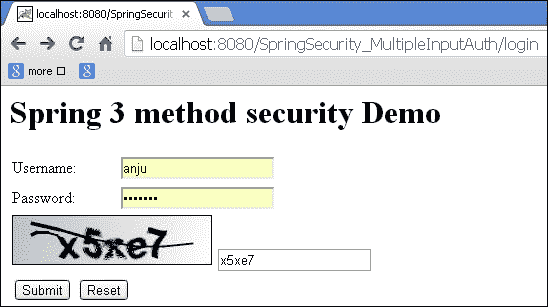
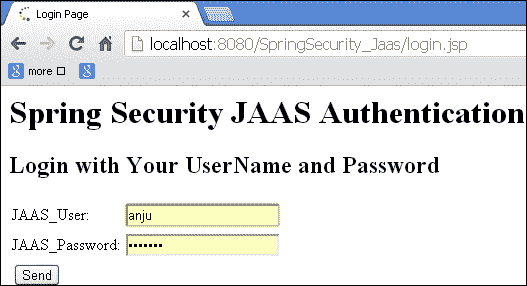
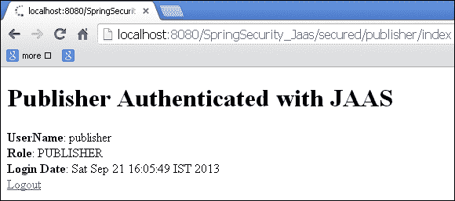

# 第十一章。更多关于 Spring 安全

在本章中，我们将涵盖：

+   具有多个认证提供者的 Spring 安全

+   具有多个输入认证的 Spring 安全

+   集成验证码的 Spring 安全

+   Spring Security with JAAS

# 介绍

在本章中，我们将看到 Spring 安全的一些更多示例。让我们看看如何将 Spring 安全与多个认证提供者集成。我们还将看到使用 Spring 进行多个输入认证的示例。

# 具有多个认证提供者的 Spring 安全

Spring Security 提供了添加多个认证提供者的选项。过滤器链会检查每个认证提供者，直到成功认证。

在本节中，让我们看看如何配置多个认证提供者以及 Spring 如何使用多个认证提供者进行认证。

例如，我们正在使用`horrormovie`应用程序，其中认证和授权由 Spring Security 与数据库处理。

## 准备工作

+   创建一个 maven web 项目

+   添加`spring-security`依赖项

+   添加与 spring-core 相关的依赖项

+   在`Web.xml`文件中配置 Spring 上下文监听器

+   创建`AddHorroMovieController.java`控制器，并添加用于添加、删除和列出的请求映射方法

+   编辑`application-security.xml`文件以添加另一个认证提供者

## 如何做...

以下是将多个认证提供者与 Spring Security 集成的步骤：

1.  编辑`application-security.xml`文件。

```java
  <authentication-manager alias="authentication Manager">
    <authentication-provider>
 <jdbc-user-service data-source-ref="tenant1DataSource"users-by-username-query=" select username, password ,'true' as enabled from users where username=?"authorities-by-username-query=" select u.username as username, ur.authority as authority from users u, user_roles ur where u.user_id = ur.user_id and u.username =?" />
    </authentication-provider>
 <authentication-provider>
 <user-service>
 <user name="anjana" password="anjana123" authorities="ROLE_EDITOR"/>
 <user name="raghu" password="raghu123" authorities="ROLE_AUTHOR"/>
 <user name="shami" password="shami123" authorities="ROLE_EDITOR"/>
 </user-service>
 </authentication-provider>
  </authentication-manager>
```

## 工作原理...

将应用部署到 GlassFish 应用服务器；访问以下 URL：`http://localhost:8080/list`，并使用用户名/密码（`Vikash`/`Vikash123`）登录。

这是在 derby 数据库中创建的用户，具有访问权限（`ROLE_EDITOR`）。

然后注销并再次使用用户名`shami`和密码`shami123`登录。在这里，用户会按顺序通过两个认证提供者进行认证。


## 另请参阅

+   *具有多个输入认证的 Spring 安全*配方

+   集成验证码的 Spring 安全

+   *具有 JAAS 的 Spring 安全*配方

# 具有多个输入认证的 Spring 安全

在本节中，我们将演示多个输入认证。这也被称为双因素认证。到目前为止，在我们的所有示例中，我们都是根据用户名和密码进行认证。在这个示例中，我们将提供另一个字段用于电话号码以及用户名。这是使用 hibernate 和 derby 数据库的相同`horrormovie`应用程序。

## 准备工作

+   创建一个自定义过滤器来处理新的登录表单

+   在`Springsecurity.xml`文件中配置自定义过滤器

+   更新`UserDetailsService`实现类以处理额外的输入

+   在数据库中添加一个名为`MOBILE_NO`的额外列

+   更新`login.jsp`文件以接受`MOBILE_NO`作为输入

## 如何做...

以下是使用 Spring Security 实现多个输入认证的步骤：

1.  创建名为`MultipleInputAuthenticationFilter`的自定义过滤器以提取额外的手机号参数。

```java
  public class MultipleInputAuthenticationFilter extends UsernamePasswordAuthenticationFilter{
    private String extraParameter = "mobile_no";

    public String getExtraParameter() {
        return extraParameter;
    }

    public void setExtraParameter(String extraParameter) {
      this.extraParameter = extraParameter;
    }
    private String delimiter = ":";

    @Override
    protected String obtainUsername(HttpServletRequest request)
      {
        String username = request.getParameter(getUsernameParameter());
        String mobile_no = request.getParameter(getExtraParameter());
        String combinedUsername = username + getDelimiter() + mobile_no;
        System.out.println("Combined username = " + combinedUsername);
        return combinedUsername;
      }

    public String getDelimiter()
    {
      return this.delimiter;
    }
    /**
      * @param delimiter The delimiter string used to separate the username and extra input values in the
        * string returned by <code>obtainUsername()</code>
    */
    public void setDelimiter(String delimiter) {
      this.delimiter = delimiter;
    }
```

1.  更新`application-security.xml`文件以处理自定义过滤器。

```java
  <global-method-security pre-post-annotations="enabled" />
    <http auto-config="false"  use-expressions="true" entry-point-ref="loginUrlAuthenticationEntryPoint">
      <intercept-url pattern="/login" access="permitAll" />
      <intercept-url pattern="/logout" access="permitAll" />
      <intercept-url pattern="/accessdenied" access="permitAll" />
      <intercept-url pattern="/list" access="hasRole('ROLE_EDITOR')" />
      <intercept-url pattern="/add" access="hasRole('ROLE_EDITOR')" />
      <custom-filter position="FORM_LOGIN_FILTER" ref="multipleInputAuthenticationFilter" />
      <!--<form-login login-page="/login" default-target-url="/list" authentication-failure-url="/accessdenied" />-->
      <logout logout-success-url="/logout" />
    </http>
    <authentication-manager alias="authenticationManager">
      <authentication-provider user-service-ref="MyUserDetails">
        <password-encoder hash="plaintext" />
      </authentication-provider>
    </authentication-manager>
 <beans:bean id="multipleInputAuthenticationFilter" class="com.packt.springsecurity.controller.MultipleInputAuthenticationFilter">
 <beans:property name="authenticationManager" ref="authenticationManager" />
 <beans:property name="authenticationFailureHandler" ref="failureHandler" />
 <beans:property name="authenticationSuccessHandler" ref="successHandler" />
 <beans:property name="filterProcessesUrl" value="/j_spring_security_check" />
 <beans:property name="postOnly" value="true" />
 <beans:property name="extraParameter" value="mobile_no" />
 </beans:bean>
    <beans:bean id="horrorMovieDAO" class="com.packt.springsecurity.dao.HorrorMovieDaoImpl" />
    <beans:bean id="horrorMovieManager" class="com.packt.springsecurity.service.HorrorMovieManagerImpl" />
    <beans:bean id="UsersDAO" class="com.packt.springsecurity.dao.UsersDAOImpl" />
    <beans:bean id="UsersManager" class="com.packt.springsecurity.service.UsersManagerImpl" />
    <beans:bean id="UserRoleDAO" class="com.packt.springsecurity.dao.UserRoleDAOImpl" />
    <beans:bean id="UserRoleManager" class="com.packt.springsecurity.service.UserRoleManagerImpl" />
    <beans:bean id="loginUrlAuthenticationEntryPoint" class="org.springframework.security.web.authentication.LoginUrlAuthenticationEntryPoint">
      <beans:property name="loginFormUrl" value="/login" />
    </beans:bean>
    <beans:bean id="successHandler" class="org.springframework.security.web.authentication.SavedRequestAwareAuthenticationSuccessHandler">
      <beans:property name="defaultTargetUrl" value="/list" />
    </beans:bean>

    <beans:bean id="failureHandler" class="org.springframework.security.web.authentication.SimpleUrlAuthenticationFailureHandler">
      <beans:property name="defaultFailureUrl" value="/accessdenied" />
    </beans:bean>
 <beans:bean id="MyUserDetails" class="com.packt.springsecurity.service.MyUserDetails" />
 </beans:beans> 

```

1.  更新`UsersDAOImpl`以处理额外的输入。

```java
@Override
 @Transactional
 public Users findByUserNameMobile(String userName, String mobile_no) {
 List<Users> userList = new ArrayList<Users>();
 Query query = (Query) sessionFactory.getCurrentSession().createQuery("from Users u where u.userName = :userName and u.mobile_no=:mobile_no");
 query.setParameter("userName", userName);
 query.setInteger("mobile_no", Integer.parseInt(mobile_no));
 userList = query.list();
 if (userList.size() > 0) {
 return userList.get(0);
 } else {
 return null;
 }
 }

```

1.  在实现`UserDetailsService`接口的`MyUserDetails`类中实现方法，以处理额外的输入。

```java
public UserDetails loadUserByUsername(String str)throws UsernameNotFoundException {
 String[] splitstring = str.split(":");
 if (splitstring.length < 2) {
 System.out.println("User did not enter both username and mobile number.");
 throw new UsernameNotFoundException("Must specify both username and mobile number");
 }
 String username = splitstring[0];
 String mobile = splitstring[1];

 System.out.println("Username = " + username);
 System.out.println("Mobile = " + mobile);

 Users users = UsersDAO.findByUserNameMobile(username, mobile);
 boolean enabled = true;
 boolean accountNonExpired = true;
 boolean credentialsNonExpired = true;
 boolean accountNonLocked = true;
 return new User(
 users.getUserName(),
 users.getUserPassword(),
 enabled,
 accountNonExpired,
 credentialsNonExpired,
 accountNonLocked,
 getAuthorities(users.getRole().getRoleId().intValue()));
}

```

## 工作原理...

访问以下 URL：`http://localhost:8080/SpringSecurity_MultipleInputAuth/login`

用户不仅通过用户名和密码进行认证，如本书中所有应用程序中所示，还通过手机号参数进行认证。

当用户在登录页面提交信息并点击**提交查询**时，用户名和手机号将与分隔符合并，并且 Spring 安全性将调用`MyUserDetails`类，该类将根据用户使用 hibernate 提供的输入再次拆分参数并对用户进行身份验证。

成功验证后，用户将被重定向到经过授权的页面。


## 另请参阅

+   具有多个身份验证提供程序的 Spring 安全性配方

+   具有验证码集成的 Spring 安全性配方

+   具有 JAAS 的 Spring 安全性配方

# 具有验证码集成的 Spring 安全性

让我们演示 Spring 安全性与验证码的集成。我们已经为此目的下载了`Kaptcha.jar`验证码提供程序。我们需要将 jar 文件安装到 maven 本地存储库中，以使应用程序正常工作。

该示例是前一个配方的扩展，其中考虑了额外的输入，即手机号码，用于 Spring 安全性的授权和身份验证。在此示例中，我们将从用户那里获取用户名和密码的代码以及验证码代码。用户名将与数据库进行身份验证，并且还将比较请求的验证码和用户输入的验证码。

当所有条件匹配时，用户被认为已经通过验证，否则认证失败。

## 准备就绪

+   将`Kaptcha` servlet 添加到`Web.xml`文件中

+   在您的`Springsecurity.xml`文件中配置自定义过滤器

+   更新`UserDetailsService`实现类以处理`Kaptcha`

+   更新`login.jsp`文件以将`Kaptcha`作为输入

+   扩展`UsernamePasswordAuthenticationFilter`

## 如何做...

以下是将 Spring 安全性与验证码集成的步骤：

1.  将`Kaptcha` servlet 添加到`Web.xml`文件中。

```java
  <servlet>
    <servlet-name>Kaptcha</servlet-name>
    <servlet-class>com.google.code.kaptcha.servlet.KaptchaServlet</servlet-class>
  </servlet>
  <servlet-mapping>
    <servlet-name>Kaptcha</servlet-name>
    <url-pattern>/kaptcha.jpg</url-pattern>
  </servlet-mapping>
```

1.  更新`application-security.xml`以处理自定义过滤器。

```java
  <beans:bean id="multipleInputAuthenticationFilter" class="com.packt.springsecurity.controller.MultipleInputAuthenticationFilter">
    <beans:property name="authenticationManager" ref="authenticationManager" />
    <beans:property name="authenticationFailureHandler" ref="failureHandler" />
    <beans:property name="authenticationSuccessHandler" ref="successHandler" />
    <beans:property name="filterProcessesUrl" value="/j_spring_security_check" />
    <beans:property name="postOnly" value="true" />
    <beans:property name="extraParameter" value="kaptcha" />
  </beans:bean>
```

1.  更新`UsersDAOImpl`以处理额外的输入。

```java
 @Override
 @Transactional
 public Users findByUserNameCaptcha(String userName, String kaptchaReceived, String kaptchaExpected) {
 List<Users> userList = new ArrayList<Users>();
 Query query = (Query) sessionFactory.getCurrentSession().createQuery("from Users u where u.userName = :userName");
 query.setParameter("userName", userName);
 userList = query.list();
 if (userList.size()>0 && kaptchaReceived.equalsIgnoreCase(kaptchaExpected)) {
 return (Users)userList.get(0);
 }  else {
 return null;
 }
 }

```

1.  更新`UserDetailsService`类以处理额外的输入。

```java
public UserDetails loadUserByUsername(String str)throws UsernameNotFoundException {
 String[] splitstring = str.split(":");
 if (splitstring.length < 2) {
 System.out.println("User did not enter both username and captcha code.");
 throw new UsernameNotFoundException("Must specify both username captcha code");
 }
 String username = splitstring[0];
 String kaptchaReceived = splitstring[1];
 String kaptchaExpected = splitstring[2];
 Users users = UsersDAO.findByUserNameCaptcha(username, kaptchaReceived,kaptchaExpected);
 boolean enabled = true;
 boolean accountNonExpired = true;
 boolean credentialsNonExpired = true;
 boolean accountNonLocked = true;
 return new User(
 users.getUserName(),
 users.getUserPassword(),
 enabled,
 accountNonExpired,
 credentialsNonExpired,
 accountNonLocked,
 getAuthorities(users.getRole().getRoleId().intValue())
 );
}

```

1.  扩展`UsernamePasswordAuthenticationFilter`并重写`MultipleInputAuthenticationFilter`类中的`obtainUsername`（`HttpServletRequest`请求）方法。

```java
@Override
  protected String obtainUsername(HttpServletRequest request) {
  String username = request.getParameter(getUsernameParameter());
  String kaptcha = request.getParameter(getExtraParameter());
  String kaptchaExpected = (String) request.getSession().getAttribute(com.google.code.kaptcha.Constants.KAPTCHA_SESSION_KEY);
  String combinedUsername = username + getDelimiter() + kaptcha + getDelimiter() + kaptchaExpected;
  System.out.println("Combined username = " + combinedUsername);
  return combinedUsername;
  }
```

## 工作原理...

访问以下 URL：

`http://localhost:8080/SpringSecurity_MultipleInputAuth/login`

`Kaptcha` servlet 在浏览器上为用户显示不同的图表。

用户输入的值和`Kaptcha`生成的值与`UsersDAOImpl.java`类中的`Username`字段一起与数据库中的值进行比较。当所有条件匹配时，即用户输入的`Kaptcha`应与浏览器显示的`Kaptcha`相同，并且用户名应存在于数据库中，那么用户被认为已通过验证。用户将被重定向到经过验证和授权的页面。



## 另请参阅

+   具有多个身份验证提供程序的 Spring 安全性配方

+   具有多个输入身份验证的 Spring 安全性配方

+   具有 JAAS 的 Spring 安全性配方

# 具有 JAAS 的 Spring 安全性

在第一章中，*基本安全性*，我们已经演示了如何在 JBOSS 中使用 JAAS 配置进行身份验证和授权。 Spring 安全性还提供了完全支持以实现基于 JAAS 的身份验证。我们需要将`DefaultJaasAuthenticationProvider`配置为身份验证提供程序。在本节中，我们将演示将 Spring 安全性与 JAAS 集成。

让我们看一些由 Spring 安全性 API 提供的基于 JAAS 的类和接口：

+   `org.springframework.security.authentication.jaas`

+   `AbstractJaasAuthenticationProvider`

+   `AuthorityGranter`

+   `DefaultJaasAuthenticationProvider`

+   `DefaultLoginExceptionResolver`

+   `JaasAuthenticationCallbackHandler`

+   `JaasAuthenticationToken`

+   `JaasGrantedAuthority`

+   JaasNameCallbackHandler

+   登录异常解析器

+   `SecurityContextLoginModule`

## 准备就绪

+   通过`org.springframework.security.authentication.jaas.AuthorityGranter`实现`AuthorityGranter`接口

+   通过`javax.security.auth.spi.LoginModule`实现`LoginModule`接口

+   在`context.xml`文件中配置`DefaultJaasAuthenticationProvider`类。实现`AuthorityGranter`接口及其配置。

## 如何做...

以下是使用 Spring 安全实现 JAAS 的步骤：

1.  使用`AuthorityGranterImpl`类实现`AuthorityGranter`类

```java
public class AuthorityGranterImpl implements AuthorityGranter {
  public Set<String> grant(Principal principal) {
    if (principal.getName().equals("publisher"))
      return Collections.singleton("PUBLISHER");
    else
      return Collections.singleton("EDITOR");
  }
}
```

1.  使用`javax.security.auth.spi`包中的`LoginModule`类，使用`LoginModuleImpl`类

```java
public class LoginModuleImpl implements LoginModule {
  private String password;
  private String username;
  private Subject subject;
  public boolean login() throws LoginException {
    // Check the password against the username "publisher" or "editor"
    if (username == null || (!username.equals("publisher") && !username.equals("editor"))) {
      throw new LoginException("User not valid");
    }
    if (password == null || (!password.equals("publisher123") && !password.equals("editor123"))) {
      throw new LoginException("Password not valid");
    } else {
      subject.getPrincipals().add(new UserPrincipal(username));
      return true;
    }
  }

  @Override
  public boolean abort() throws LoginException {
    // TODO Auto-generated method stub
    return false;
  }

  @Override
  public boolean commit() throws LoginException {
    // TODO Auto-generated method stub
    return true;
  }

  @Override
  public boolean logout() throws LoginException {
    // TODO Auto-generated method stub
    return false;
  }

  public void initialize(Subject subject, CallbackHandler callbackHandler,
    Map<String, ?> state, Map<String, ?> options) {
    this.subject = subject;
    try {
      NameCallback nameCallback = new NameCallback("prompt");
      PasswordCallback passwordCallback = new PasswordCallback("prompt", false);
      callbackHandler.handle(new Callback[]{nameCallback,passwordCallback});
      password = new String(passwordCallback.getPassword());
      username = nameCallback.getName();
    } catch (Exception e) {
      throw new RuntimeException(e);
    }
  }
}
```

1.  使用 JAAS 配置 Spring 安全。

```java
  <sec:authentication-manager>
    <sec:authentication-provider ref="jaasAuthProvider" />
  </sec:authentication-manager>
  <bean id="jaasAuthProvider" class="org.springframework.security.authentication.jaas.DefaultJaasAuthenticationProvider">
    <property name="configuration">
      <bean class="org.springframework.security.authentication.jaas.memory.InMemoryConfiguration">
        <constructor-arg>
          <map><entry key="SPRINGSECURITY">
            <array>
              <bean class="javax.security.auth.login.AppConfigurationEntry">
                <constructor-arg value="org.packt.springsecurityjaas.LoginModuleImpl" />
                <constructor-arg>
                  <util:constant static-field="javax.security.auth.login.AppConfigurationEntry$LoginModuleControlFlag.REQUIRED" />
                </constructor-arg>
                <constructor-arg>
                  <map></map>
                </constructor-arg>
              </bean>
            </array>
          </entry>
          </map>
        </constructor-arg>
      </bean>
    </property>
    <property name="authorityGranters">
      <list>
        <bean class="org.packt.springsecurityjaas.AuthorityGranterImpl" />
      </list>
    </property>
  </bean>
</beans>
```

## 它是如何工作的...

访问 URL：`http://localhost:8080/SpringSecurity_Jaas/`

使用以下凭据登录：`publisher`/`publisher123`和`editor`/`editor123`

身份验证由`DefaultJaasAuthenticationProvider`处理。用户信息和身份验证由`InMemoryConfiguration`处理，这意味着 JAAS 的`LoginModule`类使用`callbackhandlers`进行身份验证和授权。成功验证后，用户将被重定向到授权页面。以下截图显示了应用程序的工作流程：



## 另请参阅

+   使用多个身份验证提供程序的 Spring 安全配方

+   使用多个输入验证的 Spring 安全配方

+   使用 JAAS 的 Spring 安全配方
